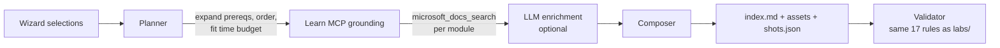

# Lab Builder — build your own Copilot Studio lab

The 40 labs in `labs/` are fixed walkthroughs. The lab builder is the opposite:
you pick an industry, the roles you are teaching, and the Copilot Studio
capabilities you want covered, and it writes a complete, step-by-step lab for
that exact combination — grounded against live Microsoft Learn documentation.

Two ways to use it:

| | |
|---|---|
| **Portal** | The **🧬 Build a Lab** tab — a five-step wizard with live preview. |
| **CLI** | `node tools/lab-builder/build.mjs` — no portal, no sign-in, no dependencies beyond Node 24. |

Output lands in `generated-labs/<slug>/` (git-ignored) as:

```
generated-labs/<slug>/
  index.md        the lab, in this repo's standard lab format
  manifest.json   what was selected, what was grounded, and the Learn sources used
  shots.json      capture manifest for the screenshots that could not be reused
  assets/         screenshots copied from existing labs in this repo
```

---

## Quick start (CLI)

```bash
# See every industry, role, and feature id
node tools/lab-builder/build.mjs --list

# Build a lab
node tools/lab-builder/build.mjs \
  --industry healthcare \
  --roles customer-service \
  --features knowledge-sharepoint,authentication,content-moderation \
  --time 240

# Or answer prompts instead
node tools/lab-builder/build.mjs --interactive
```

Useful flags:

| Flag | Effect |
|---|---|
| `--time <minutes>` | Time budget. Modules that do not fit move to "Where to Go Next". |
| `--no-core` | Skip the level 100 foundation modules (assumes learners already have an agent). |
| `--no-learn` | Offline mode. Skips Microsoft Learn and uses the curated doc links. |
| `--no-llm` | Deterministic composition even if LLM credentials are configured. |
| `--dry-run` | Print the plan and exit without writing anything. |
| `--out <dir>` | Write somewhere other than `generated-labs/`. |

The CLI exits non-zero if the generated lab fails validation, so it is safe to
run in CI.

---

## Quick start (portal)

1. Start the portal: `cd portal && npm install && npm start`.
2. Open the **🧬 Build a Lab** tab.
3. Industry → roles → features → options → build.

The wizard previews the module outline (with prerequisites resolved and the time
budget applied) before you commit to a build, then shows the finished markdown
with a download button.

---

## How it works



### 1. Feature catalog

`portal/lib/lab-builder/features.json` is the source of truth: 36 Copilot Studio
capabilities across 10 categories. Each entry carries the level, time estimate,
prerequisites, concepts, click-by-click steps, validation checks, Microsoft Learn
search queries, fallback doc URLs, related labs in this repo, and any existing
screenshots that can be reused.

This is the file to edit when the product changes or you want to add a feature.
`validateCatalog()` (and a test) enforces its integrity, including prerequisite
cycles.

### 2. Planner

`planner.js` resolves the industry and roles, expands transitive prerequisites,
topologically orders modules (prerequisite → category → level), applies the time
budget without ever orphaning a dependent module, and derives the title,
difficulty, duration, and scenario framing.

Scenario framing comes from `scenario-profiles.json`: per-industry agent name,
audience, business problem, knowledge sources, sample questions, domain
vocabulary, and the KPI to watch — plus per-role design guidance.

### 3. Microsoft Learn grounding

`learn-mcp.js` is a small streamable-HTTP JSON-RPC client for the public
[Microsoft Learn MCP server](https://learn.microsoft.com/api/mcp). No sign-in is
required. For each module it runs the catalog's `learnQueries` through
`microsoft_docs_search`, parses the SSE-framed response, dedupes by URL, and
returns excerpts plus citations.

Every call degrades gracefully. If the server is unreachable the builder falls
back to the curated `docUrls` and records a warning in the manifest — it never
fails the build.

### 4. LLM enrichment (optional)

`llm.js` auto-detects a provider:

1. **Azure OpenAI** — `AZURE_OPENAI_ENDPOINT` + `AZURE_OPENAI_API_KEY` + `AZURE_OPENAI_DEPLOYMENT`
2. **GitHub Models** — `GITHUB_TOKEN` (optionally `GITHUB_MODELS_MODEL`)
3. **None** — deterministic composition from the catalog and Learn excerpts

With a provider configured, the builder drafts the lab overview and a
scenario-specific "In your scenario" paragraph per module, constrained by a
system prompt that forbids inventing product UI. Without one, the lab is still
complete — it just uses the curated narrative instead.

Set `LAB_BUILDER_LLM=off` to force deterministic mode.

### 5. Screenshots

Copilot Studio is behind an interactive sign-in, so the builder cannot capture
fresh screenshots on demand. It does two things instead:

- **Reuses** real screenshots already committed in `labs/*/assets/`, copying them
  into the generated lab and captioning them with their source lab.
- **Emits a capture manifest** (`shots.json`) for everything else, plus an inline
  callout in the markdown telling the learner exactly what to capture.

Fill the gaps against your own tenant with the existing capture tool:

```bash
node tools/screenshot-capture/capture.js --manifest="generated-labs/<slug>/shots.json"
```

### 6. Composition and validation

`composer.js` writes markdown in this repo's standard lab format, so generated
labs look and validate exactly like the handwritten ones. Every generated lab is
run through the same rule set as `labs/` (`validateLabDir()` in
`portal/lib/validator.js`) before the builder reports success.

Each module renders as:

- **What you are doing** and **Why it matters**
- **From the docs** — a quoted Microsoft Learn excerpt with a link
- **Concepts before you click** — the mental model
- **Do this** — numbered, click-level steps
- **In your scenario** — the module applied to the chosen industry
- Screenshots (reused) and capture callouts (to fill in)
- **Check your work** — per-module validation
- **Microsoft Learn references** — citations

---

## API

All routes sit under `/api/lab-builder` and follow the portal's normal auth rules.

| Method | Route | Purpose |
|---|---|---|
| `GET` | `/api/lab-builder/features` | Industries, roles, and the feature catalog grouped by category. |
| `POST` | `/api/lab-builder/preview` | Plan a lab (ordering, timing, warnings) without generating it. |
| `POST` | `/api/lab-builder/generate` | Build the lab, write it to `generated-labs/`, return markdown + validation. |
| `GET` | `/api/lab-builder/generated` | List previously generated labs. |
| `GET` | `/api/lab-builder/generated/:labId` | Read one generated lab as markdown and HTML. |

Request body for preview and generate:

```json
{
  "industry": "healthcare",
  "roles": ["customer-service"],
  "features": ["knowledge-sharepoint", "authentication"],
  "timeBudget": 240,
  "includeCore": true,
  "title": "Optional title override",
  "agentName": "Optional agent name override",
  "useLearnMcp": true,
  "useLlm": true
}
```

---

## Extending the catalog

Add a feature to `portal/lib/lab-builder/features.json`:

```jsonc
{
  "id": "my-feature",
  "name": "My feature",
  "category": "tools",            // must match a category id
  "level": 200,                   // 100, 200, or 300
  "minutes": 20,
  "summary": "One sentence on what the learner configures.",
  "whyItMatters": "Why this exists and what breaks without it.",
  "concepts": ["Mental model point one.", "Point two."],
  "steps": ["Click-level step one.", "Step two."],
  "validation": ["How the learner proves it worked."],
  "screenshots": [{ "filename": "my-feature.png", "section": "agents", "instructions": ["What to show."] }],
  "learnQueries": ["Copilot Studio my feature"],
  "docUrls": ["https://learn.microsoft.com/microsoft-copilot-studio/..."],
  "prereqs": ["create-agent"],
  "relatedLabs": ["01-intro-workshop"],
  "reuseScreenshots": [{ "lab": "06-energy-weather-agent", "file": "some-shot.png", "caption": "..." }]
}
```

Then run `npm test` in `portal/` — the catalog integrity test will flag unknown
categories, bad levels, missing fields, dangling prerequisites, and cycles.

To add an industry, add an entry to `portal/lib/scenarios.json` (used across the
portal) and a matching profile in `portal/lib/lab-builder/scenario-profiles.json`.

---

## Testing

```bash
cd portal && npm test
```

`portal/test/lab-builder.test.js` covers catalog integrity, prerequisite
expansion and ordering, planner behaviour (time budgets, unknown inputs), LLM
provider detection, and a full offline generation that must pass every validator
rule. No network access is required.
