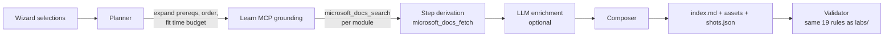

# Lab Builder — build your own Copilot Studio lab

The 40 labs in `labs/` are fixed walkthroughs. The lab builder is the opposite:
you pick an industry, the roles you are teaching, and the Copilot Studio
capabilities you want covered, and it writes a complete, step-by-step lab for
that exact combination — grounded against live Microsoft Learn documentation.

Two ways to use it:

| | |
|---|---|
| **Portal** | The **🧬 Build a Lab** tab — a five-step wizard with live preview. |
| **CLI** | `node tools/lab-builder/build.mjs` — no portal, no sign-in, no dependencies beyond Node 24. |

Output lands in `generated-labs/<slug>/` (git-ignored) as:

```
generated-labs/<slug>/
  index.md        the lab, in this repo's standard lab format
  manifest.json   what was selected, what was grounded, the Learn sources used
                  and the HTTP status each returned when checked, when they were
                  verified, where each module's steps came from, and any
                  decisions a human made about a blocked build
  shots.json      capture manifest for the screenshots that could not be reused
  assets/         screenshots copied from existing labs in this repo
```

---

## Quick start (CLI)

```bash
# See every industry, role, and feature id
node tools/lab-builder/build.mjs --list

# Build a lab
node tools/lab-builder/build.mjs \
  --industry healthcare \
  --roles customer-service \
  --features knowledge-sharepoint,authentication,content-moderation \
  --time 240

# Or answer prompts instead
node tools/lab-builder/build.mjs --interactive
```

Useful flags:

| Flag | Effect |
|---|---|
| `--time <minutes>` | Time budget. Modules that do not fit move to "Where to Go Next". |
| `--no-core` | Skip the level 100 foundation modules (assumes learners already have an agent). |
| `--no-learn` | Offline mode. Skips Microsoft Learn and uses the curated doc links. |
| `--no-llm` | Deterministic composition even if LLM credentials are configured. |
| `--decide <code>=<option>` | Pre-answer a build blocker. Repeatable. See [Blocked builds](#blocked-builds). |
| `--non-interactive` | Never prompt. Report blockers and exit 2 instead. |
| `--dry-run` | Print the plan and exit without writing anything. |
| `--out <dir>` | Write somewhere other than `generated-labs/`. |

Exit codes:

| Code | Meaning |
|---|---|
| `0` | The lab was built and passed validation. |
| `1` | Bad input, or the generated lab failed validation. |
| `2` | The build stopped for a decision and none was supplied. |
| `3` | A decision cancelled the build. |

---

## Blocked builds

Some conditions would quietly make the lab worse: Microsoft Learn being
unreachable, a module that finds no documentation, a language model that writes
some passages but not others. Rather than note them and carry on, the builder
**stops before writing anything** and asks a human.

Each blocker carries a stable `code`, a plain-language description of what it
means for the learner, and two to four ranked options — exactly one recommended,
each stating its tradeoff.

| Code | Raised when | Options |
|---|---|---|
| `learn-mcp-unavailable` | The Learn MCP handshake fails. | `retry` *(recommended)*, `proceed-curated`, `cancel` |
| `modules-ungrounded` | A module has nothing to cite: no relevant search result and no curated link. | `proceed-curated` *(recommended)*, `drop-modules`, `cancel` |
| `sources-dead` | Link checking found that *every* URL a module cites returns an error, leaving it with no reference. | `proceed-flagged` *(recommended)*, `drop-modules`, `cancel` |
| `steps-fetch-failed` | A module's documentation page could not be read. | `retry` *(recommended)*, `proceed-catalog`, `cancel` |
| `steps-not-derived` | The page was read, but no procedure on it matched the module. | `proceed-catalog` *(recommended)*, `cancel` |
| `llm-partial-failure` | A configured model wrote some passages but not others. | `retry` *(recommended)*, `proceed-deterministic`, `proceed-mixed`, `cancel` |
| `modules-deferred` | The time budget dropped a module you explicitly selected. | `accept-deferred` *(recommended)*, `ignore-budget`, `cancel` |

An explicit choice you already made is never a blocker. `--no-learn` and
`--no-llm`, and modules the builder added on your behalf being deferred, stay
warnings — you decided those.

`retry` is not a resolution: it re-runs the same gate, so a condition that has
not cleared asks again.

```bash
# CI: fails loudly rather than shipping a degraded lab
node tools/lab-builder/build.mjs --features topics --non-interactive

# CI: proceed deliberately, recorded in the manifest
node tools/lab-builder/build.mjs --features topics \
  --decide learn-mcp-unavailable=proceed-curated
```

Whatever is chosen is written to `manifest.json` so a reader can see which
decisions shaped the lab:

```json
"decisions": [
  {
    "code": "learn-mcp-unavailable",
    "title": "Microsoft Learn is unreachable",
    "consequence": "Microsoft Learn could not be reached (fetch failed). …",
    "chosen": { "id": "proceed-curated", "label": "Build on the curated documentation links instead", "tradeoff": "…" },
    "decidedAt": "2026-08-23T01:06:11.335Z",
    "decidedVia": "cli-flag"
  }
]
```

The record deliberately carries **no user identity**. The manifest travels with
the lab, and `exporter.js` archives every non-Markdown file in a lab directory
into a downloadable ZIP. Who decided is written to the portal's server log
instead.

---

## Quick start (portal)

1. Start the portal: `cd portal && npm install && npm start`.
2. Open the **🧬 Build a Lab** tab.
3. Industry → roles → features → options → build.

The wizard previews the module outline (with prerequisites resolved and the time
budget applied) before you commit to a build. If the build hits a blocker it
pauses and shows the decision inline — keyboard-navigable radios with the
consequence and each option's tradeoff — and only resumes once you choose. The
finished markdown appears with a download button and a record of any decisions.

---

## How it works



### 1. Feature catalog

`portal/lib/lab-builder/features.json` is the source of truth for *structure*: 36
Copilot Studio capabilities across 10 categories. Each entry carries the level,
time estimate, prerequisites, concepts, fallback click-by-click steps, validation
checks, Microsoft Learn search queries, doc URLs, related labs in this repo, and
any existing screenshots that can be reused.

The steps in this file are a fallback, not what the learner normally reads. When
the documentation page can be read and a procedure on it matches the module, the
lab uses that instead — see [Step derivation](#4-step-derivation).

This is the file to edit to add a feature, change a module's structure, or fix
the fallback used when a page cannot be read. `validateCatalog()` (and a test)
enforces its integrity, including prerequisite cycles.

### 2. Planner

`planner.js` resolves the industry and roles, expands transitive prerequisites,
topologically orders modules (prerequisite → category → level), applies the time
budget without ever orphaning a dependent module, and derives the title,
difficulty, duration, and scenario framing.

Scenario framing comes from `scenario-profiles.json`: per-industry agent name,
audience, business problem, knowledge sources, sample questions, domain
vocabulary, and the KPI to watch — plus per-role design guidance.

### 3. Microsoft Learn grounding

`learn-mcp.js` is a small streamable-HTTP JSON-RPC client for the public
[Microsoft Learn MCP server](https://learn.microsoft.com/api/mcp). No sign-in is
required. For each module it runs the catalog's `learnQueries` through
`microsoft_docs_search`, parses the SSE-framed response, dedupes by URL, and
then **scores every result for relevance before citing any of it**.

That scoring step (`relevance.js`) is not optional polish. Learn search spans
every Microsoft product at once, so a module about creating a Copilot Studio
agent was citing Microsoft Fabric IQ, Power Automate process mining, and a
Power Platform release plan, with the page that actually answered it ranked
fourth. Every one of those URLs returns HTTP 200, so link checking cannot see
the problem.

A result is scored on three things:

- **Product affinity** — does the URL sit under a documentation area this module
  is expected to live in? The expected prefixes are derived from the catalog's
  existing `docUrls`, so no catalog entry needs hand editing; a feature can
  override them with `docPaths`. Affinity *multiplies* the topical score rather
  than adding to it, because an off-product page scores well on words precisely
  when it describes the same task in the wrong product.
- **Topical overlap** — the title against the module name, and the excerpt
  against the module's vocabulary, using the same tokenizer and the same
  `overlap`/`coverage` measures `steps.js` uses to pick a procedure.
- **Page kind** — release plans, "what's new", and troubleshooting articles are
  demoted, but only when an unpenalized how-to already clears the floor.

Results below the relevance floor are dropped from the citation list and
recorded in the manifest under `relevance.droppedAsIrrelevant`, so a reviewer
can see what the filter refused and why. The **From the docs** pull quote is
taken from the highest-scoring source rather than the first sufficiently long
one, so a module cannot quote one product's page under another product's
heading.

Every call degrades gracefully at the transport level: a timeout or a malformed
response returns an empty result rather than throwing. What it does *not* do is
quietly ship a lab built on that emptiness — an unreachable server raises the
`learn-mcp-unavailable` blocker and the build stops until a human decides.

A search that returns nothing *relevant* is deliberately not a blocker. It falls
back to the catalog's curated `docUrls`, which are on-target by construction;
only a module with no curated link either raises `modules-ungrounded`. Blocking
on a merely noisy search would prompt on almost every build and teach people to
click straight through the prompt.

The manifest distinguishes the two claims per module: `grounded` means the
module has citations at all, and the narrower `learnVerified` means they came
from a live search that cleared the floor. Only `learnVerified` modules are
counted in the lab's "checked against live Microsoft Learn documentation" line.

The catalog's `docUrls` serve two purposes: they are the pages the step deriver
reads (below), and they are the citation fallback when a search returns nothing
relevant.
`features.json` carries an optional top-level `docsReviewed` date for when those
links were last checked against live documentation; it is `null` until someone
actually checks, because a wrong freshness date is worse than none. Per-feature
`lastVerified` dates (issue #42) override that fallback when present, and the
blocker text quotes whichever it can support.

### 4. Step derivation

Grounding contributes citations. It does not, on its own, make the *instructions*
current — and the instructions are the substance of a walk-through. `steps.js`
closes that gap: for each module it fetches the catalog's `docUrls` with
`microsoft_docs_fetch`, finds the numbered procedures on the page, scores them
against the module, and renders the best match as the module's **Do this** list.

Selection is the hard part, not extraction. One Learn article routinely carries
several unrelated procedures — `knowledge-add-sharepoint` has six — so a
candidate must clear a confidence threshold and two structural gates before it is
used:

- **Label coverage.** It has to reproduce a share of the curated steps' bolded UI
  labels. The curated wording is not trusted, but it is a fair statement of which
  screens the module is about, and a candidate that never mentions them is
  describing something else.
- **Completeness.** It is never allowed to be materially shorter than the curated
  procedure. A shorter candidate is a fragment, not the procedure.

When nothing clears the gates, the curated steps are used and the module says so
in the lab. That path raises `steps-not-derived` first, so it is a decision rather
than a silent substitution.

**No language model is involved.** Every derived step is a cleaned substring of a
page that was fetched, which is a structural guarantee that the builder cannot
invent product UI — stronger than asking a model not to. It also means the steps
are identical with and without credentials configured.

Fetched pages are untrusted input. They are never executed. Steps are stripped of
HTML, images, and control characters; relative Learn links are resolved to
absolute `https:` URLs and unsafe schemes dropped; TODO-style markers are scrubbed
because `validateLabDir()` rejects them anywhere in a lab file. When a model *is*
configured, fetched text reaches it inside `<untrusted-documentation>` markers
that the system prompt defines as quoted material, never instructions.

Each module records in `manifest.json` whether its steps were `doc-derived` or
`catalog-fallback`, the source URL and section heading, the fetch timestamp, and a
`drift` record comparing the curated steps against the live page. Drift is
reported rather than acted on — the derived path already resolved it — and it is
the signal that a catalog entry has gone stale.

### 5. LLM enrichment (optional)

`llm.js` auto-detects a provider:

1. **Azure OpenAI** — `AZURE_OPENAI_ENDPOINT` + `AZURE_OPENAI_API_KEY` + `AZURE_OPENAI_DEPLOYMENT`
2. **GitHub Models** — `GITHUB_TOKEN` (optionally `GITHUB_MODELS_MODEL`)
3. **None** — deterministic composition from the catalog and Learn excerpts

With a provider configured, the builder drafts the lab overview and a
scenario-specific "In your scenario" paragraph per module, constrained by a
system prompt that forbids inventing product UI. Without one, the lab is still
complete — it just uses the curated narrative instead. Either way the model plays
no part in producing the walk-through steps.

Set `LAB_BUILDER_LLM=off` to force deterministic mode.

### 6. Screenshots

Copilot Studio is behind an interactive sign-in, so the builder cannot capture
fresh screenshots on demand. It does two things instead:

- **Reuses** real screenshots already committed in `labs/*/assets/`, copying them
  into the generated lab and captioning them with their source lab.
- **Emits a capture manifest** (`shots.json`) for everything else, plus an inline
  callout in the markdown telling the learner exactly what to capture.

Fill the gaps against your own tenant with the existing capture tool:

```bash
node tools/screenshot-capture/capture.js --manifest="generated-labs/<slug>/shots.json"
```

### 7. Composition and validation

`composer.js` writes markdown in this repo's standard lab format, so generated
labs look and validate exactly like the handwritten ones. Every generated lab is
run through the same rule set as `labs/` (`validateLabDir()` in
`portal/lib/validator.js`) before the builder reports success.

Before composition, every URL the lab is about to embed is requested once
(`linkcheck.js`). This is the liveness check `validateLabDir()` cannot do — it is
structural, and `parseImageRefs` skips anything with an `http:` scheme, so until
issue #41 a build could report all checks passing while citing a page that no
longer exists.

The check reuses the approach in `tools/lab-accuracy/check-accuracy.mjs`: GET
rather than HEAD, because some Learn endpoints reject HEAD; redirects followed;
and HTTP >= 400 kept distinct from status 0. That distinction decides what
happens next:

- **4xx/5xx** — the origin says the page is gone, so the citation is removed. If
  the module still has others, that is a warning, not a blocker; keeping five
  good links instead of six is not a decision anyone would make differently.
- **Status 0** — a timeout, DNS failure, or proxy. That is evidence about the
  machine running the build, not about the page, so the citation is kept and
  reported as a warning.

Only a module left with *no* citation at all raises `sources-dead`. URLs are
deduplicated per run, checked with a bounded concurrency of 8 and an 8s timeout
(`LAB_BUILDER_LINK_TIMEOUT_MS`). Measured on a five-module healthcare build with
28 unique URLs, the check adds roughly 0.7s to a 3.5s build.

Set `LAB_BUILDER_LINK_CHECK=off` to skip it — for an air-gapped build, or for
tests. A lab built that way says so in place of a verification date rather than
implying a check that never ran.

`manifest.json` records `verifiedAt`, a `linkCheck` summary, and the HTTP status
of each source. The lab itself carries a **VERIFIED** metadata row and states
that it is a point-in-time artifact: generated labs live outside `labs/`, are
git-ignored, and are therefore not covered by the monthly accuracy audit, so the
remedy for an old one is to regenerate it rather than re-read it.

Each module renders as:

- **What you are doing** and **Why it matters**
- **From the docs** — a quoted Microsoft Learn excerpt with a link
- **Concepts before you click** — the mental model
- **Do this** — numbered, click-level steps
- **In your scenario** — the module applied to the chosen industry
- Screenshots (reused) and capture callouts (to fill in)
- **Check your work** — per-module validation
- **Microsoft Learn references** — citations

---

## API

All routes sit under `/api/lab-builder` and follow the portal's normal auth rules.

| Method | Route | Purpose |
|---|---|---|
| `GET` | `/api/lab-builder/features` | Industries, roles, and the feature catalog grouped by category. |
| `POST` | `/api/lab-builder/preview` | Plan a lab (ordering, timing, warnings) without generating it. |
| `POST` | `/api/lab-builder/generate` | Build the lab, write it to `generated-labs/`, return markdown + validation. |
| `GET` | `/api/lab-builder/generated` | List previously generated labs. |
| `GET` | `/api/lab-builder/generated/:labId` | Read one generated lab as markdown and HTML. |

Request body for preview and generate:

```json
{
  "industry": "healthcare",
  "roles": ["customer-service"],
  "features": ["knowledge-sharepoint", "authentication"],
  "timeBudget": 240,
  "includeCore": true,
  "title": "Optional title override",
  "agentName": "Optional agent name override",
  "useLearnMcp": true,
  "useLlm": true,
  "decisions": { "learn-mcp-unavailable": "proceed-curated" }
}
```

`POST /api/lab-builder/generate` returns HTTP 200 with one of three shapes,
discriminated by `status`:

```jsonc
// the lab was built and written
{ "status": "complete", "labId": "…", "markdown": "…", "manifest": { … }, "validation": { … } }

// a gate needs a human; nothing was written
{ "status": "blocked", "blockers": [ { "code": "…", "consequence": "…", "options": [ … ] } ] }

// a decision stopped the build; nothing was written
{ "status": "cancelled", "blockers": [ … ] }
```

Resuming is stateless: the client re-POSTs the same body with the accumulated
`decisions`. The server holds nothing between requests, so there is no pending
session to expire and no capability token to leak. An unknown blocker code or
option id is rejected with HTTP 400.

---

## Extending the catalog

Add a feature to `portal/lib/lab-builder/features.json`:

```jsonc
{
  "id": "my-feature",
  "name": "My feature",
  "category": "tools",            // must match a category id
  "level": 200,                   // 100, 200, or 300
  "minutes": 20,
  "summary": "One sentence on what the learner configures.",
  "whyItMatters": "Why this exists and what breaks without it.",
  "concepts": ["Mental model point one.", "Point two."],
  "steps": ["Click-level step one.", "Step two."],
  "validation": ["How the learner proves it worked."],
  "screenshots": [{ "filename": "my-feature.png", "section": "agents", "instructions": ["What to show."] }],
  "learnQueries": ["Copilot Studio my feature"],
  "docUrls": ["https://learn.microsoft.com/microsoft-copilot-studio/..."],
  "prereqs": ["create-agent"],
  "relatedLabs": ["01-intro-workshop"],
  "reuseScreenshots": [{ "lab": "06-energy-weather-agent", "file": "some-shot.png", "caption": "..." }]
}
```

Then run `npm test` in `portal/` — the catalog integrity test will flag unknown
categories, bad levels, missing fields, dangling prerequisites, and cycles.

To add an industry, add an entry to `portal/lib/scenarios.json` (used across the
portal) and a matching profile in `portal/lib/lab-builder/scenario-profiles.json`.

---

## Testing

```bash
cd portal && npm test
```

`portal/test/lab-builder.test.js` covers catalog integrity, prerequisite
expansion and ordering, planner behavior (time budgets, unknown inputs), blocker
detection and resolution for all four codes, LLM provider detection, and a full
offline generation that must pass every validator rule. No network access is
required.
