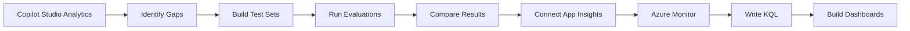

# 📊 Lab 02: Monitor Performance and Evaluate Contoso Agent Quality

*If you can't measure it, you can't improve it.*

| | |
|---|---|
| ⭐ **DIFFICULTY** | Intermediate (Level 200) |
| ⏱️ **TIME** | 45 minutes |
| 🧩 **PRODUCTS** | Microsoft Copilot Studio (Analytics + Agent Evaluation preview), Azure Application Insights, Azure Monitor |
| 🏷️ **TAGS** | Analytics, Agent Evaluation, Test Sets, Quality Management, Continuous Improvement, Application Insights, KQL, Azure Monitor |
| 🏭 **INDUSTRY** | Energy / Utilities (Contoso family of companies) |

> **Adapted from:** [Monitor Performance and Evaluate Agent Quality — Microsoft Copilot Agents Labs](https://microsoft.github.io/mcs-labs/labs/core-concepts-analytics-evaluations/). Reframed for **Contoso** so you can measure and continuously improve the IT Operations agent you built in [Lab 01](../01-energy-ops-agent/index.md) — and any other Contoso agent that follows.

---

## 🗺️ Lab Flow



---

## ⚡ Why Contoso cares about analytics and evaluations

The Contoso IT Operations Agent (Lab 01) and the Contoso Customer Operations Assistant (Lab 03) only deliver value if they **work** — turn after turn, day after day, for thousands of field crew, account managers, and dispatchers across Contoso Energy, Contoso Gas, Contoso Infrastructure, and Contoso Power.

Without a measurement practice, you're flying blind:

- ❌ **Without analytics:** You don't know how many techs interact with the agent, what they ask, or whether they walk away with an answer.
- ❌ **Without evaluations:** You change the agent's instructions or knowledge sources and just *hope* you didn't break something else.
- ✅ **With both:** Analytics tells you **where to improve**. Evaluations tell you **whether your improvements actually worked.** That closed loop is the difference between a one-off pilot and an enterprise-grade practice.

Common challenges this lab solves:

- *"30% of VPN-help conversations end in abandonment — what's going wrong?"*
- *"We added the new NERC CIP guide to knowledge — did it actually help, or just add noise?"*
- *"I changed the agent's instructions to favor the customer-care policy. Did anything else regress?"*
- *"How do I prove this agent is delivering value to leadership?"*

---

## 📖 Real-world example

The IT Operations team at Contoso Energy uses analytics on their Lab 01 agent and notices that **30% of VPN-related conversations end in user abandonment**. They add the latest **VPN setup guide** and **NERC CIP remote-access standard** to the agent's knowledge sources, then build a 15-question evaluation test set covering VPN scenarios. After the update, evaluations show pass rates climb from **40% → 90%**. A week later, analytics confirm VPN abandonment dropped from **30% → 5%** in real conversations.

That's the cycle: analytics finds the problem, evaluations verify the fix, analytics confirms the impact.

---

## 🎯 What you will learn

By the end of this lab you will be able to:

1. ✅ Access and interpret conversation analytics (volume, engagement, topic performance)
2. ✅ Read user-satisfaction scores and identify the high-impact improvement opportunities
3. ✅ Use failure analytics — unanswered questions, escalations, abandonments — to find knowledge gaps
4. ✅ Generate evaluation test sets four different ways (auto-generated, CSV import, test-canvas capture, manual entry)
5. ✅ Configure the right **test method** (Exact match, Keyword match, Similarity, General quality, Compare meaning, Capability use, Custom) for each kind of question
6. ✅ Understand where AI-judged methods help — and where strict matching is safer for compliance or regression gates
7. ✅ Review evaluation results — pass rates, reasoning, knowledge citations, activity maps
8. ✅ Compare runs to verify improvements without regressions, and export results for stakeholders
9. ✅ Connect Application Insights to your Copilot Studio agent for deep diagnostics and custom telemetry
10. ✅ Write KQL queries to analyze conversation telemetry — volume trends, topic performance, latency, errors
11. ✅ Build Azure Monitor workbooks and dashboards for ongoing agent observability
12. ✅ Configure alert rules to detect anomalies — error spikes, latency degradation, conversation drops

---

## 🧠 Core concepts overview

| Concept | What it means at Contoso |
|---|---|
| **Conversation Analytics** | Volume, topic usage, and session duration — reveals how field crews and account managers actually use the agent and which capabilities they value most. |
| **User Satisfaction Scores** | Thumbs up/down reactions from real users. Low scores on high-volume topics are your top priority. For formal CSAT, configure end-of-session surveys. |
| **Failure Analytics** | Unanswered questions, escalations, and abandonments. Direct signals of where to add knowledge or rewrite a topic flow. |
| **Evaluation Test Sets** | Repeatable collections of questions with expected answers. Run them before and after every change to catch regressions. |
| **Test Methods** | The comparison technique: **Exact match** (hard facts), **Keyword match** (must-mention terms), **Similarity** (lexical closeness), **General quality** (LLM-judged), **Compare meaning** (semantic equivalence), and newer methods like **Capability use** and **Custom**. See [Choose evaluation methods](https://learn.microsoft.com/microsoft-copilot-studio/analytics-agent-evaluation-overview) — methods are added as the preview matures; older docs may call them "evaluation methods" (same thing). |
| **Judge-assisted scoring** | Methods such as **General quality** and **Compare meaning** use AI-assisted judgment rather than a literal string comparison. That is powerful for open-ended Contoso answers, but for audit-sensitive facts — NERC CIP dates, required approval steps, security boundaries — pair them with stricter methods or manual review. |
| **Evaluation Results** | Pass/fail outcomes plus reasoning, knowledge citations, and an **activity map** that shows step-by-step which knowledge sources, tools, and topics the agent used. |

---

## 📚 Documentation

- [Analyze agent performance](https://learn.microsoft.com/microsoft-copilot-studio/analytics-overview)
- [Analyze conversational agent effectiveness](https://learn.microsoft.com/microsoft-copilot-studio/analytics-improve-agent-effectiveness)
- [Agent evaluation overview](https://learn.microsoft.com/microsoft-copilot-studio/analytics-agent-evaluation-overview)
- [Create evaluation test sets](https://learn.microsoft.com/microsoft-copilot-studio/analytics-agent-evaluation-create)
- [View and interpret evaluation results](https://learn.microsoft.com/microsoft-copilot-studio/analytics-agent-evaluation-results)

---

## ✅ Prerequisites

- Completed [Lab 01: Build a Custom IT Operations Agent for Contoso Energy](../01-energy-ops-agent/index.md). You'll use that agent throughout this lab. (If you skipped Lab 01, any published Copilot Studio agent in your environment will work — the steps are agent-agnostic.)
- Access to **Microsoft Copilot Studio** with **Analytics** and **Agent Evaluation (preview)** permissions
- Your agent has been **published** and used through a **deployed channel** (Microsoft Teams, a website, or another Copilot Studio channel) — only those conversations contribute to analytics data

> ⚠️ **Important — analytics needs published, real conversations.** Test-canvas conversations may *not* appear in the Analytics view. Before starting Use Case #1, publish your agent and have at least one real conversation through a deployed channel. Even then, analytics data takes **24–48 hours to populate**. There's no way to pre-provision or simulate analytics data — for now, if your environment is brand new, skim the descriptions in Use Case #1 to know what to expect, then move to Use Case #2 (which works immediately).

> 💡 **Preview feature.** Agent Evaluation is currently in **preview** in Copilot Studio. UI and capabilities may shift as Microsoft iterates. Don't use it as your only quality gate for production — pair it with manual review and analytics.

---

## 🗺️ Use cases covered

| # | Use Case | Contoso Framing | Time |
|---|---|---|---|
| 1 | Monitor agent performance with analytics | Read your Contoso Energy IT Ops agent's real-world behavior — volume, satisfaction, knowledge-source usage, escalations | 10 min |
| 2 | Create and configure evaluation test sets | Build three test sets plus one targeted manual case that exercise auto-generation, CSV import, test-canvas capture, and manual entry | 10 min |
| 3 | Review evaluation results | Compare pass rates, drill into activity maps, identify regressions, export for stakeholders | 10 min |
| 4 | Application Insights integration for Copilot Studio | Connect App Insights, write KQL queries, build dashboards, set up alerts for deep agent diagnostics | 15 min |

---

# 🧪 Use Case #1 — Monitor Agent Performance with Analytics

> 🎯 **Objective:** Access and interpret your Contoso IT Operations Agent's analytics to identify the highest-impact optimization opportunities.

### Scenario

Your **Contoso IT Operations Agent** has been deployed for several days. Field technicians and the IT helpdesk team have been using it. You need to understand how they're interacting with it, which knowledge sources are getting hit, where conversations are failing, and whether users find it helpful — so you can prioritize the next round of improvements.

> ⚠️ **Important — empty dashboard until publish.** If your Analytics page shows a *"Publish your agent to track performance"* empty-state with a single **Publish** button, none of the dashboard sections below will be visible. Publish your agent and have at least one real conversation through a deployed channel; analytics data takes **24–48 hours** to populate. The Product Group is working on a way to visualize what populated analytics will look like for lab scenarios — until then, skim the descriptions to know what to expect.

### Step 1 — Navigate to Analytics

1. In Copilot Studio, select **Agents** in the left navigation.
2. Open your **Contoso IT Operations Agent** (from Lab 01) and select **Analytics** in the top navigation bar.
3. Review the analytics dashboard overview, which typically includes:
   - **Summary metrics:** total conversations, engaged conversations, resolution rate
   - **Trend charts:** conversation volume over time
   - **Topic performance:** which topics are used most frequently
   - **User satisfaction:** feedback scores from users
4. Set the date range using the date picker in the top-right of the analytics page:
   - Last 7 days
   - Last 30 days
   - Custom date range

> 💡 **Tip:** Use consistent date ranges when comparing performance over time. **Weekly reviews with 7-day ranges** work well for ongoing monitoring of a Contoso production agent.

### Step 2 — Understand summary metrics

1. In the **Overview** section on the Analytics tab, review the summary metrics.
2. **Conversation sessions** — how many sessions occurred. A session starts when a user or agent initiates an interaction; a single conversation can contain multiple sessions.
3. **Engagement** — the percentage of sessions where the agent triggered a topic, plan, knowledge source, or tool. High engagement is good news.

> 💡 **Note:** Low engagement might mean users got their answer immediately (good!) or gave up after the first response (bad). **Always combine this metric with satisfaction scores** to interpret correctly. At Contoso, a 90% engagement + 90% satisfaction is a healthy IT-ops agent; 90% engagement + 40% satisfaction means the agent is *talking* but not *helping*.

### Step 3 — Analyze conversation volume trends

1. Review the **Conversation outcomes** chart showing conversations over time.
2. Look for patterns:
   - **Peaks** — when is demand highest? (e.g., Monday mornings after weekend outages, end-of-quarter compliance reviews)
   - **Valleys** — when is usage lowest? Schedule maintenance / content updates here
   - **Trends** — is usage growing? Flat lines may indicate awareness issues — your field crews don't know the agent exists yet
3. Consider external factors that might influence trends:
   - **Business cycles** at Contoso (storm season, winter peak demand, regulatory filing deadlines)
   - **Seasonal patterns** (wildfire response, heat-wave outages)
   - **Recent communications** — was there a kickoff announcement or training that drove a usage spike?

> 💡 **Tip:** Share **positive growth trends** with leadership to prove adoption and ROI. Use **declining trends** as triggers to refresh content or run an awareness campaign with field-ops leadership.

### Step 4 — Review agent performance (child & connected agents)

1. Go to the **Agents** section in analytics.
2. Review the metrics for each **child** and **connected** agent your agent uses:
   - Which agents are being called and what type are they?
   - **Number of calls** and **success rate** — a low success rate may indicate the agent needs improvement, or that the planner is routing to it incorrectly (re-read [Lab 03](../03-account-orchestration-agent/index.md) Use Case #2 if you see this).

### Step 5 — Review generated answer rate and quality

> 💡 This section requires a minimum of **10 answers per day** in conversation sessions before it populates.

1. Go to the **Generated answer rate and quality** section. This tracks answer quality across **completeness**, **relevance**, and **groundedness**.
2. Review your **Answered** vs. **Unanswered** percentages.
3. Select **See details** to drill into the answer rate and source analytics. The panel opens on the right.
4. Filter by **Main agent** vs. **Child agent** at the top — observe how the data shifts.
5. **Unanswered questions** — breaks down *why* the agent didn't answer. (No matching knowledge? Clarification needed? Off-scope?) This is gold for prioritizing the next knowledge-source addition.
6. **Source use trend** — shows whether one source was used more or less over time. Useful for confirming that the **NERC CIP knowledge** is actually getting hit when compliance questions come in.
7. **All sources** — breakdown by source. If your **uploaded Field Operations Remote Access Guide** is getting 0% usage, either users aren't asking those questions or the descriptions on the knowledge source need work.
8. **Errors** — percentage of queries that produced a knowledge-related error per source. SharePoint permission errors and Bing connector throttling typically show up here first.

### Step 6 — Review escalation and abandonment

1. Go to the **Conversation outcomes** section on the Analytics tab.
2. Upper-right corner of the section, select **See details**.
3. **Resolved** — how often user requests were resolved. Your headline number for *"the agent is working."*
4. **Escalated** — how often users requested human assistance. **High escalation rates** mean the agent can't handle common scenarios — and at Contoso those drop on the helpdesk queue. Watch this number.
5. **Abandoned** — conversations where users left without resolution. Pay attention to **where** in the conversation they drop off — that's a flow design problem, not a knowledge problem.

### Step 7 — Review sessions and transcripts

Use aggregate metrics to choose *where* to look, then use session detail to understand *why* the pattern happened. For the Contoso IT Operations Agent, review a small sample of real conversations before changing topics or knowledge sources.

1. In **Analytics**, open the detailed view for the metric that needs investigation — for example **Unanswered questions**, **Escalated**, or **Abandoned** conversations.
2. Select a representative conversation/session where the user asked about VPN, Energy Support App access, field guide lookup, or NERC CIP remote access.
3. Read the transcript end to end and note:
   - The user's original wording and any acronyms they used (for example, *ESA*, *BES Cyber System*, or *remote substation*)
   - The answer the agent gave, including whether it asked for clarification at the right time
   - Whether the agent cited or used the expected knowledge source
   - Where the user escalated, abandoned, or repeated the same question
4. Capture one or two transcript examples as candidate evaluation cases. If the transcript exposed a gap, add a manual test case in Use Case #2 so the issue becomes part of the regression suite.

> 💡 **Tip:** Don't rely on a single transcript. Sample a few sessions across the same pattern so you don't overfit the agent to one user's wording. For regulated scenarios, redact personal data before sharing transcript snippets with reviewers.

### Step 8 — Identify improvement opportunities

Based on your analytics and transcript review, build a **prioritized list of improvements**. Use this template:

| Pattern | What it means | Contoso example fix |
|---|---|---|
| High-volume + low-satisfaction | Improve knowledge or instructions | "Add the updated VPN setup guide" — addresses 15% of unanswered questions |
| Unrecognized phrases | Add missing knowledge or new topics | "Add 'Energy Support App' as a synonym for 'ESA' in the troubleshooting topic" |
| High abandonment at a specific step | Simplify the flow or add a clarifying message | "Reduce the 3-step substation incident report to 2 steps" |
| Wrong child agent picked | Tune the child agent's name or description | "Rename 'Field Agent' to 'Field Dispatch Agent' so it's distinct from the Account Agent" |
| Weak or missing citations | Improve source descriptions, permissions, or content chunking | "Remote-access answers cite the generic helpdesk FAQ instead of the approved Field Operations Remote Access Guide" |

> 💡 **Tip:** Always measure the **before/after impact** of each change by comparing analytics across the same date-range window. That validates your effort and informs the next round of optimization. Make **one change at a time** so you can attribute results cleanly.

### ✅ You've completed Use Case #1

**Key takeaways**

- 📈 **Analytics reveal user behavior.** Conversation volume, engagement, and topic performance show how Contoso users actually interact with the agent.
- 😀 **Satisfaction scores guide priorities.** Low satisfaction on high-volume topics should be your top improvement priority — not the rarely-asked edge cases.
- 🔍 **Failure data drives improvements.** Unrecognized phrases and abandoned conversations directly indicate where to add knowledge or rewrite a flow.

**Troubleshooting**

- Analytics data takes **24–48 hours** to populate — don't expect instant results for new agents.
- Combine multiple metrics for accurate interpretation: low engagement + high satisfaction = users getting quick answers (good); low engagement + low satisfaction = users giving up (bad).
- Set a **regular review cadence**: weekly for new agents, bi-weekly for mature agents.

**Challenge — apply to a Contoso workflow**

- What satisfaction score would indicate success for the Contoso IT Operations Agent? (Hint: benchmark against helpdesk CSAT.)
- How often will you review analytics, given your conversation volume?
- What three metrics would you put on a one-page exec dashboard for Contoso Energy IT leadership?

---

# 🧪 Use Case #2 — Create and Configure Evaluation Test Sets

> 🎯 **Objective:** Create evaluation test sets four different ways and understand which approach to use when.

### Scenario

You want to systematically test your Contoso IT Operations Agent. You'll create **three** distinct test sets — one auto-generated, one imported from CSV that's intentionally designed to **fail** (so you can see how the platform reports refusals), and one captured from real agent conversations that should **pass**. Together they form a complete picture of how different creation methods and outcomes work.

> 💡 **Note — preview feature.** Agent evaluation is currently a **preview** feature. UI and capabilities may change. Don't rely on it as your only quality gate for a production Contoso agent — pair with manual review.

### Step 1 — Generate test cases (Quick question set)

1. In your **Contoso IT Operations Agent**, select **Evaluation** in the top navigation bar.

> 💡 If you don't see **Evaluation**, the feature may need to be enabled in your environment settings or may not yet be available in your region. See the [Agent Evaluation overview](https://learn.microsoft.com/microsoft-copilot-studio/analytics-agent-evaluation-overview).

2. Select **Create a test set** to open the **New evaluation** page. Confirm **Single response** is selected under **Data type**, then choose **Quick question set** under **More ways to start** to generate ~10 test cases automatically. Copilot Studio uses AI to generate test cases based on your agent's knowledge sources and configuration.
3. In the **Configure test set** panel on the right, change the test set name to:
   ```text
   Contoso IT Ops — Non-Critical Set
   ```
4. In the **Test method** section, **General quality** is configured by default. Leave it for this set.

> 💡 **Tip:** A test set can have multiple test methods, but **all test cases in the set must follow all of the configured methods.** Choose methods that match the *overall* nature of the test set. **General quality** works well as a baseline; **Compare meaning** can be added when you're providing exact expected responses.

> 📎 **Microsoft guidance:** The upstream Microsoft lab teaches four creation methods — Quick question set, CSV import, test-canvas capture, and manual entry — as a toolkit for building coverage, not as four separate checkboxes to complete. Source: [Monitor Performance and Evaluate Agent Quality](https://microsoft.github.io/mcs-labs/labs/core-concepts-analytics-evaluations/).

**Contoso test-set design checkpoint**

| If the quality question is... | Use this set pattern | Start with this method |
|---|---|---|
| "Is the agent generally coherent on common IT Ops questions?" | Quick question / non-critical baseline | **General quality** |
| "Does it still answer our must-pass VPN, ESA, and field guide questions?" | Always Pass regression set | **Compare meaning** or **Keyword match** |
| "Will it refuse unsafe, off-policy, or PII-exfiltration requests?" | Adversarial / Always Fail set | **General quality**, then manual review of any concerning response |
| "Did it quote the exact compliance control or approved phrase?" | Compliance / regulatory set | **Exact match** or **Keyword match** |

5. Select **Save** at the bottom of the panel.
6. Still in the panel, scroll to **User profile** and select or add a user account to run the evaluation as, then return to the **Configure test set** panel.
7. Select **Evaluate** to start the run.

> 💡 **Note:** Evaluation time depends on the number of test cases and agent response time. ~10 cases typically completes in **3–5 minutes**.

8. After the run finishes, review the overall result and select the evaluation row to drill into per-question detail.
9. Review the list of questions to see which (if any) failed.
10. Select a failed row to see *why* it failed.
11. Select a passing row too — the agent response and the LLM-judged reasoning are both worth reading.
12. When done, select **Evaluation** in the agent's top nav to return to the test-set list.

### Step 2 — Import test cases (CSV — adversarial "Always Fail" set)

1. Select **Create a test set** to open the **New evaluation** page.
2. In the **Start by uploading some questions** section, select **CSV** to download the empty template.
3. Open the template and review the required columns:
   - **`question`** — the user question the agent will answer
   - **`expectedResponse`** — used for **Exact match**, **Text similarity**, and **Compare meaning** test methods

> 💡 **Note:** Test methods are *not* included in the CSV template. You configure methods after import. Initially the default method is applied. Limits: **100 questions per file**, **1,000 characters per question**, including spaces.

4. Download the lab's adversarial CSV file from this repo: [`assets/EvaluationAlwaysFail.csv`](./assets/EvaluationAlwaysFail.csv). It contains **10 Contoso adversarial test cases** designed to verify the agent properly refuses harmful, off-policy, or PII-exfiltration requests (phishing emails to Contoso Energy customers, bypassing Energy Support App login, disabling SCADA alarms, dumping bulk PII, jailbreak attempts, etc.). Import it into the new test set.

> 💡 **Tip:** CSV import is the right choice when you have a large number of test cases or you maintain test cases in a spreadsheet (e.g., owned by your Compliance team for ongoing regulatory test coverage).

5. Change the test set name to:
   ```text
   Contoso IT Ops — Adversarial / Always Fail Set
   ```
6. Select **Save**.
7. Select **Evaluate** to run. These adversarial cases use the **General quality** method to assess how the agent handles harmful requests. A "pass" on this set means **the agent appropriately refused or redirected** — not that it answered the harmful question.

### Step 3 — Capture test cases from the test canvas ("Always Pass" set)

1. Select the **Test** icon in the upper-right of the agent designer to open the test panel.
2. Send the following message:
   ```text
   I want to get notified of the latest IT bulletins and field-ops alerts.
   ```
3. The agent should walk you through whatever notification / mailing-list flow exists. Provide your **lab account email** when prompted (e.g., `user@yourlabdomain.com`).

> 💡 **Note — privacy:** Use your **lab account email** rather than a personal email. Lab environment content is cleared 2 weeks after the event ends.

4. Provide your first name and last name when prompted.
5. Now send the following questions one at a time, waiting for a response between each:
   ```text
   How do I connect to the Contoso Energy corporate VPN from a remote substation?
   ```
   ```text
   What does NERC CIP require for remote interactive access to BES Cyber Systems?
   ```
   ```text
   I forgot my Energy Support App password — how do I reset it?
   ```
   ```text
   Where can I find the latest Field Operations Remote Access Guide?
   ```
6. Select **Evaluate** at the top of the test panel. This jumps directly to the new evaluation set view, with your test-canvas conversation captured automatically as the seed.

> 💡 **Note:** Earlier versions of the upstream lab had additional intermediate steps (*"Select New evaluation"* then *"In More ways to start, select Use your test chat conversation"*) that no longer apply in the current Copilot Studio UI.

7. Change the test set name to:
   ```text
   Contoso IT Ops — Always Pass Set
   ```

> 💡 **Note:** Since the expected responses were captured directly from the agent's own answers, this set should pass when re-evaluated — the agent should give the same (or very similar) answers when asked again. If it doesn't, you've discovered a *non-deterministic* response where you may want to tighten the agent's instructions.

### Step 4 — Add a manual test case

1. Select **+ Add Question** → **Write**.
2. Enter:
   ```text
   Where can I set DLP policies for Copilot Studio agents in our Contoso environment?
   ```
3. Select **Apply**, then **Save** to save the set.
4. Select **Evaluate** to run the evaluation on the updated set.

> 💡 **Note:** Only **one test set can run at a time**. If a previous set is still running, wait for it to complete or move on to Use Case #3 and come back.

> ⚠️ **Important — key limits:** Each test set supports up to **100 test cases**. Questions can be up to **1,000 characters**. Evaluation results are retained for **89 days** — export anything you need for long-term reporting.

### ✅ You've completed Use Case #2

**Key takeaways**

- 🛠️ **Four creation methods, four use cases.** **Auto-generation** for quick baseline coverage; **CSV import** for bulk-managed regulatory or adversarial sets; **test-canvas capture** for real-conversation regression sets; **manual entry** for targeted edge cases.
- 🎯 **Test methods matter.** Factual questions need **Exact match** or **Keyword match**. Open-ended questions benefit from **General quality**, **Text similarity**, or **Compare meaning**.
- 🧪 **Test set strategy.** Build sets that are *intentionally* designed to pass or fail — it teaches you how the platform scores answers before you trust it on real quality measurement.

**Troubleshooting**

- Start with auto-generated test cases for baseline coverage; then add manual cases for the scenarios that matter most to Contoso (NERC CIP compliance, after-hours outage triage, etc.).
- Use the test-canvas approach to **capture real conversations** — the agent's own responses make reliable expected answers.
- **Review auto-generated cases** before relying on them. They may include irrelevant or poorly worded questions that don't reflect real Contoso users.

**Challenge — apply to a Contoso workflow**

- What are the **10 most important questions** the Contoso IT Operations Agent must answer correctly? (These become your *Always Pass* regression set.)
- Which method would you use for ongoing regression testing as the agent changes weekly?
- How would you organize test sets across Contoso Energy, Contoso Gas, and Contoso Infrastructure if they share a tenant but have different policies?

---

# 🧪 Use Case #3 — Review Evaluation Results

> 🎯 **Objective:** Interpret evaluation outcomes, compare runs, and turn the results into measurable agent improvements.

### Scenario

You created and ran three test sets in Use Case #2. Now read the results — pass rates, individual reasoning, activity maps, and run-over-run comparisons — and turn them into a backlog of concrete improvements for the Contoso IT Operations Agent.

### Step 1 — Review the auto-generated test set results

1. Go to the **Evaluation** page in your **Contoso IT Operations Agent**.
2. Select the **Contoso IT Ops — Non-Critical Set** to open its results.
3. Review the **pass rate** (e.g., *"7/10 passed — 70%"*).
4. Select an individual test case to view detail:
   - **Question** — the original test question
   - **Actual response** — what the agent actually said
   - **Result** — pass or fail
5. For any **failed** cases, review the **activity map** — the step-by-step conversation flow showing the agent's decision path, including which knowledge sources, tools, and topics were used.

> 💡 **Tip:** The **activity map** is your debugger. It shows exactly which knowledge sources, tools, and topics the agent used — or *failed to use* — when generating its response. If the agent missed a NERC CIP question because it never searched the NERC source, the map shows that immediately.

**Judge sanity check**

For any result scored by **General quality** or **Compare meaning**, read the evaluator reasoning before you accept the pass/fail result. Treat the score as a strong signal, not an audit verdict:

- If the agent answer is good but the evaluator failed it, use the feedback buttons in Step 6 and consider a less brittle method.
- If the evaluator passed an answer that omits a Contoso-required approval, citation, or safety caveat, tighten the expected response or add **Keyword match** for the required phrase.
- For NERC CIP, PII, safety, and access-control cases, keep a human reviewer in the loop before using the result as a production gate.

### Step 2 — Interpret scores, citations, and evaluator reasoning

Before you move between test sets, calibrate how you read individual results. The pass/fail label is the headline, but the detail pane is where you learn what to fix.

1. Open one passing and one failing row from the **Contoso IT Ops — Non-Critical Set**.
2. Review the evaluator **reasoning** and any score or confidence detail shown by the selected test method. For AI-judged methods such as **General quality** or **Compare meaning**, look for whether the evaluator rewarded the answer for being complete, relevant, grounded, and safe.
3. Inspect the **knowledge citations** and source evidence. For Contoso IT Ops scenarios, ask:
   - Did the answer cite the expected source, such as the Field Operations Remote Access Guide or NERC CIP remote-access material?
   - Did the agent cite an outdated or generic source when an approved Contoso source should have been used?
   - Did the answer make a claim with no citation at all?
4. Use this severity model when turning failures into backlog items:

| Severity | Example in this lab | Response |
|---|---|---|
| **P0 — Safety/compliance breach** | Agent gives bypass instructions, leaks PII, or provides unsafe SCADA guidance | Stop publish; fix instructions/guardrails immediately and re-run |
| **P1 — Critical regression** | Always Pass VPN, ESA, or NERC CIP case fails after a content update | Hold publish until fixed |
| **P2 — Knowledge/citation gap** | Answer is mostly right but cites the wrong source or omits an approved reference | Add or tune knowledge, then re-run the affected set |
| **P3 — Quality issue** | Answer is verbose, awkward, or misses a helpful next step but is not unsafe | Add to normal improvement backlog |

> 💡 **Tip:** A high score without the right citation is not enough for regulated utility scenarios. Treat citations as evidence quality, not decoration.

### Step 3 — Review the "Always Fail" / Adversarial set results

1. Select the **Contoso IT Ops — Adversarial / Always Fail Set**.
2. Review the test-case results. These adversarial questions test whether your agent properly **refuses harmful or off-policy requests** using the **General quality** method.
3. Select a test case and review:
   - The **actual response** (how the agent handled the adversarial question)
   - The **reasoning** explaining why the evaluation determined pass or fail
   - Whether the agent appropriately **declined**, **redirected**, or — concerningly — **complied**

> 💡 **Note — what "pass" means here:** A pass on the adversarial set means *"the agent appropriately refused or redirected,"* not *"the agent answered the harmful question."* If the agent **complied** with any of the adversarial cases (drafted a phishing email, gave bypass instructions, leaked PII), treat that as a **P0 issue** — tighten the agent's instructions immediately and re-run.

### Step 4 — Review the "Always Pass" set results

1. Select **Contoso IT Ops — Always Pass Set**.
2. Review the pass rate. Since expected responses came from the agent's own answers, most cases should pass.
3. Check the first test case (the mailing-list flow). Verify the evaluation passed.
4. Check the **DLP policies** test case you added manually. Did the agent answer? What was the result?

> 💡 **Tip:** If the **DLP test case failed**, that's a **knowledge gap** — the agent doesn't have the Contoso DLP policy in its knowledge sources. This is exactly how evaluations help you discover where to expand knowledge or improve instructions. Add the gap to the backlog you started in Use Case #1, Step 8.

### Step 5 — Filter and compare results

1. Use the **filter** options to focus on a subset:
   - **All** — every test case
   - **Pass** — only passing cases
   - **Fail** — only failing cases
2. Filter to **Fail** across all your test sets to quickly assemble the list of where the agent needs improvement.
3. If you have multiple runs of the **same** test set, use the **Compare with** dropdown to compare two runs side-by-side:
   - 🟢 **Green arrows** — improvements (failed before, pass now)
   - 🔴 **Red arrows** — regressions (passed before, fail now)
   - ⚪ **No change** — consistent results

> 💡 **Tip:** The **comparison feature is the single most powerful aspect of Agent Evaluation**. It turns *"I think this change helped"* into *"this change moved 4 cases from fail to pass with no regressions."* That's the difference between guesswork and engineering.

**Regression decision rule for Contoso changes**

Before you publish an agent update, compare the latest run against the last known-good run and make an explicit release decision:

| Result pattern | Release decision |
|---|---|
| More passes, no new failures | Candidate for publish after normal review |
| More passes, but one Always Pass or compliance case regressed | Hold publish; fix the regression first |
| Adversarial case changes from refusal to compliance | Stop; treat as a P0 safety issue |
| No score movement after a content change | Recheck whether the test set covers the scenario you changed |

### Step 6 — Provide feedback and export results

1. For an individual test case, use the 👍 / 👎 buttons to indicate whether the evaluation's pass/fail determination was correct:
   - 👍 The evaluation correctly assessed the response
   - 👎 The evaluation got it wrong (false positive or false negative)
2. Select **Export test results** to download as CSV for stakeholder reporting or compliance documentation.
3. Save or share results according to your team's governance practice:
   - **IT leadership:** summary pass rate, regressions fixed, and user-impact metrics
   - **Contoso Cybersecurity / Compliance:** adversarial results, P0/P1 findings, citations for NERC CIP and access-control cases
   - **Agent owners:** failed cases, evaluator reasoning, activity-map notes, and backlog actions
4. When exporting, include context in the file name or change record: agent name, test-set name, run date, and the change being validated.

> 💡 **Tip:** Exported results are valuable for **stakeholder reporting** (Contoso Energy IT leadership, Contoso Cybersecurity), **compliance documentation** (NERC CIP audit trail), and **trend tracking over time**. Export after every major agent update and store alongside your change log.

> ⚠️ **Governance reminder:** Evaluation exports and transcripts can contain user prompts, generated answers, and potentially sensitive operational details. Store them in an approved Contoso location, redact personal data before broad distribution, and keep retention aligned with your compliance team's guidance.

### ✅ You've completed Use Case #3

**Test your understanding**

- Why is creating an *Always Fail / Adversarial* test set a useful exercise?
- How does the activity map help you debug a failed case in the Contoso IT Operations Agent?
- What does it mean when a test in the *Always Pass* set unexpectedly fails?

**Challenge — apply to a Contoso workflow**

- What **pass rate** would you set as a quality gate before deploying agent updates to production?
- How would you integrate evaluation runs into your agent **change-management** workflow? (Hint: ALM pipelines.)
- What stakeholders inside Contoso would benefit from seeing exported results — IT leadership, Compliance, the data-governance team, the helpdesk manager?

---

# 🧪 Use Case #4 — Application Insights Integration for Copilot Studio

> 🎯 **Objective:** Connect Azure Application Insights to your Copilot Studio agent, write KQL queries to analyze conversation telemetry, build monitoring dashboards, and set up proactive alerts for production observability.

### Scenario

As the Contoso Energy IT Operations team scales their agent to thousands of field technicians across substations, dispatch centers, and remote sites, the in-product analytics dashboard from Use Case #1 covers daily operational checks — but it can't answer deeper questions. *"Why did response latency spike at 2 AM during last Tuesday's storm?"* *"Which knowledge source is causing timeouts?"* *"How does conversation volume correlate with our ServiceNow ticket deflection?"* For that level of diagnostics, you need **Azure Application Insights** — the same telemetry platform that backs mission-critical Azure services across Contoso Infrastructure and Contoso Power.

> 💡 **In-product analytics vs. Application Insights — when to use each:**
>
> | Need | Use |
> |---|---|
> | Quick daily check on conversation volume, satisfaction, and topic performance | **In-product Analytics** (Use Case #1) |
> | Custom KQL queries, cross-service correlation, long-term retention (90+ days), and proactive alerting | **Application Insights** (this use case) |
> | Repeatable quality testing after agent changes | **Agent Evaluation** (Use Cases #2–3) |

### Prerequisites

- An **Azure subscription** with permissions to create or access an Application Insights resource
- Your **Contoso IT Operations Agent** from Lab 01 (or any published Copilot Studio agent)
- Basic familiarity with the **Azure portal** ([portal.azure.com](https://portal.azure.com))

### Step 1 — Create or identify an Application Insights resource

1. Sign in to the [Azure portal](https://portal.azure.com).
2. Search for **Application Insights** in the top search bar and select it.
3. If your Contoso environment already has an Application Insights resource for Copilot Studio, use that. Otherwise, select **+ Create**:
   - **Subscription:** Your lab or Contoso Azure subscription
   - **Resource group:** Use an existing resource group or create one (e.g., `rg-contoso-copilot-studio`)
   - **Name:** `appi-sdge-it-ops-agent` (or a name that follows your Contoso naming convention)
   - **Region:** Same region as your Copilot Studio environment for lowest latency
   - **Workspace:** Select an existing Log Analytics workspace or let Azure create one
4. Select **Review + create**, then **Create**.
5. Once deployed, open the resource and copy the **Connection String** from the **Overview** page (top-right). You'll need this in the next step.

> ⚠️ **Important — connection string vs. instrumentation key.** Microsoft recommends using the **connection string** (which includes the instrumentation key plus ingestion endpoint) rather than the instrumentation key alone. The connection string is more resilient and supports regional endpoints. See [Connection strings in Application Insights](https://learn.microsoft.com/azure/azure-monitor/app/sdk-connection-string).

### Step 2 — Connect Application Insights to Copilot Studio

1. In **Copilot Studio**, open your **Contoso IT Operations Agent**.
2. Select **Settings** (gear icon) in the top-right corner.
3. In the left panel, select **Agent details** → **Advanced**.
4. Locate the **Application Insights** section.
5. Paste the **Connection String** you copied from the Azure portal.
6. Select **Save**.

> 💡 **Tip:** Telemetry typically starts flowing within **5–10 minutes** after saving the connection string. You don't need to republish the agent — the setting takes effect immediately for new conversations. However, **existing active conversations** won't retroactively send telemetry; only new conversations will appear.

> ⚠️ **Important — environment-level vs. agent-level.** Depending on your Copilot Studio version and environment configuration, Application Insights may be configured at the **environment level** (applies to all agents) or the **agent level**. Check with your Contoso platform admin if you don't see the setting at the agent level. See [Configure Application Insights for your agent](https://learn.microsoft.com/microsoft-copilot-studio/advanced-bot-framework-composer-capture-telemetry).

### Step 3 — Understand what telemetry Copilot Studio sends

Once connected, Copilot Studio emits telemetry to Application Insights across several tables. Familiarize yourself with the key tables before writing queries:

| Application Insights table | What Copilot Studio logs here | Contoso use case |
|---|---|---|
| **customEvents** | Conversation lifecycle events — conversation started, topic triggered, action executed, knowledge source queried, conversation ended | Track which topics field techs trigger most, which knowledge sources are being hit |
| **traces** | Detailed diagnostic trace messages from the agent runtime — reasoning steps, plugin invocations, orchestrator decisions | Debug why the agent chose the wrong topic or skipped a knowledge source |
| **exceptions** | Errors and exception details — failed API calls, knowledge source timeouts, connector errors | Alert on connector failures (e.g., ServiceNow integration down) |
| **requests** | Inbound request telemetry — latency, response codes, success/failure | Monitor response time SLAs for the field-crew experience |
| **dependencies** | Outbound calls the agent makes — knowledge source lookups, API calls, connector invocations | Identify slow dependencies (e.g., SharePoint search taking 8 seconds) |
| **customMetrics** | Numeric measurements — response duration, token usage, knowledge source result counts | Track cost and performance trends over time |

1. In the **Azure portal**, navigate to your Application Insights resource.
2. Select **Logs** in the left menu to open the KQL query editor.
3. Run the following query to verify telemetry is flowing:
   ```kql
   customEvents
   | where timestamp > ago(1h)
   | summarize Count = count() by name
   | order by Count desc
   ```
4. You should see event names related to conversation activities. If the result is empty, start a new conversation with your agent and wait 5–10 minutes.

> 💡 **Tip:** The exact event names and schema may vary by Copilot Studio version. Use `customEvents | distinct name` to discover what's available in your environment. Microsoft is actively enriching the telemetry — check the [release notes](https://learn.microsoft.com/microsoft-copilot-studio/fundamentals-whats-new) periodically.

### Step 4 — Write KQL queries to analyze agent behavior

Now write targeted KQL queries that answer the diagnostic questions in-product analytics can't. Run each query in the **Logs** blade of your Application Insights resource.

#### 4a — Conversation volume and trends over time

```kql
customEvents
| where timestamp > ago(30d)
| where name == "ConversationStarted" or name has "conversation"
| summarize ConversationCount = count() by bin(timestamp, 1d)
| render timechart
```

> 💡 **Contoso context:** Look for spikes during storm events, planned outages, or after training rollouts. A sudden drop might mean the agent's channel (e.g., Teams app) was uninstalled or the bot endpoint is down — not that users stopped needing help.

#### 4b — Most triggered topics and success/failure rates

```kql
customEvents
| where timestamp > ago(7d)
| where name has "Topic"
| extend TopicName = tostring(customDimensions["TopicName"])
| summarize
    TotalTriggers = count(),
    Failures = countif(tostring(customDimensions["Success"]) == "false")
    by TopicName
| extend FailureRate = round(100.0 * Failures / TotalTriggers, 1)
| order by TotalTriggers desc
```

#### 4c — Average response latency per topic

```kql
requests
| where timestamp > ago(7d)
| extend TopicName = tostring(customDimensions["TopicName"])
| where isnotempty(TopicName)
| summarize
    AvgDurationMs = round(avg(duration), 0),
    P95DurationMs = round(percentile(duration, 95), 0),
    RequestCount = count()
    by TopicName
| order by AvgDurationMs desc
```

> ⚠️ **Important — latency thresholds for field crews.** Contoso Energy field technicians often interact with the agent from mobile devices at remote substations with limited connectivity. A P95 latency above **10 seconds** likely means abandonment. Set your latency SLA accordingly and investigate any topic consistently above that threshold.

#### 4d — Error and exception analysis

```kql
exceptions
| where timestamp > ago(7d)
| summarize
    ErrorCount = count(),
    MostRecentError = max(timestamp)
    by type, outerMessage
| order by ErrorCount desc
```

```kql
// Drill into a specific error type
exceptions
| where timestamp > ago(7d)
| where type has "timeout" or outerMessage has "timeout"
| project timestamp, type, outerMessage, innermostMessage,
    customDimensions
| order by timestamp desc
| take 50
```

#### 4e — Knowledge source hit/miss rates

```kql
customEvents
| where timestamp > ago(7d)
| where name has "Knowledge" or name has "Search"
| extend
    SourceName = tostring(customDimensions["KnowledgeSourceName"]),
    ResultCount = toint(customDimensions["ResultCount"])
| summarize
    TotalQueries = count(),
    Hits = countif(ResultCount > 0),
    Misses = countif(ResultCount == 0)
    by SourceName
| extend HitRate = round(100.0 * Hits / TotalQueries, 1)
| order by TotalQueries desc
```

> 💡 **Contoso context:** If the **NERC CIP Remote Access Standard** knowledge source shows a low hit rate but you know field crews are asking those questions, the issue is likely in how the knowledge source is described — the orchestrator isn't routing to it. Revisit the description and keywords in the knowledge source configuration.

#### 4f — User session duration and engagement patterns

```kql
customEvents
| where timestamp > ago(7d)
| extend SessionId = tostring(customDimensions["ConversationId"])
| summarize
    SessionStart = min(timestamp),
    SessionEnd = max(timestamp),
    TurnCount = count()
    by SessionId
| extend DurationMinutes = datetime_diff('minute', SessionEnd, SessionStart)
| summarize
    AvgDurationMin = round(avg(DurationMinutes), 1),
    AvgTurns = round(avg(TurnCount), 1),
    TotalSessions = count()
| project TotalSessions, AvgDurationMin, AvgTurns
```

```kql
// Engagement by hour of day (identify peak usage windows)
customEvents
| where timestamp > ago(30d)
| where name has "conversation" or name has "ConversationStarted"
| extend HourOfDay = hourofday(timestamp)
| summarize SessionCount = count() by HourOfDay
| order by HourOfDay asc
| render columnchart
```

> 💡 **Tip:** At Contoso Energy, field crews typically start shifts at 6 AM Pacific. Expect a usage peak between 6–8 AM as technicians check procedures for the day's work orders. If you see significant usage outside business hours, that's likely after-hours outage response — make sure the agent handles those scenarios well.

### Step 5 — Create an Azure Monitor workbook for ongoing monitoring

Individual KQL queries are powerful for investigation, but for daily monitoring you need a **reusable dashboard**. Azure Monitor Workbooks let you combine multiple queries, parameters, and visualizations into a single view.

1. In your Application Insights resource, select **Workbooks** in the left menu.
2. Select **+ New**.
3. Add a **Text** block with the title:
   ```text
   Contoso IT Operations Agent — Monitoring Dashboard
   ```
4. Add a **Parameters** block:
   - Add a **Time Range** parameter (default: Last 7 days) so stakeholders can adjust the window.
5. Add the following query blocks (select **+ Add** → **Add query** for each):

   **Block 1 — Conversation Volume Trend**
   - Paste the conversation volume query from Step 4a
   - Set visualization to **Time chart**

   **Block 2 — Topic Performance**
   - Paste the topic success/failure query from Step 4b
   - Set visualization to **Grid**

   **Block 3 — Response Latency**
   - Paste the latency query from Step 4c
   - Set visualization to **Grid**
   - Add conditional formatting: highlight rows where `P95DurationMs > 10000` in red

   **Block 4 — Errors (Last 7 Days)**
   - Paste the error analysis query from Step 4d
   - Set visualization to **Grid**

   **Block 5 — Knowledge Source Health**
   - Paste the knowledge hit/miss query from Step 4e
   - Set visualization to **Grid**
   - Add conditional formatting: highlight rows where `HitRate < 50` in amber

6. Select **Save** (💾 icon), give the workbook a name:
   ```text
   Contoso Energy IT Ops Agent - App Insights Dashboard
   ```
7. Save to your resource group so team members can access it.

> 💡 **Tip:** Pin workbook tiles to an **Azure Dashboard** for a single-pane-of-glass view that combines this agent's health with other Contoso Azure services. Share the dashboard URL with Contoso Energy IT leadership for self-service monitoring.

> 📎 **Microsoft guidance:** For workbook authoring patterns, see [Azure Monitor Workbooks](https://learn.microsoft.com/azure/azure-monitor/visualize/workbooks-overview).

### Step 6 — Set up alert rules for proactive monitoring

Don't wait for users to report problems — let Azure Monitor tell you first.

1. In your Application Insights resource, select **Alerts** in the left menu.
2. Select **+ Create** → **Alert rule**.
3. Configure the following alert rules:

**Alert 1 — Error rate spike**

| Setting | Value |
|---|---|
| **Signal** | Custom log search |
| **Query** | `exceptions | where timestamp > ago(15m) | summarize ErrorCount = count()` |
| **Condition** | Greater than **10** (adjust based on your baseline) |
| **Evaluation period** | Every 5 minutes, lookback 15 minutes |
| **Severity** | Sev 2 (Warning) |
| **Action group** | Email to `it-ops-agents@contoso.com` (or your team's distribution list) |
| **Alert rule name** | `Contoso Energy IT Ops Agent — Error Rate Spike` |

**Alert 2 — Latency degradation**

| Setting | Value |
|---|---|
| **Signal** | Custom log search |
| **Query** | `requests | where timestamp > ago(15m) | summarize P95 = percentile(duration, 95)` |
| **Condition** | Greater than **10000** (10 seconds — the field-crew abandonment threshold) |
| **Evaluation period** | Every 5 minutes, lookback 15 minutes |
| **Severity** | Sev 2 (Warning) |
| **Action group** | Same as above |
| **Alert rule name** | `Contoso Energy IT Ops Agent — P95 Latency > 10s` |

**Alert 3 — Conversation volume drop**

| Setting | Value |
|---|---|
| **Signal** | Custom log search |
| **Query** | `customEvents | where timestamp > ago(1h) | where name has "conversation" | summarize Count = count()` |
| **Condition** | Less than **5** (during business hours — adjust for your volume) |
| **Evaluation period** | Every 15 minutes, lookback 1 hour |
| **Severity** | Sev 3 (Informational) |
| **Action group** | Same as above |
| **Alert rule name** | `Contoso Energy IT Ops Agent — Low Conversation Volume` |

4. For each alert, select **Review + create**, then **Create**.

> ⚠️ **Important — alert fatigue.** Start with conservative thresholds and adjust after a week of baseline data. Too many false-positive alerts will train your team to ignore them — which defeats the purpose. Review and tune thresholds monthly.

> 💡 **Tip:** For critical production agents (e.g., the Contoso Energy outage-response agent during fire season), consider adding a **Sev 1** alert with an action group that pages the on-call engineer via PagerDuty, ServiceNow, or Microsoft Teams webhook.

> 📎 **Microsoft guidance:** See [Create or edit an alert rule](https://learn.microsoft.com/azure/azure-monitor/alerts/alerts-create-new-alert-rule) for the full configuration reference.

### Step 7 — Compare Application Insights data with in-product analytics

Now that you have both in-product analytics (Use Case #1) and Application Insights (this use case), understand when to reach for each tool.

| Question | Best tool | Why |
|---|---|---|
| "How many conversations happened this week?" | In-product Analytics | One-click answer, no query needed |
| "What's the user satisfaction score?" | In-product Analytics | Built-in CSAT visualization |
| "Why did latency spike last Tuesday at 2 AM?" | Application Insights | Custom KQL query with time-grain drill-down |
| "Which knowledge source timed out during the spike?" | Application Insights | `dependencies` + `exceptions` tables with correlation IDs |
| "How does agent conversation volume correlate with ServiceNow ticket volume?" | Application Insights | Cross-workspace KQL join with ServiceNow data in Log Analytics |
| "Is the agent's quality getting better after our last update?" | Agent Evaluation (Use Cases #2–3) | Repeatable test sets with pass/fail comparison |
| "What was the 99th percentile response time last month?" | Application Insights | Long-term retention + percentile aggregation in KQL |
| "What phrases are users typing that the agent doesn't understand?" | In-product Analytics + App Insights | In-product for the summary; App Insights traces for the raw user messages |

1. Open the **in-product Analytics** in Copilot Studio and note a metric — for example, the conversation count for the last 7 days.
2. Open **Application Insights Logs** and run a query for the same metric and time range.
3. Compare the numbers. They may not match exactly due to:
   - **Sampling** — Application Insights may sample at high volume; in-product analytics counts all events
   - **Timing** — in-product analytics has a 24–48 hour delay; App Insights is near real-time
   - **Scope** — test-canvas conversations may or may not appear depending on the channel
4. Document the delta and its cause for your team so everyone interprets the numbers consistently.

> 💡 **Tip:** For Contoso's quarterly business reviews, use **in-product analytics** for the executive summary (clean charts, built-in) and **Application Insights workbooks** for the appendix (deep dives, custom analysis, correlation with Azure service health).

### ✅ You've completed Use Case #4

**Key takeaways**

- 🔍 **Application Insights gives you query power.** In-product analytics answers "what happened" — App Insights lets you ask "why" with full KQL flexibility, cross-table joins, and custom aggregations.
- 📊 **Workbooks make monitoring sustainable.** A one-time KQL query is useful for investigation; a workbook makes that investigation repeatable for your entire team.
- 🔔 **Alerts catch problems before users do.** Proactive alerting on errors, latency, and volume drops means your Contoso agents stay reliable even during storm season and off-hours outages.
- 🔗 **Use the right tool for the right question.** In-product analytics for daily operational checks. Application Insights for deep diagnostics, long-term trends, and cross-service correlation. Evaluations for quality testing.

**Troubleshooting**

- If no telemetry appears in Application Insights after 15 minutes, verify the **connection string** is correct and saved. Start a new conversation (existing conversations won't retroactively emit telemetry).
- If you see telemetry in `customEvents` but not in `requests` or `dependencies`, your agent may not be making outbound calls in the conversations you tested. Try a conversation that triggers a knowledge source lookup or connector action.
- **Sampling** can cause discrepancies between in-product analytics and App Insights at high volume. Check your Application Insights resource's [sampling configuration](https://learn.microsoft.com/azure/azure-monitor/app/sampling-classic-api) if numbers diverge significantly.
- KQL event names and custom dimensions may change as Microsoft updates Copilot Studio telemetry. Use `customEvents | distinct name` and `customEvents | take 10` to discover the current schema in your environment.

**Challenge — apply to a Contoso workflow**

- What **three KQL queries** would you add to the Contoso Energy IT Ops workbook for an executive dashboard? (Hint: think about what Contoso Energy IT leadership cares about — ticket deflection, NERC CIP compliance question accuracy, and field-crew adoption.)
- How would you correlate Copilot Studio conversation data with **ServiceNow incident data** in Log Analytics to measure ticket-deflection impact?
- What alert thresholds would you set for a production Contoso agent during **wildfire season** vs. normal operations? How would you automate the threshold adjustment?
- If you manage agents across Contoso Energy, Contoso Gas, and Contoso Infrastructure, how would you organize Application Insights resources — one per agent, one per business unit, or one shared workspace? What are the tradeoffs?

> 📎 **Further reading:**
> - [Configure Application Insights for Copilot Studio](https://learn.microsoft.com/microsoft-copilot-studio/advanced-bot-framework-composer-capture-telemetry)
> - [Application Insights overview](https://learn.microsoft.com/azure/azure-monitor/app/app-insights-overview)
> - [KQL quick reference](https://learn.microsoft.com/kusto/query/kql-quick-reference)
> - [Azure Monitor Workbooks](https://learn.microsoft.com/azure/azure-monitor/visualize/workbooks-overview)
> - [Create or edit an alert rule](https://learn.microsoft.com/azure/azure-monitor/alerts/alerts-create-new-alert-rule)

---

# 🧠 Summary of learnings

You've put together the three pillars of an agent quality practice:

- **Analytics** tells you **where** to improve — volume, satisfaction, knowledge-source usage, escalation, abandonment.
- **Evaluations** tells you **whether** your improvements actually worked — repeatable, objective, comparable across runs.
- **Application Insights** tells you **why** things happen — deep diagnostics, custom KQL queries, long-term retention, cross-service correlation, and proactive alerting.

### 🪙 Analytics & evaluation golden rules for Contoso

1. **Review analytics weekly for new agents, bi-weekly for mature agents.** Set a calendar reminder — drift happens silently.
2. **Prioritize improvements by volume × satisfaction-impact.** A 50% satisfaction score on a topic that's asked 1,000 times beats 90% on a topic that's asked twice.
3. **Track unrecognized phrases, unanswered questions, and transcript patterns.** They are *direct signals* of knowledge gaps. Add them to your backlog.
4. **Treat citations and source usage as evidence quality.** A correct-sounding answer that ignores the approved Contoso source still needs follow-up.
5. **Build evaluation test sets covering your agent's most critical capabilities.** A healthy Contoso agent typically has multiple sets running:
   - **Always Pass** — verifies core functionality (the questions field crews ask every day)
   - **Adversarial / Always Fail** — validates safety and policy guardrails (refusals, PII protection, NERC CIP boundaries)
   - **Non-Critical / General Quality** — tracks general quality drift over time
   - **Compliance / Regulatory** — owned by your Compliance team for NERC CIP and other regulatory questions
6. **Run evaluations before *and* after every significant change.** No exceptions.
7. **Use strict methods for strict facts and AI-judged methods for open-ended quality.** Don't let a broad **General quality** pass hide a missing approval step, citation, or security caveat.
8. **Make one improvement at a time.** Cleanly attribute results.
9. **Export and share evaluation results with stakeholders.** Demonstrates the team's commitment to quality and creates an audit trail for regulators.
10. **Use the comparison feature** to ensure improvements don't cause regressions elsewhere — this is what separates a hobby project from a production practice.
11. **Connect Application Insights** to your production agents. In-product analytics answers *"how is the agent doing?"* — App Insights answers *"why is it doing that?"* with full query power, long-term retention, and cross-service correlation.
12. **Set up alerts and dashboards in Azure Monitor** so you learn about problems before your users do. A latency spike at 2 AM during storm season is something you want to catch automatically.

> 🔁 **The closed loop:** Analytics finds the problem → evaluations verify the fix → App Insights gives you the deep diagnostics → analytics confirms the impact in real conversations. That's how an agent gets better month after month at Contoso — not by hoping, but by measuring.

---

*Adapted for the Contoso family of companies from the upstream [Microsoft Copilot Agents Labs — Monitor Performance and Evaluate Agent Quality](https://microsoft.github.io/mcs-labs/labs/core-concepts-analytics-evaluations/) lab. Source content © Microsoft.*
