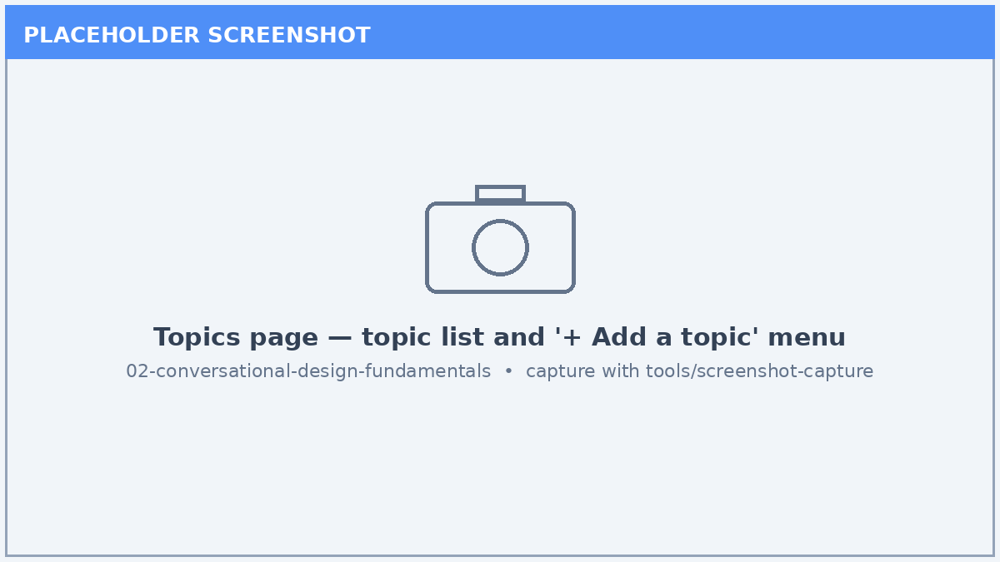
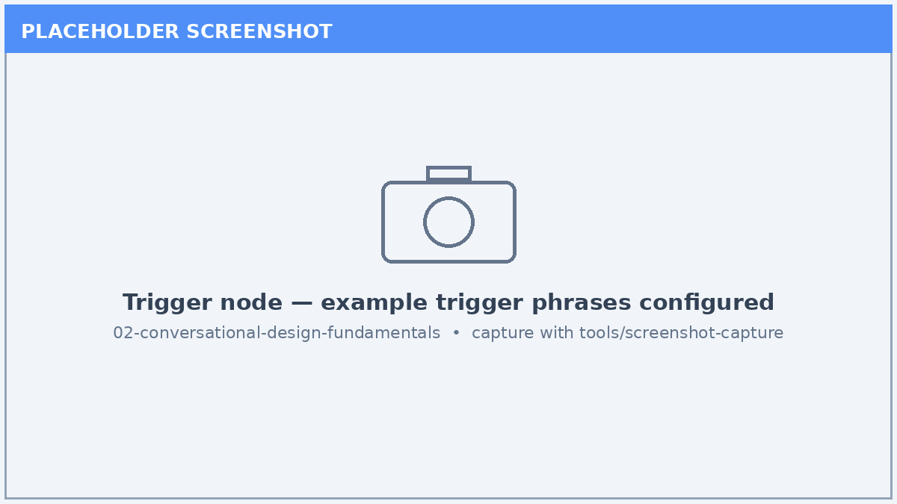
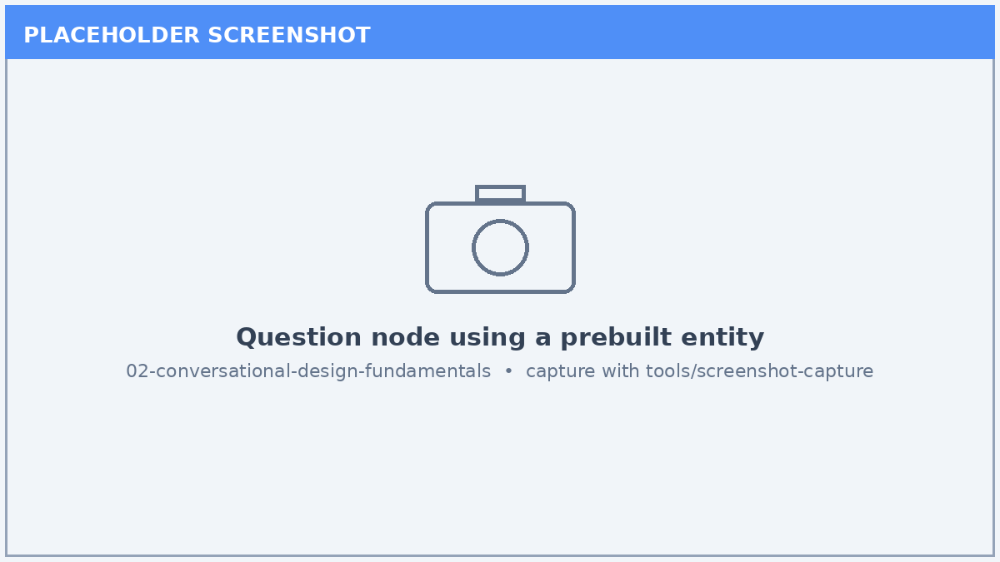

# Lab 02: Topics, Triggers, Entities & Variables — Conversational Design Fundamentals

*Learn the building blocks of Copilot Studio conversations before you add knowledge, tools, and orchestration.*

| | |
|---|---|
| ⭐ **DIFFICULTY** | Beginner to Intermediate (100-200) |
| ⏱️ **TIME** | 45 minutes |
| 🧩 **PRODUCTS** | Microsoft Copilot Studio |
| 🏷️ **TAGS** | Topics, Triggers, Entities, Variables, Conversation Design |
| 🏭 **INDUSTRIES** | Cross-industry |

---

## Overview

Before an agent can ground answers in knowledge or call tools, it needs a solid **conversational foundation**: topics that organize dialog, triggers that route user intent, entities that extract structured values, and variables that carry state across a conversation. This lab teaches those fundamentals so the later, more advanced labs build on a clear mental model.

## 🎯 Learning Objectives

1. Create and organize **topics** and understand system vs. custom topics.
2. Configure **trigger phrases** and understand how the orchestrator routes intent.
3. Capture user input with **question nodes** and **prebuilt/custom entities**.
4. Store and reuse data with **topic** and **global variables**.
5. Test conversation flow end-to-end in the test canvas.

## Prerequisites

- Access to Microsoft Copilot Studio with permission to create an agent.
- A web browser (Microsoft Edge or Chrome recommended).
- No prior agent-building experience required.

## Step-by-Step

### Step 1 — Explore the Topics page

1. Open or create an agent and select **Topics** in the left navigation.
2. Review the **system topics** (Greeting, Fallback, Conversation Start, End of Conversation).
3. Select **+ Add a topic → From blank** to create a custom topic.
4. Name the topic to reflect a single user intent (for example, *Report an Outage*).

### Step 2 — Configure trigger phrases

1. Open your new topic and select the **Trigger** node.
2. Add 5–8 natural-language **trigger phrases** that a user might type.
3. Save and note how the orchestrator uses these phrases (plus the topic description) to route intent.
4. Avoid overlapping phrases across topics to prevent routing ambiguity.

### Step 3 — Capture input with entities

1. Add a **Question** node below the trigger.
2. Set **Identify** to a prebuilt entity (for example, *City and country*, *Number*, or *Date and time*).
3. Save the user response to a **variable** so later nodes can reuse it.
4. Optionally create a **custom entity** (closed list) for domain-specific values.

### Step 4 — Work with variables

1. Open the **Variables** pane and inspect the variable you created.
2. Change a topic variable to a **global variable** so it persists across topics.
3. Reference the variable in a **Message** node using `{Topic.VariableName}` syntax.
4. Add a **condition** node that branches on the variable's value.

### Step 5 — Test the conversation

1. Open the **Test** pane and enter one of your trigger phrases.
2. Confirm the topic triggers, the question is asked, and the entity is captured.
3. Verify the variable is echoed back in the message node.
4. Iterate on trigger phrases if routing does not behave as expected.

## ✅ Validation / Success Criteria

- You created a custom topic with at least five trigger phrases.
- A question node captures input using a prebuilt or custom entity.
- A variable is reused in a later node and persists as expected.
- The conversation flows end-to-end in the test canvas without errors.

## ✅ Lab Complete

You now understand the **conversational design fundamentals** that every Copilot Studio agent is built on. With topics, triggers, entities, and variables in hand, you are ready to ground agents in knowledge and add tools.

**Suggested next labs:**

- [Lab 03: Prompt Assistant](../03-prompt-assistant/index.md) — write better instructions and prompts.
- [Lab 04: Build a Custom IT Operations Agent for Contoso Energy](../04-energy-ops-agent/index.md) — add knowledge sources to a real scenario.

> 🔗 **Related lab:** [Lab 01: Copilot Studio Introductory Workshop](../01-intro-workshop/index.md) — the broader orientation to building, configuring, and publishing agents.

---

*Screenshots in this lab are placeholders. Capture live images with the [screenshot tool](../../tools/screenshot-capture/) (`shots.json` is wired for this lab).*
