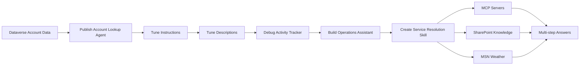

# 🧭 Lab 03: Orchestration with Copilot Studio for Contoso

*Routing the right tool, the right data, and the right policy — every turn.*

| | |
|---|---|
| ⭐ **DIFFICULTY** | Advanced (Level 300) |
| ⏱️ **TIME** | 60 minutes |
| 🧩 **PRODUCTS** | Microsoft Copilot Studio, Microsoft Dataverse, Microsoft 365 (SharePoint / Work IQ), Model Context Protocol (MCP), MSN Weather |
| 🏷️ **TAGS** | Generative Orchestration, New Orchestrator, Agentic Reasoning Loop, Skills, MCP, Connected Agents |
| 🏭 **INDUSTRY** | Energy / Utilities (Contoso family of companies) |

> **Adapted from:** [Orchestration with Copilot Studio — Microsoft Copilot Agents Labs](https://microsoft.github.io/mcs-labs/labs/mcs-orchestration/). Reframed for **Contoso** — the North American energy infrastructure company and parent of Contoso Energy, Contoso Gas, Contoso Infrastructure, and Contoso Power. Technical steps remain compatible with the upstream Microsoft sample data and connectors.

---

## 🗺️ Lab Flow



---

## 🏢 Why Contoso cares about orchestration

Contoso serves nearly 40 million consumers across regulated utilities and infrastructure projects. Customer Operations, Field Dispatch, Account Management, and Outage Response teams all work across **dozens of source systems** — customer records in Dataverse, work-order systems, weather services for storm response, partner portals, and policy libraries that differ between **internal handling** and **what we say to a customer**.

A Copilot Studio agent that "feels smart" to a Contoso account manager has to make the same choice a seasoned employee makes every day:

> *Which system holds the answer, which policy applies, what do I share with the customer, and what do I keep internal?*

That decision is what **generative orchestration** does on every turn. The quality of those decisions depends almost entirely on:

- The **Instructions** at agent and child-agent level
- The **Descriptions** on every tool, child agent, and input
- Whether you use the **New Orchestrator (Agentic Reasoning Loop)** for multi-step tasks
- Whether you package recurring playbooks as **Skills**

Common challenges this lab solves:

- *"The agent pulled the wrong account when I said 'the Texas customer'."*
- *"It quoted an internal escalation policy to the customer — that should never have happened."*
- *"It stops at every step instead of finishing the work."*
- *"I keep cramming rules into the system prompt and it still picks the wrong tool."*

---

## 🎯 What you will learn

By the end of this lab you will:

1. ✅ Verify and publish a **Contoso Customer Account Lookup** connected agent backed by Dataverse
2. ✅ See — turn by turn — how **Instructions** and **Descriptions** at four different levels shape the planner's routing decisions
3. ✅ Use the **Activity Tracker** and **Get rationale** as debugger traces for your descriptions
4. ✅ Build a new-type **Contoso Customer Operations Assistant** that uses the **New Orchestrator (Agentic Reasoning Loop)** to complete multi-step tasks end to end
5. ✅ Package a **Service Resolution Concierge Skill** that chains custom MCP servers, two knowledge sources (customer-facing vs. internal), and live weather across a single turn

---

## 🧠 Core concepts overview

| Concept | What it means at Contoso |
|---|---|
| **Generative Orchestration** | The planner that decides — on every turn — which tool, knowledge source, child agent, or connected agent answers the user. |
| **Instructions** | Top-level rules that always apply (e.g., *"Always include account number when handing off to billing."*). Run on every turn — use sparingly. |
| **Descriptions** | Per-tool, per-agent, per-input metadata the planner reads when it's deciding *whether* to use that thing. Descriptions are the most important routing signal; names and parameter metadata help refine selection. |
| **New Orchestrator (Agentic Reasoning Loop)** | The default orchestrator in newly created agents using generative orchestration. Plans → acts → observes → iterates within **one turn** until the task is done. |
| **Skill** | A reusable, named playbook the orchestrator loads on demand. Bundles *when to use me + the tools I rely on + the procedure to follow* — keeps base instructions short and behavior consistent. |
| **MCP Tool** | A Model Context Protocol server attached to the agent. In this lab you'll use the **Microsoft Dataverse MCP Server** plus two sample servers (Order Management, Warehouse) that simulate a Contoso field-service backend. |

---

## 📚 Documentation

- [Generative Orchestration FAQ](https://learn.microsoft.com/en-us/microsoft-copilot-studio/faqs-generative-orchestration)
- [Configure generative actions](https://learn.microsoft.com/en-us/microsoft-copilot-studio/advanced-generative-actions)
- [Multi-Agent in Copilot Studio](https://learn.microsoft.com/en-us/microsoft-copilot-studio/authoring-add-other-agents)
- [Enhanced Task Completion sample (Order Management / Warehouse MCP)](https://microsoft.github.io/enhanced-task-completion/)

---

## ✅ Prerequisites

- Access to **Microsoft Copilot Studio**
- A Power Platform environment where you can edit Dataverse table views and toggle environment settings (**System Administrator** or **System Customizer**)
- Sample data loaded into the Dataverse **Account** and **Contact** tables (the `(sample)` records used throughout Use Cases #1 and #2)
- The pre-loaded **Account Data Lookup Agent** available in your environment (Use Case #1 verifies and publishes it — this becomes your *Contoso Customer Account Lookup Agent*)
- For **Use Cases #3 and #4** only: an environment where **new-type agents** (the New Orchestrator), **Dataverse Intelligence (Work IQ)**, and **Dataverse MCP servers** can be used

> 💡 The `(sample)` Account and Contact records ship with Dataverse and are reused here so the lab works in any tenant. Treat them as stand-ins for Contoso commercial customer accounts (large industrial gas customers, transmission partners, energy infrastructure counterparties, etc.) as you walk through the scenarios.

---

## 🗺️ Use cases covered

| # | Use Case | Contoso Framing | Time |
|---|---|---|---|
| 1 | Get the sample connected agent working | Stand up the **Contoso Customer Account Lookup Agent** | 10 min |
| 2 | See the impact of Instructions and Descriptions on the planner | Watch the planner pick the right account, contact, tool, and input | 20 min |
| 3 | New Orchestrator — Agentic Reasoning Loop | Build a **Contoso Customer Operations Assistant** that completes multi-step asks in one turn | 30 min |
| 4 | Leveraging Skills | Package a **Service Resolution Concierge** Skill that chains MCP, knowledge, and weather | 30 min |

---

# 🧪 Use Case #1 — Get the Contoso Customer Account Lookup Agent working

> 🎯 **Objective:** Confirm the environment is ready and the prebuilt connected agent is published. If you've already done this in another lab (e.g., the Multi-Agent lab), skip to Use Case #2.

### Scenario

Before exploring how Instructions and Descriptions shape orchestration, the agent and its underlying Dataverse data have to be properly configured — Dataverse Search must be on, the Account and Contact **Quick Find** views must be correctly indexed, and the agent must be published with peer-to-peer connection enabled.

### Step 1 — Make sure Dataverse Search is on

1. In the upper-right corner of Copilot Studio, select the ⚙️ **Gear icon**.
2. Select **Go to Power Platform admin center**.
3. In the [Power Platform admin center](https://admin.powerplatform.microsoft.com), select **Manage** → **Environments**.
4. Pick your environment from the list.
5. Select **Settings** on the top navigation bar of the environment page (the top-nav Settings — *not* the global gear).
6. Expand the **Product** group and select **Features**.
7. In the **Dataverse search** section, verify both checkboxes are **enabled**:
   - *Turn on search indexing to support Dataverse intelligence (Work IQ) in AI and agent experiences*
   - *Show global search bar in all model driven apps and turn on search indexing to support search-only experiences*
8. Select **Save** if you made any changes.

### Step 2 — Make sure the right columns are indexed

> ⚠️ **Important:** Not strictly required for *any* connected agent to work — but required for the prebuilt one to return results in this lab.

1. Go to the Power Apps maker portal: <https://make.powerapps.com>.
2. In the left menu select **Tables**.
3. Open the **Account** table → **Views** (under *Data experiences*) → **Quick Find Active Accounts**.
4. Select **View Column** and confirm the view contains at least:
   - Address 1: State/Province
   - Address 1: ZIP/Postal Code
   - Address 1: City
   - Annual Revenue
   - Currency
5. Use **+ View column** to add anything missing.
6. Confirm the **Find by** list (bottom-right, via **Edit find table columns**) includes:
   - Address 1: State/Province
   - Address 1: ZIP/Postal Code
   - Address 1: City
7. Select **Save and publish**. **Do not navigate away until publish completes.**
8. Repeat for the **Contact** table → **Quick Find Active Contacts** view, ensuring these are present:
   - Anniversary
   - Birthday
   - Job Title
   - Marital Status
9. **Save and publish.**

### Step 3 — Test and publish the Account Data Lookup Agent

1. Back in Copilot Studio, open the **Account Data Lookup Agent** (your Contoso Customer Account Lookup Agent).
2. Open the **Test** chat (top-right).
3. Enter: `What are the accounts in Texas?`
4. Verify the agent returns results — that confirms data + indexing are working.
5. Select **Settings** in the upper-right menu.
6. On **Generative AI** settings, scroll to **Connected agents** and make sure *"Let other agents connect to and use this one"* is **On**.
   > 💡 Use the **Connected agents** section on the **Generative AI** page — *not* the separate *Connected Agents* item in the Settings left-nav (that one manages inputs/outputs).
7. Close Settings (X in upper-right).
8. Select **Publish** → check **Force newest version** → **Publish** to confirm.
   > ⚠️ An agent can't be connected to unless it is **published**, and forcing the newest version makes sure downstream connections pick up your latest changes.

### ✅ You've completed Use Case #1

**Key takeaways**

- Dataverse Search must be enabled at the environment level for the prebuilt Account Data Lookup Agent used in this lab to return Dataverse results.
- Quick Find indexes determine which fields the planner can filter on at runtime.
- An agent must be both **published** *and* have **"Let other agents connect to and use this one"** enabled before peers can connect.

**Troubleshooting**

- No results from a search? Verify the Quick Find view's columns are added *and* the view is saved and published.
- Agent can't find account data at all? Re-check that Dataverse Search is on in the admin center for this environment.

---

# 🧪 Use Case #2 — See the impact of Instructions and Descriptions on the planner

> 🎯 **Objective:** Build intuition for how the planner reads Instructions and Descriptions at **four different levels** to assemble a correct plan — and how to debug it when it doesn't.

### Scenario

A Contoso account manager opens the agent and asks a string of follow-up questions about customers in Texas — accounts, primary contacts, derived facts like age, then pivots to a contact by name. Every turn is a planner decision: which child agent, which tool, which arguments.

### Part A — Where Instructions and Descriptions live

Open the **Account Data Lookup Agent** and walk each location below. Each one is a hook the planner reads.

1. **Instructions in Overview** — agent-level Instructions appended to the planner's context on **every turn**. Right place for cross-cutting rules ("If `(sample)` appears in a contact/account name, include it when passing to tools"; "Never offer to export or create a file").
   > 💡 Instructions are expensive — they cost context on every turn. Use them only for rules that genuinely apply everywhere.
2. **Child Agents** — open the **Agents** tab. The two children here are **Account Agent** and **Contact Agent**, each with a **Child** relationship. The planner picks one per step.
3. **Descriptions in Child Agents** — open each child and review **Name** + **Description** in Details.
   > 💡 **Descriptions are the primary routing signal.** A clear name helps, but the description carries the handling rules and disambiguation that the planner relies on most.
4. **Instructions in Child Agents** — these only run when *that* child runs. Right place for tool-selection rules scoped to that child (e.g., "Use **Find Account** to look up; use **Get Account Details** to expand details on an account already in context").
   > 💡 Reach for child Instructions only when name + description tuning isn't enough.
5. **Descriptions in Tools** — open **Tools** → **Find Account**. The Description names the operation in plain English and hints at acceptable inputs ("city, account name, primary contact, state…"). That natural-language hint is what lets the planner recognize "accounts in Texas" maps to this tool.
6. **Descriptions in Inputs** — still inside **Find Account**, open **Inputs** → expand `search`. Notice the description: *"Search query that includes state in the format of two digit state code in all caps, 5 digit zip code, city, the account name, and/or the primary contact name."* That single sentence is what translates the user's word *"Texas"* into the value `TX` that Dataverse Search actually needs.
   > ⚠️ Input descriptions are the **foundation of dynamic chaining**. When one tool's output becomes another tool's input, the description tells the planner how to reshape it. Skip this, and the planner has to guess.

### Part B — Demonstration

1. Open the **Test** chat (top-right) and select **+** to start a fresh conversation.

> ⚠️ Run the prompts below **in order, without resetting**. Several depend on prior context (*"them"*, *"the 2nd one"*) and resetting will break the chain.

After each turn, expand the **Activity tracker** to see which child agent and which tool the planner chose, and what arguments it passed.

#### Turn 1 — Find accounts by location

```text
What are the accounts in Texas?
```

You should see:

- ✅ Right child agent picked: **Account Agent**
- ✅ Right tool picked: **Find Account**
- ✅ Input optimized: `"search": "TX"` — *not* `"Texas"`. The input description forced the planner to format the value the way Dataverse Search expects.

#### Turn 2 — Carry context across turns

```text
What are all the details on them?
```

The planner does **not** re-run the search. It takes the four accounts from Turn 1 and calls **Get Account Details** *once per account* — four parallel calls. "Them" never goes to a tool; it resolves to the four accounts.

> 💡 The **find → details** pattern matters: a single mega-tool that returns every field on every match would blow the LLM context budget. Splitting the work means only the data the user actually needs reaches the model.

#### Turn 3 — Drill into a related entity (Account → Contact)

```text
What is the job title of the primary contact of the 2nd one?
```

The planner switches to **Contact Agent**. Look at the **Task** input it sent to that child — it isn't *"the 2nd one"*; it's *"Get the job title of Nancy Anderson (sample), the primary contact for Adventure Works (sample)."* The parent resolved the context **before** dispatching.

> 💡 Child agents take a **natural-language Task**, not structured parameters. The parent translates context; the child picks its own tools.

#### Turn 4 — Use a derived field that doesn't exist as a column

```text
How old are they?
```

Dataverse has `Birthdate`, not `age`. The agent calls **Get-Contact-Details**, retrieves the birthdate, and the LLM does the date math itself before answering.

> 💡 You don't need a tool for every question. Expose raw fields and let the planner derive answers. Reach for a tool only when the calculation is unreliable for the LLM (large datasets, exact business rules, signed calls).

#### Turn 5 — Use a status field, then ask the planner to explain itself

```text
Are they married?
```

Confirm Nancy is married. Then scroll to the bottom of the Activity Tracker turn and select **Get rationale**. The agent returns a plain-language reconstruction of the plan it ran:

- *"Identify all accounts based in Texas from the provided data."*
- *"Extract and list all available details for each Texas-based account."*
- *"Confirm and present the job title of the primary contact for Adventure Works (sample)."*

> 💡 **Get rationale is the most useful tuning lever in orchestration.** Read it side-by-side with your Instructions and Descriptions. If the rationale reflects what you *meant*, your descriptions are doing their job. If it reflects something subtly wrong, you have a precise pointer to which description needs sharper wording.

#### Turn 6 — Pivot directly to a contact

```text
What is Susanna Stubberod's phone number?
```

No **Account Agent** in the trace this time — the planner recognized the subject is a person and dispatched straight to **Contact Agent**, enriching the Task with the related account context it found.

> 💡 Because Account Agent and Contact Agent are **peer** children — neither calls the other — the planner can enter from whichever side the user starts on. *"Accounts in Texas"* → Account Agent. *"Susanna's phone number"* → Contact Agent. The same set of tools answers every direction of question. That's the difference between an agent you have to extend for every new question and one that flexes.

### ✅ You've completed Use Case #2

**Key takeaways**

- **Instructions shape behavior; Descriptions shape routing.** Instructions are how an agent behaves once selected; Descriptions are how the planner decides to select it in the first place.
- The planner reads descriptions at **four levels** — agent, child agent, tool, and input. Weakness at any level cascades into wrong routing or wrong arguments.
- Conversation context (pronouns, ordinals, prior results) carries through orchestration and is resolved into concrete tool arguments — without the user repeating themselves.

**Troubleshooting**

- Planner picks the wrong child? Fix the child's **Name** first, then its **Description**.
- Tool called with the wrong argument? Almost always an **input Description** issue.
- Planner re-searches when it should have used context? Tool descriptions are probably unclear about required vs. optional inputs.

---

# 🧪 Use Case #3 — New Orchestrator: Agentic Reasoning Loop

> 🎯 **Objective:** Stand up a newly created Contoso Customer Operations Assistant using generative orchestration and validate how the **Agentic Reasoning Loop** drives multi-tool task completion in a single turn.

### Scenario

A Contoso customer operations specialist wants one assistant that can — without stopping to confirm at every step — pull a commercial customer's primary contact, check the weather at that customer's site (storm risk! gift planning! site visit planning!), look up internal policy, and synthesize an answer. A newly created agent uses generative orchestration with the Agentic Reasoning Loop by default, so this is what you get out of the box.

### Step 1 — Enable Dataverse Intelligence (Work IQ) and Dataverse MCP servers

> 💡 Required for the **Microsoft Dataverse MCP Server** tool you'll add below — not specific to the New Orchestrator.

1. Navigate to the **Power Platform admin center** as in Use Case #1 → **Manage** → **Environments** → your environment → **Settings** (top nav) → **Product** group → **Features**.
2. Under **Dataverse intelligence**, verify *"Turn on Dataverse intelligence (Work IQ) for agents and AI experiences"* is checked.
3. Under **Dataverse Model Context Protocol**, verify the GA MCP client option is checked. Enable the Preview option only if you plan to use preview MCP tools.
4. **Save** if you made changes.

### Step 2 — Create the *Contoso Customer Operations Assistant*

1. In Copilot Studio, select **Agents** in the left navigation → **New Agent** in the upper-right.
   > 💡 Creating a new agent this way uses generative orchestration with the **Agentic Reasoning Loop** enabled by default.
3. Name it:
   ```text
   Contoso Customer Operations Assistant
   ```
4. In the **Instructions** box, paste:
   ```text
   You are a Customer Operations Assistant for Contoso account managers and customer-care specialists. Help users complete multi-step tasks end to end. Use your Dataverse tools to look up commercial customer (account) and contact data, and the weather tool for current conditions at a customer's site. When a request touches gifts or spending on customers or partners, follow the company gifting policy in your knowledge. Complete the whole task before responding rather than stopping to ask at each step.
   ```
5. Leave the **Model** at its default and select **Save**.

### Step 3 — Add the tools the orchestrator will use

#### 3a — Add the Weather tool (Maker authentication)

1. In the right rail, select **Add tool**. Search for `Weather` → select **Get current weather (MSN Weather)** → **Add**.
2. In the Tools list, select **Get current weather** to open Tool details.
3. Under **Authentication mode**, select **Maker**. Under **Connection**, choose **Not connected** → **Create new connection** → **Create**. Once connected, **Save**.
   > ⚠️ Use **Maker** for anonymous / API-key / service-account tools. The MSN Weather connector authenticates anonymously, so it runs as the maker. The same rule applies to any shared-credential connector. Tools that act *as the signed-in user* (mailbox, files) stay on **User** authentication.
4. Still in Tool details → **Inputs**. Leave **Location** set to **AI** (the agent infers it from the conversation). For **Units**, change *How is this filled?* from **AI** to **Value**, then add a variable and pick **I** (Imperial °F) or **C** (Celsius). **Save**.

#### 3b — Add the Microsoft Dataverse MCP Server tool

1. Select **Add tool** again. Search **Dataverse**, apply the **Model Context Protocol** filter, and pick **Microsoft Dataverse MCP Server** — the **GA** card, *not* Preview.
2. On **Select a connection**, pick your Dataverse connection (or create one if needed) → **Next**.
3. On **Review capabilities** (lists `read_query`, `search`, `create_table`, `update_record`, etc.), leave defaults → **Confirm**.
   > 💡 This lab only exercises `read_query` (reading accounts/contacts) and `search` (schema discovery). The orchestrator won't call write/delete actions unless a prompt explicitly asks.
4. **Save**. Your Tools list should show **Get current weather** and **Microsoft Dataverse MCP Server**.

### Step 4 — Add a knowledge source

1. On the **Build** tab, select **Add knowledge** in the right rail.
2. Choose the **SharePoint** card (Powered by Work IQ), select **Browse items**, navigate **OnePlace → Documents → HR → company_policies_sample.pdf** → **Confirm selection** → **Add to agent**.
3. Confirm the file appears under **Knowledge**.

> 💡 At Contoso, this stand-in `company_policies_sample.pdf` would be your internal Field Operations / Customer Engagement / Procurement & Gifting policy. The mechanic is identical — Work IQ queries SharePoint live, so the source is *Ready* almost immediately.

### Step 5 — Test the Agentic Reasoning Loop

Open the **Preview** tab. You'll see a brief *"Working on it…"* then an **activity trace** that names each tool call before the final answer. The level of detail shown depends on the model — some models show a chain of thought inline, while others show only the tool steps.

#### Test 1 — A single tool call

```text
What is the current weather in San Diego?
```

The trace shows the agent deciding to call **Get current weather**, then returning conditions.

#### Test 2 — Structured data via the Dataverse MCP server

```text
Give me a table with all the accounts that are in Texas
```

The trace shows the agent reasoning *"I need to search the accounts table in Dataverse and query it,"* calling **read_query**, and rendering a Markdown table.

#### Test 3 — Modify the previous result (carry context)

```text
Add the account number to the list
```

The agent re-renders the table with an **Account Number** column, reusing the prior turn's context — you may see a second `read_query` in the trace.

#### Test 4 — Multi-tool reasoning (knowledge + Dataverse + weather)

```text
I need to get a gift for the primary account contact for Litware. Can you propose an appropriate gift that takes into consideration our gifting policies and their weather to make some good recommendations for an appropriate gift.
```

Watch the loop drive through several steps in **one turn**:

1. **search** the gifting policy (knowledge)
2. **read_query** the Litware account + its primary contact (Dataverse MCP)
3. **Get current weather** for the contact's city
4. Synthesize a policy-compliant, weather-appropriate recommendation — with a citation back to `company_policies_sample.pdf`

#### Test 5 — Inspect a single step

Any tool step in the trace is expandable. Open a **read_query** step and you'll see the exact SQL generated (e.g., `SELECT name, address1_city, address1_stateorprovince, … FROM account WHERE address1_stateorprovince = 'Texas' OR address1_stateorprovince = 'TX'`) and the raw result the orchestrator reasoned over.

### ✅ You've completed Use Case #3

**Key takeaways**

- A newly created agent uses generative orchestration with the **Agentic Reasoning Loop** by default — it plans → acts → observes → iterates within **one turn** until the task is done.
- The trade-off is **visibility**. The classic Activity Tracker and *Get rationale* aren't the surface here — the **Preview pane** shows the activity trace, and you expand a step to see its parameters and result.
- Match credentials to tool intent: shared-credential connectors → **Maker**; user-context connectors → **User**.
- The Reasoning Loop **chains** tools across knowledge, Dataverse, and weather in one turn — no per-step prompting.

**Troubleshooting**

- "Connection Required" card at runtime? Open the tool's Details and confirm **Authentication mode** and **Connection** are set (Weather should be **Maker** + a connection).
- Can't query Dataverse? Confirm the Dataverse MCP environment feature is **on** and the Entra connection for **Microsoft Dataverse MCP Server** is complete.
- Policy-dependent answer is generic? Confirm `company_policies_sample.pdf` is listed under **Knowledge**.

**Challenge — apply to a Contoso workflow**

- Pick a workflow that gathers info from multiple systems and then takes an action (compose a customer email, draft a field-dispatch note, file an outage ticket).
- Sketch the tools it would need. For **each one**, decide: **Maker** or **User** authentication — and why?

---

# 🧪 Use Case #4 — Leveraging Skills: a Contoso Service Resolution Concierge

> 🎯 **Objective:** Extend your Use Case #3 agent so it can diagnose and resolve service problems end to end — then watch the New Orchestrator **load the Skill** and chain MCP tools, two knowledge sources, and weather across a single turn.

### Scenario

In a Contoso customer-care context, the equivalent of an "order problem" is a **service request**: a work order that's delayed, a part that's out of stock for a field repair, a return/exchange on equipment, or a delivery that may be impacted by weather. The technical building blocks below use the Microsoft *Enhanced Task Completion* sample MCP servers — frame them as analogs to your service-ticketing / parts-inventory / dispatch systems.

By the end you will have:

- ✅ Added a **Customer-facing knowledge source** (separate from the internal policy from Use Case #3)
- ✅ Created the **Order Management MCP** and **Warehouse MCP** connections and attached both servers as tools
- ✅ Authored a **Service Resolution Concierge** Skill
- ✅ Updated the agent's Instructions to **use the Skill** and to enforce the **internal vs. customer-facing** policy line
- ✅ Run prompts that show the Skill load, then the orchestrator chaining everything together

> ⚠️ **Important:** This Use Case builds directly on Use Case #3. Make sure the Contoso Customer Operations Assistant exists with **Get current weather**, **Microsoft Dataverse MCP Server**, and the **internal `company_policies_sample.pdf`** knowledge already attached.

### Step 1 — Add the customer-facing knowledge source

In Use Case #3 you added the **internal** policy from the HR folder. Now add a **customer-facing** policy so the agent can tell the difference between *what we say to a customer* and *what we use internally to decide*.

1. Open the Contoso Customer Operations Assistant on the **Build** tab.
2. In the right rail → **Add knowledge** → **SharePoint**.
3. **Browse items** → **OnePlace → Documents → Customer** → select **`Contoso-Customer-Care-Policies.pdf`** → **Confirm selection**.
4. **Add to agent.** Knowledge should now list **both** sources — internal (HR folder) and customer-facing (Customer folder).

> 💡 At Contoso this two-source pattern is critical. The customer-facing document is what an account manager *quotes* to a customer (returns, refunds, SLA windows, outage credits). The internal document is *handling/escalation* guidance the agent uses to decide — but never reads back to a customer. The Skill below enforces that line explicitly.

### Step 2 — Create the MCP server connections (temporary workaround)

This lab uses two prebuilt sample MCP connectors — **Order Management MCP** and **Warehouse MCP** — that simulate an e-commerce / fulfillment backend ([Enhanced Task Completion sample](https://microsoft.github.io/enhanced-task-completion/)). For Contoso purposes, treat them as analogs to a field-service ticketing system and a parts-inventory system.

> ⚠️ **Preview limitation:** At time of writing, the **new-type agent's** inline *Add tool → connection* step cannot create a brand-new connection for these custom MCP connectors. Workaround: mint the connections via a throwaway **classic** agent, then reuse them in the new-type agent. This step will go away as the preview matures.

1. Go to the **Agents** page. Select the chevron next to **New Agent** → **New classic agent**. Name it `Enable New MCP Servers` → **Create**.
2. On the agent's **Overview**, select **Add tool** → filter to **Model Context Protocol (MCP)** → search `Order Management` → press **Enter**.
3. Pick **Order Management MCP Server**. Open the **Connection** dropdown (reads *Not connected*) → **Create new connection** → **Create** (no credentials required). When the connection shows as connected, **Add and configure** — the server's actions (`search_orders`, `get_order`, `get_shipment`, `request_return`, `get_return_status`) will load.
4. Repeat for **Warehouse MCP Server** (`check_stock`, `get_fulfillment_status`, `find_alternatives`, `get_restock_date`).

Both connections now exist in the environment and are reusable. Leave the classic agent as-is.

### Step 3 — Attach the MCP servers to the Contoso agent

1. Return to **Contoso Customer Operations Assistant** (Build tab) → right rail → **Add tool**.
2. Filter to **Model Context Protocol (MCP)** → search **Order Management** → pick **Order Management MCP Server**. The **Connection** step now resolves to the connection you created → **Next**.
3. On **Review capabilities**, the server's actions load (no *"Couldn't load MCP tools"* error) → **Confirm**.
4. Repeat for **Warehouse MCP Server**.

Your Tools list should now show **four** tools: Get current weather, Microsoft Dataverse MCP Server, Order Management MCP Server, Warehouse MCP Server.

### Step 4 — Add the Service Resolution Concierge Skill

1. In the right rail → **Add skill** (the **+** on the **Skills** section). The dialog offers **Upload a skill** (a `SKILL.md`) or **Create from blank**. Choose **Create from blank**.
2. Fill in the three fields:

   **Name**
   ```text
   service-resolution-concierge
   ```

   **Description**
   ```text
   Use when a Contoso customer or account manager asks about a service request, work order, or shipped item that is delayed, stuck, missing, damaged, out of stock, that they want to return or exchange, or whose delivery might be affected by weather. Diagnoses where the request is in the fulfillment pipeline and reports the options (wait for restock, exchange for an alternative, or start a return) grounded in customer-facing company policy. Only takes action when the user explicitly asks.
   ```

   **Instructions**
   ```text
   You help resolve a service / order problem when asked. Answer the question the user actually asked. Do not push next steps, volunteer extra options, or take any write action (returns, exchanges, follow-up messages) unless the user explicitly asks for it.

   When to use this skill:
   - "Where is my order?" / "Why is order #12345 late?"
   - "This item is out of stock — what can I do?"
   - "I want to return / exchange an item."
   - "Can I get this in a different size or color?"
   - "Could the weather hold up my delivery?"

   Tools you have:
   - Order Management MCP: search_orders (find the order and identify the customer by name, email, or order number); get_order (full order detail — items, SKUs, status, shipping address); get_shipment (carrier, tracking, delivery estimate — shipped/delivered orders only); request_return (open a return for an item); get_return_status (return stage / refund status).
   - Warehouse MCP: get_fulfillment_status (picking/packing stage for an order not yet shipped); check_stock (inventory level for a SKU); find_alternatives (other in-stock items in the same category — best for size/color exchanges); get_restock_date (expected arrival date + incoming quantity for an out-of-stock SKU).
   - Get current weather: current conditions at a delivery destination, to flag risk to an active delivery.
   - Contoso Customer Care Policies (knowledge): return window, refunds, restocking fees, exchanges, cancellations, shipping/weather-delay, backorder rules.

   Procedure:
   1. Identify the order and the customer. If given an order ID, call get_order directly. Otherwise call search_orders with the name, email, or partial info — this both finds the order(s) and identifies the customer. If more than one matches, ask one clarifying question — never guess.
   2. Diagnose by the order's state. Shipped/delivered: get_shipment for carrier, tracking, delivery estimate. Not yet shipped (processing): get_fulfillment_status for the warehouse stage. get_shipment will error for an order that hasn't shipped — that's expected; pivot to get_fulfillment_status rather than reporting a failure.
   3. If an item is delayed or unavailable, call check_stock for that SKU. If out of stock, call get_restock_date for when it returns. Only offer find_alternatives when a same-category item is a genuine substitute (a different size or color of the same product); do not present an unrelated category-mate. When nothing comparable is in stock, say so and present waiting for restock as the honest option.
   4. Ground the options in policy. Two policy sources are loaded — use the right one. Contoso Customer Care Policies is the customer-facing source: what you state, quote, and promise the customer (returns, refunds, exchanges, cancellations, shipping) — cite it by section. The internal policies (company_policies_sample.pdf) are internal handling/escalation guidance: use them to decide and escalate, but do not quote or read them back to a customer. When both cover the same topic, the customer hears the customer-facing rule; apply internal constraints silently or by escalating. Key rules: Returns (section 1) 30 days from delivery, in-transit not yet returnable; Damaged/wrong item (1.4) priority — no restocking fee, free return shipping, customer's choice of replacement/exchange/full refund including original shipping; Restocking fee (3) 15% only on undamaged change-of-mind returns.
   5. If the user asks whether weather could affect an active delivery, get the destination from get_order, confirm the order is in transit or out for delivery via get_shipment, then call Get current weather for the destination city and assess risk. Current conditions only — don't present it as a forecast; frame it as conditions now at the destination for an imminent delivery.
   6. Answer the question. Report what you found — status, location, restock date, eligible options — and stop. If they asked "where is my order," tell them where it is. Only lay out resolution choices (wait/exchange/return) if they asked what they can do about it.
   7. Take action only when explicitly asked. Return: only if the user says to start one — request_return, then get_return_status to confirm it opened, and read back the return authorization. Exchange: only if the user chooses a specific size/color — confirm with check_stock first. Never open a return, commit an exchange, or send any message on your own initiative.

   Guardrails:
   - Never promise a refund, exchange, restock date, or delivery outcome that a tool result or the policy knowledge does not support.
   - If a tool returns nothing or errors, say so plainly and offer the next-best path; do not invent order, stock, tracking, or weather data.
   - Resolve the customer and order with search_orders/get_order; don't ask for info you can already look up.
   - Never disclose internal policy (company_policies_sample.pdf) to a customer. Quote only the Contoso Customer Care Policies; use internal policy to decide and escalate, not to answer.
   ```

3. Select **Create**. The Skill appears under **Skills** as **service-resolution-concierge** and the agent saves.

> 💡 If you author a Skill as a `SKILL.md` file instead, it carries a small YAML front matter block with `name` and `description`. When filling the form fields here, you *don't* include front matter — the **Name** and **Description** fields capture it; **Instructions** holds the body only.

### Step 5 — Update the agent Instructions

Replace the Use Case #3 instructions with a shorter, Skill-aware version that points the orchestrator at the Skill for service problems and draws the internal-vs-customer policy line.

1. In the **Instructions** box, select all of the existing text and replace it with:

   ```text
   You are the Contoso Customer Operations Assistant for account managers and customer-care specialists. Help users resolve service issues end to end — order status, shipments, returns, exchanges, inventory, restock timing, and delivery-weather risk.

   Use your tools to do the work: search_orders and get_order plus the Order Management and Warehouse MCP servers for order, fulfillment, stock, and return actions; the Dataverse tools for account and contact data; and the weather tool for current conditions at a delivery destination.

   For any service / order problem (delayed, stuck, out of stock, damaged, return, exchange, or weather-risk), follow the Service Resolution Concierge skill.

   Ground customer-facing answers in the Contoso Customer Care Policies (returns, refunds, exchanges, cancellations, shipping) and cite the relevant section. Treat the internal company policy as internal guidance only — use it to decide and escalate, and do not quote it to a customer.

   Answer the question that was asked. Only take an action (open a return or commit an exchange) when the user explicitly asks. Never invent order, stock, tracking, or weather data — if a tool returns nothing or errors, say so and offer the next-best step.
   ```

2. **Save.**

### Step 6 — Demonstration

Open the **Preview** pane. Watch the activity trace: on service problems you'll see the Skill load followed by MCP tool calls, a knowledge search, and a synthesized answer.

> ⚠️ **Reset between prompts that state a customer name.** When a prompt opens with *"I'm Sarah Mitchell"* or *"this is James Rivera,"* the orchestrator keeps that person in context. Select **New chat** at the top of the Preview pane to start clean.

#### 1. Full account picture (identity + fan-out)

```text
Hi, I'm Sarah Mitchell. Can you pull up my orders and summarize where each one stands, flagging anything that's delayed or has a return in progress?
```

One request fans out across the whole account: `search_orders` finds Sarah's three orders, `get_order` pulls all three, then `get_shipment` and `get_fulfillment_status` fill in live state. **Reset** after.

#### 2. The bundle dilemma (Skill loads; mixed availability)

```text
Order ORD-10460 still hasn't arrived. What's holding it up, and what are my options?
```

This is the centerpiece. Watch the Skill load, then `get_order` → `get_fulfillment_status` + `check_stock` (both items) → `get_restock_date` for the out-of-stock item → a policy search — and a mixed-availability picture (one item backordered, one picked).

#### 3. Restock timing (the honest "wait")

```text
When will the LumiRead e-reader in order ORD-10422 ship?
```

`get_order` → `get_fulfillment_status` → `get_restock_date`. The agent reports *"still awaiting restock"* rather than inventing a ship date.

#### 4. Size/color exchange (where `find_alternatives` shines)

```text
The black TrailMark hoodie in order ORD-10455 — can I get it in XL or grey instead?
```

`get_order` → `find_alternatives` surfaces the genuine same-product substitutes; the agent checks the Customer Care exchange rules before answering.

#### 5. Weather and delivery risk (cross-domain synthesis)

```text
My order ORD-10421 is out for delivery — could the weather hold it up?
```

The orchestrator bridges three domains: `get_order` + `get_shipment` to find the destination and confirm it's out for delivery, then **Get current weather** for that city, then the shipping-delay policy — and concludes whether weather is a concern. *Current conditions only* — not a forecast.

#### 6. Policy-grounded eligibility (the guardrail in action)

```text
The PulseWave earbuds in order ORD-10318 are defective. Confirm I'm within policy, then go ahead and start the return for me.
```

Even though the user asks for an action, the agent checks the policy **first**: `get_order` + `get_shipment` establish the delivery date, the policy gives the 30-day return window (§1.1), and the agent **declines** to start the return because the order is outside that window — citing the section rather than calling `request_return`.

> 💡 The sample orders are dated well before the current date, so this prompt demonstrates a **policy-grounded refusal** rather than an executed return. It's a clean illustration that the grounding is real — the agent does exactly what the policy says.

#### 7. Won't guess (the clarifying-question guardrail)

```text
Hi, this is James Rivera. Can you check on my recent order?
```

`search_orders` finds two orders for James, so instead of guessing, the agent asks **one clarifying question** — which order, or both?

### ✅ You've completed Use Case #4

**Key takeaways**

- A **Skill** is a reusable, named playbook the orchestrator loads on demand. It bundles *when to use me + the tools I rely on + the procedure to follow* — keeping base instructions short and behavior consistent. You saw `Loaded Skill: …` in the trace whenever a prompt matched.
- **Custom MCP servers** extend the agent with domain actions. The two sample servers added ten order/fulfillment tools the orchestrator chained dynamically — no per-step prompting.
- **Two knowledge sources, two audiences.** The customer-facing policy is what the agent **quotes**; the internal policy is **decision/escalation** guidance it doesn't read back to a customer. Instructions and the Skill enforce that line.
- **Grounding is real, not cosmetic.** The agent cited policy sections, respected the return window, and refused an out-of-window return — proof the policy actually governs its answers.

**Troubleshooting**

- New-type agent's *Add tool → connection* can't create a connection for a custom MCP server? Use the classic-agent workaround above (preview limitation).
- *"Couldn't load MCP tools"* on **Review capabilities**? The connection isn't in place yet — mint it via the classic agent, then re-add the tool.
- Custom MCP server hard to find? Filter the tool picker to **Model Context Protocol** and press **Enter** to run the search.
- Agent carries a previous customer into a new question? Select **New chat** to reset — context persists across a conversation.

**Challenge — apply to a Contoso workflow**

- Take a multi-step Contoso process — outage response, gas-leak triage, commercial onboarding, large-customer quoting — and sketch it as a Skill: a clear *when to use me* description that the generative AI orchestrator can read, the tools it would call, and a numbered procedure with **explicit guardrails for when not to act**. Decide what belongs in the Skill vs. the agent's base instructions.

---

# 🧠 Summary of learnings

You've seen Copilot Studio's orchestration engine from three distinct angles:

- **Generative orchestration (Use Case #2)** — the planner can select multiple topics, tools, and agents and execute multistep plans. Highly inspectable via the Activity Tracker and *Get rationale*. Tunable through agent Instructions, child-agent and tool Names + Descriptions, and input-parameter Descriptions.
- **Agentic Reasoning Loop (Use Case #3)** — the default in newly created agents. Plans, acts, observes, iterates within **one turn** until the task is complete. Better when users want finished outcomes; provides activity traces for inspection.
- **Skills (Use Case #4)** — reusable, named playbooks the New Orchestrator loads on demand. Bundles when to use it, the tools it relies on, and a numbered procedure with guardrails — so base instructions stay short and behavior stays consistent.

> The single most important shift between the two orchestrators: **standard orchestration optimizes for the next correct step; the New Orchestrator optimizes for the user's end goal.** Pick the orchestrator based on which behavior your users actually want — and use Skills to give that orchestrator consistent, reusable playbooks for the workflows it handles most.

### 🪙 Orchestration golden rules

1. **Descriptions are the primary routing signal; names and input metadata refine selection.** Tune descriptions first, then escalate to child or parent Instructions when description tuning isn't enough.
2. **Input descriptions are the foundation of dynamic chaining.** Without clear input descriptions, the planner has to guess how to reshape one tool's output into another tool's input.
3. **Use *Get rationale* as a debugger trace for your descriptions.** When the planner makes the wrong decision, the rationale points you at exactly which description needs sharper wording.
4. **Match credential pattern to tool intent.** Anonymous / API-key / service-account tools → **Maker** credentials. Tools that act as the user → **User** credentials.
5. **Choose your orchestration approach deliberately.** Use classic orchestration where manual topic control matters; use generative orchestration with the Agentic Reasoning Loop where finished outcomes matter.
6. **At Contoso: never blur internal and customer-facing policy.** Two knowledge sources, two audiences. Instructions and Skills draw the line.

---

*Adapted for the Contoso family of companies from the upstream [Microsoft Copilot Agents Labs — Orchestration with Copilot Studio](https://microsoft.github.io/mcs-labs/labs/mcs-orchestration/) lab. Source content © Microsoft.*
