# ⚡ Lab 04: Build an Advanced Energy Intelligence Agent with US Census Bureau Data

*Turn public demographic and economic data into grid-planning intelligence.*

| | |
|---|---|
| ⭐ **DIFFICULTY** | Advanced (Level 200–300) |
| ⏱️ **TIME** | 3 hours (15 min intro, 150 min hands-on, 15 min Q&A) |
| 🧩 **PRODUCTS** | Microsoft Copilot Studio, US Census Bureau API, Power Automate, VS Code (optional) |
| 🏷️ **TAGS** | Topics, Variables, HTTP Actions, Connected Agents, Agent Flows, Evaluations, Model Selection, Energy Planning |
| 🏭 **INDUSTRY** | Energy / Utilities |

---

## 🗺️ Lab Flow

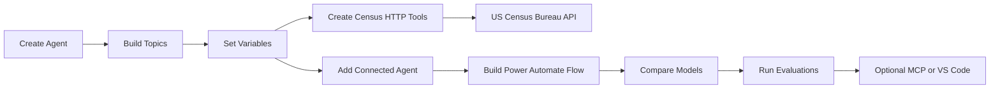

---

## ⚡ Why this lab matters for energy and utilities

Energy companies make infrastructure decisions years before the load shows up on the grid. Planners and operations teams need fast answers to questions about population growth, housing expansion, and industrial concentration inside the service territory.

In this lab, you'll build an **Energy Intelligence Agent** in **Microsoft Copilot Studio** that combines **US Census Bureau data** with real utility planning scenarios so analysts can move from raw public data to territory decisions quickly.

---

## 🏗️ What you'll build

By the end of the lab, you will have a working solution with these components:

| Layer | What you will build |
|---|---|
| **Parent agent** | **Energy Intelligence Agent** |
| **Topics** | **Service Territory Lookup** and **Census Data Help** |
| **Variables** | Global, topic, and system variables |
| **Tools / actions** | Census HTTP actions |
| **Connected agent** | **Census Data Specialist** |
| **Agent flow** | Power Automate state summary flow |
| **MCP server** | Local Census MCP server *(optional)* |
| **Evaluation suite** | 10-question regression set |

### Architecture summary

```text
User
  -> Energy Intelligence Agent (parent)
      -> Topics collect geography + intent
      -> Direct HTTP tools for simple ACS lookups
      -> Connected Agent: Census Data Specialist
      -> Power Automate flow for multi-endpoint summaries
      -> MCP server tools for richer planner-driven discovery (optional)
      -> Final response grounded in Census data
```

> 💡 **Think like a utility planner:** the agent is not just answering trivia. It is helping decide where grid upgrades, feeder expansion, DER planning, workforce deployment, or customer-program targeting should happen first.

---

## 🎯 Objectives

By the end of this lab, you will be able to:

1. ✅ Build topics for service-territory lookup and Census help
2. ✅ Use variables for API settings, FIPS values, and year selection
3. ✅ Create Census tools for county demographics and state employment
4. ✅ Add a connected **Census Data Specialist** agent
5. ✅ Build a Power Automate state summary flow
6. ✅ Compare models for quality, latency, and cost
7. ✅ Evaluate the agent with a 10-question regression set
8. ⭐ *(Optional)* Expose Census capabilities through an MCP server
9. ⭐ *(Optional)* Manage the agent through VS Code

---

## 🧠 Core concepts overview

| Concept | What it means |
|---|---|
| **ACS 5-Year dataset** | Demographic and housing estimates at `/data/{year}/acs/acs5` |
| **Economic Census** | Business and industry patterns such as `/data/{year}/ecnbasic` |
| **FIPS codes** | State = 2 digits, county = 3 digits |
| **Geography hierarchy** | state → county → tract → block group |
| **Topics** | Guided conversation flows |
| **Variables** | Reusable values during a conversation |
| **Tools / actions** | API-backed functions the agent can call |
| **Connected agents** | Child agents for specialized work |
| **Agent flows** | Multi-step Power Automate actions |
| **MCP server** *(optional)* | A discoverable tool host |
| **Evaluations** | Repeatable quality tests |

### US Census Bureau API details used in this lab

| Item | Value |
|---|---|
| **Base URL** | `https://api.census.gov/data/` |
| **API key signup** | <https://api.census.gov/data/key_signup.html> |
| **ACS 5-Year dataset** | `/data/{year}/acs/acs5` |
| **Economic Census dataset** | `/data/{year}/ecnbasic` |
| **Population** | `B01003_001E` |
| **Median household income** | `B19013_001E` |
| **Housing units** | `B25001_001E` |
| **Units in structure** | `B25024_001E` |
| **Total civilian employed population** | `C24050_001E` |
| **Manufacturing employment** | `C24050_004E` |
| **Commute patterns** | `B08301_001E` |

### Example energy-relevant queries

- **Population in Harris County, Texas** (county `201`, state `48`):
  `https://api.census.gov/data/2023/acs/acs5?get=NAME,B01003_001E&for=county:201&in=state:48&key={API_KEY}`
- **Median household income in an energy corridor county**:
  `https://api.census.gov/data/2023/acs/acs5?get=NAME,B19013_001E&for=county:113&in=state:06&key={API_KEY}`
- **County housing units for grid capacity planning**:
  `https://api.census.gov/data/2023/acs/acs5?get=NAME,B25001_001E&for=county:085&in=state:48&key={API_KEY}`

> ⚠️ **Important:** Census responses are returned as arrays, usually with a header row followed by one or more data rows. Your tools and flows must parse the second row, not just dump the raw payload to the user.

---

## 📚 Documentation

- [Create and edit topics](https://learn.microsoft.com/en-us/microsoft-copilot-studio/authoring-create-edit-topics)
- [Variables overview](https://learn.microsoft.com/en-us/microsoft-copilot-studio/authoring-variables-about)
- [Add other agents overview](https://learn.microsoft.com/en-us/microsoft-copilot-studio/authoring-add-other-agents)
- [Agent flows overview](https://learn.microsoft.com/en-us/microsoft-copilot-studio/flows-overview)
- [Call an agent flow from an agent](https://learn.microsoft.com/en-us/microsoft-copilot-studio/advanced-use-flow)
- [Select a primary AI model](https://learn.microsoft.com/en-us/microsoft-copilot-studio/authoring-select-agent-model)
- [Extend your agent with MCP](https://learn.microsoft.com/en-us/microsoft-copilot-studio/agent-extend-action-mcp)
- [Agent evaluation overview](https://learn.microsoft.com/en-us/microsoft-copilot-studio/analytics-agent-evaluation-intro)
- [Run evaluations and view results](https://learn.microsoft.com/en-us/microsoft-copilot-studio/analytics-agent-evaluation-results)
- [Census Data API home](https://api.census.gov/data.html)
- [Census API user guide](https://www.census.gov/data/developers/guidance/api-user-guide.html)
- [Census API key signup](https://api.census.gov/data/key_signup.html)

---

## ✅ Prerequisites

- Access to **Microsoft Copilot Studio** in an environment where you can create or edit agents
- Permission to create **Power Automate cloud flows**
- A free **US Census Bureau API key** from <https://api.census.gov/data/key_signup.html>
- Basic familiarity with **state and county FIPS codes**
- Optional: **VS Code** if you plan to complete the optional extension section
- Optional for the MCP section (Use Case #8): **Node.js 18+** or **Python 3.10+** and **VS Code** on your local machine

> 💡 **Tip:** If your utility uses ZIP-code-based districting, you can still complete this lab at the county level and extend the same design later to ZIP, tract, or block-group analysis.

---

## 🗺️ Use cases covered

| # | Section | Time | Required |
|---|---|---|---|
| 1 | Topics | 30 min | ✅ |
| 2 | Variables | 20 min | ✅ |
| 3 | Tools | 28 min | ✅ |
| 4 | Connected Agents | 20 min | ✅ |
| 5 | Agent Flows | 22 min | ✅ |
| 6 | Model Selection & Testing | 14 min | ✅ |
| 7 | Agent Evaluations | 16 min | ✅ |
| | **Q&A / Wrap-up** | **15 min** | ✅ |
| | **Core lab total** | **180 min (3 hours)** | |
| 8 | Optional: MCP Servers | 20 min | ⭐ Optional |
| 9 | Optional: VS Code Extension | 20 min | ⭐ Optional |

> 💡 The optional sections (Use Cases #8 and #9) are **not** counted against the 3-hour lab time. Use Case #8 (MCP) requires Node.js or Python and VS Code. Use Case #9 assumes VS Code is already installed and is intended for teams interested in source control and CI/CD workflows for their agents.

---

# 🧪 Use Case #1 — Topics (30 min)

> 🎯 **Objective:** Create custom topics that capture geography, extract entities, branch on user intent, and route energy-planning requests to the correct Census actions.

### Scenario

A planner needs either a guided service-territory lookup or a quick explanation of what Census data the agent supports.

### Step 1 — Create the Energy Intelligence Agent

1. Open [Copilot Studio](https://copilotstudio.microsoft.com/). You should land on the **What would you like to build?** home page shown below.

   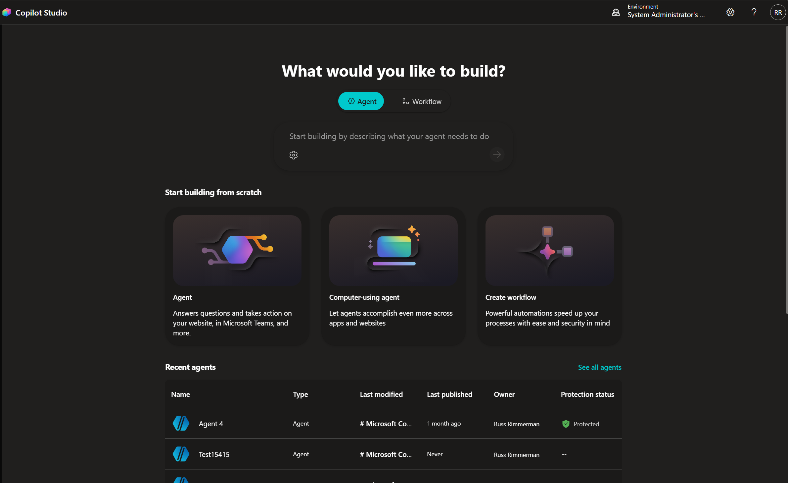

2. Make sure **Agent** is selected (not **Workflow**), then under **Start building from scratch** select the **Agent** tile.
3. Name the agent:
   ```text
   Energy Intelligence Agent
   ```
4. In **Instructions**, enter:
   ```text
   You are an energy planning assistant for analysts, distribution planners, field operations, and regulatory teams. Help users analyze service-territory demographics and economic indicators using US Census Bureau data. Ask for missing geography details when needed. Prefer county and state analysis when the user is unclear. Keep responses concise, data-driven, and useful for grid planning, load forecasting, customer program targeting, and capacity expansion.
   ```
5. In **Select your agent's model** select one of the available models (you can change this later).
6. Save the agent.

> 💡 **Tip:** Keep the agent instructions broad and cross-cutting. The detailed collection logic belongs in topics and tool descriptions, not in a massive system prompt.

### Step 2 — Create the **Service Territory Lookup** topic

1. Open the agent and select **Topics**.
2. Select **+ Add a topic** and **From blank**.

   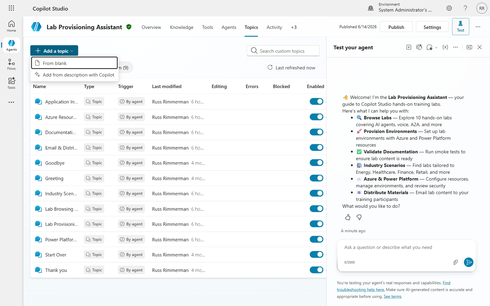

> 💡 **Tip:** The **Add from description with Copilot** can save significant time up front in creating your agent. Since this lab is designed to be more advanced, we are selecting the more manual option of starting with a blank slate.

3. Click on the word **Untitled** at the top left, and rename it to:
   ```text
   Service Territory Lookup
   ```
4. In the topic **Description** field, write a clear prompt so the generative AI orchestrator knows when to trigger this topic automatically:
   ```text
   Use this topic when the user wants to look up or analyze Census-based demographics, population, housing, or employment data for a service territory — including requests by state, county, or ZIP code. Examples: "Analyze a service territory", "Population and housing for my area", "Energy planning data for a state or county".
   ```
5. Save the topic.

### Step 3 — Add an opening message and collect location with an Adaptive Card

Instead of asking a freeform location question and then parsing the answer with condition branches, we'll collect **city**, **state**, and **zip code** at once using an Adaptive Card. This gives the planner a structured form, validates required fields client-side, and produces clean, named values your downstream nodes can use directly — no entity extraction or string parsing required.

1. In the authoring canvas, click on the **+** below the trigger and select **Send a message** node:
   ```text
   I can look help you look up Census-based demographics and employment indicators for a service territory.
   ```
2. Click **+** and add a **Ask with adaptive card** node 
3. In the Adaptive Card editor, switch to the **JSON** view and paste the following payload:
   ```json
   {
     "$schema": "https://adaptivecards.io/schemas/adaptive-card.json",
     "type": "AdaptiveCard",
     "version": "1.5",
     "body": [
       {
         "type": "TextBlock",
         "text": "Enter the location information",
         "weight": "Bolder",
         "size": "Medium",
         "wrap": true
       },
       {
         "type": "Input.Text",
         "id": "city",
         "label": "City",
         "placeholder": "Example: Cypress",
         "isRequired": true,
         "errorMessage": "Please enter a city."
       },
       {
         "type": "Input.Text",
         "id": "state",
         "label": "State",
         "placeholder": "Example: TX",
         "maxLength": 2,
         "isRequired": true,
         "errorMessage": "Please enter a 2-letter state abbreviation."
       },
       {
         "type": "Input.Text",
         "id": "zipCode",
         "label": "Zip Code",
         "placeholder": "Example: 77433",
         "maxLength": 10,
         "isRequired": true,
         "errorMessage": "Please enter a zip code."
       }
     ],
     "actions": [
       {
         "type": "Action.Submit",
         "title": "Submit",
         "data": {
           "action": "submitLocation"
         }
       }
     ]
   }
   ```
   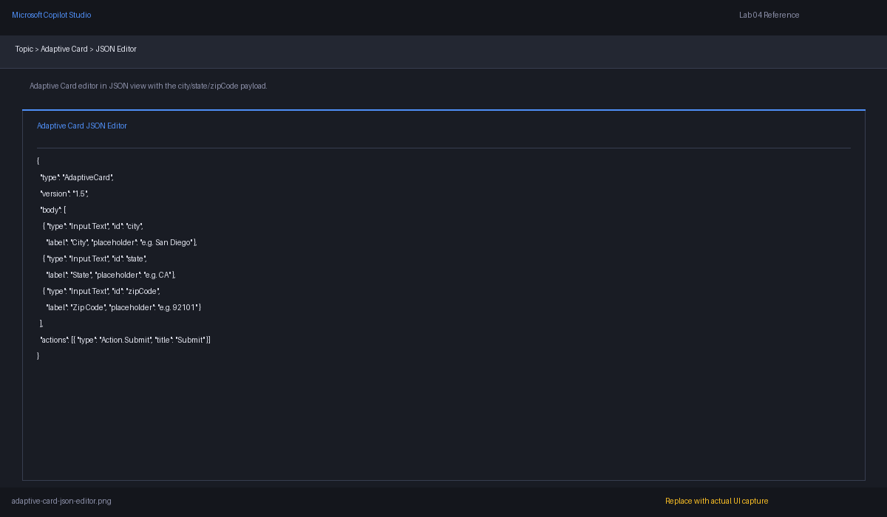

4. Save the card and click **Close**. Copilot Studio will surface each `Input.Text` as a separately addressable output you can map to topic variables.

   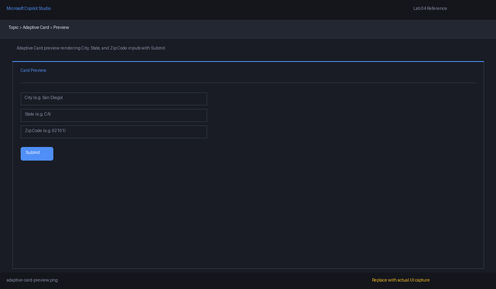

5. Under **Save user response as**, map the card outputs into three new topic variables:
   - `city` → `Topic.City`
   - `state` → `Topic.StateInput` (2-letter abbreviation, e.g. `TX`)
   - `zipCode` → `Topic.ZipCode`

   

> 💡 **Why an Adaptive Card here?** With a freeform question you'd need entity extraction or condition branches to figure out whether the user typed a city, a state, or a ZIP. The card guarantees you receive all three values as named, validated inputs — and the `isRequired` + `errorMessage` properties handle empty-input cases for you.

### Step 4 — Convert the user's location into FIPS codes

The Census API needs **FIPS codes**, not free-text city/state strings. Now that the card has given you clean inputs, convert them into the FIPS codes the tools in Use Case #3 will consume.

1. After the Adaptive Card node, add a **Set variable value** node.
2. Under **To value** select the **...** and select **Formula**.
3.  We want to map the 2-letter state abbreviation to its FIPS code. The simplest approach for the lab is a Power Fx expression using `Switch`:
   ```powerfx
   Switch(
     Upper(Topic.state),
     "TX", "48",
     "CA", "06",
     "NY", "36",
     "FL", "12",
     "IL", "17",
     ""
   )
   ```
   Notice the variable automatically renames to Global.varFIPS`. Add more state mappings as needed for your demo footprint, or replace this node with a connector/HTTP call to a ZIP→FIPS lookup service if you want full national coverage.

   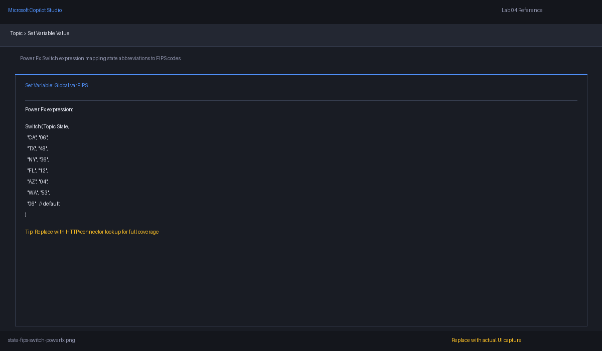

2. Add a **Condition** node to confirm we successfully resolved a state FIPS:
   - **If `Topic.state` is blank** → add a **Send a message** node explaining the state isn't yet supported by the demo lookup.
3. Add a Topic managegement node of **Go to step** then slect the Adaptive Card action to send the user back to the adaptive card.
   - **All other actions** → continue to the next step.

3. (Optional) If your environment includes a county-resolution tool or flow, add a **Call an action** node that takes `Topic.city`, `Topic.state`, and `Topic.zipCode` and returns a 3-digit county FIPS. If you don't have one, you can demo with a hardcoded county for the city you're testing (for example Cypress, TX → Harris County → `201`).

> ⚠️ **Important:** County names are not unique across the US. "Jefferson County" exists in multiple states. The Adaptive Card's required `state` field guarantees you always have a state alongside the city, so any county lookup you run downstream will resolve unambiguously.

### Step 5 — Add the **Census Data Help** topic

1. Create another new topic named:
   ```text
   Census Data Help
   ```
2. In the topic **Description** field, write a clear prompt so the orchestrator routes informational questions here instead of to the lookup topic:
   ```text
   Use this topic when the user asks what Census data is available, what variables or datasets the agent can access, or wants an explanation of demographic data concepts — not when they want to run an actual lookup. Examples: "What Census data can you access?", "Explain your demographic data", "What do the Census variables mean?"
   ```
3. Add a **Send a message** node with content like:
   ```text
   I can use US Census Bureau datasets such as ACS 5-Year for population, income, housing, and employment indicators. I can also be extended with Economic Census data for business patterns by industry. Common geographies are state and county, using FIPS codes under the hood.
   ```
4. Optionally add a second message listing key variables (`B01003_001E` — population, `B19013_001E` — income, `B25001_001E` — housing, `C24050_001E` / `C24050_004E` — employment, `B08301_001E` — commute).
5. End the topic with a prompt:
   ```text
   If you want, I can run a service territory lookup now. Which state or county should we analyze?
   ```

### Step 6 — Route to actions from the topic

1. Return to **Service Territory Lookup**.
2. After the FIPS resolution from Step 4, add a placeholder **Call an action** node for the county demographics tool you will build in Use Case #3 (this will use `Topic.StateFIPS` and `Topic.CountyFIPS`).
3. If you didn't resolve a county FIPS in Step 4, add a parallel placeholder **Call an action** node for the state employment tool, which only needs `Topic.StateFIPS`.
4. Add a **Send a message** node after each action branch to summarize what will happen, for example:
   ```text
   I'll look up Census demographics for {Topic.City}, {Topic.StateInput} and return population, median household income, and housing units.
   ```
5. Save the topic.

### Step 7 — Test both topics

1. Open the **Test** panel.
2. Run prompts such as:
   - `Analyze a service territory for grid expansion`
   - `What Census data can you use?`
3. Confirm:
   - The correct topic triggers
   - The Adaptive Card appears and blocks submission until **City**, **State**, and **Zip Code** are all filled in
   - Submitting with the example values (`Cypress`, `TX`, `77433`) populates `Topic.City`, `Topic.StateInput`, and `Topic.ZipCode`
   - `Topic.StateFIPS` resolves to `48` for `TX` and the topic continues to the action call
   - Help questions trigger the **Census Data Help** topic rather than the lookup topic

> 💡 **Tip:** A good energy-planning topic should reduce ambiguity early. Collecting structured location inputs through an Adaptive Card removes a whole class of "did the user mean a city or a county?" parsing problems before the tool runs.

### ✅ You've completed Use Case #1

**Key takeaways**

- Topic design is how you convert vague territory questions into structured, tool-ready requests.
- Adaptive Cards are the cleanest way to collect multi-field structured input (city + state + zip) in one turn — no entity extraction, no condition-tree to disambiguate input types.
- Separate "help/explanation" behavior from "run data lookup" behavior so the planner doesn't confuse information requests with execution requests.

**Troubleshooting**

- If the wrong topic triggers, refine the topic descriptions so the orchestrator can clearly distinguish them — make **Census Data Help** sound explanatory and **Service Territory Lookup** sound action-oriented.
- If the Adaptive Card doesn't render in the test panel, confirm you used the **Ask with adaptive card** node (not a plain message with embedded JSON) and that the JSON validates against Adaptive Cards 1.5.
- If the card outputs aren't available as variables, re-open the card node and verify each `Input.Text` `id` (`city`, `state`, `zipCode`) is mapped under **Save user response as**.
- If `Topic.StateFIPS` is empty after the `Switch`, the user likely entered a state not yet listed in the Power Fx mapping — extend the `Switch` or add an HTTP/connector-based ZIP→FIPS lookup.

---

# 🧪 Use Case #2 — Variables (20 min)

> 🎯 **Objective:** Configure global, topic, and system variables so the agent can store configuration, capture geography details, and assemble reusable Census request URLs.

### Scenario

Your agent needs reusable state for API settings, geography, and year selection.

### Step 1 — Define the variable strategy

Use the following variable design:

| Variable | Type | Purpose |
|---|---|---|
| `Global.DefaultState` | Global | Default state when the lab is run for one utility footprint |
| `Global.APIKey` | Global | Stores the Census API key |
| `Global.DefaultYear` | Global | Default dataset year, such as `2023` |
| `Topic.City` | Topic | City entered by the user via the Adaptive Card |
| `Topic.StateInput` | Topic | 2-letter state abbreviation from the Adaptive Card (e.g. `TX`) |
| `Topic.ZipCode` | Topic | ZIP code entered by the user via the Adaptive Card |
| `Topic.StateFIPS` | Topic | 2-digit state FIPS resolved from `Topic.StateInput` |
| `Topic.CountyFIPS` | Topic | 3-digit county FIPS gathered or derived during the conversation |
| `Topic.DataYear` | Topic | Year chosen for this specific request |
| `System.Activity.Text` | System | Raw incoming user message |
| `System.Conversation.Id` | System | Useful for diagnostics and flow tracing |

### Step 2 — Create global variables

1. Open the agent and go to the variable management experience.
2. Create a global variable named `Global.DefaultState`.
3. Set a sample value such as:
   ```text
   TX
   ```
4. Create `Global.DefaultYear` and set it to:
   ```text
   2023
   ```
5. Create `Global.APIKey` and paste your Census API key.

   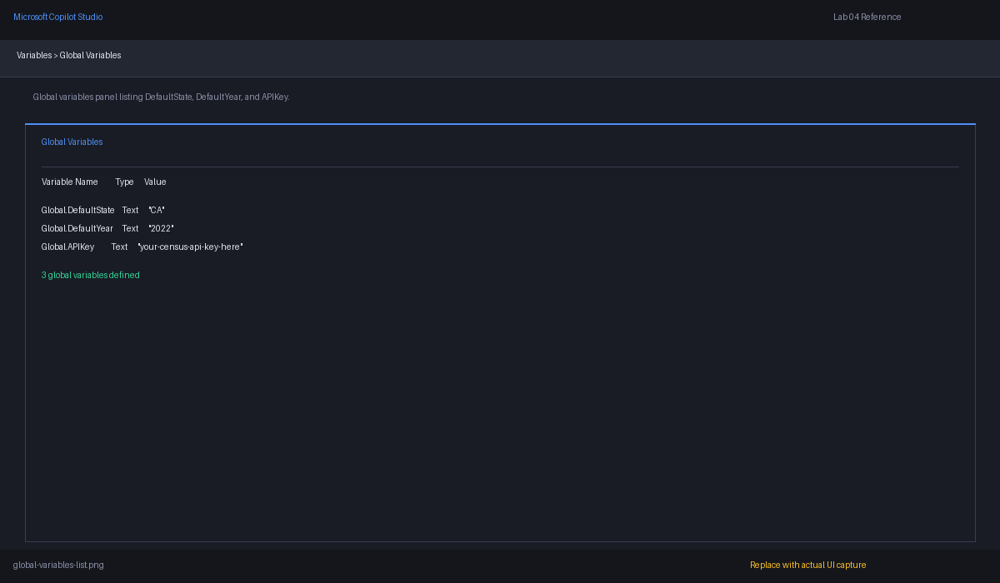

> ⚠️ **Security reminder:** Treat the API key like a secret. In production, prefer managed connections, Azure Key Vault, environment variables, or a protected flow/custom connector pattern instead of broadly exposing the key in multiple editable places.

### Step 3 — Initialize topic variables in **Service Territory Lookup**

1. Return to the **Service Territory Lookup** topic.
2. Near the start of the topic (before the Adaptive Card), add **Set variable value** nodes.
3. Initialize:
   - `Topic.DataYear = Global.DefaultYear`
   - `Topic.StateFIPS = ""`
   - `Topic.CountyFIPS = ""`
4. If your utility works mostly in one state, you can pre-fill the Adaptive Card state field. The simplest pattern is to keep the card as-is and let the user confirm or override the value; alternatively, set `Topic.StateInput = Global.DefaultState` before the card and document the trade-off.

> 💡 **Tip:** Initialization makes your topic easier to debug. Empty strings are easier to reason about than partially populated values from a previous test run.

### Step 4 — Capture Adaptive Card outputs and resolve year selection

1. The Adaptive Card from Use Case #1 already populates `Topic.City`, `Topic.StateInput`, and `Topic.ZipCode` for you — no extra parsing or entity extraction is required.
2. The `Switch`-based **Set variable value** node from Use Case #1 maps `Topic.StateInput` to `Topic.StateFIPS`.
3. If you want the user to override the default Census year, add a follow-up **Ask a question** node after the card:
   ```text
   Which Census year should I use? Press Enter to use the default year.
   ```
4. If the answer is blank, keep `Topic.DataYear = Global.DefaultYear`.
5. Otherwise, set `Topic.DataYear` to the user-supplied value.

### Step 5 — Use variables inside request URLs

When you later build HTTP requests, reference variables in the URL template. Your county demographics call should conceptually resolve to:

```text
https://api.census.gov/data/{Topic.DataYear}/acs/acs5?get=NAME,B01003_001E,B19013_001E,B25001_001E&for=county:{Topic.CountyFIPS}&in=state:{Topic.StateFIPS}&key={Global.APIKey}
```

Your state employment call should conceptually resolve to:

```text
https://api.census.gov/data/{Topic.DataYear}/acs/acs5?get=NAME,C24050_001E,C24050_004E&for=state:{Topic.StateFIPS}&key={Global.APIKey}
```

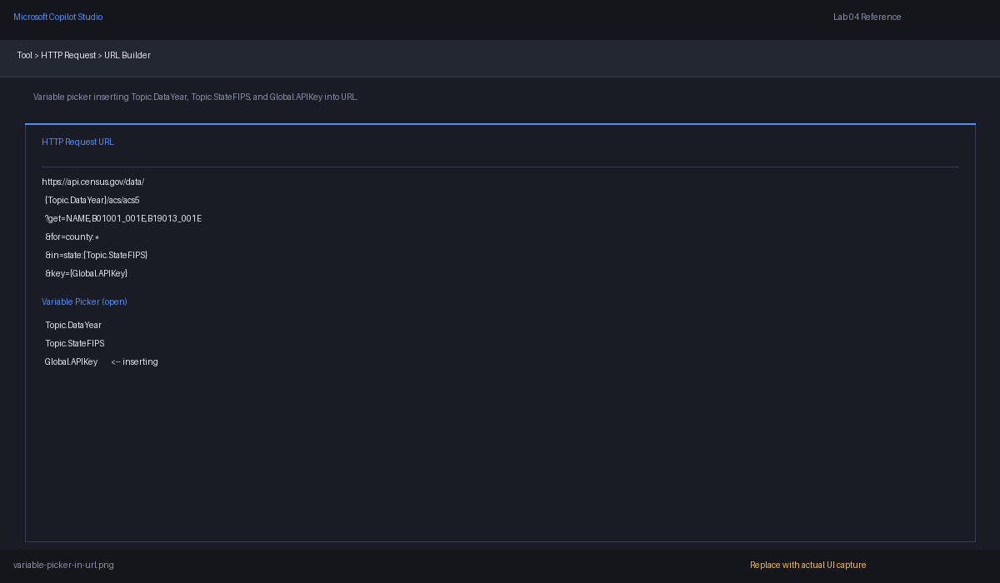

### Step 6 — Pass variables between topics and use system variables

1. In **Census Data Help**, when the user says they want to run a lookup, transition to **Service Territory Lookup** and pass along any already-known context (state name, preferred year).
2. For debugging during development, inspect `System.Activity.Text` and `System.Conversation.Id` to trace conversation flow. Remove or hide diagnostic output before publishing.

> ⚠️ **Do not** leave internal identifiers or raw troubleshooting output exposed in a production response to business users.

### ✅ You've completed Use Case #2

**Key takeaways**

- Global variables are best for reusable configuration such as default year, default state, and API settings.
- Topic variables hold the geography and request-specific values for one run of the conversation.
- Variables are what make your HTTP actions, connected agents, and flows reusable instead of hard-coded.

**Troubleshooting**

- If your action URL is malformed, check whether blank variables are being inserted into the path.
- If the wrong year is used, verify that `Topic.DataYear` is only overridden when a nonblank answer is provided.
- If a help topic hands off to the lookup topic but loses context, explicitly set the variables before the transition.

---

# 🧪 Use Case #3 — Tools (28 min)

> 🎯 **Objective:** Build two Census Bureau tools that planners can call for county-level demographics and state-level energy employment analysis.

### Scenario

Planners need two capabilities: county demographics for territory growth analysis and state employment indicators for infrastructure planning.

### Step 1 — Build Tool 1: **Get County Demographics**

1. In the agent, open **Tools**.
2. Select **Add tool**.
3. Choose the option for an **HTTP action**, **custom connector**, or equivalent API-backed action in your environment.
4. Name the tool:
   ```text
   Get County Demographics
   ```
5. Add this description:
   ```text
   Use when the user asks for county-level service territory demographics such as population, median household income, or housing units. Requires a 2-digit state FIPS code, 3-digit county FIPS code, and a Census data year.
   ```

### Step 2 — Configure Tool 1 inputs

Create these inputs:

| Input | Type | Description |
|---|---|---|
| `year` | Text or number | Census data year, such as `2023` |
| `state` | Text | 2-digit state FIPS code, for example `48` for Texas |
| `county` | Text | 3-digit county FIPS code, for example `201` for Harris County |
| `apiKey` | Text | Census API key |

Give the planner-friendly input descriptions, especially for FIPS formatting:

- `state`: *Two-digit state FIPS code. Use leading zeros when needed.*
- `county`: *Three-digit county FIPS code within the state. Use leading zeros when needed.*

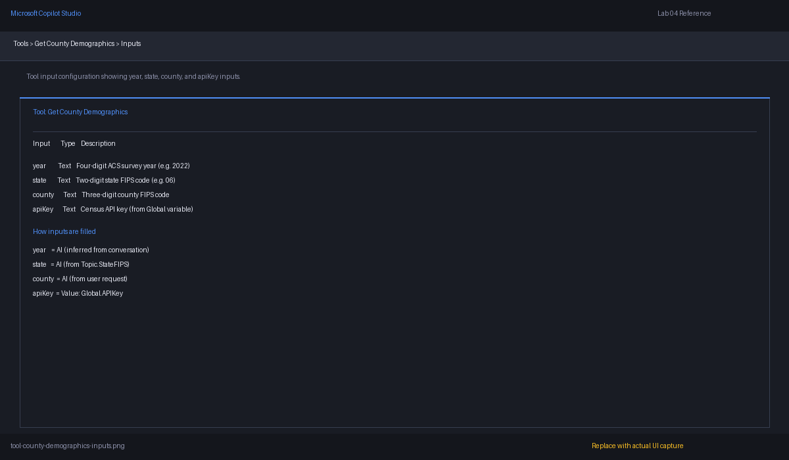

### Step 3 — Configure the Tool 1 request

Use this real endpoint pattern:

```text
https://api.census.gov/data/{year}/acs/acs5?get=NAME,B01003_001E,B19013_001E,B25001_001E&for=county:{county}&in=state:{state}&key={apiKey}
```

This returns:

- `NAME` — geography label
- `B01003_001E` — total population
- `B19013_001E` — median household income
- `B25001_001E` — total housing units

### Step 4 — Configure Tool 1 outputs

Map the response so the planner sees clear names instead of raw Census variable IDs.

Recommended outputs:

| Output | Meaning |
|---|---|
| `locationName` | County and state display name |
| `population` | Total population |
| `medianHouseholdIncome` | Median household income |
| `housingUnits` | Total housing units |
| `stateFips` | State FIPS returned by the API |
| `countyFips` | County FIPS returned by the API |

If your action surface cannot reshape arrays automatically, document that row 0 is headers and row 1 is values, then parse those in the action or downstream flow.

> 💡 **Tip:** Good output names matter. The planner should understand `medianHouseholdIncome` instantly; `B19013_001E` is a tool-builder detail, not a user-facing concept.

### Step 5 — Build Tool 2: **Get State Energy Employment**

Follow the same pattern as Tool 1:

1. Add another tool named **Get State Energy Employment**.
2. Description:
   ```text
   Use when the user asks for state-level employment indicators relevant to energy infrastructure planning, especially total employment and manufacturing employment. Requires a 2-digit state FIPS code and a Census data year.
   ```
3. Inputs: `year`, `state`, `apiKey` (same types and descriptions as Tool 1, without `county`).
4. Request URL:
   ```text
   https://api.census.gov/data/{year}/acs/acs5?get=NAME,C24050_001E,C24050_004E&for=state:{state}&key={apiKey}
   ```
   This returns `C24050_001E` (total civilian employed population) and `C24050_004E` (manufacturing employment).

### Step 6 — Test both tools and wire them into topics

1. Review the **Description** and **Input descriptions** for both tools from the planner's perspective — make sure they explain when to use county vs state analysis, that FIPS codes are required, and that outputs are planning indicators.
2. Run manual tests:
   - County: `year = 2023`, `state = 48`, `county = 201`, `apiKey = <your key>`
   - State: `year = 2023`, `state = 48`, `apiKey = <your key>`
3. Verify that both tools return readable data.

   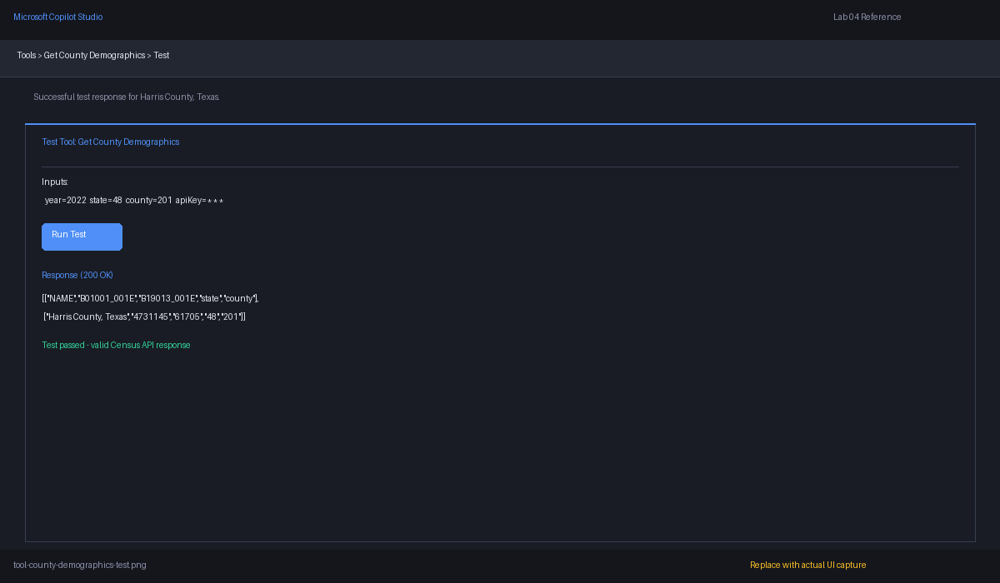
4. Return to **Service Territory Lookup** and wire the tools into the topic branches:
   - **County branch** → call **Get County Demographics** with `Topic.DataYear`, `Topic.StateFIPS`, `Topic.CountyFIPS`, `Global.APIKey`
   - **State branch** → call **Get State Energy Employment** with `Topic.DataYear`, `Topic.StateFIPS`, `Global.APIKey`
5. After each action, add a concise summary message.

Example county response pattern:

```text
{locationName} has a population of {population}, median household income of ${medianHouseholdIncome}, and {housingUnits} housing units. This is useful for service territory growth and housing-driven load expansion analysis.
```

### ✅ You've completed Use Case #3

**Key takeaways**

- HTTP/Census tools let the agent answer with live public data instead of static knowledge.
- Clear tool descriptions and input metadata are essential for reliable planner routing.
- County demographics and state employment together provide a strong first planning signal for residential and commercial load growth.

**Troubleshooting**

- If you get a 400 error, the most common issue is malformed FIPS codes or a missing year.
- If results look empty, verify the dataset year exists for the requested variables.
- If the output is a raw array, add parsing or map the second row into named outputs.

---

# 🧪 Use Case #4 — Connected Agents (20 min)

> 🎯 **Objective:** Create a **Census Data Specialist** connected agent, add it to the parent Energy Intelligence Agent, and configure sharing so Census questions route cleanly to the specialist.

### Scenario

The parent agent should orchestrate the planning experience while a connected specialist agent owns Census-specific reasoning and tool usage.

### Step 1 — Create the connected agent

1. In Copilot Studio, create a new agent named:
   ```text
   Census Data Specialist
   ```
2. Use instructions such as:
   ```text
   You are a Census data specialist supporting an energy company. Answer questions about ACS and related Census datasets, geographies, FIPS codes, and planning indicators. Use Census API tools to retrieve public demographic, housing, and employment data. Explain what the data means for service territory planning, but do not make engineering decisions or claim to replace a load forecast.
   ```
3. Save the agent.

### Step 2 — Add tools, enable sharing, and publish the connected agent

1. Add **Get County Demographics** and **Get State Energy Employment** to the connected agent.
2. Optionally add the **Census Data Help** topic or equivalent help content if you want the child to explain variables directly.
3. Test the connected agent independently with prompts such as:
   - `What is B19013_001E?`
   - `Show me county demographics for Harris County Texas`
4. Open **Settings** for the connected agent. Enable the setting that allows other agents to connect to and use this agent.

   

5. Publish the connected agent.

> ⚠️ **Important:** A connected agent cannot be selected by a parent until it is published and sharing is enabled. Both agents must be in the same environment.

### Step 3 — Add the connected agent to the parent

1. Open **Energy Intelligence Agent**.
2. Go to the **Agents** page.
3. Add the **Census Data Specialist** as a connected agent.
4. Give it a strong description for the parent planner, for example:
   ```text
   Use for US Census Bureau questions, FIPS guidance, ACS demographic summaries, county population and housing lookups, and state employment indicators relevant to energy planning.
   ```
5. Save the parent agent.

### Step 4 — Validate handoff behavior

1. In the parent agent test chat, try prompts such as:
   - `Analyze Harris County demographics for grid expansion`
   - `What does C24050_004E represent?`
2. Open the activity trace and confirm the parent routed the work to the child agent.
3. Refine the child description if the parent fails to route consistently.

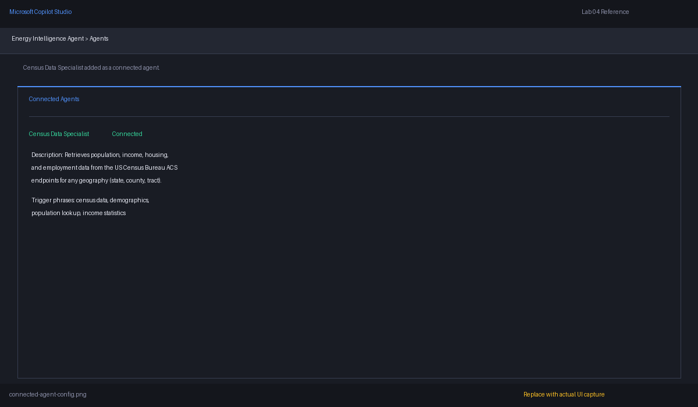

### ✅ You've completed Use Case #4

**Key takeaways**

- Connected agents let you separate planning orchestration from Census-domain specialization.
- Published versions and clear descriptions are the key ingredients for successful peer-to-peer routing.
- A specialist child agent is the cleanest way to scale from two tools today to many tools later.

**Troubleshooting**

- If the child agent doesn't appear, verify it is published and sharing is enabled in the same environment.
- If the parent doesn't route correctly, sharpen the connected agent's **description** — descriptions are the primary routing signal.
- If the child answers generically, confirm the Census tools are attached directly to the child, not only to the parent.

---

# 🧪 Use Case #5 — Agent Flows (22 min)

> 🎯 **Objective:** Build a Power Automate cloud flow that receives a state FIPS code, calls multiple Census endpoints in sequence, aggregates the results, and returns a formatted summary to the agent.

### Scenario

A planning manager wants one state briefing instead of several separate tool responses.

### Step 1 — Create the cloud flow

1. Open **Power Automate**.
2. Select **Create**.
3. Choose the trigger **When an agent calls the flow**.

   

4. Name the flow:
   ```text
   Census State Planning Summary
   ```
5. Add inputs:
   - `stateFips` (Text)
   - `dataYear` (Text)
   - `apiKey` (Text)

### Step 2 — Add the HTTP actions for population, housing, and employment

Add two **HTTP** actions (both `GET`):

1. **Get State Population Housing:**
   ```text
   https://api.census.gov/data/@{triggerBody()['dataYear']}/acs/acs5?get=NAME,B01003_001E,B25001_001E&for=state:@{triggerBody()['stateFips']}&key=@{triggerBody()['apiKey']}
   ```

2. **Get State Employment:**
   ```text
   https://api.census.gov/data/@{triggerBody()['dataYear']}/acs/acs5?get=NAME,C24050_001E,C24050_004E&for=state:@{triggerBody()['stateFips']}&key=@{triggerBody()['apiKey']}
   ```

### Step 3 — Parse responses and compose a planning summary

1. Add **Parse JSON** or **Compose** actions after each HTTP action. Census returns a two-row array — use expressions to pull values from index `[1]`, not `[0]`.
2. Add a **Compose** action to format a planning summary:
   ```text
   State planning summary for {StateName}:
   - Population: {Population}
   - Housing units: {HousingUnits}
   - Total employed population: {EmploymentTotal}
   - Manufacturing employment: {ManufacturingEmployment}

   Planning interpretation:
   Use population and housing as a proxy for residential growth pressure, and use the sector employment indicator as a proxy for industrial and infrastructure-related demand concentration.
   ```
3. If your environment supports cards, create a structured card payload with sections for **Population**, **Housing**, **Employment**, and **Planning interpretation**.

### Step 4 — Return output and add the flow to the agent

1. Add the **Respond to the agent** action as the final step.
2. Return fields such as:
   - `summaryText`
   - `stateName`
   - `population`
   - `housingUnits`
   - `employmentTotal`
   - `energySectorEmployment`
3. Save the flow.

   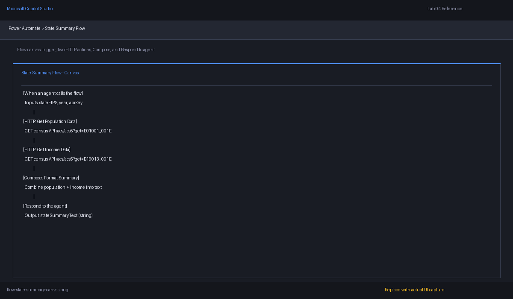

4. Return to **Energy Intelligence Agent** and add the flow as a tool/action named **Get State Planning Summary**.
5. Description:
   ```text
   Use when the user wants a combined state-level summary for energy planning, including population, housing, and employment indicators in a single response.
   ```
5. Test it with a prompt like:
   - `Give me a planning summary for Texas`

### ✅ You've completed Use Case #5

**Key takeaways**

- Agent flows are the right pattern for multi-step data aggregation.
- Power Automate is especially useful when the raw API response needs transformation before the agent presents it.
- A combined state summary is more useful to planners than isolated single-variable lookups.

**Troubleshooting**

- If the flow returns blanks, inspect the array indexes in the Compose/Parse JSON steps.
- If the action isn't available in Copilot Studio, confirm the flow trigger is the Copilot/agent trigger and that the flow was saved.
- If the summary text is too technical, simplify the compose output and let the agent rephrase it for business users.

---

# 🧪 Use Case #6 — Model Selection & Testing (14 min)

> 🎯 **Objective:** Compare available models in Copilot Studio for quality, speed, and cost tradeoffs on energy-domain prompts.

### Scenario

You want to verify which model is best for simple lookups versus multi-step planning questions.

### Step 1 — Locate the model selection setting

1. Open **Energy Intelligence Agent**.
2. Go to **Settings** or the **AI / Model** section of the agent.
3. Open the **primary model** selector.
4. Note which models are available in your environment.

> 💡 **Important:** Model availability changes over time and varies by region or tenant. Use the highest-capability and lowest-cost models available in your environment for comparison.

### Step 2 — Create a repeatable prompt set

Use the same prompts for every model so your comparison is fair.

Suggested prompt set:

1. `Give me a county demographic summary for Harris County, Texas, and explain why it matters for feeder expansion.`
2. `Explain the difference between total population, housing units, and energy-sector employment for service territory planning.`
3. `Summarize Texas using population, housing, and employment as if you were briefing a distribution planning manager.`

### Step 3 — Test and compare models

1. Select the strongest model available in your environment. Run the prompt set and observe response quality, synthesis ability, tool follow-through, and latency.
2. Switch to the lowest-cost model available. Re-run the same prompts.
3. Compare and record your results:

| Model | Best for | Watchouts |
|---|---|---|
| High-capability model | Multi-step reasoning, stronger summarization, tool-rich planning questions | Higher latency or cost |
| Lighter / lower-cost model | Quick lookups, help topics, simple structured responses | May be weaker on synthesis or nuance |
| Other available model | Environment-specific | Validate before production |

Use stronger models for executive summaries, multi-tool analysis, and interpretation-heavy questions. Use lighter models for simple lookups, help topics, and deterministic tool wrappers.

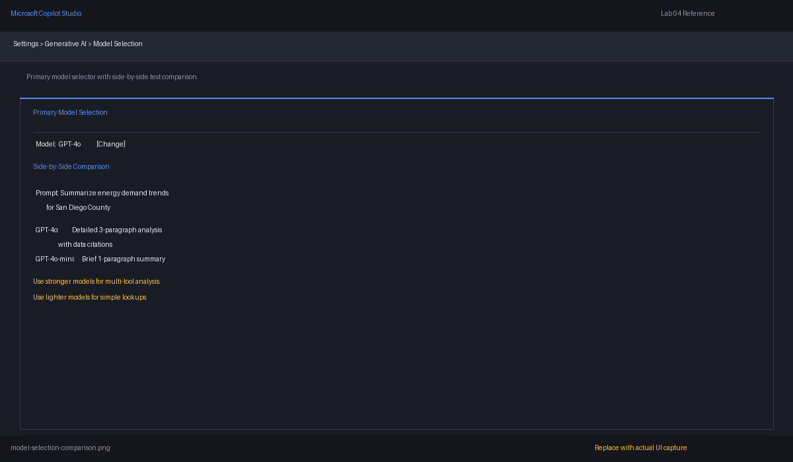

### ✅ You've completed Use Case #6

**Key takeaways**

- Model choice is an architecture decision, not just a settings toggle.
- Stronger models usually perform better on reasoning-heavy planning prompts.
- Lower-cost models can still work well for narrow lookup experiences when your tools are well-defined.

**Troubleshooting**

- If a model produces weak answers, make sure the tool descriptions and topic routing are strong before blaming the model.
- If latency is too high, route simple deterministic tasks to lighter models or flows.
- If a model isn't available, document the substitute you used and why.

---

# 🧪 Use Case #7 — Agent Evaluations (16 min)

> 🎯 **Objective:** Create a 10-question evaluation set for energy/Census scenarios, run it to validate agent quality, review failures, and iterate.

### Scenario

Before planners rely on the agent, you need evidence that it handles common and ambiguous questions reliably.

### Step 1 — Create the evaluation test set

1. Open **Energy Intelligence Agent**.
2. Go to **Evaluation**.
3. Select **Create a test set**.
4. Name it:
   ```text
   Energy Census Planning Regression Set
   ```
5. Configure test methods:
   - **Similarity**
   - **General quality**
   - **Keyword match**

   

> 💡 **Method guidance:**
> - **Similarity** helps with structured summaries that can vary in wording.
> - **General quality** helps with open-ended planning explanations.
> - **Keyword match** is useful for must-mention concepts like population, housing, FIPS, or employment.

### Step 2 — Add 10 energy-specific test questions

Use a set like this:

| # | Test question | Check |
|---|---|---|
| 1 | `Show me county demographics for Harris County, Texas.` | County lookup |
| 2 | `What Census variables do you use for population, income, and housing?` | Help topic |
| 3 | `Give me state employment indicators for Texas that matter for energy planning.` | State tool |
| 4 | `Explain why housing units matter for grid capacity planning.` | Interpretation |
| 5 | `Analyze a county called Jefferson County.` | Missing-state follow-up |
| 6 | `What does C24050_004E mean?` | Variable explanation |
| 7 | `Summarize Texas using population, housing, and employment in one answer.` | Aggregation |
| 8 | `I only know the ZIP code 77002. What should I do?` | Guidance |
| 9 | `Which county indicator is most useful for spotting residential growth pressure?` | Reasoning |
| 10 | `Compare why population growth and industrial employment growth lead to different planning actions.` | Multi-step reasoning |

### Step 3 — Define expected outcomes

For each test, add expected answers or assertions. For example: Question 1 should include keywords like `population`, `median household income`, `housing units`. Question 5 should require the agent to ask for the state. Question 10 should mention both **residential growth** and **commercial/industrial demand**.

### Step 4 — Run the evaluation

1. Save the test set.
2. Run the evaluation.
3. Review:
   - Overall pass rate
   - Which tests fail
   - Whether failures cluster around help, aggregation, or multi-step reasoning
4. Open several failed cases and review the activity map.

### Step 5 — Interpret results and iterate

1. Identify the root cause for each failure using the activity map.
2. Apply fixes in the right place:

| Signal | What it means |
|---|---|
| Agent gives generic answers instead of calling tools | Tool descriptions may need strengthening |
| Missing-state prompts don't trigger follow-up | Topic logic needs a condition or follow-up question |
| Slow but accurate answers | Consider model selection tradeoffs (Use Case #6) |
| Wrong tool is invoked | Improve tool descriptions so the planner can distinguish them |

3. After making fixes, re-run the same evaluation set and compare results.
4. Repeat until the pass rate meets your team's quality bar.

Apply fixes in the right place: topic issues → fix the topic; tool issues → fix descriptions; routing issues → fix connected-agent descriptions; reasoning issues → revisit model choice.

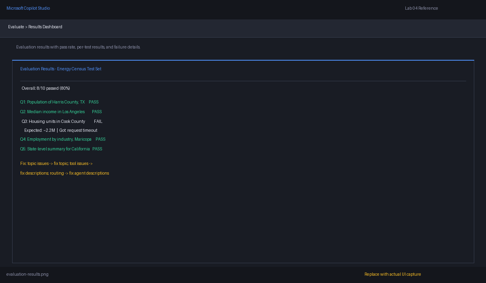

### ✅ You've completed Use Case #7

**Key takeaways**

- Evaluations turn your planning agent into an engineering asset instead of a demo.
- The same test set can prove whether architecture changes (tools, connected agents, model selection) improved real answer quality.
- Failed cases usually tell you exactly where to tune: topics, tools, routing, or model choice.

**Troubleshooting**

- If the evaluation is inconsistent, make sure the prompts are stable and the expected criteria aren't overly strict.
- If keyword-match fails on good answers, expand the acceptable keywords.
- If multi-step questions still fail, inspect whether the tool descriptions are rich enough for the planner to choose them.

---

# 🧪 Optional Use Case #8 — MCP (Model Context Protocol) Servers (20 min, optional)

> 🎯 **Objective:** Stand up a local MCP server that wraps Census API calls, register it in Copilot Studio, and expose discoverable tools for runtime use. This section requires **VS Code** and **Node.js 18+** (or Python 3.10+).

### Scenario

You need a reusable tool host that can expose several Census capabilities in one place.

### Step 1 — Decide on Node.js or Python

Either platform works. In this lab, we'll show a **Node.js** example because it maps cleanly to local development and tool registration.

You will expose these tools:

- `get_population`
- `get_median_income`
- `get_housing_stats`
- `get_employment_by_industry`

### Step 2 — Create the MCP server project and add tool logic

1. Create a local folder such as `energy-census-mcp`.
2. Initialize a Node.js project and install the MCP SDK.
3. Create a file named `server.js` with a pattern like:

```javascript
import { McpServer } from "@modelcontextprotocol/sdk/server/mcp.js";
import { StdioServerTransport } from "@modelcontextprotocol/sdk/server/stdio.js";

const server = new McpServer({ name: "energy-census-mcp", version: "1.0.0" });
const apiKey = process.env.CENSUS_API_KEY;
const census = (path) => fetch(`https://api.census.gov/data/${path}&key=${apiKey}`).then(r => r.json());

// Register tools: get_population, get_median_income, get_housing_stats, get_employment_by_industry
// Each tool accepts year + FIPS inputs, calls the matching ACS endpoint, and returns parsed values.

const transport = new StdioServerTransport();
await server.connect(transport);
```

> 💡 **Note:** This file uses ESM imports. Add `"type": "module"` to your `package.json` or use a `.mjs` extension.

The full implementation pattern is simple: register the four tools, map each one to the correct Census URL, and return named fields rather than raw variable codes.

### Step 3 — Set the API key and run locally

1. Set an environment variable named `CENSUS_API_KEY`.
2. Start the server locally.
3. Confirm it launches without errors.

### Step 4 — Register the MCP server in Copilot Studio

1. In Copilot Studio, open your agent.
2. Go to **Add tool** and choose the **Model Context Protocol** option.
3. Choose to connect to an existing or local MCP server, depending on your environment.
4. Point Copilot Studio to the server registration details.
5. Review the discovered tools.
6. Add all four tools to the agent.

A sample MCP configuration might look like:

```json
{
  "mcpServers": {
    "energy-census": {
      "command": "node",
      "args": ["C:\\path\\to\\energy-census-mcp\\server.js"],
      "env": {
        "CENSUS_API_KEY": "your-api-key-here"
      }
    }
  }
}
```

### Step 5 — Test discovery and runtime usage

1. In the agent test surface, ask:
   - `Get population for Harris County Texas`
   - `Get housing stats for Tarrant County Texas`
   - `Get employment by industry for Texas`
2. Inspect the trace to confirm the agent discovered and invoked the MCP tools.
3. Compare the behavior with your earlier direct HTTP tools.

> 💡 **Why MCP?** One server exposes many related Census tools, schemas become discoverable at runtime, and you can extend to Economic Census, commute data, or tract-level analysis without rebuilding topics. MCP also centralizes API key handling outside the agent canvas.

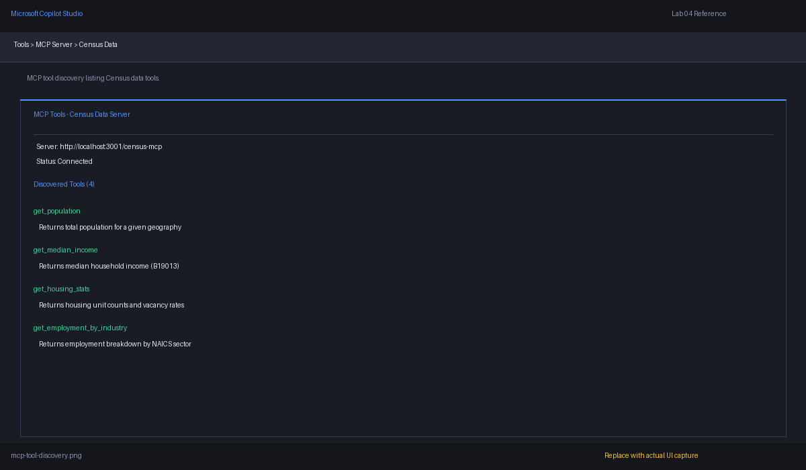

### ✅ You've completed Optional Use Case #8

**Key takeaways**

- MCP is a scalable pattern when your Census integration grows beyond a couple of static HTTP tools.
- Runtime tool discovery helps the agent adapt without manually wiring every capability into every topic.
- Centralizing Census logic in an MCP server is a strong design for advanced utility analytics agents.

**Troubleshooting**

- If no tools appear, confirm the server starts locally and that the registration path/command is correct.
- If calls fail at runtime, verify the API key environment variable is present in the server process.
- If the agent picks the wrong MCP tool, improve the tool descriptions so the planner can distinguish population, income, housing, and employment tasks.

---

# 🧪 Optional Use Case #9 — Copilot Studio Extension for VS Code (20 min, optional)

> 🎯 **Objective:** Install the Copilot Studio extension for VS Code, connect to your environment, inspect the agent YAML, and understand why source-controlled agent assets matter.

### Scenario

Your team wants source control, review, and repeatable promotion between environments.

### Step 1 — Confirm prerequisites

1. Install **Visual Studio Code**.
2. Sign in with your Microsoft account.
3. Confirm you can access the same Copilot Studio environment used in this lab.

### Step 2 — Install the extension

1. Open VS Code.
2. Go to **Extensions**.
3. Search for **Microsoft Copilot Studio**.
4. Install the extension.
5. Sign in if prompted.

Reference:
- [Install the Microsoft Copilot Studio extension for Visual Studio Code](https://learn.microsoft.com/en-us/microsoft-copilot-studio/visual-studio-code-extension-install-configure)

### Step 3 — Connect to your environment

1. Use the extension command palette entry to connect to a Copilot Studio environment.
2. Select the environment containing **Energy Intelligence Agent**.
3. Download or open the agent project locally.

### Step 4 — Inspect the YAML and project structure

1. Review the generated files for:
   - Agent metadata
   - Topics
   - Tools / actions
   - Connections or references
2. Locate the YAML or component files for **Service Territory Lookup** and **Census Data Help**.

Reference:
- [Edit your Microsoft Copilot Studio agent in Visual Studio Code](https://learn.microsoft.com/en-us/microsoft-copilot-studio/visual-studio-code-extension-edit-agent-components)

### Step 5 — Make a safe change in VS Code

1. Update a topic description or tool description.
2. Validate the YAML.
3. Sync the change back to Copilot Studio.
4. Re-test the affected prompt in the browser.

### Step 6 — Explain why this matters

Benefits to highlight:

- Better **version control** for topics and instructions
- Easier **code review** for prompt and tool changes
- Cleaner **CI/CD** story for enterprise teams

### ✅ You've completed Optional Use Case #9

**Key takeaways**

- VS Code is ideal when your Copilot Studio solution becomes a team asset.
- YAML visibility makes topic and tool changes easier to review.
- Version control matters for regulated utility use cases.

**Troubleshooting**

- If the extension can't connect, confirm you're signed into the correct Microsoft account and environment.
- If the YAML doesn't sync cleanly, pull the latest version from Copilot Studio before editing.

---

# 🙋 Q&A and Wrap-Up (15 min)

> 🎯 **Objective:** Consolidate learning, answer outstanding questions, and discuss next steps for production deployment.

### Suggested discussion topics

Use this time for open Q&A. If the group needs prompts, consider these:

**Architecture & design**

- How would you extend this agent to cover tract-level or block-group geographies?
- When should Census tools live in the parent agent vs. the connected specialist vs. an MCP server?
- What's the right model selection strategy when cost matters but planning accuracy is critical?

**Production readiness**

- How would you secure the Census API key in a production deployment (Key Vault, managed connections)?
- What evaluation cadence makes sense — weekly, per-release, per-knowledge-source change?
- How would you monitor real user satisfaction alongside automated evaluations?

**Energy-specific extensions**

- What other public data sources (EIA, NOAA weather, FERC filings) could complement Census data?
- How would you connect this agent to internal GIS or load-forecasting systems?
- Could this pattern support regulatory reporting (IRP filings, rate-case data requests)?

### Recap — what you built today

| Component | What it does |
|---|---|
| **Topics** | Capture geography, route intent, explain available data |
| **Variables** | Store FIPS codes, API keys, and year selections across the conversation |
| **Tools** | Call Census Bureau ACS endpoints for demographics and employment |
| **Connected Agent** | Specialist child agent owning all Census reasoning |
| **Agent Flow** | Power Automate multi-endpoint aggregation returning a planning summary |
| **Model Selection** | Compared quality/cost tradeoffs for energy-domain prompts |
| **Evaluations** | 10-question regression set proving quality before and after changes |
| **MCP Server** *(optional)* | Runtime-discoverable Census tool host |
| **VS Code Extension** *(optional)* | Source-controlled agent management and CI/CD workflows |

> 💡 **Next steps for your team:** Take the patterns from this lab and adapt them to your real service territory data, internal APIs, and planning workflows. The architecture scales — add more Census variables, more geographies, more MCP tools — without redesigning the agent.

---

## 🏁 Congratulations

You've built an **Energy Intelligence Agent** that combines topics, variables, Census API tools, a connected specialist agent, a Power Automate flow, model testing, and an evaluation suite. If you completed the optional sections, you also explored MCP-based tool discovery and VS Code agent management.

This pattern gives an energy company a strong foundation for service-territory demographics, capacity planning, commercial corridor analysis, and regulatory-ready planning summaries.

> 🔋 **Final thought:** the value is not just calling the Census API. It is turning public data into planner-friendly decisions.
