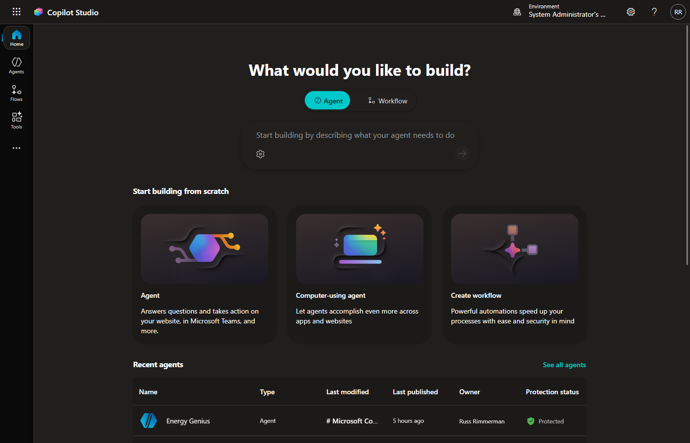
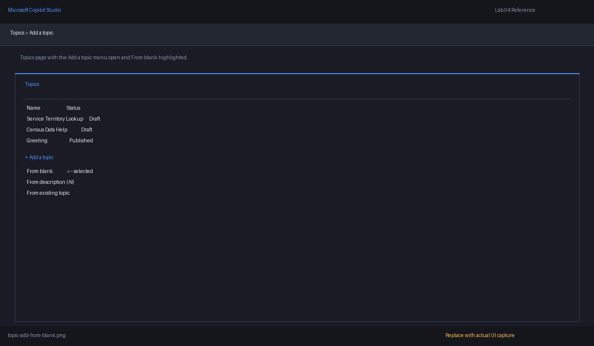
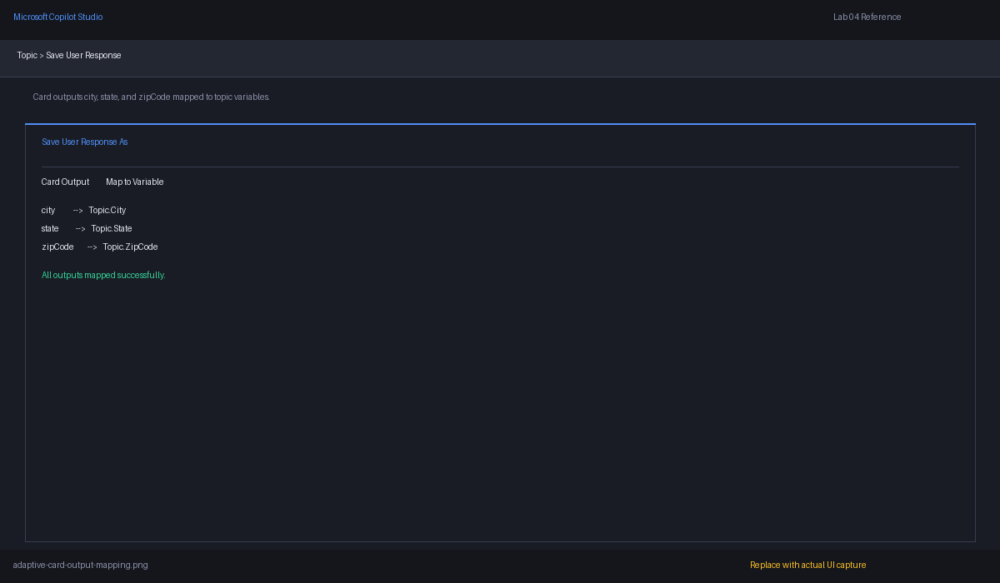
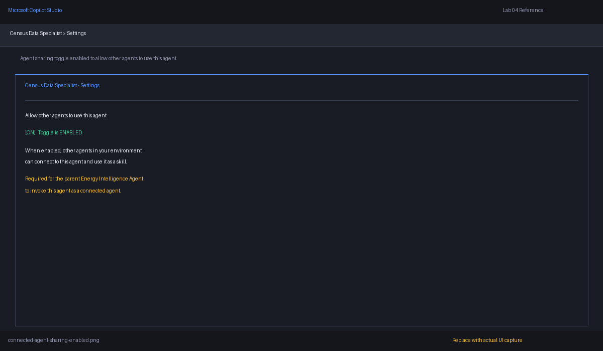
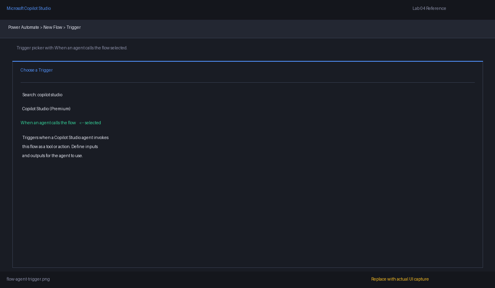
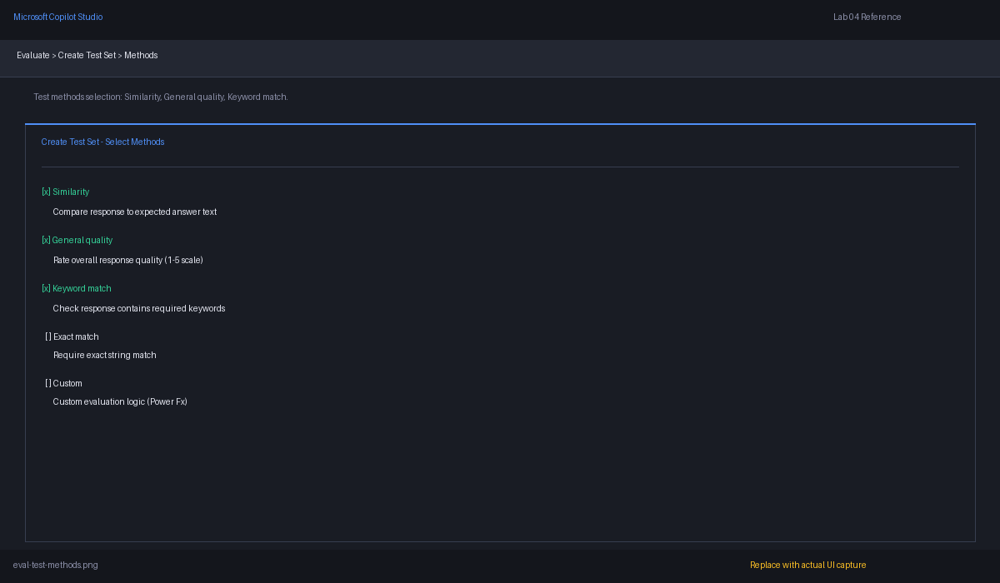

# ⚡ Lab 04: Build an Energy Operations Weather Intelligence Agent with MSN Weather

*Turn live weather signals into grid-operations intelligence.*

| | |
|---|---|
| ⭐ **DIFFICULTY** | Intermediate (Level 200) |
| ⏱️ **TIME** | 1 hour 45 min (15 min intro, 75 min hands-on, 15 min Q&A) |
| 🧩 **PRODUCTS** | Microsoft Copilot Studio, MSN Weather connector, Adaptive Cards, Custom Prompts, Power Automate |
| 🏷️ **TAGS** | Topics, Variables, Adaptive Cards, Connector Tools, Custom Prompt Tools, Connected Agents, Agent Flows, Evaluations, Model Selection, Grid Operations |
| 🏭 **INDUSTRY** | Energy / Utilities |


---

## ⚡ Why this lab matters for energy and utilities

Weather drives the grid. Heat waves and cold snaps push residential and commercial HVAC load to record peaks. Severe weather knocks out feeders, triggers outages, and dictates crew dispatch. Wind, humidity, and lightning probability change line ratings and switching plans. Operations centers, distribution planners, and field crews all need fast, location-specific weather context to anticipate demand spikes and stage resources.

In this lab, you'll build an **Energy Operations Weather Intelligence Agent** in **Microsoft Copilot Studio** that uses the built-in **MSN Weather connector** so dispatchers and planners can move from a free-text question to a service-territory weather briefing in one turn.

---

## 🏗️ What you'll build

By the end of the lab, you will have a working solution with these components:

| Layer | What you will build |
|---|---|
| **Parent agent** | **Energy Operations Weather Agent** |
| **Topics** | **Service Territory Weather Lookup** and **Weather Operations Help** |
| **Variables** | Global, topic, and system variables — populated via an **Adaptive Card** for structured location input |
| **Tools / actions** | Two MSN Weather **connector tools** plus one **custom prompt tool** that produces an operations briefing |
| **Connected agent** | **Weather Operations Specialist** |
| **Agent flow** | Power Automate multi-location weather briefing |
| **MCP server** | Local Open-Meteo MCP server *(optional)* |
| **Evaluation suite** | 10-question regression set |

### Architecture summary

```text
User
  -> Energy Operations Weather Agent
      -> Topics collect location + intent
      -> MSN Weather connector tools for current weather and forecast
      -> Connected Agent: Weather Operations Specialist
      -> Power Automate flow for multi-location briefings
      -> MCP server tools for richer dispatcher-driven discovery (optional)
      -> Final response grounded in MSN Weather data
```

> 💡 **Think like a grid operator:** the agent is not just answering trivia. It is helping decide how much load to plan for tonight, where to pre-stage crews ahead of a storm, which feeders are at thermal risk, and which substations need a closer look during a heat advisory.

---

## 🎯 Objectives

By the end of this lab, you will be able to:

1. ✅ Build topics for service-territory weather lookups and operator help
2. ✅ Use variables for default location, units, and forecast horizon, and collect structured location inputs with an **Adaptive Card**
3. ✅ Add MSN Weather connector actions as agent tools, and build a **custom prompt tool** that turns the connector outputs into an operations briefing
4. ⭐ *(Optional)* Add a connected **Weather Operations Specialist** agent
5. ⭐ *(Optional)* Build a Power Automate multi-location briefing flow
6. ⭐ *(Optional)* Compare models for quality, latency, and cost
7. ⭐ *(Optional)* Evaluate the agent with a 10-question regression set
8. ⭐ *(Optional)* Expose richer weather capabilities through an MCP server backed by Open-Meteo

---

## 🧠 Core concepts overview

| Concept | What it means |
|---|---|
| **MSN Weather connector** | A built-in Power Platform connector for current conditions and short-range forecasts |
| **Connector actions** | Pre-built operations such as *Get current weather* and *Get forecast for today* |
| **Location string** | A free-text place such as `Cypress, TX` or `Seattle, WA` |
| **Units** | `Imperial` (°F, mph) or `Metric` (°C, km/h) |
| **Topics** | Guided conversation flows |
| **Variables** | Reusable values during a conversation |
| **Adaptive Cards** | JSON-defined input forms that populate named topic variables in one turn |
| **Tools / actions** | Connector- or HTTP-backed functions the agent can call |
| **Custom prompt tool** | A reusable AI prompt template, packaged as a tool, that returns model-generated text from named inputs |
| **Connected agents** | Child agents for specialized work |
| **Agent flows** | Multi-step Power Automate actions |
| **MCP server** *(optional)* | A discoverable tool host |
| **Evaluations** | Repeatable quality tests |

### MSN Weather connector details used in this lab

| Item | Value |
|---|---|
| **Connector name** | MSN Weather |
| **Action — current** | *Get current weather* |
| **Action — today** | *Get forecast for today* |
| **Action — tomorrow** | *Get forecast for tomorrow* |
| **Required input** | `Location` (free-text place) |
| **Required input** | `Units` (`Imperial` or `Metric`) |
| **Sample current outputs** | `temperature`, `feelsLike`, `humidity`, `windSpeed`, `windDirection`, `dayOrNight`, `description` |
| **Sample forecast outputs** | `dayHigh`, `dayLow`, `daytimeDescription`, `precipitationProbability`, `chanceOfRain`, `chanceOfSnow` |
| **Authentication** | Power Platform connection — sign in with your work account; no API key needed |

> 💡 **Why MSN Weather?** It's a built-in Power Platform connector, so there is no API-key signup, no URL crafting, and no JSON payload parsing. You add an action, the agent calls it, and structured outputs come back ready to use. That lets the lab focus on **agent design** (topics, variables, connected agents, flows, evaluations) instead of HTTP plumbing.

### Example energy-relevant prompts

- **Heat-driven demand on a residential corridor**

  *"What is the current temperature and feels-like in Cypress, TX, and is it likely to drive a residential AC peak this evening?"*

- **Storm staging for crews and trucks**

  *"Will Tarrant County see thunderstorms tomorrow that could affect overhead distribution?"*

- **Cold-snap load planning**

  *"Compare today's lows in Minneapolis, MN and Fargo, ND for cold-load pickup planning."*

> ⚠️ **Important:** The MSN Weather connector returns forward-looking forecasts that can change. Treat outputs as *current-as-of-call* and re-call before time-sensitive operational decisions.

---

## 📚 Documentation

- [Create and edit topics](https://learn.microsoft.com/en-us/microsoft-copilot-studio/authoring-create-edit-topics)
- [Variables overview](https://learn.microsoft.com/en-us/microsoft-copilot-studio/authoring-variables-about)
- [Add other agents overview](https://learn.microsoft.com/en-us/microsoft-copilot-studio/authoring-add-other-agents)
- [Agent flows overview](https://learn.microsoft.com/en-us/microsoft-copilot-studio/flows-overview)
- [Call an agent flow from an agent](https://learn.microsoft.com/en-us/microsoft-copilot-studio/advanced-use-flow)
- [Select a primary AI model](https://learn.microsoft.com/en-us/microsoft-copilot-studio/authoring-select-agent-model)
- [Extend your agent with MCP](https://learn.microsoft.com/en-us/microsoft-copilot-studio/agent-extend-action-mcp)
- [Agent evaluation overview](https://learn.microsoft.com/en-us/microsoft-copilot-studio/analytics-agent-evaluation-intro)
- [Run evaluations and view results](https://learn.microsoft.com/en-us/microsoft-copilot-studio/analytics-agent-evaluation-results)
- [MSN Weather connector reference](https://learn.microsoft.com/connectors/msnweather/)
- [Open-Meteo API documentation](https://open-meteo.com/en/docs) *(used in the optional MCP section)*

---

## ✅ Prerequisites

- Access to **Microsoft Copilot Studio** in an environment where you can create or edit agents
- Permission to create **Power Automate cloud flows**
- Permission to create connections to the **MSN Weather** connector in your environment (a one-time consent on first use)
- Optional for the MCP section (Use Case #8): **Node.js 18+** or **Python 3.10+** and **VS Code** on your local machine

> 💡 **Tip:** The MSN Weather connector requires no API key. The optional MCP section uses **Open-Meteo**, which is also free and key-free, so you can complete the entire lab without provisioning any external credentials.

---

## 🗺️ Use cases covered

| # | Section | Time | Required |
|---|---|---|---|
| 1 | Topics | 25 min | ✅ |
| 2 | Variables (with Adaptive Card) | 25 min | ✅ |
| 3 | Tools (connector + custom prompt) | 25 min | ✅ |
| 4 | Connected Agents | 18 min | ⭐ Optional |
| 5 | Agent Flows | 20 min | ⭐ Optional |
| 6 | Model Selection & Testing | 12 min | ⭐ Optional |
| 7 | Agent Evaluations | 15 min | ⭐ Optional |
| | **Q&A / Wrap-up** | **15 min** | ✅ |
| | **Core lab total** | **105 min (1 hour 45 min, includes 15 min intro)** | |
| 8 | Optional: MCP Servers | 20 min | ⭐ Optional |

---

# 🧪 Use Case #1 — Topics (25 min)

> 🎯 **Objective:** Create custom topics that capture user intent, route grid-operations questions to the correct branches, and stub out where structured location collection will happen — the Adaptive Card itself is built in Use Case #2 alongside the variables it populates.

### Scenario

A grid operator needs either a guided service-territory weather lookup or a quick explanation of what weather data the agent supports.

### Step 1 — Create the Energy Operations Weather Agent

1. Open [Copilot Studio](https://copilotstudio.microsoft.com/). You should land on the **What would you like to build?** home page shown below. Make sure you select the correct Power Platform Environment for your lab work. If you don't see the environment you expect, check with your administrator to ensure you have access. If you are prompted with any "Welcome to Copilot Studio" or "What's new" pop-ups, close them to see the home page.

   

2. Make sure **Agent** is selected (not **Workflow**), then under **Start building from scratch** select the **Agent** tile.
3. Name the agent:

   ```text
   Energy Operations Weather Agent
   ```

4. In **Instructions**, enter:

   ```text
   You are a grid operations assistant for dispatchers, distribution planners, field crews, and customer-operations teams. Help users translate live weather and short-range forecasts into operational decisions about load, outages, crew staging, and customer impact. Ask for the city and state when location is missing or ambiguous. Default to Imperial units unless the user requests Metric. Keep responses concise, time-aware, and useful for grid operations — call out heat-driven AC peaks, cold-load pickup, severe-weather risk, and crew safety where relevant.
   ```

5. In **Select your agent's model** select one of the available models (you can change this later).
6. Save the agent.

> 💡 **Tip:** Keep the agent instructions broad and cross-cutting. The detailed collection logic belongs in topics and tool descriptions, not in a massive system prompt.

### Step 2 — Create the **Service Territory Weather Lookup** topic

1. Open the agent and select **Topics**.
2. Select **+ Add a topic** and **From blank**.

   

> 💡 **Tip:** The **Add from description with Copilot** can save significant time up front in creating your agent. To make the topic structure explicit for learning, we are selecting the more manual option of starting with a blank slate.

3. Click on the word **Untitled** at the top left, and rename it to:

   ```text
   Service Territory Weather Lookup
   ```

4. In the **Describe what this topic does*** field, past the following prompt so the generative AI orchestrator knows when to trigger this topic automatically:

   ```text
   Use this topic when the user wants the current weather, today's forecast, or tomorrow's forecast for a specific service territory location — typically a city and state. Examples: "What's the weather at the Cypress substation?", "Forecast for Tarrant County tomorrow", "Will it rain in Houston this afternoon?".
   ```

5. Save the topic.

### Step 3 — Ask the user for a City and State

1. In the authoring canvas, click the **+** below the trigger and add a **Send a message** node:

   ```text
   I can pull current weather and short-range forecasts for any service-territory location.
   ```

2. Click **+** and add a **Ask a question** node to collect the **city**:

   ```text
   Which city is the service territory location in?
   ```

   - Set **Identify** to **User's entire response**.
   - Under **Save user response as**, save to a topic variable named `Topic.City`.

3. Click **+** and add another **Ask a question** node to collect the **state**:

   ```text
   What is the 2-letter state abbreviation (for example, TX)?
   ```

   - Set **Identify** to **User's entire response**.
   - Under **Save user response as**, save to a topic variable named `Topic.State`.

4. Below the questions, add a **Send a message** node that previews what will happen once the variables are populated:

   ```text
   Once we have a location, I'll pull current conditions and today's forecast and explain what they mean for grid operations.
   ```

> 💡 **Why two simple questions?** Asking for city and state as separate, named questions gives the orchestrator clean, validated values it can write straight into topic variables — no entity-extraction guesswork and no need to parse a freeform "what's the location?" reply. In Use Case #2 we'll layer in the rest of the variable strategy (defaults, units, forecast horizon) and compose `Topic.Location` from these inputs.

### Step 4 — Add the **Weather Operations Help** topic

1. Create another new topic named:

   ```text
   Weather Operations Help
   ```

2. In the topic **Description** field, write a clear prompt so the orchestrator routes informational questions here instead of to the lookup topic:

   ```text
   Use this topic when the user asks what weather data the agent can access, what fields are returned, what units are supported, or wants an explanation of how forecast data is used in grid operations — not when they want to run an actual lookup. Examples: "What weather data can you pull?", "What does feels-like mean for crew safety?", "Explain how heat advisories affect load."
   ```

3. Add a **Send a message** node with content like:

   ```text
   I use the MSN Weather connector to pull current conditions and short-range forecasts for any city and state. I can return temperature, feels-like, humidity, wind, and chance of precipitation in Imperial or Metric units.
   ```

4. Optionally add a second message explaining how operators use these signals:

   ```text
   - Temperature and feels-like → residential AC peak risk and crew heat exposure
   - Humidity and dew point → equipment loading and ampacity considerations
   - Wind and gusts → overhead-line and tree-contact risk
   - Chance of precipitation → outage probability and storm staging
   ```

5. End the topic with a prompt:

   ```text
   If you want, I can run a weather lookup now. Which city and state should we check?
   ```

### Step 5 — Add the MSN Weather connector as a tool and call it from the topic

Now that the topic collects a city and state, wire it to a real connector so the operator gets actual weather back instead of a placeholder message.

1. In the agent's left navigation, open **Tools**.
2. Select **+ Add a tool**, choose **Connector**, and search for **MSN Weather**.
3. From the MSN Weather connector, pick the **Get current weather** action.
4. **Create a new connection to MSN Weather.** This is your first time using the connector in this agent, so there won't be an existing connection to pick from. Follow these clicks in order:
   1. Next to the MSN Weather connector, click **Not connected**.
   2. Click **Create new connection**.
   3. In the connection dialog, click **Create**.
   4. When the action returns to the tool, click **Add and configure**.
   5. In the tool configuration panel, locate **Credentials to use** and change it to **Maker-provided credentials**.
   6. No API key or secret is required — MSN Weather uses your Power Platform connection.

5. Add this description so the orchestrator knows when to use it:

   ```text
   Use when the operator needs live conditions — temperature, feels-like, humidity, wind, and a short text description — for a specific city and state. Useful for AC-peak risk, crew heat exposure, and right-now situational awareness.
   ```

7. Configure the tool's inputs:

   | Connector input | Fill behavior | Value |
   |---|---|---|
   | `Location` | Leave as-is (default) | Formula: `Topic.City & ", " & Topic.State` |
   | `Units` | Set to **Custom Value** | `Imperial` |

8. Save the tool.

### Step 6 — Use the tool inside **Service Territory Weather Lookup**

1. Return to **Service Territory Weather Lookup**.
2. After the **Ask a question** node that captures `Topic.State`, click **+** and add a **Call an action** node.
3. Select the **Get Current Weather** tool you just created.
4. Confirm the inputs are wired as in Step 5 (`Location` → `Topic.City & ", " & Topic.State`, `Units` → `Imperial`).
5. Capture the tool's response into a topic variable named `Topic.WeatherResponse`.
6. Replace the earlier "Once we have a location…" preview message with a **Send a message** node that reads the response back to the operator. Use Power Fx to format the key fields, for example:

   ```powerfx
   "Current conditions for " & Topic.City & ", " & Upper(Topic.State) & ": " &
   Topic.WeatherResponse.responses.weather.current.cap & ", " &
   Text(Topic.WeatherResponse.responses.weather.current.temperature) & "° (feels like " &
   Text(Topic.WeatherResponse.responses.weather.current.feels) & "°), humidity " &
   Text(Topic.WeatherResponse.responses.weather.current.humidity) & "%, wind " &
   Text(Topic.WeatherResponse.responses.weather.current.windSpeed) & "."
   ```

   > 💡 The exact JSON path may render slightly differently in your tenant — if the formula bar shows the response under `responses[0]`, adjust the dot path to match what IntelliSense suggests.

7. Save the topic.

### Step 7 — Test the end-to-end flow

1. Open the **Test** panel.
2. Run prompts such as:
   - `Pull weather for a service territory` → answer `Houston` for city and `TX` for state.
   - `What weather data can you pull?` → should hit the **Weather Operations Help** topic.
3. Confirm:
   - The correct topic triggers based on the user's intent.
   - The lookup topic asks for city, then state, then calls **Get Current Weather**.
   - The final message contains real values returned by the connector (temperature, humidity, wind, description).
   - Help questions still trigger the **Weather Operations Help** topic rather than the lookup topic.

> 💡 **Tip:** A good operations topic should reduce ambiguity early. In Use Case #2 we'll replace the two questions with an Adaptive Card and add a `Topic.Units` variable so the operator can switch between Imperial and Metric. In Use Case #3 we'll add a second connector tool (today's forecast) and a custom prompt that interprets the raw numbers as an operations briefing.

### ✅ You've completed Use Case #1

**Key takeaways**

- Topic design is how you convert vague operator questions into structured, tool-ready requests.
- Separate "help/explanation" behavior from "run weather lookup" behavior so the operator doesn't confuse information requests with execution requests.
- Strong topic descriptions are the orchestrator's primary signal for routing — invest in them early.
- The MSN Weather connector is a built-in Power Platform connector, so you can stand up a working weather tool with no API key and no HTTP-payload parsing.

**Troubleshooting**

- If the wrong topic triggers, refine the topic descriptions so the orchestrator can clearly distinguish them — make **Weather Operations Help** sound explanatory and **Service Territory Weather Lookup** sound action-oriented.
- If your help topic accidentally calls a tool, confirm the **Weather Operations Help** topic does not contain any **Call an action** nodes.
- If the connector returns *Location not found*, confirm the formula composes `City, ST` correctly and the state is a valid 2-letter abbreviation.
- If the response message shows blank values, expand the response in the variable inspector and adjust the dot path in the Power Fx formula to match the actual shape returned in your tenant.

---

# 🧪 Use Case #2 — Variables (25 min)

> 🎯 **Objective:** Configure global, topic, and system variables so the agent can store default location, units, forecast horizon, and the resolved location string used by every weather tool — and use an **Adaptive Card** to populate those variables with structured, validated inputs in a single turn.

### Scenario

Your agent needs reusable state for default location, units, and forecast horizon.

### Step 1 — Define the variable strategy

Use the following variable design:

| Variable | Type | Purpose |
|---|---|---|
| `Global.DefaultLocation` | Global | Default location when the agent is run for one utility footprint, e.g. `Cypress, TX` |
| `Global.DefaultUnits` | Global | Default units, `Imperial` or `Metric` |
| `Global.HeatAdvisoryF` | Global | Temperature in °F above which the agent flags an AC-peak risk, e.g. `95` |
| `Topic.City` | Topic | City entered by the user via the Adaptive Card |
| `Topic.State` | Topic | 2-letter state abbreviation from the Adaptive Card (e.g. `TX`) |
| `Topic.Location` | Topic | Composed `City, ST` string passed to the MSN Weather connector |
| `Topic.Units` | Topic | Units selected for this specific request |
| `Topic.ForecastHorizon` | Topic | `today` or `tomorrow` |
| `System.Activity.Text` | System | Raw incoming user message |
| `System.Conversation.Id` | System | Useful for diagnostics and flow tracing |

### Step 2 — Create global variables

1. Open the agent and go to the variable management experience. If you don't see a dedicated variables page in your environment, create the variables from a **Set variable value** node and set their scope to **Global**.
2. Create a global variable named `Global.DefaultLocation`.
3. Set a sample value such as:

   ```text
   Cypress, TX
   ```

4. Create `Global.DefaultUnits` and set it to:

   ```text
   Imperial
   ```

5. Create `Global.HeatAdvisoryF` and set it to:

   ```text
   95
   ```

> 💡 **Tip:** Globals are how you adjust an entire demo footprint in one place. Move from `Cypress, TX` to `Minneapolis, MN` for a winter cold-load demo without touching topics or tools.

### Step 3 — Initialize topic variables in **Service Territory Weather Lookup**

1. Return to the **Service Territory Weather Lookup** topic.
2. Near the start of the topic (before the location-collection placeholder you added in Use Case #1), add **Set variable value** nodes.
3. Initialize:
   - `Topic.Units = Global.DefaultUnits`
   - `Topic.Location = ""`
   - `Topic.ForecastHorizon = "today"`
4. If your operations team works mostly in one footprint, you can pre-fill `Topic.State` with the dominant value (e.g., `"TX"`) so the Adaptive Card you add next opens with that value already populated.

> 💡 **Tip:** Initialization makes your topic easier to debug. Empty strings are easier to reason about than partially populated values from a previous test run.

### Step 4 — Collect structured location inputs with an Adaptive Card

> 🎴 **New topic introduced: Adaptive Cards.** Adaptive Cards are JSON-defined, host-agnostic UI blocks that render natively inside Copilot Studio chat. We use them here as a **variable-collection mechanism** — instead of asking a freeform location question and parsing the answer with conditions or entity extraction, the card returns named, validated values straight into topic variables. That makes Adaptive Cards the cleanest bridge between a conversational prompt and the structured data your tools need.

In this step, you'll replace the location-collection placeholder from Use Case #1 with an Adaptive Card that captures **city** and **state** in a single turn and writes each field into a named topic variable.

1. Open **Service Territory Weather Lookup**.
2. Delete the location-collection placeholder **Send a message** node from Use Case #1.
3. In its place, add an **Ask with adaptive card** node. (If your tenant labels the option slightly differently, choose the Adaptive Card question/action that opens the card editor.)
4. In the Adaptive Card editor, switch to the **JSON** view and paste the following payload:

   ```json
   {
     "$schema": "https://adaptivecards.io/schemas/adaptive-card.json",
     "type": "AdaptiveCard",
     "version": "1.5",
     "body": [
       {
         "type": "TextBlock",
         "text": "Service territory location",
         "weight": "Bolder",
         "size": "Medium",
         "wrap": true
       },
       {
         "type": "TextBlock",
         "text": "Enter the city and state of the service territory you want a weather briefing for.",
         "isSubtle": true,
         "wrap": true,
         "spacing": "Small"
       },
       {
         "type": "Input.Text",
         "id": "city",
         "label": "City",
         "placeholder": "Example: Cypress",
         "isRequired": true,
         "errorMessage": "Please enter a city."
       },
       {
         "type": "Input.Text",
         "id": "state",
         "label": "State (2-letter abbreviation)",
         "placeholder": "Example: TX",
         "maxLength": 2,
         "isRequired": true,
         "errorMessage": "Please enter a 2-letter state abbreviation."
       }
     ],
     "actions": [
       {
         "type": "Action.Submit",
         "title": "Submit",
         "data": {
           "action": "submitLocation"
         }
       }
     ]
   }
   ```

   

5. Save the card and click **Close**. Copilot Studio will surface each `Input.Text` as a separately addressable output you can map to topic variables.

   

6. Under **Save user response as**, map each card output to its corresponding topic variable from Step 1's variable strategy:

   | Card output (`Input.Text` id) | Topic variable |
   |---|---|
   | `city` | `Topic.City` |
   | `state` | `Topic.State` |

   

> 💡 **Why an Adaptive Card here?** The card guarantees you receive named, validated inputs. The `isRequired` + `errorMessage` properties handle empty-input cases for you — there is no condition tree, no entity extractor, and no \"did the user mean a city, a county, or a substation name?\" guesswork. For an energy-operations agent where dispatchers may be one-handed during a storm event, a structured card is also faster than typing a sentence.

#### Adaptive Card design tips for energy operations

- **Pre-populate the dominant state.** Add `\"value\": \"TX\"` to the `state` input so an operator working a single-state footprint just confirms the value. Override is one tap.
- **Add a units toggle as a second card later.** If your operations team mixes Imperial and Metric across regions, an `Input.ChoiceSet` with `Imperial` / `Metric` is a natural follow-up card that writes to `Topic.Units`.
- **Validate at the edge.** Card validation (`isRequired`, `maxLength`, `errorMessage`) keeps invalid input out of `Topic.Location` entirely — preferable to catching it after the connector returns *Location not found*.

### Step 5 — Compose `Topic.Location` from card outputs with Power Fx

The MSN Weather connector accepts a single free-text `Location` such as `Cypress, TX`. Now that the card has given you clean inputs, compose them into the single string the connector expects.

1. After the Adaptive Card node, add a **Set variable value** node.
2. Under **To value** select the **...** and select **Formula**.
3. Use a Power Fx expression that builds `City, ST` from the card inputs:

   ```powerfx
   If(
     !IsBlank(Topic.City) && !IsBlank(Topic.State),
     Concatenate(Topic.City, ", ", Upper(Topic.State)),
     ""
   )
   ```

   Set the **To** variable to `Topic.Location`.

4. Add a **Condition** node to confirm we have a usable location:
   - **If `Topic.Location` is blank** → add a **Send a message** node explaining we need a city and state, then add a **Go to step** node that returns to the Adaptive Card.
   - **All other conditions** → continue to the next step.

> 💡 **Tip:** Keeping location parsing in one place (`Topic.Location`) means every weather tool, the connected agent, and the Power Automate flow all share the same input and behave consistently.

### Step 6 — Resolve units and forecast horizon

1. The Adaptive Card from Step 4 already populates `Topic.City` and `Topic.State` — no extra parsing or entity extraction is required.
2. The Power Fx step from Step 5 composes `Topic.Location`.
3. If you want the operator to override units, add a follow-up **Ask a question** node after the card with options `Imperial` and `Metric`, and set `Topic.Units` accordingly. Otherwise keep `Topic.Units = Global.DefaultUnits`.
4. If the operator's wording mentions *"tomorrow"* (you can detect this with a simple condition on `System.Activity.Text` or with an entity), set `Topic.ForecastHorizon = "tomorrow"`. Otherwise leave it as `today`.

### Step 7 — Use variables in connector calls

When you build the MSN Weather tools in Use Case #3, you'll wire the connector inputs to these variables:

| Connector input | Source variable |
|---|---|
| `Location` | `Topic.Location` |
| `Units` | `Topic.Units` |

The connected agent and the Power Automate flow will reuse the same variables, so location and units behave consistently everywhere.

### Step 8 — Pass variables between topics and use system variables

1. In **Weather Operations Help**, when the user says they want to run a lookup, transition to **Service Territory Weather Lookup** and pass along any already-known context (city, state, units).
2. For debugging during development, inspect `System.Activity.Text` and `System.Conversation.Id` to trace conversation flow. Remove or hide diagnostic output before publishing.

> ⚠️ **Do not** leave internal identifiers or raw troubleshooting output exposed in a production response to operators.

### ✅ You've completed Use Case #2

**Key takeaways**

- Global variables are best for reusable configuration such as default location, default units, and operational thresholds.
- Topic variables hold the location and request-specific values for one run of the conversation.
- **Adaptive Cards** are the cleanest way to populate multi-field topic variables in one turn — JSON-defined inputs map directly to named variables, with built-in validation and zero entity extraction.
- Variables are what make your connector tools, connected agents, and flows reusable instead of hard-coded.

**Troubleshooting**

- If the Adaptive Card doesn't render in the test panel, confirm you used the **Ask with adaptive card** node (not a plain message with embedded JSON) and that the JSON validates against Adaptive Cards 1.5.
- If the card outputs aren't available as variables, re-open the card node and verify each `Input.Text` `id` (`city`, `state`) is mapped under **Save user response as**.
- If `Topic.Location` is empty after the Power Fx step, confirm both `Topic.City` and `Topic.State` are populated — the `If(...)` expression returns an empty string if either is blank.
- If the connector returns *Location not found*, check `Topic.Location` — confirm `City, ST` is composed correctly and the state is a valid 2-letter abbreviation.
- If forecast units are wrong, verify that `Topic.Units` is being passed through and not silently overridden.
- If a help topic hands off to the lookup topic but loses context, explicitly set the variables before the transition.

---

# 🧪 Use Case #3 — Tools (25 min)

> 🎯 **Objective:** Build three agent tools that together turn raw weather data into an operations briefing — two **connector tools** (MSN Weather actions) and one **custom prompt tool** that interprets the connector outputs in energy-operations language.

### Scenario

Operators need three capabilities:

1. **Live current weather** for right-now decisions (connector tool).
2. **Today's forecast** for end-of-shift planning (connector tool).
3. **An operations briefing** that reads the raw weather signals and translates them into AC-peak risk, crew safety guidance, demand-spike warnings, and storm-staging language (custom prompt tool).

This is also a chance to see two distinct **tool types** in Copilot Studio side by side:

| Tool type | What it does | When to choose it |
|---|---|---|
| **Connector tool** | Calls a Power Platform connector action (deterministic, structured outputs) | When you need real data from a system of record |
| **Custom prompt tool** | Wraps a reusable prompt template (model-generated outputs) | When you need to interpret, summarize, or translate structured data into operator-friendly language |

### Step 1 — Build Tool 1: **Get Current Weather**

1. In the agent, open **Tools**.
2. Select **Add tool**.
3. Choose **Connector** and search for **MSN Weather**.
4. Select the action **Get current weather**.
5. When prompted, create or select a connection to MSN Weather. The connector uses your Power Platform connection — no API key is required, but the first use will ask you to consent.
6. Name the tool:

   ```text
   Get Current Weather
   ```

7. Add this description:

   ```text
   Use when the operator needs live conditions — temperature, feels-like, humidity, wind, and a short text description — for a specific city and state. Useful for AC-peak risk, crew heat exposure, and right-now situational awareness.
   ```

### Step 2 — Configure Tool 1 inputs

The MSN Weather *Get current weather* action exposes two inputs:

| Input | Type | Description |
|---|---|---|
| `Location` | Text | Free-text place such as `Cypress, TX` |
| `Units` | Text (enum) | `Imperial` or `Metric` |

Give the operator-friendly input descriptions:

- `Location`: *City and 2-letter state, e.g. `Cypress, TX`.*
- `Units`: *Imperial returns °F and mph. Metric returns °C and km/h.*

Wire the inputs to the topic variables:

- `Location` ← `Topic.Location`
- `Units` ← `Topic.Units`

### Step 3 — Configure Tool 1 outputs

The MSN Weather connector returns a structured response. Surface the most useful fields to the agent so the operator sees clean names:

| Output | Source field | Meaning |
|---|---|---|
| `temperature` | `responses[0].weather.current.temperature` | Current temperature in the requested units |
| `feelsLike` | `responses[0].weather.current.feels` | Feels-like temperature |
| `humidity` | `responses[0].weather.current.humidity` | Relative humidity (%) |
| `windSpeed` | `responses[0].weather.current.windSpeed` | Wind speed in the requested units |
| `description` | `responses[0].weather.current.cap` | Short text description, e.g. *Mostly sunny* |
| `dayOrNight` | `responses[0].weather.current.dayOrNight` | `d` or `n` |

If your connector surface returns these as nested objects instead of flat outputs, expand the **Outputs** panel and select the fields you want exposed to the agent.

> 💡 **Tip:** Good output names matter. The operator should understand `feelsLike` instantly; raw nested paths are a tool-builder detail, not an operations concept.

### Step 4 — Build Tool 2: **Get Today's Forecast**

Follow the same pattern as Tool 1:

1. Add another tool named **Get Today's Forecast**.
2. Description:

   ```text
   Use when the operator needs today's forecast — high, low, daytime description, and chance of precipitation — for a specific city and state. Useful for end-of-shift load planning, storm staging, and crew dispatch.
   ```

3. Pick the connector action **Get forecast for today**.
4. Inputs (same as Tool 1): `Location` ← `Topic.Location`, `Units` ← `Topic.Units`.
5. Recommended outputs:

   | Output | Source field | Meaning |
   |---|---|---|
   | `dayHigh` | `responses[0].weather.forecast.days[0].daily.tempHi` | Day high temperature |
   | `dayLow` | `responses[0].weather.forecast.days[0].daily.tempLo` | Day low temperature |
   | `daytimeDescription` | `responses[0].weather.forecast.days[0].day.shortCap` | Short description for the daytime period |
   | `chanceOfRain` | `responses[0].weather.forecast.days[0].daily.pricip` | Daily precipitation probability |
   | `windSummary` | `responses[0].weather.forecast.days[0].daily.windDesc` | Wind summary for the day |

> 💡 **Optional:** If you want a tomorrow-aware experience, add a fourth connector tool named **Get Tomorrow's Forecast** that wraps the *Get forecast for tomorrow* action with the same input shape. The lab evaluation set assumes today and current only, so the extra tool is purely upside.

### Step 5 — Build Tool 3: **Generate Operations Briefing** (custom prompt)

The two connector tools return raw numbers — temperature, humidity, wind, precipitation chance. They don't tell an operator *what to do about it*. A **custom prompt tool** wraps a reusable prompt template that takes the structured connector outputs as inputs and produces an operations-grade summary.

This is your first non-connector tool, and it's a useful pattern any time you want a model to interpret structured data into a domain-specific narrative.

1. In **Tools**, select **Add tool**.
2. Choose **Prompt** (also labeled **Create a prompt** or **Custom prompt** depending on tenant).
3. Name the tool:

   ```text
   Generate Operations Briefing
   ```

4. Add this description:

   ```text
   Use after the current-weather and today's-forecast tools have run. Translates the raw weather outputs into a 3-bullet operations briefing covering AC-peak / demand-spike risk, crew heat or cold safety, and storm or wind staging implications. Always returns operator-friendly language; never makes engineering or dispatch decisions.
   ```

5. Define the prompt **inputs**. These are the variables the prompt template will use:

   | Input name | Type | Wired to | Notes |
   |---|---|---|---|
   | `location` | Text | `Topic.Location` | Free text such as `Cypress, TX` |
   | `units` | Text | `Topic.Units` | `Imperial` or `Metric` |
   | `currentTemperature` | Number | output of `Get Current Weather` (`temperature`) | |
   | `feelsLike` | Number | output of `Get Current Weather` (`feelsLike`) | |
   | `humidity` | Number | output of `Get Current Weather` (`humidity`) | |
   | `windSpeed` | Number | output of `Get Current Weather` (`windSpeed`) | |
   | `currentDescription` | Text | output of `Get Current Weather` (`description`) | |
   | `forecastHigh` | Number | output of `Get Today's Forecast` (`dayHigh`) | |
   | `forecastLow` | Number | output of `Get Today's Forecast` (`dayLow`) | |
   | `chanceOfRain` | Number | output of `Get Today's Forecast` (`chanceOfRain`) | |
   | `daytimeDescription` | Text | output of `Get Today's Forecast` (`daytimeDescription`) | |
   | `windSummary` | Text | output of `Get Today's Forecast` (`windSummary`) | |
   | `heatAdvisoryThreshold` | Number | `Global.HeatAdvisoryF` | Threshold from the global variable defined in Use Case #2 |

6. In the prompt body, paste this template (Copilot Studio replaces `{{name}}` placeholders with the input values at runtime):

   ```text
   You are a weather-operations specialist supporting an electric utility.

   Inputs:
   - Location: {{location}}
   - Units: {{units}}
   - Current conditions: {{currentTemperature}}° (feels like {{feelsLike}}°), humidity {{humidity}}%, wind {{windSpeed}}, {{currentDescription}}
   - Today's forecast: high {{forecastHigh}}°, low {{forecastLow}}°, {{daytimeDescription}}, {{chanceOfRain}}% chance of rain, winds {{windSummary}}
   - Heat-advisory threshold: {{heatAdvisoryThreshold}}°

   Produce an operations briefing for grid operators in EXACTLY this format and nothing else:

   **Operations Briefing — {{location}}**

   - **Demand outlook:** One sentence on AC-peak / cold-load-pickup risk, calling out whether feels-like is at or above {{heatAdvisoryThreshold}}°.
   - **Crew safety:** One sentence on heat or cold exposure for field crews and any PPE / hydration / break-cycle implications.
   - **Storm & staging:** One sentence on wind, precipitation, or storm-staging implications based on chance of rain, wind summary, and conditions text.

   Rules:
   - Use only the data provided. Do not invent values, alerts, or thresholds.
   - Be concise: one sentence per bullet, max ~25 words.
   - Never recommend specific dispatch decisions or engineering actions — frame everything as risk awareness for the operator.
   - If a value is missing or zero, say so plainly rather than guessing.
   ```

7. Set the prompt **output** name to:

   ```text
   operationsBriefing
   ```

   Type: **Text**.

8. **Test the prompt in isolation.** Use the prompt editor's test panel and pass realistic sample values (for example: `Cypress, TX`, `Imperial`, current 96, feels-like 104, humidity 62, wind 8, description *Mostly sunny*, high 99, low 78, 10% rain, winds *Light and variable*, threshold 95). Confirm the output is exactly three bullets, in operations language, and stays inside the rules.

9. Save and publish the prompt.

> 💡 **Why a custom prompt instead of just composing the message in the topic?** A prompt tool is **reusable** — the connected agent in Use Case #4 and the agent flow in Use Case #5 will both call it with their own inputs and get the same briefing format. Composing the message inline in the topic would force you to copy-paste prompt logic into three places.

### Step 6 — Wire the tools into the topic and run a manual test

1. Return to **Service Territory Weather Lookup**.
2. After the location resolution step, replace the Use Case #1 placeholders with real **Call an action** nodes:
   - **Current branch** → call **Get Current Weather** with `Topic.Location` and `Topic.Units`
   - **Today's forecast branch** → call **Get Today's Forecast** with `Topic.Location` and `Topic.Units`
3. After both connector actions complete, add a third **Call an action** node that runs **Generate Operations Briefing** with all the inputs from Step 5's table.
4. Add a **Send a message** node that returns the prompt output to the operator:

   ```text
   {operationsBriefing}
   ```

5. Run manual tests with example inputs:
   - Current: `Topic.Location = "Cypress, TX"`, `Topic.Units = "Imperial"`
   - Forecast: `Topic.Location = "Houston, TX"`, `Topic.Units = "Imperial"`
6. Verify:
   - Both connector tools return readable data.
   - The custom prompt produces a 3-bullet briefing in the exact requested format.
   - The briefing references `Global.HeatAdvisoryF` correctly when feels-like is at or above the threshold.

### ✅ You've completed Use Case #3

**Key takeaways**

- Copilot Studio supports two complementary tool types: **connector tools** for deterministic data and **custom prompt tools** for model-driven interpretation. Use both.
- The MSN Weather connector is a built-in Power Platform connector, so no API-key signup or HTTP-payload parsing is required.
- Custom prompts make AI interpretation **reusable** — a single prompt can be called from a topic, a connected agent, and an agent flow.
- A prompt template is just text + named inputs + a defined output. Strict formatting rules and explicit "do not invent" guardrails are what turn it from creative writing into an operations tool.
- Current weather + today's forecast + an operations briefing together provide a strong first signal for AC-peak risk, crew safety, and storm staging.

**Troubleshooting**

- If you get *Location not found*, double-check the `City, ST` spelling and that the state is a valid 2-letter abbreviation.
- If results look off by a factor (e.g., 30 vs. 86), confirm the `Units` input is `Imperial` or `Metric` exactly.
- If connector outputs come back nested, expand the **Outputs** panel in the tool editor and select the specific fields you want surfaced to the agent.
- If the custom prompt returns prose paragraphs instead of three bullets, tighten the formatting block in the template ("in EXACTLY this format and nothing else") and re-run the prompt's isolated test.
- If the prompt invents a heat advisory or alert that wasn't in the inputs, add or strengthen the *Use only the data provided. Do not invent values* rule.

---

# 🧪 Optional: Use Case #4 — Connected Agents (18 min)

> 🎯 **Objective:** Create a **Weather Operations Specialist** connected agent, add it to the parent Energy Operations Weather Agent, and configure sharing so weather questions route cleanly to the specialist.

### Scenario

The parent agent should orchestrate the operations experience while a connected specialist agent owns weather-specific reasoning and tool usage.

### Step 1 — Create the connected agent

1. In Copilot Studio, create a new agent named:

   ```text
   Weather Operations Specialist
   ```

2. Use instructions such as:

   ```text
   You are a weather-operations specialist supporting an electric utility. Answer questions about current conditions and short-range forecasts using the MSN Weather connector. Translate weather signals into operations language: AC-peak risk, cold-load pickup, ampacity considerations, crew heat or cold exposure, overhead-line wind risk, and storm-staging implications. Do not make engineering decisions or claim to replace dispatch authority.
   ```

3. Save the agent.

### Step 2 — Add tools, enable sharing, and publish the connected agent

1. Add **Get Current Weather** and **Get Today's Forecast** to the connected agent.
2. Optionally add the **Weather Operations Help** topic or equivalent help content if you want the child to explain fields directly.
3. Test the connected agent independently with prompts such as:
   - `What's a feels-like temperature and why does it matter for crew safety?`
   - `Give me the current weather in Cypress, TX`
4. Open **Settings** for the connected agent. Enable the setting that allows other agents to connect to and use this agent.

   

5. Publish the connected agent.

> ⚠️ **Important:** A connected agent cannot be selected by a parent until it is published and sharing is enabled. Both agents must be in the same environment.

### Step 3 — Add the connected agent to the parent

1. Open **Energy Operations Weather Agent**.
2. Go to the **Agents** page.
3. Add the **Weather Operations Specialist** as a connected agent.
4. Give it a strong description for the parent operator, for example:

   ```text
   Use for live weather and short-range forecast questions, AC-peak and cold-load reasoning, storm staging guidance, and crew heat- or cold-exposure context. The specialist owns the MSN Weather connector tools.
   ```

5. Save the parent agent.

### Step 4 — Validate handoff behavior

1. In the parent agent test chat, try prompts such as:
   - `Pull current weather for the Cypress substation area`
   - `Will tomorrow's forecast affect crew dispatch in Tarrant County?`
2. Open the activity trace and confirm the parent routed the work to the child agent.
3. Refine the child description if the parent fails to route consistently.

### ✅ You've completed Use Case #4

**Key takeaways**

- Connected agents let you separate operations orchestration from weather-domain specialization.
- Published versions and clear descriptions are the key ingredients for successful peer-to-peer routing.
- A specialist child agent is the cleanest way to scale from two tools today to many tools later (severe alerts, lightning density, fire-weather indices).

**Troubleshooting**

- If the child agent doesn't appear, verify it is published and sharing is enabled in the same environment.
- If the parent doesn't route correctly, sharpen the connected agent's **description** — descriptions are the primary routing signal.
- If the child answers generically, confirm the MSN Weather tools are attached directly to the child, not only to the parent.

---

# 🧪 Optional: Use Case #5 — Agent Flows (20 min)

> 🎯 **Objective:** Build a Power Automate cloud flow that takes a list of locations, calls the MSN Weather connector for each, aggregates the results, and returns a service-territory weather briefing to the agent.

### Scenario

A dispatcher wants one briefing covering several substation areas instead of separate per-location lookups.

### Step 1 — Create the cloud flow

1. Open **Power Automate**.
2. Select **Create**.
3. Choose the trigger **When an agent calls the flow**. If the trigger list is grouped by connector, look under the Copilot Studio or agent-related connector names used in your tenant.

   

4. Name the flow:

   ```text
   Service Territory Weather Briefing
   ```

5. Add inputs:
   - `location1` (Text)
   - `location2` (Text)
   - `location3` (Text)
   - `units` (Text — `Imperial` or `Metric`)

### Step 2 — Add the MSN Weather actions for each location

For each of the three locations, add an MSN Weather **Get current weather** action and an MSN Weather **Get forecast for today** action.

1. Action: **Get current weather** with `Location = location1`, `Units = units`. Rename it `Current at L1`.
2. Action: **Get forecast for today** with `Location = location1`, `Units = units`. Rename it `Forecast at L1`.
3. Repeat for `location2` and `location3`, naming the actions `Current at L2`, `Forecast at L2`, `Current at L3`, `Forecast at L3`.

> 💡 **Tip:** If your environment supports the **Apply to each** loop and you want fewer actions, you can build an array of locations from the inputs and loop over a single Get current weather + Get forecast for today pair. The three-action layout above is easier to debug for a workshop.

### Step 3 — Compose the operations briefing

1. Add a **Compose** action that builds a single briefing string from the six MSN Weather responses. Reference outputs like `body('Current_at_L1')?['responses'][0]?['weather']?['current']?['temperature']` or use the dynamic-content picker to insert each field.
2. Suggested briefing format:

   ```text
   Service territory weather briefing ({units}):

   1. {location1}
      - Now: {tempL1}° (feels {feelsL1}°), {descL1}, wind {windL1}
      - Today: high {hiL1}°, low {loL1}°, {dayDescL1}, {rainL1}% chance of rain

   2. {location2}
      - Now: {tempL2}° (feels {feelsL2}°), {descL2}, wind {windL2}
      - Today: high {hiL2}°, low {loL2}°, {dayDescL2}, {rainL2}% chance of rain

   3. {location3}
      - Now: {tempL3}° (feels {feelsL3}°), {descL3}, wind {windL3}
      - Today: high {hiL3}°, low {loL3}°, {dayDescL3}, {rainL3}% chance of rain

   Operations interpretation:
   Use the highest feels-like reading to gauge AC-peak risk across the territory, and use the highest chance-of-rain to inform crew staging and storm response.
   ```

3. If your environment supports cards, create a structured card payload with sections per location and an **Operations interpretation** footer.

### Step 4 — Return output and add the flow to the agent

1. Add the **Respond to the agent** action as the final step.
2. Return fields such as:
   - `briefingText`
   - `peakFeelsLike`
   - `maxChanceOfRain`
   - `units`
3. Save the flow.
4. Return to **Energy Operations Weather Agent** and add the flow as a tool/action named **Get Service Territory Briefing**.
5. Description:

   ```text
   Use when the operator wants a combined weather briefing across multiple service-territory locations in a single response, with current conditions, today's forecast, and an operations interpretation.
   ```

6. Test it with a prompt like:
   - `Give me a weather briefing for Cypress TX, Houston TX, and Tarrant County TX`

### ✅ You've completed Use Case #5

**Key takeaways**

- Agent flows are the right pattern for multi-location aggregation.
- Power Automate is especially useful when you want to call the same connector several times and produce a single composed response.
- A combined service-territory briefing is more useful to dispatchers than isolated single-location lookups.

**Troubleshooting**

- If a location returns *not found*, double-check the `City, ST` spelling and that the state is a valid 2-letter abbreviation.
- If the action isn't available in Copilot Studio, confirm the flow trigger is the Copilot/agent trigger and that the flow was saved.
- If the briefing text is too technical, simplify the compose output and let the agent rephrase it for business users.

---

# 🧪 Optional: Use Case #6 — Model Selection & Testing (12 min)

> 🎯 **Objective:** Compare available models in Copilot Studio for quality, speed, and cost tradeoffs on grid-operations prompts.

### Scenario

You want to verify which model is best for simple lookups versus multi-step operations questions.

### Step 1 — Locate the model selection setting

1. Open **Energy Operations Weather Agent**.
2. Go to **Settings** or the **AI / Model** section of the agent.
3. Open the **primary model** selector.
4. Note which models are available in your environment.

> 💡 **Important:** Model availability changes over time and varies by region or tenant. Use the highest-capability and lowest-cost models available in your environment for comparison.

### Step 2 — Create a repeatable prompt set

Use the same prompts for every model so your comparison is fair.

Suggested prompt set:

1. `Give me current weather for Cypress, TX and explain what it means for tonight's residential AC peak.`
2. `Compare today's forecast for Cypress TX, Houston TX, and Tarrant County TX from a storm-staging perspective.`
3. `Summarize whether tomorrow's weather across our Texas service territory raises crew heat-safety concerns.`

### Step 3 — Test and compare models

1. Select the strongest model available in your environment. Run the prompt set and observe response quality, synthesis ability, tool follow-through, and latency.
2. Switch to the lowest-cost model available. Re-run the same prompts.
3. Compare and record your results:

| Model | Best for | Watchouts |
|---|---|---|
| High-capability model | Multi-step reasoning, multi-location synthesis, tool-rich operations questions | Higher latency or cost |
| Lighter / lower-cost model | Quick lookups, help topics, simple structured responses | May be weaker on synthesis or nuance |
| Other available model | Environment-specific | Validate before production |

Use stronger models for shift-handoff briefings, multi-location analysis, and interpretation-heavy questions. Use lighter models for simple lookups, help topics, and deterministic tool wrappers.


### ✅ You've completed Use Case #6

**Key takeaways**

- Model choice is an architecture decision, not just a settings toggle.
- Stronger models usually perform better on reasoning-heavy operations prompts.
- Lower-cost models can still work well for narrow lookup experiences when your tools are well-defined.

**Troubleshooting**

- If a model produces weak answers, make sure the tool descriptions and topic routing are strong before blaming the model.
- If latency is too high, route simple deterministic tasks to lighter models or flows.
- If a model isn't available, document the substitute you used and why.

---

# 🧪 Optional: Use Case #7 — Agent Evaluations (15 min)

> 🎯 **Objective:** Create a 10-question evaluation set for grid-operations weather scenarios, run it to validate agent quality, review failures, and iterate.

### Scenario

Before operators rely on the agent, you need evidence that it handles common and ambiguous questions reliably.

### Step 1 — Create the evaluation test set

1. Open **Energy Operations Weather Agent**.
2. Go to **Evaluation**.
3. Select **Create a test set**.
4. Name it:

   ```text
   Energy Weather Operations Regression Set
   ```

5. Configure test methods:
   - **Similarity**
   - **General quality**
   - **Keyword match**

   

> 💡 **Method guidance:**

> - **Similarity** helps with structured briefings that can vary in wording.

> - **General quality** helps with open-ended operations explanations.

> - **Keyword match** is useful for must-mention concepts like temperature, feels-like, AC peak, or crew safety.

### Step 2 — Add 10 energy-specific test questions

Use a set like this:

| # | Test question | Check |
|---|---|---|
| 1 | `Give me current weather for Cypress, TX.` | Current-weather lookup |
| 2 | `What weather data fields can you pull?` | Help topic |
| 3 | `Give me today's forecast for Houston, TX in Imperial units.` | Today's-forecast tool |
| 4 | `Explain why feels-like temperature matters for crew safety.` | Interpretation |
| 5 | `What's the weather at the substation?` | Missing-location follow-up |
| 6 | `What does chance of rain tell me operationally?` | Field explanation |
| 7 | `Give me a weather briefing for Cypress TX, Houston TX, and Tarrant County TX.` | Multi-location flow |
| 8 | `What's the forecast?` | Missing-location follow-up |
| 9 | `Will today's heat raise residential AC load above normal?` | Reasoning |
| 10 | `Compare why heat waves and cold snaps both raise grid load.` | Multi-step reasoning |

### Step 3 — Define expected outcomes

For each test, add expected answers or assertions. For example: Question 1 should include keywords like `temperature`, `feels`, `humidity`. Question 5 should require the agent to ask for the city and state. Question 10 should mention both **AC load** and **heating load**.

### Step 4 — Run the evaluation

1. Save the test set.
2. Run the evaluation.
3. Review:
   - Overall pass rate
   - Which tests fail
   - Whether failures cluster around help, multi-location aggregation, or reasoning
4. Open several failed cases and review the activity map.

### Step 5 — Interpret results and iterate

1. Identify the root cause for each failure using the activity map.
2. Apply fixes in the right place:

| Signal | What it means |
|---|---|
| Agent gives generic answers instead of calling tools | Tool descriptions may need strengthening |
| Missing-location prompts don't trigger follow-up | Topic logic needs a condition or follow-up question |
| Slow but accurate answers | Consider model selection tradeoffs (Use Case #6) |
| Wrong tool is invoked | Improve tool descriptions so the operator can distinguish current vs. forecast |

3. After making fixes, re-run the same evaluation set and compare results.
4. Repeat until the pass rate meets your team's quality bar.

Apply fixes in the right place: topic issues → fix the topic; tool issues → fix descriptions; routing issues → fix connected-agent descriptions; reasoning issues → revisit model choice.


### ✅ You've completed Use Case #7

**Key takeaways**

- Evaluations turn your operations agent into an engineering asset instead of a demo.
- The same test set can prove whether architecture changes (tools, connected agents, model selection) improved real answer quality.
- Failed cases usually tell you exactly where to tune: topics, tools, routing, or model choice.

**Troubleshooting**

- If the evaluation is inconsistent, make sure the prompts are stable and the expected criteria aren't overly strict.
- If keyword-match fails on good answers, expand the acceptable keywords.
- If multi-step questions still fail, inspect whether the tool descriptions are rich enough for the operator to choose them.

---

# 🧪 Optional Use Case #8 — MCP (Model Context Protocol) Servers (20 min, optional)

> 🎯 **Objective:** Stand up an MCP server that wraps **Open-Meteo** weather APIs (free and key-free), expose it over **Streamable HTTP**, connect it to Copilot Studio with the MCP onboarding wizard, and add discoverable tools for runtime use. This section requires **VS Code** and **Node.js 18+** (or Python 3.10+).

### Scenario

The MSN Weather connector covers most operator needs, but you want a richer set of weather signals (hourly forecast, multi-day forecast, derived peak-risk indicator) exposed through a single discoverable tool host. Open-Meteo is a free, key-free weather API that pairs well with MCP for this purpose.

### Step 1 — Decide on Node.js or Python

Either platform works. In this lab, we'll show a **Node.js** example because it maps cleanly to local development and the MCP TypeScript SDK.

Create a local project and install the SDK:

```powershell
mkdir energy-weather-mcp
cd energy-weather-mcp
npm init -y
npm i @modelcontextprotocol/sdk zod express
npm pkg set type=module
```

You will expose these tools:

- `get_current_weather`
- `get_hourly_forecast`
- `get_daily_forecast`
- `get_demand_spike_indicator`

### Step 2 — Create the MCP server project and add tool logic

Create a file named `server.js` with a Streamable HTTP pattern like this:

```javascript
import express from "express";
import { McpServer } from "@modelcontextprotocol/sdk/server/mcp.js";
import { StreamableHTTPServerTransport } from "@modelcontextprotocol/sdk/server/streamableHttp.js";
import { z } from "zod";
function getServer() {
  const server = new McpServer({ name: "energy-weather-mcp", version: "1.0.0" });
  async function openMeteo(latitude, longitude, params) {
    const url = new URL("https://api.open-meteo.com/v1/forecast");
    url.searchParams.set("latitude", String(latitude));
    url.searchParams.set("longitude", String(longitude));
    url.searchParams.set("temperature_unit", "fahrenheit");
    url.searchParams.set("wind_speed_unit", "mph");
    for (const [k, v] of Object.entries(params)) url.searchParams.set(k, v);
    const response = await fetch(url);
    if (!response.ok) throw new Error(`Open-Meteo returned ${response.status}`);
    return response.json();
  }
  const locationInput = {
    latitude: z.number().describe("Service-territory latitude in decimal degrees"),
    longitude: z.number().describe("Service-territory longitude in decimal degrees")
  };
  server.registerTool("get_current_weather", {
    title: "Get current weather",
    description: "Returns current temperature, feels-like, humidity, and wind for a service-territory point.",
    inputSchema: locationInput
  }, async ({ latitude, longitude }) => {
    const data = await openMeteo(latitude, longitude, {
      current: "temperature_2m,apparent_temperature,relative_humidity_2m,wind_speed_10m"
    });
    const c = data.current ?? {};
    return { content: [{ type: "text", text:
      `Current at ${latitude},${longitude}: ${c.temperature_2m}°F (feels ${c.apparent_temperature}°F), humidity ${c.relative_humidity_2m}%, wind ${c.wind_speed_10m} mph` }] };
  });
  server.registerTool("get_hourly_forecast", {
    title: "Get hourly forecast",
    description: "Returns next-N-hour temperature and precipitation probability for a service-territory point.",
    inputSchema: {
      ...locationInput,
      hours: z.number().int().min(1).max(48).default(12)
    }
  }, async ({ latitude, longitude, hours }) => {
    const data = await openMeteo(latitude, longitude, {
      hourly: "temperature_2m,precipitation_probability",
      forecast_days: "2"
    });
    const t = (data.hourly?.time ?? []).slice(0, hours);
    const temps = (data.hourly?.temperature_2m ?? []).slice(0, hours);
    const pops = (data.hourly?.precipitation_probability ?? []).slice(0, hours);
    const lines = t.map((ts, i) => `${ts}: ${temps[i]}°F, ${pops[i]}% rain`);
    return { content: [{ type: "text", text: lines.join("\n") }] };
  });
  server.registerTool("get_daily_forecast", {
    title: "Get daily forecast",
    description: "Returns next-N-day high/low and precipitation probability for a service-territory point.",
    inputSchema: {
      ...locationInput,
      days: z.number().int().min(1).max(7).default(3)
    }
  }, async ({ latitude, longitude, days }) => {
    const data = await openMeteo(latitude, longitude, {
      daily: "temperature_2m_max,temperature_2m_min,precipitation_probability_max",
      forecast_days: String(days)
    });
    const dts = data.daily?.time ?? [];
    const hi = data.daily?.temperature_2m_max ?? [];
    const lo = data.daily?.temperature_2m_min ?? [];
    const pop = data.daily?.precipitation_probability_max ?? [];
    const lines = dts.map((d, i) => `${d}: high ${hi[i]}°F, low ${lo[i]}°F, ${pop[i]}% rain`);
    return { content: [{ type: "text", text: lines.join("\n") }] };
  });
  server.registerTool("get_demand_spike_indicator", {
    title: "Get demand spike indicator",
    description: "Returns whether forecast highs over the next N days exceed a heat threshold (in °F), suggesting elevated AC-driven load.",
    inputSchema: {
      ...locationInput,
      days: z.number().int().min(1).max(7).default(3),
      thresholdF: z.number().default(95)
    }
  }, async ({ latitude, longitude, days, thresholdF }) => {
    const data = await openMeteo(latitude, longitude, {
      daily: "temperature_2m_max",
      forecast_days: String(days)
    });
    const highs = data.daily?.temperature_2m_max ?? [];
    const flagged = highs.filter((h) => h >= thresholdF).length;
    return { content: [{ type: "text", text:
      `Of the next ${highs.length} days, ${flagged} are at or above ${thresholdF}°F. ${flagged > 0 ? "Expect elevated AC-driven peak risk." : "No heat-driven peak risk in this window."}` }] };
  });
  return server;
}
const app = express();
app.use(express.json());
app.post("/mcp", async (req, res) => {
  const server = getServer();
  const transport = new StreamableHTTPServerTransport({
    sessionIdGenerator: undefined // stateless: fresh transport per request — simpler for workshops
  });
  try {
    await server.connect(transport);
    await transport.handleRequest(req, res, req.body);
  } catch (error) {
    console.error("Error handling MCP request:", error);
    if (!res.headersSent) {
      res.status(500).json({ jsonrpc: "2.0", error: { code: -32603, message: "Internal server error" }, id: null });
    }
  } finally {
    transport.close();
    server.close();
  }
});
app.get("/mcp", (_req, res) => res.status(405).json({ error: "Stateless MCP only accepts POST requests." }));
app.delete("/mcp", (_req, res) => res.status(405).json({ error: "Stateless MCP has no server-side session to delete." }));
app.listen(3000, () => console.log("MCP server listening at http://localhost:3000/mcp"));
```

The SDK's `StreamableHTTPServerTransport` handles the MCP protocol messages; your HTTP server only routes requests to `/mcp`. `express.json()` parses the JSON body for `handleRequest(req, res, req.body)`, so hand-test clients must send `Content-Type: application/json`.

### Step 3 — Run locally and make it reachable

1. Start the server locally:

   ```powershell
   node server.js
   ```

2. Confirm it launches without errors and logs `http://localhost:3000/mcp`.
3. Expose the local HTTP endpoint so Copilot Studio can reach it from the cloud. Common options:
   - **ngrok** (`ngrok http 3000`) — quick public HTTPS forwarding URL for short lab sessions after you connect the ngrok agent to your account. If you add an ngrok traffic policy or OAuth protection, choose a Copilot Studio authentication option that can satisfy it. See [ngrok Agent CLI Quickstart](https://ngrok.com/docs/getting-started/).
   - **VS Code port forwarding** — built into VS Code and backed by Microsoft dev tunnels. Forwarded ports are private by default, so change the port visibility to public before using it as a Copilot Studio MCP URL. See [VS Code port forwarding](https://code.visualstudio.com/docs/debugtest/port-forwarding).
   - **Azure Dev Tunnels or deploy to Azure** — `devtunnel host -p 3000` creates a private tunnel by default. For a short lab endpoint Copilot Studio can reach without interactive sign-in, use `devtunnel host -p 3000 --allow-anonymous`; otherwise configure an auth mechanism Copilot Studio can supply. Deploy to Azure Container Apps/App Service for a durable team endpoint. See [Create and host a tunnel](https://learn.microsoft.com/azure/developer/dev-tunnels/get-started).

Use the public HTTPS URL plus `/mcp` as the MCP **Server URL**, for example `https://your-tunnel.example/mcp`.

### Step 4 — Register the MCP server in Copilot Studio

Copilot Studio's documented path is the MCP onboarding wizard, not a desktop-client `command` / `args` JSON file.

1. In Copilot Studio, open your agent and go to the **Tools** page.
2. Select **Add a tool**.
3. Select **New tool**.
4. Select **Model Context Protocol** to open the MCP onboarding wizard.
5. Fill in:
   - **Server name:** `energy-weather-mcp`
   - **Server description:** brief purpose, such as `Provides Open-Meteo current, hourly, daily, and demand-spike weather tools by latitude/longitude.`
   - **Server URL:** the reachable Streamable HTTP endpoint, such as `https://your-tunnel.example/mcp`
6. Choose the authentication type for your MCP server:
   - **None** for a short local lab endpoint with no auth.
   - **API key** if your MCP server validates a header or query key.
   - **OAuth 2.0** for a production server that authenticates users through an identity provider.
7. Select **Create**. On **Add tool**, create or select the connection, then select **Add to agent**.
8. Review the discovered tools and keep all four enabled, or turn off any tools you don't want the agent to use.

Reference: [Connect your agent to an existing MCP server](https://learn.microsoft.com/microsoft-copilot-studio/mcp-add-existing-server-to-agent) and [Add MCP server tools and resources to an agent](https://learn.microsoft.com/microsoft-copilot-studio/mcp-add-components-to-agent).

### Step 5 — Test discovery and runtime usage

1. In the agent test surface, ask:
   - `Get current weather at lat 29.97 lon -95.69` *(Cypress, TX area)*
   - `Get a 12-hour hourly forecast for lat 29.76 lon -95.37` *(Houston, TX)*
   - `Will the next 3 days exceed the heat threshold at lat 33.45 lon -112.07?` *(Phoenix, AZ)*
2. Inspect the trace to confirm the agent invoked the MCP server tool and that the request reached your tunnel or deployed endpoint.
3. If needed, open the MCP server's settings on the agent **Tools** tab to review the discovered tool names, descriptions, inputs, and outputs.
4. Compare the behavior with the MSN Weather connector tools you built in Use Case #3.

> 💡 **Why MCP here?** The MSN Weather connector is great for a couple of high-value actions, but exposing hourly granularity, multi-day reach, and a derived heat-spike indicator through one MCP server keeps the agent's tool surface tight and discoverable. You can add fire-weather, lightning density, or wind-loading tools later without rebuilding any topics.

### ✅ You've completed Optional Use Case #8

**Key takeaways**

- MCP is a scalable pattern when your weather integration grows beyond a couple of static connector actions.
- Copilot Studio connects to MCP servers by reachable Streamable HTTP URL through the MCP onboarding wizard.
- Runtime tool discovery helps the agent adapt without manually wiring every capability into every topic.
- Centralizing weather logic in an MCP server is a strong design for richer utility analytics agents.

**Troubleshooting**

- If no tools appear, confirm the public **Server URL** ends in `/mcp`, is HTTPS, and reaches your Streamable HTTP server from outside your machine.
- If calls fail at runtime, verify the MCP server process is still running and the tunnel or deployed endpoint is still active.
- If Copilot Studio can't connect, check whether your tunnel requires interactive sign-in; use an auth mode Copilot Studio can supply, or deploy the server to a reachable Azure endpoint.
- If the agent picks the wrong MCP tool, improve the tool descriptions so the operator can distinguish current, hourly, daily, and demand-spike tasks.

---

# 🙋 Q&A and Wrap-Up (15 min)

> 🎯 **Objective:** Consolidate learning, answer outstanding questions, and discuss next steps for production deployment.

### Suggested discussion topics

Use this time for open Q&A. If the group needs prompts, consider these:

**Architecture & design**

- How would you extend this agent to cover hourly granularity or fire-weather indices?
- When should weather tools live in the parent agent vs. the connected specialist vs. an MCP server?
- What's the right model selection strategy when cost matters but operations accuracy is critical?

**Production readiness**

- How would you secure connector and MCP credentials in a production deployment (Key Vault, managed connections)?
- What evaluation cadence makes sense — weekly, per-release, per-tool change?
- How would you monitor real operator satisfaction alongside automated evaluations?

**Energy-specific extensions**

- What other public data sources (NOAA NWS alerts, lightning networks, FEMA storm reports) could complement MSN Weather?
- How would you connect this agent to internal SCADA, DERMS, or outage-management systems?
- Could this pattern support storm-restoration coordination across a multi-state footprint?

### Recap — what you built today

| Component | What it does |
|---|---|
| **Topics** | Route intent and stage location collection |
| **Variables (with Adaptive Card)** | Store location, units, and forecast-horizon selections across the conversation; collect structured `City` and `State` inputs in one turn |
| **Tools — connector** | MSN Weather actions for current weather and today's forecast |
| **Tools — custom prompt** | `Generate Operations Briefing` — turns raw weather data into a 3-bullet operations briefing |
| **Connected Agent** | Specialist child agent owning all weather reasoning |
| **Agent Flow** | Power Automate multi-location aggregation returning an operations briefing |
| **Model Selection** | Compared quality/cost tradeoffs for grid-operations prompts |
| **Evaluations** | 10-question regression set proving quality before and after changes |
| **MCP Server** *(optional)* | Runtime-discoverable weather tool host backed by Open-Meteo |

> 💡 **Next steps for your team:** Take the patterns from this lab and adapt them to your real service-territory locations, internal operations systems, and storm-response workflows. The architecture scales — add more locations, more weather signals, more MCP tools — without redesigning the agent.

---

## 🏁 Congratulations

You've built an **Energy Operations Weather Agent** that combines topics, variables (populated by an Adaptive Card), two MSN Weather connector tools plus a custom prompt tool, a connected specialist agent, a Power Automate flow, model testing, and an evaluation suite. If you completed the optional MCP section, you also explored runtime tool discovery against the Open-Meteo API.

This pattern gives an energy company a strong foundation for grid-operations weather awareness, demand-spike anticipation, storm staging, and crew-safety planning.

> 🔋 **Final thought:** the value is not just calling the MSN Weather connector. It is turning live weather signals into operations-ready decisions.
