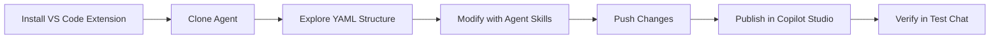

# 🛠️ Lab 05: Clone, Modify, and Republish Agents with the Copilot Studio VS Code Extension

*Manage your agents as code — clone and edit in VS Code, then publish and verify in Copilot Studio.*

| | |
|---|---|
| ⭐ **DIFFICULTY** | Advanced (Level 300) |
| ⏱️ **TIME** | 45 minutes |
| 🧩 **PRODUCTS** | Microsoft Copilot Studio, Visual Studio Code, Copilot Studio VS Code Extension |
| 🏷️ **TAGS** | VS Code, Agent Management, Clone Agent, Publish, Agent Skills, Source Control |
| 🏭 **INDUSTRY** | Energy / Utilities |
| 📋 **STATUS** | Optional |

> **Prerequisite:** You should have a working agent in Copilot Studio — either the Contoso IT Operations Agent from [Lab 01](../01-energy-ops-agent/index.md), the Energy Operations Weather Agent from [Lab 04](../04-energy-weather-agent/index.md), or any agent in your environment.

---

## 🗺️ Lab Flow



---

## ⚡ Why this lab matters

When agents move from proof-of-concept to production, teams need repeatable ways to modify, review, and promote changes. The Copilot Studio extension for VS Code gives you a developer-first workflow:

- **Clone** — pull a full copy of an agent from the cloud into a local VS Code workspace.
- **Modify** — use the Copilot Studio agent skill commands to update topics, descriptions, instructions, and tool configurations without switching to the browser.
- **Publish** — apply changes back to Copilot Studio and publish via the browser.
- **Verify** — confirm changes work using the Copilot Studio test chat in the browser.

This pattern is essential for energy companies with change-management policies, regulated review processes, and multi-environment promotion (dev → staging → production).

---

## 🏗️ What you'll do

| Step | What happens |
|---|---|
| **Clone** | Pull your cloud agent into a local VS Code project |
| **Explore** | Understand the project structure — YAML topics, tools, instructions |
| **Modify** | Use Copilot Studio agent skill commands to change the agent |
| **Publish** | Apply changes back to Copilot Studio and publish via the browser |
| **Verify** | Test the updated agent in the Copilot Studio test chat |

---

## 🎯 Objectives

By the end of this lab, you will be able to:

1. Clone an existing Copilot Studio agent to your local machine using the VS Code extension
2. Navigate the local agent project structure (topics, tools, instructions, metadata)
3. Use Copilot Studio agent skill commands to modify agent components
4. Publish changes back to Copilot Studio from VS Code
5. Verify that your changes are live using the Copilot Studio test chat

---

## ✅ Prerequisites

1. **Visual Studio Code** — installed and up to date
2. **Copilot Studio VS Code Extension** — installed from the VS Code marketplace ([Install guide](https://learn.microsoft.com/en-us/microsoft-copilot-studio/visual-studio-code-extension-install-configure))
3. **Microsoft account** — signed into VS Code with access to a Copilot Studio environment
4. **An existing agent** — at least one agent published in your Copilot Studio environment
5. **GitHub Copilot** *(optional)* — if you want to use Copilot Chat with the Copilot Studio plugin for natural-language editing

---

# 🧪 Use Case #1 — Clone an Agent to VS Code (10 min)

> 🎯 **Objective:** Pull a full copy of your cloud agent into a local VS Code workspace so you can inspect and modify it as files.

### Step 1 — Open VS Code and sign in

1. Open **Visual Studio Code**.
2. If you are not already signed in, sign in with your Microsoft account using the Accounts button in the bottom-left corner.
3. Confirm you see the **Copilot Studio** icon in the Activity Bar (left sidebar). If you don't see it, verify the extension is installed.

### Step 2 — Connect to your Copilot Studio environment

1. Click the **Copilot Studio** icon in the Activity Bar.
2. Select your **environment** from the list.
3. You should see a list of agents available in that environment.

### Step 3 — Clone the agent

1. In the Copilot Studio panel, find the agent you want to clone (for example, **Contoso IT Operations Agent** or **Energy Operations Weather Agent**).
2. Right-click the agent and select **Clone agent** (or use the command palette: `Ctrl+Shift+P` → **Copilot Studio: Clone Agent**).
3. Choose a local folder to save the project.
4. Wait for the clone operation to complete — VS Code will open the agent project.

> 💡 **Tip:** The clone operation pulls down the full agent definition including topics, tools, instructions, knowledge configuration, and metadata. Think of it like `git clone` for your agent.

### Step 4 — Explore the project structure

Once the clone completes, explore the file tree. You should see files and folders for:

| File / folder | What it contains |
|---|---|
| Agent metadata | Agent name, description, and configuration |
| Topics | YAML files defining each topic — descriptions, nodes, messages, and conditions |
| Tools / actions | Tool definitions, HTTP action configurations, and connector references |
| Instructions | The agent's system instructions (system prompt) |

Take a moment to open a few files and understand how the browser-based authoring canvas maps to YAML and configuration files.

> 💡 **Screenshot callout:** Capture the VS Code Explorer showing the cloned agent project structure.

### ✅ You've completed Use Case #1

**Key takeaways**

- Cloning gives you a complete local copy of the agent — every topic, tool, and instruction.
- The project structure maps directly to what you see in the Copilot Studio browser UI.
- Local files can be version-controlled with Git for team collaboration and change tracking.

---

# 🧪 Use Case #2 — Modify the Agent with Agent Skill Commands (20 min)

> 🎯 **Objective:** Use the Copilot Studio agent skill commands in VS Code to make targeted changes to your agent — update topic descriptions, edit instructions, and modify tool configurations.

### Scenario

Your team has decided to:

1. Improve a topic description so the generative AI orchestrator routes to it more accurately.
2. Update the agent's system instructions to add a new behavioral guideline.
3. Modify a tool description to help the planner choose it more effectively.

You'll use the Copilot Studio agent skill commands to make each change.

### Step 1 — Discover available agent skill commands

1. Open the **Command Palette** (`Ctrl+Shift+P`).
2. Type **Copilot Studio** to see all available commands.
3. Take note of the commands related to editing agent components — topics, instructions, tools, and publishing.

Alternatively, if you have **GitHub Copilot** with the **Copilot Studio plugin** installed, you can use Copilot Chat to describe changes in natural language. The plugin can help translate your intent into YAML modifications. This is optional — you can make all changes by editing the YAML files directly.

### Step 2 — Update a topic description

The generative AI orchestrator uses topic descriptions to decide when to trigger each topic. A clear, specific description improves routing accuracy.

1. Pick a topic to improve — for example, a topic that handles a specific user intent.
2. Open the topic's YAML file in the project.
3. Find the `description` field.
4. Update the description to be more specific about **when** this topic should be used and **what kinds of user messages** should trigger it.

**Before (vague):**
```yaml
description: Helps users with account information.
```

**After (clear and thorough):**
```yaml
description: >-
  Use this topic when the user asks about their account details, billing
  history, payment status, or account settings. This includes questions
  like "What's my balance?", "When is my bill due?", or "Update my
  contact information." Do not use for outage reports or service requests.
```

> 💡 **Tip:** Good topic descriptions tell the orchestrator both **when to use** the topic and **when not to use** it. Include example phrases and boundary conditions.

### Step 3 — Edit the agent's system instructions

1. Locate the agent's instructions file in the project (often the main agent YAML or a dedicated instructions file).
2. Add a new behavioral guideline. For example, if your agent serves energy field crews, you might add:

```text
Always confirm the user's service territory before providing location-specific data. Never assume the user's region — always ask.
```

3. Save the file.

### Step 4 — Modify a tool description

Tool descriptions help the orchestrator's planner decide **which tool to call** and **when**. A well-written tool description leads to better tool selection.

1. Open a tool definition file.
2. Find the tool's `description` field.
3. Update it to be more specific about what the tool does, what inputs it expects, and when it should be used.

**Before:**
```yaml
description: Gets the weather.
```

**After:**
```yaml
description: >-
  Retrieves the current MSN Weather conditions (temperature, wind,
  conditions, and "feels like") for a specific location and units.
  Use this tool when the user asks about current conditions in a
  service-territory location for grid-load awareness, outage prep, or
  field-crew safety. Requires `Location` (city + state or ZIP) and
  `Units` (Imperial or Metric) as inputs.
```

### Step 5 — Validate your changes

1. Review the YAML files you edited for syntax errors (watch for indentation, missing colons, and unescaped special characters).
2. If your project has validation built in, run it now.
3. Use the VS Code Problems panel (`Ctrl+Shift+M`) to check for any YAML issues.

> ⚠️ **Important:** YAML is whitespace-sensitive. A misplaced indent can break the entire topic definition. Use VS Code's YAML extension for syntax highlighting and validation.

### ✅ You've completed Use Case #2

**Key takeaways**

- Agent skill commands and direct YAML editing give you precise control over agent behavior.
- Topic descriptions are how you tell the generative AI orchestrator when to trigger each topic — invest time in making them clear and thorough.
- Tool descriptions directly affect the planner's ability to choose the right tool — include purpose, inputs, and boundary conditions.

**Troubleshooting**

- If YAML validation fails, check for special characters that need quoting (colons, quotes, pipe characters).
- If Copilot Chat doesn't recognize the agent skill, make sure the Copilot Studio extension is installed and you are signed in.

---

# 🧪 Use Case #3 — Publish Changes Back to the Cloud (5 min)

> 🎯 **Objective:** Apply your local changes back to Copilot Studio and publish the updated agent.

### Step 1 — Apply changes to Copilot Studio

1. Open the **Command Palette** (`Ctrl+Shift+P`).
2. Run **Copilot Studio: Apply changes** (or the equivalent sync command in your extension version) to upload your modified files to the cloud environment.
3. Wait for the operation to complete.

> 💡 **Tip:** If you get a conflict warning, it means someone (or you in the browser) made changes in Copilot Studio after your clone. Use **Get changes** to pull the latest version first, merge your changes, then apply again.

### Step 2 — Publish the agent

1. After applying changes, open **Copilot Studio** in your browser.
2. Navigate to the agent and select **Publish** to make the changes live.
3. Wait for the publish operation to complete.

### ✅ You've completed Use Case #3

**Key takeaways**

- Applying changes syncs your local edits to the Copilot Studio cloud environment.
- Publishing is done in the Copilot Studio browser UI — it makes the changes live.
- Always use **Get changes** before applying if multiple people work on the same agent.

---

# 🧪 Use Case #4 — Verify Changes in the Copilot Studio Test Chat (10 min)

> 🎯 **Objective:** Confirm that your published changes work correctly by testing the agent in the Copilot Studio test chat.

### Step 1 — Open the test chat

1. Open **Copilot Studio** in your browser.
2. Navigate to the agent you just published.
3. Open the **Test agent** panel (test chat).
4. Select **Reset** or **New chat** to clear any cached conversation state.

### Step 2 — Test the updated topic description

1. Type a message that should trigger the topic you updated.
2. Verify the correct topic fires — check the activity map or conversation trace.
3. Try a message that should **not** trigger this topic and verify it routes elsewhere.

**Example test prompts:**

If you updated a topic for account information:
- ✅ Should trigger: *"What's my current balance?"*
- ✅ Should trigger: *"When is my next bill due?"*
- ❌ Should not trigger: *"Report a power outage on my street"*

### Step 3 — Test the updated system instructions

1. Ask a question that exercises the new behavioral guideline you added.
2. Verify the agent follows the new instruction.

For example, if you added *"Always confirm the user's service territory"*:
- Ask: *"What's the population in my area?"*
- Expected: The agent should ask which service territory or geography you mean, rather than assuming.

### Step 4 — Test the updated tool description

1. Ask a question that should invoke the tool you updated.
2. Verify the tool is selected correctly by checking the activity map.
3. Confirm the tool returns the expected results.

### Step 5 — Document your findings

Record what you tested and the results:

| Change made | Test prompt | Expected behavior | Actual behavior | Pass / Fail |
|---|---|---|---|---|
| Updated topic description | *Your test prompt* | Correct topic triggers | | |
| Updated system instructions | *Your test prompt* | Agent follows new guideline | | |
| Updated tool description | *Your test prompt* | Correct tool selected | | |

> 💡 **Tip:** If something doesn't work as expected, go back to VS Code, adjust the YAML, push, publish, and re-test. This edit → publish → verify loop is the core developer workflow for Copilot Studio agents.

### ✅ You've completed Use Case #4

**Key takeaways**

- Always verify published changes in the test chat before promoting to production.
- The activity map in Copilot Studio shows you exactly which topic fired and which tools were called — use it to debug routing issues.
- The edit → push → publish → test loop in VS Code mirrors standard software development workflows.

**Troubleshooting**

- If the old behavior persists after publishing, reset the test chat and try again — cached state can show stale behavior.
- If the test chat doesn't reflect your changes, verify the publish completed successfully in Copilot Studio.
- If a topic routes incorrectly, revisit the topic description — the orchestrator relies on clear, specific descriptions to make routing decisions.

---

# 🙋 Summary and Next Steps

### What you accomplished

| Step | What you did |
|---|---|
| **Clone** | Pulled a cloud agent to a local VS Code workspace |
| **Explore** | Inspected the YAML project structure for topics, tools, and instructions |
| **Modify** | Used agent skill commands and direct YAML editing to update descriptions, instructions, and tools |
| **Publish** | Applied changes back to Copilot Studio and published via the browser |
| **Verify** | Tested changes in the Copilot Studio test chat and confirmed correct behavior |

### Why this workflow matters for enterprise teams

- **Version control** — with the agent as local files, you can use Git for branching, pull requests, and change history.
- **Code review** — topic descriptions, tool configs, and instructions can go through the same review process as application code.
- **Repeatable promotion** — clone from dev, modify, apply to staging, verify, promote to production. For enterprise multi-environment promotion, use **solutions and ALM pipelines** alongside VS Code for a complete CI/CD story.
- **Auditability** — regulated industries (energy, utilities, finance) require change logs and approval trails. File-based agent management makes this possible.

### Challenge — extend this workflow

- Set up a **Git repository** for your cloned agent and make your first commit.
- Create a **branch** for a new feature (e.g., adding a new topic), make the change in VS Code, apply to Copilot Studio, verify, then merge the branch.
- If your team uses Azure DevOps or GitHub, explore how you could integrate the apply and publish steps into a **CI/CD pipeline** using solutions and ALM pipelines.

> 🔋 **Final thought:** Managing agents as code isn't just a developer convenience — it's how enterprise teams scale from one agent to dozens while maintaining quality and compliance.
