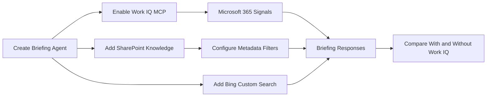

# 🧠 Lab 08: Supercharge Agents with Work IQ and Microsoft 365 Intelligence

*Ground utility agents in the living context of meetings, mail, files, chats, and curated knowledge sources.*

| | |
|---|---|
| ⭐ **DIFFICULTY** | Intermediate (Level 200) |
| ⏱️ **TIME** | 60 minutes |
| 🧩 **PRODUCTS** | Microsoft Copilot Studio, Work IQ, Microsoft 365, SharePoint |
| 🏷️ **TAGS** | Work IQ, Microsoft 365, Knowledge Sources, SharePoint, Contextual Intelligence |
| 🏭 **INDUSTRIES** | Energy / Utilities |

---

## 🗺️ Lab Flow



---

## Overview

A utility operations answer is only as good as the context behind it. Static documents help, but they rarely capture the latest email thread about a substation outage, the current meeting cadence for a rate-case workstream, or the newest operating procedure draft living in SharePoint.
In this lab, you will connect an agent to **Work IQ** so it can reason over **Microsoft 365** signals such as emails, meetings, chats, and files. You will then enrich the solution with **SharePoint** knowledge sources and **Bing Custom Search** for curated public energy content.
The result is an agent that can brief Contoso Energy or Contoso Energy teams with far more situational awareness than a document-only assistant.

---

## 🏗️ What you'll build

| Layer | What you will build |
|---|---|
| **Primary agent** | **Operations Briefing Agent** for utility managers and planners |
| **Work IQ MCP** | Real-time organizational context from Microsoft 365 signals |
| **SharePoint grounding** | Internal procedures, outage reports, and planning artifacts |
| **Metadata filtering** | Targeted retrieval by file name, owner, and modified date |
| **Web grounding** | Curated public energy content through Bing Custom Search |
| **Comparison harness** | Prompts that show the difference with and without Work IQ context |

### Architecture summary

```text
User
  -> Operations Briefing Agent
      -> Work IQ MCP tools for Microsoft 365 context
      -> SharePoint knowledge with scoped retrieval
      -> Bing Custom Search for curated public energy sources
      -> Final grounded operational briefing
```

> 💡 **Tip:** Work IQ is most useful when you ask questions tied to current work patterns, not timeless policy snippets.

---

## Objectives

1. Turn on Work IQ for an agent and understand the licensing and governance prerequisites.
2. Use Microsoft 365 context to improve operational briefings and answer quality.
3. Add SharePoint knowledge sources and metadata-aware retrieval patterns.
4. Add Bing Custom Search for targeted external industry grounding.
5. Compare agent quality with and without Work IQ-enabled context.

---

## 🧠 Core concepts

| Concept | What it means in this lab |
|---|---|
| **Work IQ** | The Microsoft 365 intelligence layer that combines data, memory, and inference for more contextual agent behavior. |
| **MCP tools** | The tool interface Copilot Studio uses to reach Work IQ services. |
| **Shared context** | Signals from files, emails, meetings, chats, and line-of-business data. |
| **SharePoint knowledge** | Graph-backed retrieval over sites and lists the user is allowed to access. |
| **Metadata filters** | Query constraints such as file name, owner, or modified date for more precise answers. |
| **Bing Custom Search** | A scoped web index that replaces broad public website grounding with curated search coverage. |
| **Observability** | Tracing and admin control over available MCP servers and tools. |

---

## 📚 Documentation

- [Work IQ MCP overview](https://learn.microsoft.com/en-us/microsoft-copilot-studio/use-work-iq)
- [Add SharePoint as a knowledge source](https://learn.microsoft.com/en-us/microsoft-copilot-studio/knowledge-add-sharepoint)
- [Add Bing Custom Search as a knowledge source](https://learn.microsoft.com/en-us/microsoft-copilot-studio/knowledge-bing-custom-search)

---

## Prerequisites

- Access to **Microsoft Copilot Studio** and permission to configure tools or knowledge sources.
- A **Microsoft 365 Copilot license** because Work IQ requires Microsoft 365 Copilot licensing.
- At least one SharePoint site that contains internal utility content such as outage playbooks, planning memos, or field guidance.
- Optional but recommended: a curated list of public energy-industry sites you want to include in a Bing Custom Search instance.

> ⚠️ **Warning:** Work IQ guidance in Microsoft Learn is currently preview-oriented. Confirm the feature availability, region support, and governance stance in your tenant before relying on it for production scenarios.

---

## 🗺️ Use cases covered

| # | Section | Time | Required |
|---|---|---|---|
| 1 | Enable Work IQ on your agent | 10 min | ✅ |
| 2 | Ground responses with real-time M365 context | 15 min | ✅ |
| 3 | Add SharePoint metadata filters | 10 min | ✅ |
| 4 | Add Bing Custom Search | 10 min | ✅ |
| 5 | Compare results with and without Work IQ | 15 min | ✅ |

> 💡 **Tip:** Use questions tied to active work—upcoming rate-case meetings, recent outage reviews, or draft documents—to make the value of Work IQ visible quickly.

---

# 🧪 Use Case #1 — Enable Work IQ on your agent (10 min)

> 🎯 **Objective:** Turn on Work IQ so the agent can use Microsoft 365 signals.

### Scenario

A utility operations manager wants a morning briefing agent that understands current work in progress rather than only static documents.

### Step 1 — Review Work IQ prerequisites and governance

1. Open the Microsoft Learn **Work IQ MCP overview** and review the licensing note that a Microsoft 365 Copilot license is required.
2. Read the sections on centralized governance and note that admins can allow or block Work IQ MCP servers in the Microsoft 365 admin center.
3. Document which Work IQ tools are relevant to your scenario, such as mail, calendar, Teams, or custom business connectors surfaced through the platform.
4. Check with your admin team whether Work IQ MCP tools are already activated or whether approval is needed.
5. Record the privacy posture for your pilot so users understand the agent is reasoning over content they are already authorized to access.
6. Move forward only after governance and licensing questions are resolved.


### Step 2 — Create the Operations Briefing Agent

1. Create or open an agent named **Operations Briefing Agent**.
2. In the overview instructions, describe the audience: utility managers, planners, outage coordinators, and program leads.
3. Tell the agent to summarize current work, identify blockers, and cite the most relevant operational artifacts when possible.
4. Keep the instruction tone concise and management-friendly so briefings are easy to paste into email or Teams.
5. Save the agent and verify you can reach its Tools or knowledge configuration areas.
6. Note one or two realistic briefing prompts you plan to test later.


#### Sample prompt for this step

```text
You are an operations briefing assistant for Contoso Energy leaders. Use available Microsoft 365 and enterprise knowledge to summarize current work, recent decisions, key meetings, action items, and relevant files. Keep answers concise, traceable, and useful for outage operations, field readiness, and planning reviews.
```

### Step 3 — Enable Work IQ MCP tools

1. Open the agent's tool configuration surface where Work IQ MCP tools are exposed in your tenant.
2. Add or enable the Work IQ toolset approved by your administrators.
3. Review the available scopes so the agent uses only the required Microsoft 365 context for this scenario.
4. Save the configuration and note any admin-center dependencies if tools remain blocked.
5. Return to the agent overview and add one sentence reminding the agent to prefer current M365 context when the user asks about recent work or meetings.
6. Save again so the instruction and tooling updates land together.


#### Quick verification

- A Microsoft 365 Copilot license exists for the scenario.
- The Work IQ MCP tooling is enabled or approved.
- The agent instructions mention current-work context explicitly.

### Test prompts

Use these prompts in Copilot Studio test chat, the flow test pane, or the voice test panel as appropriate:

```text
Give me a morning briefing on current substation modernization work for the South region.
What recent files, meetings, and messages should I review before the rate-case planning meeting?
```

### Validation checklist

- Work IQ tooling is enabled or at least configured in principle for the agent.
- The agent instructions are aligned to recent-work briefing scenarios.
- Governance dependencies are documented.

### What you accomplished

| Outcome | Why it matters |
|---|---|
| Activated contextual grounding | The agent now has a path to real-time work signals rather than static-only knowledge. |
| Aligned the briefing scenario | The instruction set now targets a realistic operational briefing use case. |
| Captured governance requirements | Licensing and admin approval are explicit instead of hidden assumptions. |

### Key takeaways

- Work IQ is a capability and a governance model at the same time.
- Current-work prompts are where Work IQ value becomes obvious fastest.
- Licensing and admin readiness must be handled early.

### Troubleshooting

- If Work IQ tools do not appear, check admin-center allow/block settings and region availability.
- If the agent ignores M365 context later, strengthen the instruction language around recent work and active collaboration artifacts.

### Evidence to capture

- Save at least one successful run, screenshot, or transcript excerpt for future demos and regression checks.
- Record the configuration choices that most influenced the result, such as descriptions, instructions, model selection, or access settings.
- Note one failure mode or edge case discovered during this use case so the team can retest it later.
- Capture which stakeholder would need to review this capability before broader rollout.

### Improvement ideas

- Add one more regression prompt that stresses this use case from a different angle.
- Decide whether any part of this pattern should become a reusable asset for other agents, flows, or teams.
- Review whether logging, governance, or support ownership need to be tightened before production use.
- Identify the next adjacent scenario you would automate or route now that this use case is working.

### Stakeholder discussion prompts

- What business outcome improves most if this use case becomes a standard operating capability?
- What would make the result more trustworthy to operations, security, or compliance reviewers?
- Which metric should be watched first after rollout to prove this use case is adding value?
- What is the simplest rollback plan if this use case behaves unexpectedly after a change?

### ✅ You've completed Use Case #1

You now have the foundation to move from **a static knowledge agent** to **an agent prepared for live Microsoft 365 context**.

---

# 🧪 Use Case #2 — Ground responses with real-time M365 context (15 min)

> 🎯 **Objective:** Use Work IQ to pull context from emails, meetings, files, and chats.

### Scenario

A Contoso program manager wants to know what happened this week across a wildfire-readiness workstream without digging through Outlook, Teams, and SharePoint manually.

### Step 1 — Define the briefing shape

1. Decide what a good operational briefing should include: recent meetings, active files, unresolved actions, and notable chat or email themes.
2. Write a simple response format that the agent should follow, such as Executive summary, Recent signals, Risks, and Recommended next steps.
3. Add that structure to the agent instructions or use it directly in your test prompts.
4. Decide which timeframe matters most—today, the last 48 hours, or the current week.
5. Keep the format short enough for leaders to scan quickly.
6. Save the structure in your lab notes so you can test consistently.


### Step 2 — Test Microsoft 365 context retrieval

1. Ask the agent for a briefing tied to a real project, meeting series, or operational initiative that has recent Microsoft 365 activity.
2. Review whether the answer references emails, meeting context, files, or chats in a way that feels current and specific.
3. If the answer is too generic, ask a more grounded question that includes a team name, program, district, or meeting name.
4. Compare the answer against what you already know from Outlook or Teams to judge whether the agent surfaced the right themes.
5. Adjust the wording if you need more emphasis on action items or file recency.
6. Capture one high-quality answer for future demos or governance review.


#### Sample prompt for this step

```text
Prepare a concise weekly briefing for the South Region wildfire-readiness program. Include recent meetings, notable emails or chat themes, important files updated this week, risks or blockers, and the top next actions.
```

### Step 3 — Teach the agent to clarify missing business context

1. If a user asks for 'a project update' without naming the program or team, tell the agent to ask which workstream, district, or meeting cadence they mean.
2. Add one sentence to the instructions saying the agent should ask focused clarifying questions before it searches broadly.
3. Test an ambiguous prompt and confirm the agent requests more context instead of returning a vague generic answer.
4. If it still answers vaguely, revise the instructions to penalize shallow briefings without named scope.
5. Document the kinds of identifiers your users typically know, such as feeder name, district, initiative, workstream, or meeting title.
6. Use that list to improve future prompts and starter phrases.


### Test prompts

Use these prompts in Copilot Studio test chat, the flow test pane, or the voice test panel as appropriate:

```text
Summarize everything important from the last week for the grid resilience steering committee.
What are the current blockers and next actions for the EV charging deployment workstream?
I need a briefing before the South Region outage review meeting tomorrow.
```

### Validation checklist

- The agent can produce a structured briefing tied to recent work.
- The answer quality improves when you name a real initiative or meeting context.
- The agent asks clarifying questions when the scope is too broad.

### What you accomplished

| Outcome | Why it matters |
|---|---|
| Validated live context usage | You confirmed the agent can reason over active work rather than only static content. |
| Shaped the briefing format | A repeatable response format makes the output more useful to leaders. |
| Improved ambiguity handling | Clarification reduces shallow, generic summaries. |

### Key takeaways

- Work IQ shines when prompts name active teams, meetings, or initiatives.
- Response format matters as much as retrieval quality.
- Clarifying questions are a feature, not a failure, when the scope is broad.

### Troubleshooting

- If answers remain generic, ask narrower questions tied to named teams or timeframes.
- If the user lacks access to the underlying content, the agent cannot reliably ground the response in it.

### Evidence to capture

- Save at least one successful run, screenshot, or transcript excerpt for future demos and regression checks.
- Record the configuration choices that most influenced the result, such as descriptions, instructions, model selection, or access settings.
- Note one failure mode or edge case discovered during this use case so the team can retest it later.
- Capture which stakeholder would need to review this capability before broader rollout.

### Improvement ideas

- Add one more regression prompt that stresses this use case from a different angle.
- Decide whether any part of this pattern should become a reusable asset for other agents, flows, or teams.
- Review whether logging, governance, or support ownership need to be tightened before production use.
- Identify the next adjacent scenario you would automate or route now that this use case is working.

### Stakeholder discussion prompts

- What business outcome improves most if this use case becomes a standard operating capability?
- What would make the result more trustworthy to operations, security, or compliance reviewers?
- Which metric should be watched first after rollout to prove this use case is adding value?
- What is the simplest rollback plan if this use case behaves unexpectedly after a change?

### ✅ You've completed Use Case #2

You now have the foundation to move from **enabled tooling** to **a working M365-grounded briefing pattern**.

---

# 🧪 Use Case #3 — Add SharePoint metadata filters (10 min)

> 🎯 **Objective:** Use SharePoint knowledge retrieval with metadata-aware filtering for more precise answers.

### Scenario

The operations team stores outage procedures, restoration playbooks, and planning memos in SharePoint. They want the agent to search recent, authoritative files rather than the entire site every time.

### Step 1 — Add the SharePoint site as knowledge

1. Open the agent and select **Add knowledge** from the Overview or Knowledge page.
2. Choose **SharePoint** from the featured knowledge options.
3. Enter the site URL for your operations or planning workspace and add a strong description that explains what content lives there.
4. If you use multiple URLs, separate them with line breaks and keep the descriptions specific.
5. Save the knowledge source and confirm it appears on the agent.
6. Document which content types the site contains, such as post-incident reviews, field procedures, and planning decks.


### Step 2 — Design metadata-driven retrieval prompts

1. Decide which metadata is most useful for your utility scenario: filename, owner, modified date, or perhaps a naming convention used by operations teams.
2. Write prompts that intentionally mention those filters, such as 'latest outage playbook updated this month by the restoration team.'
3. If your site uses lists as well as documents, note whether the answer should prefer list data or document content for certain questions.
4. Test a prompt that emphasizes recency and compare it with a generic prompt that does not mention metadata.
5. Observe whether the more precise prompt returns a better-cited or more relevant answer.
6. Capture examples of effective filter phrasing for your users.


#### Sample prompt for this step

```text
Find the most recently modified outage restoration playbook owned by the South Region operations team and summarize the top three actions for field supervisors.
```

### Step 3 — Combine SharePoint with Work IQ guidance

1. Update the agent instructions to prefer SharePoint documents for formal policy or procedure answers and Work IQ for current collaboration context.
2. Test a question that needs both, such as a current briefing plus the latest formal procedure.
3. Check whether the answer distinguishes between what is live collaboration context and what is from authoritative SharePoint content.
4. If the answer blends the two unclearly, add instruction text that asks the agent to label sources or separate current activity from formal guidance.
5. Save the revised instructions once the distinction is clear.
6. Remind users that SharePoint responses follow their Microsoft authentication and permission boundaries.

> **Note:** Microsoft Learn notes that turning on Work IQ can improve SharePoint retrieval precision, even if latency increases slightly in some cases.

### Test prompts

Use these prompts in Copilot Studio test chat, the flow test pane, or the voice test panel as appropriate:

```text
Summarize the latest distribution outage playbook modified this quarter.
What procedure document updated by the field operations owner should I review before tomorrow's storm drill?
```

### Validation checklist

- The SharePoint site is connected as a knowledge source.
- Metadata-aware prompt phrasing improves answer precision.
- The agent can distinguish formal SharePoint guidance from live Work IQ context.

### What you accomplished

| Outcome | Why it matters |
|---|---|
| Added internal authoritative knowledge | SharePoint now anchors the agent in enterprise documents and lists. |
| Improved retrieval precision | Metadata hints make it easier to target the right content. |
| Balanced live and formal context | The agent can now separate current collaboration signals from official procedure. |

### Key takeaways

- Metadata language in prompts often matters more than people expect.
- SharePoint is for authoritative artifacts; Work IQ is for living work context.
- Combining both requires explicit instruction design.

### Troubleshooting

- If answers seem stale, add recency language such as modified this week or this month.
- If the wrong files appear, improve the knowledge-source description and the prompt specificity.

### Evidence to capture

- Save at least one successful run, screenshot, or transcript excerpt for future demos and regression checks.
- Record the configuration choices that most influenced the result, such as descriptions, instructions, model selection, or access settings.
- Note one failure mode or edge case discovered during this use case so the team can retest it later.
- Capture which stakeholder would need to review this capability before broader rollout.

### Improvement ideas

- Add one more regression prompt that stresses this use case from a different angle.
- Decide whether any part of this pattern should become a reusable asset for other agents, flows, or teams.
- Review whether logging, governance, or support ownership need to be tightened before production use.
- Identify the next adjacent scenario you would automate or route now that this use case is working.

### Stakeholder discussion prompts

- What business outcome improves most if this use case becomes a standard operating capability?
- What would make the result more trustworthy to operations, security, or compliance reviewers?
- Which metric should be watched first after rollout to prove this use case is adding value?
- What is the simplest rollback plan if this use case behaves unexpectedly after a change?

### ✅ You've completed Use Case #3

You now have the foundation to move from **live M365 context only** to **a blended live-plus-authoritative grounding model**.

---

# 🧪 Use Case #4 — Add Bing Custom Search (10 min)

> 🎯 **Objective:** Create a scoped web index for industry-specific public content.

### Scenario

The utility wants the agent to reference only trusted external industry sites, such as NERC, FERC, DOE, CAISO, or selected utility-regulatory resources, rather than the open web.

### Step 1 — Prepare a custom search scope

1. Decide which public websites belong in the curated search index for your scenario, such as grid reliability guidance, regulator announcements, or regional market information.
2. Create or review the Bing Custom Search instance and obtain the **Custom Configuration ID** from the production endpoint view.
3. Make sure the curated source list reflects only approved sites because Bing Custom Search replaces previously added public website knowledge sources.
4. Write down the reason for each included site so governance reviewers understand the scope.
5. Keep the set intentionally small for the first pilot to avoid noisy answers.
6. Share the planned scope with subject-matter experts if they care about source authority.


### Step 2 — Add Bing Custom Search to the agent

1. In Copilot Studio, open the agent and select **Add knowledge**.
2. Choose **Advanced** and then select **Bing Custom Search**.
3. Paste the **Custom Configuration ID** into the configuration field.
4. Save the knowledge source and confirm it is active on the agent.
5. Note that once Bing Custom Search is enabled, broad public website sources are overridden and additional public website knowledge sources cannot be added in parallel.
6. Update your design notes so future makers understand that this agent now uses a curated external web scope.

> ⚠️ **Warning:** Because Bing Custom Search replaces general public website knowledge, make sure you are comfortable with the curated source list before enabling it.

### Step 3 — Test a utility-industry research prompt

1. Ask a question that should benefit from curated external sources, such as a regulatory update, reliability standard interpretation, or market notice summary.
2. Compare the answer with what you would expect from a broad public-web search and note whether the results feel more focused.
3. If the answer lacks the expected site coverage, revisit the Bing Custom Search instance and source list rather than over-editing agent instructions immediately.
4. Record one strong example for future demos and user training.
5. Decide whether the agent should cite external results separately from internal Work IQ or SharePoint content.
6. Save any instruction updates needed to keep external research clearly labeled.


### Test prompts

Use these prompts in Copilot Studio test chat, the flow test pane, or the voice test panel as appropriate:

```text
Summarize the most relevant recent regulatory guidance our distribution planning team should know about.
What recent public reliability guidance is most applicable to utility outage readiness planning?
```

### Validation checklist

- Bing Custom Search is configured with a valid Custom Configuration ID.
- The team understands that this overrides broad public website grounding.
- The agent can answer industry questions using a curated public source scope.

### What you accomplished

| Outcome | Why it matters |
|---|---|
| Added curated external grounding | The agent can now reference approved public industry sources instead of the open web. |
| Scoped external trust boundaries | Governance is stronger because source authority is intentional. |
| Documented override behavior | Future makers will understand why normal public websites are no longer active. |

### Key takeaways

- Curated external search is better than generic public search for regulated scenarios.
- Source scope is a governance decision, not just a technical checkbox.
- You should explain override behavior to anyone who edits the agent later.

### Troubleshooting

- If expected sites are missing, fix the Bing Custom Search configuration rather than stuffing more prompt text into the agent.
- If answers feel too narrow, revisit the curated source list with subject-matter experts.

### Evidence to capture

- Save at least one successful run, screenshot, or transcript excerpt for future demos and regression checks.
- Record the configuration choices that most influenced the result, such as descriptions, instructions, model selection, or access settings.
- Note one failure mode or edge case discovered during this use case so the team can retest it later.
- Capture which stakeholder would need to review this capability before broader rollout.

### Improvement ideas

- Add one more regression prompt that stresses this use case from a different angle.
- Decide whether any part of this pattern should become a reusable asset for other agents, flows, or teams.
- Review whether logging, governance, or support ownership need to be tightened before production use.
- Identify the next adjacent scenario you would automate or route now that this use case is working.

### Stakeholder discussion prompts

- What business outcome improves most if this use case becomes a standard operating capability?
- What would make the result more trustworthy to operations, security, or compliance reviewers?
- Which metric should be watched first after rollout to prove this use case is adding value?
- What is the simplest rollback plan if this use case behaves unexpectedly after a change?

### ✅ You've completed Use Case #4

You now have the foundation to move from **internal-only grounding** to **a blended internal-plus-curated external intelligence pattern**.

---

# 🧪 Use Case #5 — Compare results with and without Work IQ (15 min)

> 🎯 **Objective:** Run the same prompts and observe the quality improvement when Work IQ is enabled.

### Scenario

Stakeholders often ask whether Work IQ is worth the added governance and licensing complexity. The clearest answer is a side-by-side comparison using the same operational prompts.

### Step 1 — Choose a representative test set

1. Select three to five prompts that depend on current work context, such as weekly project briefings, upcoming meeting prep, or identifying the newest relevant file.
2. Select one or two prompts that are mostly document-based so you can see where Work IQ adds less value.
3. Write the expected outcome for each prompt before testing so you have a fair comparison standard.
4. Reset the chat between tests if needed to avoid prior-turn context leakage.
5. If possible, capture screenshots of both answer sets for stakeholder discussion.
6. Use utility-specific scenarios rather than generic sample prompts.


### Step 2 — Run the prompts with Work IQ enabled

1. Ask each prompt and capture the answer.
2. Note whether the answer references current meetings, recent files, or collaboration signals that would be hard to infer from SharePoint alone.
3. Score each answer for specificity, freshness, usefulness, and actionability.
4. Watch for any latency increase and record it honestly.
5. Mark whether citations or references to internal content felt clearer with Work IQ present.
6. Store the results in a simple comparison table.


### Step 3 — Run the same prompts with Work IQ disabled or ignored

1. Temporarily disable the Work IQ tools if your environment allows, or use a comparable agent that lacks Work IQ but shares the same SharePoint knowledge configuration.
2. Run the same prompts in the same order and capture the answers.
3. Score the answers using the exact same rubric so the comparison is fair.
4. Highlight where the non-Work-IQ version becomes generic, stale, or unable to reference current collaboration context.
5. Also note where the answers are effectively the same because the question is already well-covered by static knowledge.
6. Bring the two result sets together for review.


#### Quick verification

- Same prompts used in both modes.
- Same scoring rubric used in both modes.
- Both stronger and weaker cases for Work IQ documented honestly.

### Test prompts

Use these prompts in Copilot Studio test chat, the flow test pane, or the voice test panel as appropriate:

```text
Prepare me for tomorrow's South Region outage review using the latest meetings, files, and unresolved actions.
What is the latest field-restoration procedure I should review before the storm drill?
Summarize the current status of the EV charging deployment workstream.
```

### Validation checklist

- The team has a side-by-side comparison set.
- Work IQ value is visible on current-work prompts.
- The team also understands where SharePoint-only knowledge is already sufficient.

### What you accomplished

| Outcome | Why it matters |
|---|---|
| Created a business-facing proof point | Comparisons make it easier to explain why contextual grounding matters. |
| Scored quality systematically | A simple rubric prevents subjective debates from dominating the decision. |
| Identified high-value scenarios | You now know which prompts benefit most from Work IQ. |

### Key takeaways

- Work IQ is not magic; it is most valuable when the question depends on current work reality.
- Static knowledge still matters and often remains the best answer source for formal procedures.
- Side-by-side evaluations create stronger stakeholder buy-in than feature descriptions alone.

### Troubleshooting

- If the answers look the same, your prompts may not depend enough on current collaboration context.
- If Work IQ adds noise, narrow the prompt scope or clarify the briefing format.

### Evidence to capture

- Save at least one successful run, screenshot, or transcript excerpt for future demos and regression checks.
- Record the configuration choices that most influenced the result, such as descriptions, instructions, model selection, or access settings.
- Note one failure mode or edge case discovered during this use case so the team can retest it later.
- Capture which stakeholder would need to review this capability before broader rollout.

### Improvement ideas

- Add one more regression prompt that stresses this use case from a different angle.
- Decide whether any part of this pattern should become a reusable asset for other agents, flows, or teams.
- Review whether logging, governance, or support ownership need to be tightened before production use.
- Identify the next adjacent scenario you would automate or route now that this use case is working.

### Stakeholder discussion prompts

- What business outcome improves most if this use case becomes a standard operating capability?
- What would make the result more trustworthy to operations, security, or compliance reviewers?
- Which metric should be watched first after rollout to prove this use case is adding value?
- What is the simplest rollback plan if this use case behaves unexpectedly after a change?

### ✅ You've completed Use Case #5

You now have the foundation to move from **a configured contextual agent** to **an evidence-backed contextual intelligence story**.

---

# 🙋 Summary

### What you accomplished

| Step | What you did |
|---|---|
| **Enable** | Turned on Work IQ readiness for a Microsoft 365-grounded briefing agent |
| **Ground** | Used Microsoft 365 context for current-work briefings |
| **Refine** | Added SharePoint grounding with metadata-aware prompt design |
| **Curate** | Configured Bing Custom Search for trusted external energy content |
| **Prove value** | Compared answer quality with and without Work IQ context |

### Why this matters for energy and utilities

- Utility work changes daily; grounded answers must keep up with live collaboration, not just static documents.
- Work IQ helps bridge the gap between enterprise knowledge and what teams are actively doing right now.
- Curated internal and external grounding reduces both generic answers and unsafe open-web behavior.

### Recommended next steps

- Create a reusable set of leadership-briefing prompts for storm readiness, wildfire response, and capital planning.
- Partner with administrators to review Work IQ MCP allow/block settings in Microsoft 365 admin center.
- Experiment with role-specific agent instructions for planners, outage managers, and regulatory teams.

> 🔋 **Final thought:** The best operations briefings feel less like search results and more like a trusted teammate who actually knows what the organization is working on.

---

## 📎 Appendix A — Suggested facilitation prompts

Use these prompts to guide discussion during a live workshop, customer briefing, or internal enablement session.

- Which of our recurring utility meetings would benefit most from a prebuilt Work IQ briefing prompt?
- What SharePoint naming conventions should we standardize so metadata-aware prompts work better?
- Which public energy websites are authoritative enough to include in a curated external search scope?
- Where do we need stronger user guidance so people know when to ask for live context versus formal policy?
- What latency increase, if any, is acceptable for a richer briefing answer?

## 📎 Appendix B — Environment readiness checklist

- Microsoft 365 Copilot license is available.
- Work IQ tools are allowed in the tenant or a request path exists.
- SharePoint site URLs and ownership details are known.
- A curated public-source shortlist exists for Bing Custom Search.
- Comparison prompts are ready before the stakeholder demo.
- Privacy and permission expectations are documented for pilot users.

## 📎 Appendix C — Extension ideas

- Create separate prompt packs for outage command, planning leadership, and field operations managers.
- Add a flow that writes the morning briefing into Teams or Outlook automatically.
- Measure how often Work IQ-based briefings reduce follow-up manual searching by pilot users.

## 📎 Appendix D — Demo prompt bank

Use these copy-paste prompts when you want a quick demonstration set for the lab.

- Give me a morning briefing on current substation modernization work for the South region.
- What recent files, meetings, and messages should I review before the rate-case planning meeting?
- Summarize everything important from the last week for the grid resilience steering committee.
- What are the current blockers and next actions for the EV charging deployment workstream?
- I need a briefing before the South Region outage review meeting tomorrow.
- Summarize the latest distribution outage playbook modified this quarter.
- What procedure document updated by the field operations owner should I review before tomorrow's storm drill?
- Summarize the most relevant recent regulatory guidance our distribution planning team should know about.
- What recent public reliability guidance is most applicable to utility outage readiness planning?
- Prepare me for tomorrow's South Region outage review using the latest meetings, files, and unresolved actions.
- What is the latest field-restoration procedure I should review before the storm drill?
- Summarize the current status of the EV charging deployment workstream.

## 📎 Appendix E — Change control checklist

- Record the feature, tool, or topic version before making edits.
- Retest at least one known-good prompt after every significant change.
- Capture screenshots or transcripts for any issue you escalate.
- Review security and access implications whenever you add a new data source or tool.
- Document the owner of every integration, flow, or connected agent used in the lab.
- Use a limited pilot audience before broad rollout.
- Define rollback steps before enabling a new capability in production-like environments.
- Revisit retention and logging settings whenever you expand scope.
- Store prompt or instruction changes in version control or change records where possible.
- Schedule a follow-up review after the pilot to decide what should be hardened, simplified, or retired.

## 📎 Appendix F — Vocabulary quick reference

- Work IQ: The Microsoft 365 intelligence layer that combines data, memory, and inference for more contextual agent behavior.
- MCP tools: The tool interface Copilot Studio uses to reach Work IQ services.
- Shared context: Signals from files, emails, meetings, chats, and line-of-business data.
- SharePoint knowledge: Graph-backed retrieval over sites and lists the user is allowed to access.
- Metadata filters: Query constraints such as file name, owner, or modified date for more precise answers.
- Bing Custom Search: A scoped web index that replaces broad public website grounding with curated search coverage.

## 📎 Appendix G — Use-case review worksheet

### Use Case #1 — Enable Work IQ on your agent

- Objective review: Turn on Work IQ so the agent can use Microsoft 365 signals.
- Success evidence to collect: Work IQ tooling is enabled or at least configured in principle for the agent.
- Most important takeaway: Work IQ is a capability and a governance model at the same time.
- Most likely support issue: If Work IQ tools do not appear, check admin-center allow/block settings and region availability.
- Suggested next enhancement: Licensing and admin readiness must be handled early.

### Use Case #2 — Ground responses with real-time M365 context

- Objective review: Use Work IQ to pull context from emails, meetings, files, and chats.
- Success evidence to collect: The agent can produce a structured briefing tied to recent work.
- Most important takeaway: Work IQ shines when prompts name active teams, meetings, or initiatives.
- Most likely support issue: If answers remain generic, ask narrower questions tied to named teams or timeframes.
- Suggested next enhancement: Clarifying questions are a feature, not a failure, when the scope is broad.

### Use Case #3 — Add SharePoint metadata filters

- Objective review: Use SharePoint knowledge retrieval with metadata-aware filtering for more precise answers.
- Success evidence to collect: The SharePoint site is connected as a knowledge source.
- Most important takeaway: Metadata language in prompts often matters more than people expect.
- Most likely support issue: If answers seem stale, add recency language such as modified this week or this month.
- Suggested next enhancement: Combining both requires explicit instruction design.

### Use Case #4 — Add Bing Custom Search

- Objective review: Create a scoped web index for industry-specific public content.
- Success evidence to collect: Bing Custom Search is configured with a valid Custom Configuration ID.
- Most important takeaway: Curated external search is better than generic public search for regulated scenarios.
- Most likely support issue: If expected sites are missing, fix the Bing Custom Search configuration rather than stuffing more prompt text into the agent.
- Suggested next enhancement: You should explain override behavior to anyone who edits the agent later.

### Use Case #5 — Compare results with and without Work IQ

- Objective review: Run the same prompts and observe the quality improvement when Work IQ is enabled.
- Success evidence to collect: The team has a side-by-side comparison set.
- Most important takeaway: Work IQ is not magic; it is most valuable when the question depends on current work reality.
- Most likely support issue: If the answers look the same, your prompts may not depend enough on current collaboration context.
- Suggested next enhancement: Side-by-side evaluations create stronger stakeholder buy-in than feature descriptions alone.

## 📎 Appendix H — Facilitator retrospective questions

- Which part of the lab delivered the clearest business value signal?
- Where did learners need the most clarification or setup help?
- Which configuration step should be templatized for future workshops?
- What governance question came up repeatedly during testing?
- Which scenario felt most production-ready by the end of the lab?
- Which scenario should stay in pilot or preview status longer?
- What data, screenshot, or transcript artifact should be saved as a future teaching example?
- What would you simplify if you had to teach this lab in half the time?

## 📎 Appendix I — Role-based adaptation ideas

- For utility executives: shorten outputs into briefing bullets and decision-oriented summaries.
- For operations managers: emphasize current blockers, exceptions, and next actions.
- For field supervisors: simplify the language and foreground immediate procedural steps.
- For analysts: retain more detail, numeric evidence, and traceability to underlying sources.
- For compliance reviewers: elevate logging, retention, consent, and approval checkpoints.
- For helpdesk or contact-center leads: prioritize repeatability, escalation clarity, and support runbooks.

## 📎 Appendix J — Final quality gate

- At least one successful end-to-end scenario has been recorded.
- At least one edge case or failure path has been tested deliberately.
- Descriptions, instructions, and prompts are understandable to a reviewer who did not build the solution.
- Ownership is documented for every connected service, flow, tool, or knowledge source.
- A rollback or disable path exists before broader rollout.
- The pilot audience and feedback loop are defined.

## 📎 Appendix K — Quick demo script

- Start with the business problem in one sentence.
- Show the core happy-path scenario end to end.
- Show one failure or edge case and how the solution handles it.
- Explain the governance or support controls that make the scenario enterprise-ready.
- Close with the next step you would pilot in the real organization.
