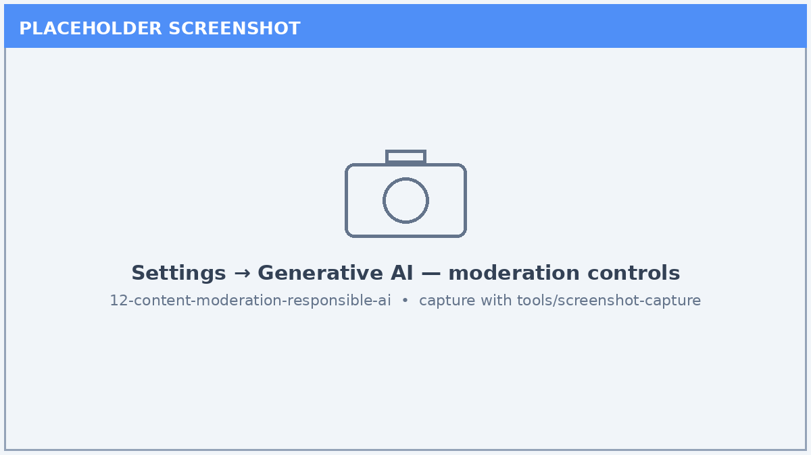
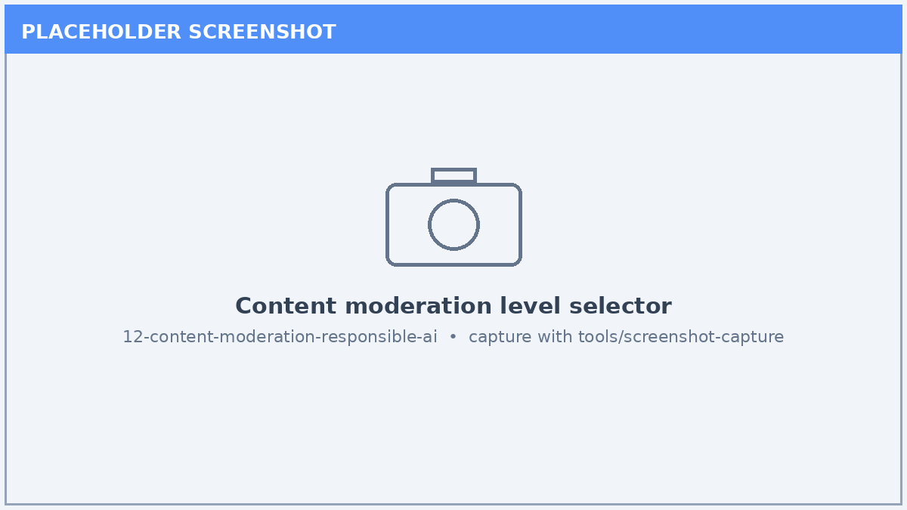
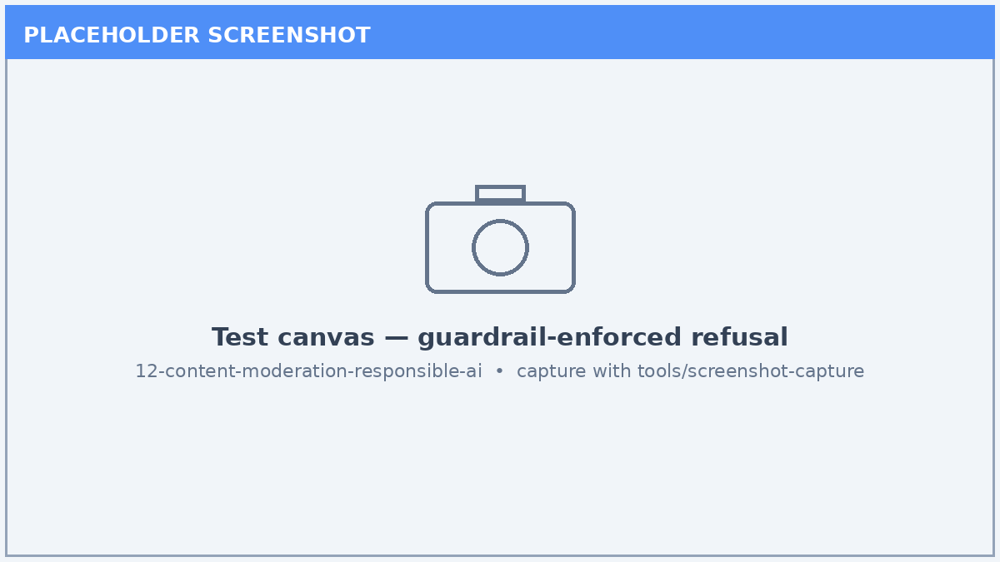

# Lab 12: Content Moderation, Guardrails & Responsible AI

*Configure moderation, grounding, and safety boundaries so your agent answers responsibly and predictably.*

| | |
|---|---|
| ⭐ **DIFFICULTY** | Intermediate (200) |
| ⏱️ **TIME** | 45 minutes |
| 🧩 **PRODUCTS** | Microsoft Copilot Studio |
| 🏷️ **TAGS** | Responsible AI, Content Moderation, Guardrails, Grounding, Safety |
| 🏭 **INDUSTRIES** | Cross-industry |

---

## Overview

A capable agent must also be a **safe** agent. In this lab you configure Copilot Studio's **content moderation** controls, tighten **grounding** so the agent stays on approved knowledge, and define explicit **safety boundaries** in the agent's instructions. You then validate that the guardrails actually hold by testing out-of-scope and adversarial prompts.

## 🎯 Learning Objectives

1. Locate and adjust **content moderation** levels in Generative AI settings.
2. Constrain answers to approved knowledge with **grounding** controls.
3. Author explicit **safety and scope boundaries** in agent instructions.
4. Test refusal behavior with out-of-scope and adversarial prompts.
5. Document a lightweight **Responsible AI** review checklist for the agent.

## Prerequisites

- A Copilot Studio agent with at least one knowledge source.
- Permission to edit Generative AI settings.
- A short list of in-scope and out-of-scope example questions.

## Step-by-Step

### Step 1 — Review Generative AI settings

1. Open your agent and go to **Settings → Generative AI**.
2. Review the available **content moderation** and response controls.
3. Note the current moderation level and grounding options.

### Step 2 — Set the content moderation level

1. Adjust the **content moderation** level to a stricter setting.
2. Understand the tradeoff: higher moderation reduces risky output but may refuse more borderline requests.
3. Save the change.

### Step 3 — Constrain grounding

1. Enable settings that keep answers grounded in your **selected knowledge** only.
2. Disable general web/world knowledge if the scenario requires source-bound answers.
3. Confirm citations are returned for grounded responses.

### Step 4 — Author safety boundaries

1. In the agent **Instructions**, add explicit scope and refusal rules (what the agent must not do).
2. Specify escalation language for requests outside its domain.
3. Save and publish the updated instructions.

### Step 5 — Test the guardrails

1. In the **Test** pane, submit an in-scope question and confirm a grounded, cited answer.
2. Submit an out-of-scope or adversarial prompt and confirm a safe refusal.
3. Capture the refusal transcript for your review record.

## ✅ Validation / Success Criteria

- Content moderation is set intentionally and saved.
- The agent answers in-scope questions with citations from approved knowledge.
- The agent safely refuses or redirects at least two out-of-scope prompts.
- You documented a short Responsible AI review checklist.

## ✅ Lab Complete

Your agent now behaves **responsibly and predictably**, staying within its approved knowledge and safely declining out-of-scope requests. These guardrails are prerequisites for any production rollout.

**Suggested next labs:**

- [Lab 08: Agent Evaluations (GA)](../08-agent-evaluations-ga/index.md) — measure quality and catch regressions.
- [Lab 35: Data Loss Prevention (DLP) & Governance Policies](../35-dlp-governance-policies/index.md) — extend safety to tenant-level governance.

> 🔗 **Related lab:** [Lab 07: Monitor Performance and Evaluate Contoso Agent Quality](../07-agent-analytics-evaluations/index.md) — verify guardrails hold over time with evaluations.

---

*Screenshots in this lab are placeholders. Capture live images with the [screenshot tool](../../tools/screenshot-capture/) (`shots.json` is wired for this lab).*
