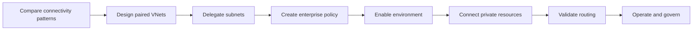

# 🔒 Lab 15: Azure VNet & Private Connectivity for Power Platform

*Route Power Platform traffic through your private network so Copilot Studio can reach regulated enterprise systems without opening them to the public internet.*

| | |
|---|---|
| ⭐ **DIFFICULTY** | Advanced (Level 300) |
| ⏱️ **TIME** | 90 minutes |
| 🧩 **PRODUCTS** | Microsoft Copilot Studio, Azure Virtual Network, Power Platform, Azure Private Link |
| 🏷️ **TAGS** | VNet, Private Connectivity, Subnet Delegation, Enterprise Policy, Managed Environment, Hybrid |
| 🏭 **INDUSTRY** | Financial Services, Healthcare, and any enterprise with private network requirements |

---

## 🗺️ Lab Flow



---

## ⚡ Why this lab matters

Copilot Studio projects often start with public SaaS endpoints.
That is fine for demos.
It is not fine for every enterprise.
Banks, insurers, healthcare providers, and regulated manufacturers regularly keep APIs, databases, secrets, and file stores behind private IP space.
They need Power Platform to reach those systems without exposing them to the internet.

Azure Virtual Network support for Power Platform solves that architectural gap.
It uses Azure subnet delegation so supported Power Platform runtime traffic leaves through your delegated subnet.
That lets your environment reach private resources such as Azure SQL, SQL Server, Azure Key Vault, Azure Blob Storage, Snowflake, Databricks, and private web APIs.
It also lets your security team apply routing, firewall, DNS, and egress controls in a familiar Azure networking model.

For Copilot Studio makers, this matters because an agent is only as useful as the systems it can reach.
If your agent needs to pull account data from a private API, store audit logs in a secured database, or retrieve secrets from Key Vault, you need a private connectivity strategy.
This lab helps you understand when to use Azure VNet support, when to use a VNet data gateway, and how to avoid the common mistakes that break outbound calls after you flip the environment into delegated networking.

---

## 🌍 Real-world example

A regional bank wants a Copilot Studio agent to help operations analysts retrieve payment exception data.
The payment records live in Azure SQL behind a private endpoint.
Secrets are stored in Azure Key Vault.
A fraud enrichment API is reachable only through the bank's hub-and-spoke network.
The architecture team rejects any solution that requires public allowlists.

The bank creates a managed Power Platform environment.
It delegates paired Azure subnets in **eastus** and **westus**.
It creates an enterprise policy and links the environment.
The custom connector that powers the Copilot Studio agent now resolves the private DNS name for Azure SQL and reaches the database over the bank's virtual network.
The same environment also accesses Key Vault through private link.
After testing, the bank adds monitoring and a NAT gateway strategy so public destinations that are still required remain controlled.

That is the pattern you will practice in this lab.

---

## 🎯 What you will learn

By the end of this lab you will be able to:

1. ✅ Explain the difference between an on-premises data gateway, a VNet data gateway, and Azure VNet support for Power Platform.
2. ✅ Identify which Power Platform services currently support Azure subnet delegation.
3. ✅ Plan paired virtual networks and delegated subnets for a Power Platform environment.
4. ✅ Estimate subnet size for production and nonproduction environments.
5. ✅ Create delegated subnets by using the **Microsoft.PowerPlatform.EnterprisePolicies** PowerShell module.
6. ✅ Create an enterprise policy and link it to a managed environment.
7. ✅ Connect Copilot Studio tools and custom connectors to private resources such as Azure SQL, Key Vault, and Snowflake.
8. ✅ Recognize how private routing affects all supported outbound calls from the environment.
9. ✅ Troubleshoot broken public endpoint dependencies, DNS issues, and connector failures after delegation.
10. ✅ Build a governance checklist for operations, licensing, monitoring, and change control.

---

## 🧠 Core concepts overview

| Concept | What it means in this lab |
|---|---|
| **Azure VNet support for Power Platform** | A Power Platform environment feature that uses delegated Azure subnets so supported outbound runtime traffic flows through your virtual network. |
| **Enterprise policy** | The Azure resource that binds one or two delegated virtual networks to Power Platform networking for a geography. |
| **Managed Environment** | A prerequisite for enabling Azure VNet support for Power Platform. |
| **Region pair** | Many geographies require two Azure regions, such as **eastus** and **westus** for United States environments, to support failover. |
| **Delegated subnet** | A subnet dedicated to **Microsoft.PowerPlatform/enterprisePolicies**. You can't reuse the same delegated subnet in multiple enterprise policies. |
| **Private endpoint** | An Azure Private Link endpoint that lets services such as Azure SQL, Key Vault, or Storage stay off the public internet while still being reachable over private IP. |
| **VNet data gateway** | A separate managed gateway pattern used primarily for Fabric, Power BI, and Power Platform dataflows rather than general Power Platform runtime outbound calls. |
| **NAT gateway** | An optional egress control for internet-bound traffic from delegated subnets. It helps you secure and monitor outbound access when some endpoints remain public. |
| **Custom DNS** | DNS configured on the delegated virtual network. Power Platform uses it to resolve the private endpoints your connectors and plug-ins call. |
| **Blast radius** | Because all supported outbound calls route through the delegated subnet, a networking mistake can affect many connectors at once. |

---

## 📚 Documentation

- [Virtual Network support overview for Power Platform](https://learn.microsoft.com/en-us/power-platform/admin/vnet-support-overview)
- [Set up virtual network support for Power Platform](https://learn.microsoft.com/en-us/power-platform/admin/vnet-support-setup-configure)
- [What is a virtual network (VNet) data gateway](https://learn.microsoft.com/en-us/data-integration/vnet/overview)
- [Monitor Azure Virtual Network](https://learn.microsoft.com/en-us/azure/virtual-network/monitor-virtual-network)
- [Azure Private Endpoint overview](https://learn.microsoft.com/en-us/azure/private-link/private-endpoint-overview)
- [Azure NAT Gateway overview](https://learn.microsoft.com/en-us/azure/nat-gateway/nat-overview)
- [Custom connectors overview](https://learn.microsoft.com/en-us/connectors/custom-connectors/)
- [Azure Key Vault connector reference](https://learn.microsoft.com/en-us/connectors/keyvault/)
- [Snowflake connector reference](https://learn.microsoft.com/en-us/connectors/snowflakev2/)
- [HTTP with Microsoft Entra ID connector reference](https://learn.microsoft.com/en-us/connectors/webcontents/)

---

## ✅ Prerequisites

- A **Managed Environment** in Power Platform.
- Access to **Microsoft Copilot Studio** and **Power Platform admin** capabilities.
- An Azure subscription where you can create virtual networks, subnets, private endpoints, and enterprise policies.
- Role coverage for both Azure and Power Platform:
  - **Network Contributor** or equivalent in Azure.
  - **Power Platform Administrator** in the tenant.
- A test resource reachable privately, such as **Azure SQL**, **Azure Key Vault**, **Azure Blob Storage**, **Snowflake**, or a private web API.
- Familiarity with basic Azure networking concepts such as VNets, subnets, private endpoints, DNS, and NSGs.

> ⚠️ **Important:** Trial environments and Dataverse for Teams environments do **not** support Azure VNet support for Power Platform.

> ⚠️ **Important:** Low-code Dataverse plug-ins that depend on connector types not yet updated for subnet delegation are still a limitation.

> 💡 **Licensing note:** Managed environments are required. In many organizations they are enabled through Power Apps Premium, Power Automate Premium, or a standalone managed-environment capability. Premium licenses also matter for the connectors you use inside the environment.

### Environment support quick check

| Environment type | Supported for Azure VNet support? |
|---|---|
| Production | Yes |
| Default | Yes |
| Sandbox | Yes |
| Developer | Yes |
| Trial | No |
| Dataverse for Teams | No |

### Pricing and licensing quick reference

| Item | Typical guidance for this lab |
|---|---|
| Power Apps Premium | Commonly used when makers need premium connectors and managed environment capabilities. |
| Power Automate Premium | Commonly used when flows or connector-backed automations participate in the solution. |
| Managed Environment requirement | Required for Azure VNet support for Power Platform. |
| Copilot Studio | Requires tenant and user licensing plus Copilot credits billing models applicable to your tenant. |
| Azure networking costs | Plan for VNets, private endpoints, private DNS, NAT gateway, Azure Firewall, and data egress where applicable. |

---

## 🗺️ Use cases covered

| # | Use Case | What you will do | Time |
|---|---|---|---|
| 1 | Understand VNet architecture | Compare on-premises gateway, VNet data gateway, and Azure VNet support for Power Platform | 20 min |
| 2 | Configure Azure VNet for Power Platform | Build paired VNets, delegate subnets, create an enterprise policy, and enable an environment | 25 min |
| 3 | Connect Copilot Studio to private resources | Use VNet-enabled connectors and custom connectors to reach Azure SQL, Key Vault, or Snowflake | 25 min |
| 4 | Governance and operations | Estimate subnet size, monitor traffic, troubleshoot failures, and build a security review checklist | 20 min |

---

# 🧪 Use Case #1 — Understand VNet Architecture

> 🎯 **Objective:** Compare the three most common private connectivity patterns so you choose the right one for each Copilot Studio and Power Platform scenario.

### Scenario

Your architecture team keeps hearing three terms:
**on-premises data gateway**,
**VNet data gateway**,
and **Azure VNet support for Power Platform**.
They sound related.
They are not interchangeable.
Before you build anything, you need a crisp decision framework.

### Step 1 — Compare the patterns at a glance

1. Review the primary purpose of each pattern.
2. Note that the **on-premises data gateway** is the classic bridge for on-premises data sources.
3. Note that the **VNet data gateway** is a managed gateway focused on Fabric, Power BI semantic models, paginated reports, and Power Platform dataflows.
4. Note that **Azure VNet support for Power Platform** is the runtime outbound connectivity pattern for supported connectors and Dataverse plug-ins in a Power Platform environment.
5. Record that Copilot Studio tool calls backed by supported connectors benefit from Azure VNet support when the environment is delegated.

| Pattern | Best fit | Key limitation |
|---|---|---|
| On-premises data gateway | On-prem or network-isolated data sources that need the gateway pattern | Not the preferred pattern for general Azure-subnet-delegated Power Platform runtime traffic |
| VNet data gateway | Fabric, Power BI, and Power Platform dataflows in Azure VNet scenarios | Not the primary answer for general connector and plug-in runtime calls from a Power Platform environment |
| Azure VNet support for Power Platform | Supported connector and Dataverse plug-in outbound calls from managed environments | Requires managed environment, delegated subnets, and careful review of all outbound dependencies |

> 💡 **Tip:** If the scenario is a Copilot Studio agent calling a supported connector from a managed Power Platform environment, start by evaluating Azure VNet support before defaulting to a gateway.

### Step 2 — Understand the runtime path

1. Draw a simple architecture with four blocks:
   - User or channel.
   - Copilot Studio agent.
   - Power Platform environment runtime.
   - Private resource in Azure or on-premises through enterprise networking.
2. Mark the delegated subnet as the path used by supported outbound calls.
3. Add private endpoints or peering where needed for the target services.
4. Add DNS as a first-class dependency, not an afterthought.
5. Mark internet-bound dependencies separately so you can decide whether to allow them, proxy them, or replace them.

```text
User -> Copilot Studio agent -> Power Platform runtime -> Delegated subnet -> Private endpoint / peered network -> Target service
```

### Step 3 — Match common scenarios to the right approach

1. Map a **private Azure SQL** lookup for account records to Azure VNet support for Power Platform.
2. Map a **Power BI semantic model refresh** inside a VNet to VNet data gateway.
3. Map a **legacy on-premises SQL Server** connection without broader subnet delegation requirements to an on-premises data gateway or a network strategy that brings the endpoint into the VNet.
4. Map a **Dataverse plug-in** that calls Key Vault privately to Azure VNet support.
5. Map a **dataflow ingestion job** to VNet data gateway.

### Step 4 — Review supported services and environment types

1. Confirm that Microsoft documents GA support for these runtime patterns in delegated environments:
   - Dataverse plug-ins.
   - SQL Server.
   - Azure SQL Data Warehouse.
   - Azure Queues.
   - Custom connectors.
   - Azure Key Vault.
   - Azure File Storage.
   - Azure Blob Storage.
   - HTTP with Microsoft Entra ID.
   - Snowflake.
   - Databricks.
   - Azure AI Search knowledge scenarios.
2. Confirm that supported environment types include **Production**, **Default**, **Sandbox**, and **Developer**.
3. Confirm that **Trial** and **Dataverse for Teams** are not supported.

> ⚠️ **Warning:** The support list is not the same as “every connector in the platform.” Always verify the connector or pattern you depend on before you promise a private networking design.

### Step 5 — Identify architecture gotchas early

1. Write down every outbound endpoint your existing solution uses.
2. Mark which of those endpoints are currently public.
3. Mark which endpoints will become private endpoints.
4. Mark which dependencies belong to ISV plug-ins or external connector definitions.
5. Flag any flow, plug-in, or connector that hardcodes a public DNS name you plan to replace.
6. Decide whether you need a NAT gateway for controlled internet-bound egress.

### Validation checklist

- You can explain the difference between the three private connectivity patterns.
- You know why DNS and private endpoints matter as much as the delegated subnet itself.
- You have a preliminary dependency list for the environment.

### Troubleshooting

- If your team keeps mixing up VNet data gateway and Azure VNet support, separate the decision by workload type: **data movement and BI** versus **Power Platform runtime outbound calls**.
- If the architecture diagram ignores DNS, assume the first test run will fail.
- If multiple teams own connectors, ask each team to inventory public endpoints before delegation.

### Challenge

Create a one-page decision matrix for your organization with three columns:
**Pattern**,
**Use it when**,
and **Avoid it when**.
Then classify five real integrations from your environment.

### ✅ You've completed Use Case #1

You now have a decision model for private connectivity instead of a vague “use a gateway somewhere” approach.

---

# 🧪 Use Case #2 — Configure Azure VNet for Power Platform

> 🎯 **Objective:** Build the core delegated-network configuration by using paired Azure VNets, delegated subnets, an enterprise policy, and environment enablement.

### Scenario

You are enabling a United States Power Platform environment for private outbound connectivity.
Because United States uses paired regions, you must prepare Azure networking in **eastus** and **westus**.
You also need subnet sizing that can handle the expected workload.

### Step 1 — Plan address space and subnet size

1. Identify whether the target environment is production or nonproduction.
2. Use Microsoft guidance as your starting point:
   - **Production:** allocate roughly **25-30 IPs** per environment.
   - **Nonproduction:** allocate roughly **6-10 IPs** per environment.
3. Add the five Azure-reserved IPs when calculating subnet size.
4. If multiple environments will share the same enterprise policy, size the delegated subnet for the combined demand.
5. Choose a CIDR block that leaves headroom for bursts and future environments.

| Example | Formula | Result |
|---|---|---|
| 4 production environments | (4 x 30) + 5 reserved | 125 IPs -> **/25** |
| 20 sandbox/developer environments | (20 x 10) + 5 reserved | 205 IPs -> **/24** |

> 💡 **Tip:** Oversizing a delegated subnet is usually cheaper than emergency redesign after you onboard more environments.

### Step 2 — Create paired virtual networks in the correct regions

1. Confirm the Power Platform geography.
2. For a **United States** environment, plan Azure resources in **eastus** and **westus**.
3. Create one VNet in each required region.
4. Create one delegated subnet in each VNet with matching capacity.
5. If your private resources live elsewhere, plan **VNet peering** or enterprise routing from these regional VNets to the actual workload networks.

> ⚠️ **Warning:** The delegated VNet must align with the supported Azure region pair for the Power Platform environment geography.

### Step 3 — Install and import the PowerShell module

1. Open **Windows PowerShell** or **PowerShell Core** with sufficient rights.
2. Install the required module.
3. Import the module into the session.
4. If your security team uses an internal PowerShell repository, approve that source before installation.

```powershell
Install-Module Microsoft.PowerPlatform.EnterprisePolicies
Import-Module Microsoft.PowerPlatform.EnterprisePolicies
```

> 💡 **Note:** Older preview guidance and community posts might refer to cmdlets such as **New-EnterprisePolicy** or **Set-VnetSupportForEnvironment**. Current Microsoft Learn guidance uses **New-SubnetInjectionEnterprisePolicy** and **Enable-SubnetInjection**.

### Step 4 — Delegate the subnets

1. Use **New-VnetForSubnetDelegation** if you want the module to create or update the subnet for delegation.
2. Run the command for each regional VNet.
3. Capture the resulting virtual network resource IDs and subnet names.
4. Verify in the Azure portal that the subnet shows **Delegated to Microsoft.PowerPlatform/enterprisePolicies**.

```powershell
New-VnetForSubnetDelegation `
  -SubscriptionId "00000000-0000-0000-0000-000000000000" `
  -VirtualNetworkName "pp-eastus-vnet" `
  -SubnetName "pp-delegated-subnet" `
  -ResourceGroupName "rg-pp-network" `
  -CreateVirtualNetwork `
  -AddressPrefix "10.20.0.0/16" `
  -SubnetPrefix "10.20.10.0/24" `
  -Region "eastus"

New-VnetForSubnetDelegation `
  -SubscriptionId "00000000-0000-0000-0000-000000000000" `
  -VirtualNetworkName "pp-westus-vnet" `
  -SubnetName "pp-delegated-subnet" `
  -ResourceGroupName "rg-pp-network" `
  -CreateVirtualNetwork `
  -AddressPrefix "10.30.0.0/16" `
  -SubnetPrefix "10.30.10.0/24" `
  -Region "westus"
```

### Step 5 — Create the enterprise policy

1. Use **New-SubnetInjectionEnterprisePolicy**.
2. Provide the resource IDs of both VNets and their delegated subnet names.
3. Set the policy location to the Power Platform geography, such as **unitedstates**.
4. Save the resulting enterprise policy ARM ID for the next step.

```powershell
New-SubnetInjectionEnterprisePolicy `
  -SubscriptionId "00000000-0000-0000-0000-000000000000" `
  -ResourceGroupName "rg-pp-network" `
  -PolicyName "pp-us-private-routing" `
  -PolicyLocation "unitedstates" `
  -VirtualNetworkId "/subscriptions/00000000-0000-0000-0000-000000000000/resourceGroups/rg-pp-network/providers/Microsoft.Network/virtualNetworks/pp-eastus-vnet" `
  -SubnetName "pp-delegated-subnet" `
  -VirtualNetworkId2 "/subscriptions/00000000-0000-0000-0000-000000000000/resourceGroups/rg-pp-network/providers/Microsoft.Network/virtualNetworks/pp-westus-vnet" `
  -SubnetName2 "pp-delegated-subnet"
```

### Step 6 — Link the enterprise policy to the environment

1. Confirm that the Power Platform environment is a **Managed Environment**.
2. Gather the **EnvironmentId**.
3. Use **Enable-SubnetInjection** to link the environment to the enterprise policy.
4. If a different admin account needs to perform the environment-side action, use **-ForceAuth** so the session prompts for the correct identity.

```powershell
Enable-SubnetInjection `
  -EnvironmentId "11111111-2222-3333-4444-555555555555" `
  -PolicyArmId "/subscriptions/00000000-0000-0000-0000-000000000000/resourceGroups/rg-pp-network/providers/Microsoft.PowerPlatform/enterprisePolicies/pp-us-private-routing"
```

### Step 7 — Prepare public egress intentionally

1. Review whether any supported connector still needs to reach a public endpoint.
2. Decide whether to:
   - Replace the endpoint with a private endpoint.
   - Allow controlled egress.
   - Route egress through a NAT gateway.
   - Block it and redesign the integration.
3. Document the decision before the environment goes live.

> ⚠️ **Warning:** Once enabled, supported outbound calls from the environment route through the delegated subnet and become subject to your network policies.

### Validation checklist

- Paired VNets exist in the right Azure regions.
- Delegated subnets are correctly assigned to **Microsoft.PowerPlatform/enterprisePolicies**.
- The enterprise policy exists and is associated with the right geography.
- The environment is managed and linked successfully.

### Troubleshooting

- If policy creation fails, confirm you used the correct geography string and regional VNet pair.
- If environment enablement fails, check role assignments for both Azure and Power Platform admin responsibilities.
- If you need to change subnet IP ranges later, plan a remove-and-reconfigure path; direct subnet-range edits are not supported while the feature is active.
- If you reused the same delegated subnet in another enterprise policy, redesign immediately because that is not supported.

### Challenge

Repeat the planning exercise for a **UK** geography.
Identify the correct region pair.
Pick address ranges.
Choose a production and nonproduction subnet size.
Then explain whether those environments should share one policy or use separate policies.

### ✅ You've completed Use Case #2

You now have the foundational network and policy configuration required for private runtime connectivity.

---

# 🧪 Use Case #3 — Connect Copilot Studio to Private Resources

> 🎯 **Objective:** Use the delegated environment to power private data access from Copilot Studio through supported connectors and custom connectors.

### Scenario

Your agent needs to perform three tasks:
retrieve customer records from **Azure SQL**,
fetch secrets from **Azure Key Vault**,
and query a **Snowflake** warehouse reachable through private networking.
You want the agent to use private routing without exposing those systems publicly.

### Step 1 — Prepare the target resources for private access

1. Ensure each target service is reachable privately.
2. For Azure services, prefer **Private Link** and private endpoints.
3. Configure private DNS zones or equivalent DNS forwarding so the delegated VNets resolve the private hostnames correctly.
4. For Snowflake or other SaaS platforms, confirm your chosen private connectivity pattern and DNS resolution method.
5. Verify connectivity from inside the network architecture before you involve Copilot Studio.

### Step 2 — Choose the connector pattern per resource

1. Use the **SQL Server** connector or a relevant supported SQL pattern for Azure SQL or SQL Server scenarios.
2. Use the **Azure Key Vault** connector for secret retrieval.
3. Use the **Snowflake** connector if it matches the scenario and region support.
4. Use a **custom connector** when you must reach a private REST API that has no suitable prebuilt connector.
5. Use **HTTP with Microsoft Entra ID** when a private web API is secured by Entra ID and the connector meets the requirement.

| Resource | Recommended pattern | Why |
|---|---|---|
| Azure SQL / SQL Server | SQL connector or custom API wrapper | Supported by delegated runtime and common in enterprise data agents |
| Azure Key Vault | Key Vault connector | Keeps secret retrieval aligned with Azure-native identity and auditing |
| Snowflake | Snowflake connector | Supported in delegated runtime and useful for analytics enrichment |
| Private line-of-business API | Custom connector or HTTP with Entra ID | Best for private REST endpoints not covered by a prebuilt connector |

### Step 3 — Build or update the connector connection

1. Open **Power Automate** or **Power Apps** and create or edit the connector connection in the same environment.
2. For custom connectors, confirm the host resolves to the private endpoint.
3. Test the connector operation directly before adding it to the agent.
4. If the operation fails, inspect DNS, NSG, firewall, and private-endpoint approval first.
5. Save successful test results so you know the connector works before orchestration is introduced.

> 💡 **Tip:** Separate **connector connectivity testing** from **agent orchestration testing**.
Fix the network path first.
Then test the conversational layer.

### Step 4 — Add the connector as a tool in Copilot Studio

1. Open your Copilot Studio agent.
2. Go to **Tools**.
3. Add the connector-backed tool you validated.
4. Write a clear tool description that helps the orchestrator understand when to call it.
5. If the tool uses user authentication, confirm the test user has access to the underlying resource.
6. If the tool uses maker-provided credentials, confirm secret storage and connection ownership meet policy.

### Step 5 — Build a simple private-data topic or prompt

1. Create a topic such as **Get Private Payment Exception Details**.
2. Add inputs such as **exception ID** or **account ID**.
3. Call the connector operation.
4. Return only the data fields required by the scenario.
5. Mask or omit fields that should never appear in chat.

#### Sample topic starter

```text
When a user asks for a payment exception or high-risk account record, collect the exception ID, retrieve the record from the private data source, summarize the result in plain language, and never reveal connection details, raw secrets, or internal network addresses.
```

### Step 6 — Test private routing end to end

1. Run a connector call to **Azure SQL** and confirm the expected record returns.
2. Run a **Key Vault** lookup for a non-sensitive metadata item or a secret alias allowed for the lab.
3. Run a **Snowflake** query that returns a safe analytic summary.
4. Review logs in your Azure networking stack to confirm the calls traverse the delegated networking path.
5. Validate that no public allowlisting was required for the protected services.

### Step 7 — Review identity and secret handling

1. Confirm whether each connector uses **user auth**, **service auth**, or **maker-provided credentials**.
2. Avoid exposing secrets in topic variables or chat transcripts.
3. Use Key Vault for secret storage rather than embedding values in custom connector definitions wherever possible.
4. Review who can edit, share, or reuse the connector connection.

> ⚠️ **Warning:** Private networking protects the transport path.
It does **not** automatically solve over-permissioned connectors, weak secret hygiene, or excessive data exposure in responses.

### Validation checklist

- The connector works in the delegated environment.
- Copilot Studio can call the tool successfully.
- Private DNS and endpoint resolution behave as expected.
- Data returned to chat is minimized and policy-compliant.

### Troubleshooting

- If the connector test fails, validate the private endpoint and DNS before changing agent instructions.
- If the connector works but the agent fails, inspect the tool description, operation mapping, and authentication mode.
- If public endpoints suddenly break after enabling delegation, inventory all outbound dependencies and decide whether to allow internet-bound egress or replace those endpoints.
- If a plug-in or custom connector expects a certificate chain signed by a nonstandard root CA, redesign the trust path because unsupported custom root injection is not available.

### Challenge

Add a second private tool that uses **HTTP with Microsoft Entra ID** to call a private web API.
Document the identity flow, required DNS entries, and one prompt that proves the agent can route to the new tool correctly.

### ✅ You've completed Use Case #3

You now have Copilot Studio reaching private resources through supported Power Platform networking patterns.

---

# 🧪 Use Case #4 — Governance and Operations

> 🎯 **Objective:** Turn a working delegated-network demo into an operable enterprise pattern with sizing, monitoring, troubleshooting, and review controls.

### Scenario

Private connectivity is now enabled.
The demo works.
That is not enough.
Your operations, platform, and security teams need to know how to size it, monitor it, support it, and review changes safely.

### Step 1 — Build a subnet sizing worksheet

1. List every environment that might attach to the enterprise policy.
2. Classify each one as production or nonproduction.
3. Use **30 IPs per production environment** as a conservative planning number.
4. Use **10 IPs per nonproduction environment** as a conservative planning number.
5. Add the five Azure-reserved addresses.
6. Confirm the resulting CIDR leaves growth room for the next year.

| Environment group | Count | Planning IPs each | Estimated total |
|---|---|---|---|
| Production | 3 | 30 | 90 |
| Sandbox | 4 | 10 | 40 |
| Developer | 6 | 10 | 60 |
| Reserved by Azure | 1 | 5 | 5 |
| **Total** | 13 | — | **195** |

In this example, a **/24** subnet gives headroom.

### Step 2 — Monitor delegated-network traffic

1. Enable or review **NSG flow logs**, firewall logs, or equivalent Azure network telemetry for the delegated path.
2. Monitor for denied outbound traffic.
3. Track DNS lookup failures.
4. Create an allowlist review process for internet-bound destinations that remain necessary.
5. Coordinate with the security operations center so connector failures and network denials are triaged together.

> 💡 **Tip:** A connector timeout is often a network symptom, not a Copilot Studio symptom.
Teach support teams where to look first.

### Step 3 — Prepare a break-fix runbook

1. Define symptoms for common incidents:
   - Private SQL connector returns timeouts.
   - Key Vault connector fails to resolve hostname.
   - Custom connector suddenly cannot reach a public API after delegation.
   - Dataverse plug-in outbound call starts failing after firewall changes.
2. For each symptom, map the first diagnostic steps.
3. Include who owns each layer:
   - Copilot Studio maker.
   - Power Platform admin.
   - Azure network admin.
   - Security admin.
4. Document rollback criteria and escalation paths.

### Step 4 — Use a security review checklist

1. Confirm that each private target uses least privilege.
2. Confirm that private DNS is governed and documented.
3. Confirm that NAT gateway or internet egress rules are intentional.
4. Confirm that delegated subnets are not reused across enterprise policies.
5. Confirm that connector owners understand data handling and logging implications.
6. Confirm that network changes follow change control and regression testing.

#### Security review checklist starter

- [ ] Managed Environment enabled.
- [ ] Paired Azure regions configured correctly.
- [ ] Delegated subnet sized with growth headroom.
- [ ] Private endpoints approved and DNS tested.
- [ ] Outbound internet access decision documented.
- [ ] Connector authentication model reviewed.
- [ ] Secrets stored in approved locations.
- [ ] Monitoring and alerts configured.
- [ ] Break-glass rollback documented.

### Step 5 — Review the most common gotchas

1. **All supported outbound calls route through the VNet** once delegation is enabled.
2. **Public endpoint assumptions break** if network policy blocks internet egress.
3. **Low-code plug-in limitations** still matter.
4. **Subnet reuse across enterprise policies** is not allowed.
5. **DNS changes after delegation** are not something you want to improvise under pressure.
6. **ISV plug-ins** also run through your network path and may need firewall review.

> ⚠️ **Warning:** The biggest operational failure pattern is enabling delegation first and discovering public dependencies later.
Do the dependency inventory before production cutover.

### Validation checklist

- You can estimate subnet size for multiple environments.
- You know where to monitor routed traffic.
- You have a first-pass incident runbook.
- You have a governance checklist for approvals and change control.

### Troubleshooting

- If traffic appears to vanish, inspect firewall denies and DNS resolution before changing connector definitions.
- If only one environment is affected, confirm it is attached to the expected enterprise policy and region pair.
- If a previously working public API breaks, verify whether a NAT gateway or explicit egress rule is now required.
- If security reviewers ask why a VNet data gateway was not used, explain the documented workload distinction.

### Challenge

Draft a production-readiness review for your own environment.
Include:
subnet sizing,
private endpoint inventory,
DNS ownership,
public egress stance,
and a rollback trigger.
Then ask a network engineer to review it for realism.

### ✅ You've completed Use Case #4

You now have the operating model required to support private Power Platform connectivity beyond the initial setup.

---

# 🙋 Summary

### What you accomplished

| Step | What you did |
|---|---|
| **Compare** | Distinguished Azure VNet support for Power Platform from gateway-based patterns |
| **Configure** | Planned paired VNets, delegated subnets, and enterprise policies |
| **Enable** | Linked a managed environment to delegated networking |
| **Connect** | Powered Copilot Studio tools against private resources |
| **Operate** | Built monitoring, sizing, and governance practices |

### Golden rules

1. **Start with dependency inventory.** Know every outbound endpoint before you delegate the environment.
2. **Treat DNS as critical infrastructure.** Private routing fails fast when name resolution is wrong.
3. **Size subnets for growth, not just for today.** Rework is harder after environments depend on the policy.
4. **Use the right private-connectivity pattern for the workload.** VNet data gateway and Azure VNet support are complementary, not interchangeable.
5. **Assume public endpoints may break after delegation.** Decide on private replacement, explicit egress, or redesign.
6. **Keep connector permissions least-privileged.** Private transport does not justify broad data access.
7. **Document rollback and ownership.** Networking, platform, and maker teams all need clear boundaries.

### Recommended next steps

- Add a second delegated-environment use case that calls a private REST API through a custom connector.
- Build a regression test matrix for connector operations before and after networking changes.
- Review whether Azure Firewall, NAT gateway, or additional DNS governance is needed for production.
- Expand the pattern to more environments only after monitoring and incident ownership are clear.

> 🔐 **Final thought:** Private connectivity is not just a networking feature.
It is an operating model for how your Copilot Studio and Power Platform workloads safely reach the systems that matter most.

---

## 📎 Appendix A — Architecture decision prompts

- Which agent tools truly require private connectivity, and which can remain public?
- Which dependencies belong to security-sensitive or regulated workloads?
- Which integration would fail most visibly if internet egress were removed tomorrow?
- Which connector owners need to validate DNS names and endpoints before cutover?
- Which workloads belong on VNet data gateway rather than Azure VNet support for Power Platform?

## 📎 Appendix B — Region pair starter reference

| Power Platform geography | Azure region pair |
|---|---|
| United States | eastus, westus |
| UK | uksouth, ukwest |
| Europe | westeurope, northeurope |
| Canada | canadacentral, canadaeast |
| Japan | japaneast, japanwest |
| India | centralindia, southindia |

Always verify the latest Microsoft Learn region mapping before production deployment.

## 📎 Appendix C — Sample validation prompts

- Retrieve account 10025 from the private payments database.
- Look up the approved metadata secret alias for the payments connector.
- Query the private analytics warehouse for yesterday's failed settlement count.
- Tell me whether this environment uses delegated networking and what that implies for outbound routing.
- Which of our current dependencies still require controlled public egress?

## 📎 Appendix D — Cutover checklist

- [ ] Managed Environment confirmed.
- [ ] Dependency inventory completed.
- [ ] Private endpoints approved.
- [ ] DNS tested from the delegated network path.
- [ ] Enterprise policy created and reviewed.
- [ ] Environment linked successfully.
- [ ] Connector smoke tests passed.
- [ ] Support runbook published.
- [ ] Rollback owner assigned.
