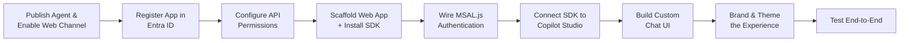
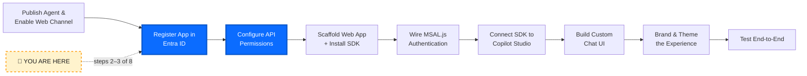
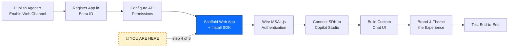
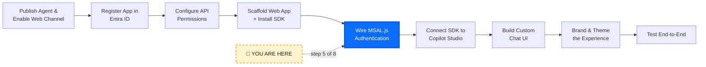
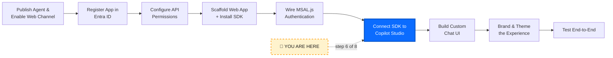
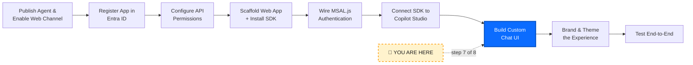
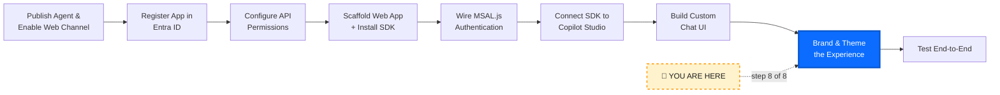
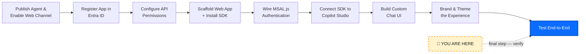

# 💬 Lab 18: Embed a Copilot Studio Agent in a Web Page with the Client SDK

*Build a fully branded, custom chat experience in your own web app — powered by the Copilot Studio Client SDK and Entra ID authentication.*

## Metadata

| | |
|---|---|
| ⭐ **DIFFICULTY** | Intermediate–Advanced (Level 250) |
| ⏱️ **TIME** | 75 minutes |
| 🧩 **PRODUCTS** | Microsoft Copilot Studio, Microsoft Entra ID, Copilot Studio Client SDK (`@microsoft/agents-copilotstudio-client`), MSAL.js |
| 🏷️ **TAGS** | Embedding, Web SDK, Custom UI, Branding, MSAL, Entra ID, Authentication, DirectToEngine |
| 🏭 **INDUSTRY** | Cross-industry |
| 📋 **STATUS** | Optional |

> **Prerequisite:** You should have a working, published agent in Copilot Studio — for example the **Contoso IT Operations Agent** from [Lab 01](../01-energy-ops-agent/index.md) or any other agent in your environment.

---

## Overview

This lab walks through building a custom, authenticated web chat experience that embeds a Copilot Studio agent using the Client SDK and Entra ID.

## 🗺️ Lab Flow



---

## ⚡ Why this lab matters

The Copilot Studio test pane and the out-of-the-box "Demo website" channel are great for quick validation, but production scenarios almost always require something more:

- **Custom branding** — your logo, colors, fonts, and tone of voice
- **Embedded context** — the chat lives alongside your existing app (an order page, a portal, a help center)
- **Identity-aware conversations** — the agent knows *who* the user is via Entra ID single sign-on
- **Full UX control** — quick replies, adaptive cards, suggested actions, file uploads, citation rendering — exactly how you want them

The **Copilot Studio Client SDK** is the modern, recommended path for these scenarios. Instead of iframing a generic widget, you talk to your agent over the **DirectToEngine** protocol from your own code, render activities however you like, and authenticate users with **Microsoft Entra ID** through **MSAL.js**.

By the end of this lab, you'll have a working web page that:

- ✅ Authenticates the user with their work or school account
- ✅ Acquires a token for the Copilot Studio Power Platform API
- ✅ Starts a conversation with your published agent
- ✅ Streams replies, suggested actions, and adaptive cards into a custom-branded chat UI
- ✅ Looks and feels like it belongs to *your* product, not Microsoft's

---

## 🏗️ What you'll do

| Step | What happens |
|---|---|
| **Configure** | Enable the right channel on your Copilot Studio agent and capture its identifiers |
| **Register** | Create an Entra ID app registration and grant Power Platform API permissions |
| **Scaffold** | Spin up a Vite + vanilla TypeScript web app and install the SDK |
| **Authenticate** | Wire MSAL.js for sign-in and silent token acquisition |
| **Connect** | Initialize the `CopilotStudioClient`, start a conversation, send messages |
| **Render** | Build a clean chat UI with messages, typing indicator, suggested actions, and adaptive cards |
| **Brand** | Apply your colors, logo, fonts, avatar, and welcome message |
| **Verify** | Run end-to-end and walk through several conversational scenarios |

---

## 🎯 Objectives

By the end of this lab, you will be able to:

1. Configure a Copilot Studio agent for direct programmatic access from a web app
2. Register an Entra ID application and grant the correct Power Platform API permission
3. Use the **Copilot Studio Client SDK** (`@microsoft/agents-copilotstudio-client`) to connect to your agent
4. Use **MSAL.js** to authenticate users and acquire delegated access tokens
5. Build a custom, fully branded chat UI that renders text, suggested actions, and adaptive cards
6. Troubleshoot common authentication and connection issues

---

## ✅ Prerequisites

1. **A published Copilot Studio agent** — in an environment you have admin or maker access to
2. **An Entra ID tenant** where you can create (or request) an app registration — your work tenant typically works
3. **Node.js 18+** and **npm** installed locally
4. **A modern browser** (Edge, Chrome, Firefox)
5. **VS Code** (recommended) for editing
6. **Basic familiarity with HTML/CSS/JavaScript** — you don't need to be a frontend expert, but you should be comfortable reading a `.ts` file

> 💡 If you don't already have an agent, complete [Lab 01](../01-energy-ops-agent/index.md) first — it gives you a Contoso IT Operations Agent you can use throughout this lab.

---

# 🧪 Use Case #1 — Configure Your Copilot Studio Agent (10 min)

```mermaid
flowchart LR
  YH["📍 YOU ARE HERE"]:::youarehere
  A["Publish Agent &<br/>Enable Web Channel"]:::current
  B["Register App in<br/>Entra ID"]
  C["Configure API<br/>Permissions"]
  D["Scaffold Web App<br/>+ Install SDK"]
  E["Wire MSAL.js<br/>Authentication"]
  F["Connect SDK to<br/>Copilot Studio"]
  G["Build Custom<br/>Chat UI"]
  H["Brand & Theme<br/>the Experience"]
  I["Test End-to-End"]
  A --> B --> C --> D --> E --> F --> G --> H --> I
  YH -.->|"step 1 of 8"| A
  classDef current fill:#0b6cff,stroke:#0957cc,color:#fff,stroke-width:3px
  classDef youarehere fill:#fff3cd,stroke:#ff9800,color:#1c1c1c,stroke-width:2px,stroke-dasharray: 5 5
```



> 🎯 **Objective:** Make sure your agent is published and capture the three identifiers the SDK needs.

The Copilot Studio Client SDK connects to your agent using three values:

- **Environment ID** — the Power Platform environment the agent lives in
- **Agent (Schema) Name** — the immutable schema name of the agent
- **Cloud / Region** — usually `Prod` (commercial cloud); some tenants use sovereign clouds

### Step 1 — Publish your agent

1. Open [Microsoft Copilot Studio](https://copilotstudio.microsoft.com).
2. Select the **environment** that contains your agent (top-right environment picker).
3. Open your agent and click **Publish** in the top-right corner.
4. Confirm. Wait for the publish to succeed.

> ⚠️ The SDK only sees the **published** version of your agent. If you edit topics or instructions later, re-publish before re-testing.

### Step 2 — Capture the Environment ID

1. In Copilot Studio, click the **settings gear** (top-right).
2. Select **Advanced** → **Resources**.
3. Copy the **Environment ID** (a GUID).
4. Save it somewhere — you'll paste it into your app config.

**Alternative:** In the [Power Platform admin center](https://admin.powerplatform.microsoft.com/) → **Environments** → your environment → **Environment ID** is shown in the details pane.

### Step 3 — Capture the Agent Schema Name

1. Back in your agent, go to **Settings** → **Advanced**.
2. Find **Schema name** (it usually looks like `cr1a3_contosoITOperationsAgent`).
3. Copy it exactly — case and prefix matter.

### Step 4 — Note the Cloud

For most commercial tenants, the cloud is simply `Prod`. If your organization uses GCC, GCC High, DoD, or another sovereign cloud, take note — you'll set this in the SDK config.

> 📋 **Stash these three values** — Environment ID, Agent Schema Name, Cloud — in a scratch file. You'll wire them into the app shortly.

---

# 🧪 Use Case #2 — Register an Entra ID Application (15 min)



> 🎯 **Objective:** Give your web app an identity that can request tokens for the Power Platform API on behalf of the signed-in user.

The Copilot Studio Client SDK uses **delegated** authentication — the user signs in, the app gets a token on their behalf, and Copilot Studio runs the conversation as that user. This is what enables identity-aware scenarios (the agent can know who you are, look up your tickets, your orders, etc.).

### Step 1 — Create the app registration

1. Open the [Microsoft Entra admin center](https://entra.microsoft.com).
2. In the left nav, go to **Applications** → **App registrations**.
3. Click **+ New registration**.
4. Fill in:
   - **Name:** `Copilot Studio Web Embed (Lab 18)` (or whatever you prefer)
   - **Supported account types:** *Accounts in this organizational directory only (Single tenant)* — recommended for the lab
   - **Redirect URI:**
     - Platform: **Single-page application (SPA)**
     - URI: `http://localhost:5173`
5. Click **Register**.

### Step 2 — Capture the Application IDs

On the app's **Overview** page, copy these two values:

- **Application (client) ID** — a GUID
- **Directory (tenant) ID** — a GUID

Save them next to your earlier three values.

### Step 3 — Configure the SPA redirect (verify)

1. Go to **Authentication** in the left nav.
2. Confirm there's a **Single-page application** platform entry with `http://localhost:5173` listed.
3. Under **Implicit grant and hybrid flows**, leave both checkboxes **unchecked** (we'll use the modern auth code flow with PKCE, which MSAL.js handles automatically).
4. Click **Save** if you made changes.

### Step 4 — Add the Power Platform API permission

This is the step most people miss — without it, MSAL will return a token but Copilot Studio will reject it.

1. Go to **API permissions** in the left nav.
2. Click **+ Add a permission**.
3. Select the **APIs my organization uses** tab.
4. Search for `Power Platform API`.
5. Select **Power Platform API**.
6. Choose **Delegated permissions**.
7. Check **`CopilotStudio.Copilots.Invoke`**.
8. Click **Add permissions**.

> ⚠️ **Don't see "Power Platform API" in the list?** It's not registered in your tenant yet. An admin needs to run one of these once:
> - **PowerShell:** `New-AzureADServicePrincipal -AppId 8578e004-a5c6-46e7-913e-12f58912df43` (the well-known Power Platform API app ID), or
> - **Azure CLI:** `az ad sp create --id 8578e004-a5c6-46e7-913e-12f58912df43`

### Step 5 — (Optional) Grant admin consent

If your tenant requires admin consent for this scope, click **Grant admin consent for {tenant}** at the top of the API permissions page. Otherwise, individual users will see a one-time consent prompt the first time they sign in.

> 📋 You now have: tenant ID, client ID, environment ID, agent schema name, cloud. That's everything the app needs.

---

# 🧪 Use Case #3 — Scaffold the Web App (10 min)



> 🎯 **Objective:** Spin up a small Vite + TypeScript app and install the two SDK packages.

We're using **Vite** because it gives us a near-zero-config dev server with TypeScript and ES modules — perfect for a lab. The same code works inside React, Vue, Angular, or any other framework — only the rendering layer changes.

### Step 1 — Create the project

Open a terminal and run:

```bash
npm create vite@latest copilot-studio-embed -- --template vanilla-ts
cd copilot-studio-embed
npm install
```

When asked, accept the defaults.

### Step 2 — Install the SDK + MSAL

```bash
npm install @microsoft/agents-copilotstudio-client @azure/msal-browser
```

- `@microsoft/agents-copilotstudio-client` — the official Copilot Studio Client SDK
- `@azure/msal-browser` — Microsoft Authentication Library for browser-based apps

### Step 3 — Create the config file

Create a new file `src/config.ts`:

```typescript
// src/config.ts
// Replace these placeholder values with the IDs you captured earlier.
// In a real app, load these from environment variables — never hard-code secrets.

export const authConfig = {
  clientId: "<YOUR-APP-CLIENT-ID>",
  tenantId: "<YOUR-TENANT-ID>",
  redirectUri: "http://localhost:5173",
  // Delegated scope for the Power Platform API → Copilot Studio
  scopes: ["https://api.powerplatform.com/CopilotStudio.Copilots.Invoke"],
};

export const agentConfig = {
  environmentId: "<YOUR-ENVIRONMENT-ID>",
  agentIdentifier: "<YOUR-AGENT-SCHEMA-NAME>", // e.g. cr1a3_contosoITOperationsAgent
  cloud: "Prod" as const, // "Prod" | "Gov" | "High" | "DoD"
};

export const branding = {
  productName: "Contoso Assist",
  tagline: "Your AI helper for everything Contoso",
  primaryColor: "#0b6cff",
  primaryColorHover: "#0957cc",
  surfaceColor: "#ffffff",
  textColor: "#1c1c1c",
  agentAvatarUrl: "/agent-avatar.png", // drop a 64x64 PNG into /public
  userAvatarInitials: "U",
  welcomeMessage:
    "Hi! I'm the Contoso Assist agent. Ask me about IT, policies, or your account.",
};
```

> 🔒 **Security note:** `clientId` and `tenantId` are **not secrets** — they're identifiers that end up in the browser regardless. But never put a client *secret* in a frontend app. The SPA flow uses PKCE specifically so no secret is needed.

### Step 4 — Drop in an avatar (optional but nice)

Place a 64×64 PNG named `agent-avatar.png` into the `public/` folder. Any image works for now.

> ✅ Project scaffolded. Time to wire up auth.

---

# 🧪 Use Case #4 — Wire Up MSAL Authentication (10 min)



> 🎯 **Objective:** Sign the user in, get a token, refresh it silently.

### Step 1 — Create an auth helper

Create `src/auth.ts`:

```typescript
// src/auth.ts
import {
  PublicClientApplication,
  type AccountInfo,
  InteractionRequiredAuthError,
} from "@azure/msal-browser";
import { authConfig } from "./config";

const msalConfig = {
  auth: {
    clientId: authConfig.clientId,
    authority: `https://login.microsoftonline.com/${authConfig.tenantId}`,
    redirectUri: authConfig.redirectUri,
  },
  cache: {
    cacheLocation: "sessionStorage" as const,
  },
};

export const msalInstance = new PublicClientApplication(msalConfig);

let initialized = false;

export async function initAuth() {
  if (initialized) return;
  await msalInstance.initialize();
  // Handle a redirect back from a sign-in (no-op on a normal page load).
  await msalInstance.handleRedirectPromise();
  initialized = true;
}

export function getAccount(): AccountInfo | null {
  const accounts = msalInstance.getAllAccounts();
  return accounts[0] ?? null;
}

export async function signIn(): Promise<AccountInfo> {
  const result = await msalInstance.loginPopup({
    scopes: authConfig.scopes,
  });
  return result.account;
}

export async function signOut() {
  const account = getAccount();
  if (account) {
    await msalInstance.logoutPopup({ account });
  }
}

/**
 * Returns a valid access token for the Copilot Studio scope.
 * Tries silent acquisition first; falls back to interactive on failure.
 */
export async function getAccessToken(): Promise<string> {
  const account = getAccount();
  if (!account) throw new Error("Not signed in");

  try {
    const result = await msalInstance.acquireTokenSilent({
      scopes: authConfig.scopes,
      account,
    });
    return result.accessToken;
  } catch (err) {
    if (err instanceof InteractionRequiredAuthError) {
      const result = await msalInstance.acquireTokenPopup({
        scopes: authConfig.scopes,
        account,
      });
      return result.accessToken;
    }
    throw err;
  }
}
```

### Step 2 — Why this matters

- **Silent first, interactive fallback.** Tokens last ~60–90 min. Silent acquisition uses the cached refresh token; if it expires or the user revokes consent, we pop up an interactive flow.
- **Popup vs. redirect.** Popup is simpler for a lab. Production apps often prefer redirect for mobile compatibility — MSAL supports both with nearly identical APIs.
- **One token, one scope.** The SDK only needs the `CopilotStudio.Copilots.Invoke` scope. Don't combine it with Graph or other scopes in the same call.

> ✅ Auth helpers ready. Next: connect to Copilot Studio.

---

# 🧪 Use Case #5 — Connect the SDK to Your Agent (10 min)



> 🎯 **Objective:** Instantiate the `CopilotStudioClient`, start a conversation, send and receive messages.

### Step 1 — Create the chat client wrapper

Create `src/chatClient.ts`:

```typescript
// src/chatClient.ts
import {
  CopilotStudioClient,
  ConnectionSettings,
  PowerPlatformCloud,
} from "@microsoft/agents-copilotstudio-client";
import { agentConfig } from "./config";
import { getAccessToken } from "./auth";

let client: CopilotStudioClient | null = null;
let conversationId: string | null = null;

function cloudFromString(value: string): PowerPlatformCloud {
  switch (value) {
    case "Gov":
      return PowerPlatformCloud.Gov;
    case "High":
      return PowerPlatformCloud.High;
    case "DoD":
      return PowerPlatformCloud.DoD;
    default:
      return PowerPlatformCloud.Prod;
  }
}

export async function ensureClient(): Promise<CopilotStudioClient> {
  if (client) return client;

  const token = await getAccessToken();

  const settings: ConnectionSettings = {
    environmentId: agentConfig.environmentId,
    agentIdentifier: agentConfig.agentIdentifier,
    cloud: cloudFromString(agentConfig.cloud),
  };

  client = new CopilotStudioClient(settings, token);
  return client;
}

export async function startConversation() {
  const c = await ensureClient();
  // Start a new conversation and yield the agent's greeting activities.
  const activities = [];
  for await (const activity of c.startConversationAsync(true)) {
    activities.push(activity);
    if (activity.conversation?.id) {
      conversationId = activity.conversation.id;
    }
  }
  return activities;
}

export async function sendMessage(text: string) {
  const c = await ensureClient();
  if (!conversationId) {
    throw new Error("Conversation not started");
  }
  const activities = [];
  for await (const activity of c.askQuestionAsync(text, conversationId)) {
    activities.push(activity);
  }
  return activities;
}

export function getConversationId() {
  return conversationId;
}

export function resetClient() {
  client = null;
  conversationId = null;
}
```

### Step 2 — What's happening

- **`startConversationAsync(true)`** opens a new conversation and asks the agent to send its greeting (topic: `Conversation Start`). It returns an **async iterable** of activities — Copilot Studio streams them back as it produces them.
- **`askQuestionAsync(text, conversationId)`** sends a user message and streams the agent's response activities (text, typing indicators, suggested actions, adaptive cards).
- **Activities** follow the Bot Framework activity schema. The most common types you'll render: `message` (with optional `attachments` and `suggestedActions`) and `typing`.

> ✅ The plumbing is in place. Now build the UI that makes it look like *your* product.

---

# 🧪 Use Case #6 — Build the Branded Chat UI (15 min)



> 🎯 **Objective:** Replace the default Vite template with a custom-branded chat experience.

### Step 1 — Replace `index.html`

Open `index.html` at the project root and replace its contents with:

```html
<!doctype html>
<html lang="en">
  <head>
    <meta charset="UTF-8" />
    <link rel="icon" type="image/png" href="/agent-avatar.png" />
    <meta name="viewport" content="width=device-width, initial-scale=1.0" />
    <title>Contoso Assist</title>
  </head>
  <body>
    <div id="app"></div>
    <script type="module" src="/src/main.ts"></script>
  </body>
</html>
```

### Step 2 — Replace `src/main.ts`

```typescript
// src/main.ts
import { branding } from "./config";
import { initAuth, signIn, signOut, getAccount } from "./auth";
import {
  startConversation,
  sendMessage,
  resetClient,
} from "./chatClient";
import { renderActivity, renderUserMessage } from "./ui";
import "./styles.css";

const root = document.getElementById("app")!;

root.innerHTML = `
  <div class="chat-shell" style="
    --primary:${branding.primaryColor};
    --primary-hover:${branding.primaryColorHover};
    --surface:${branding.surfaceColor};
    --text:${branding.textColor};
  ">
    <header class="chat-header">
      
      <div>
        <h1>${branding.productName}</h1>
        <p>${branding.tagline}</p>
      </div>
      <button id="auth-btn" class="auth-btn">Sign in</button>
    </header>
    <main id="messages" class="messages" aria-live="polite"></main>
    <footer class="composer">
      <input
        id="composer-input"
        type="text"
        placeholder="Ask me anything…"
        autocomplete="off"
        disabled
      />
      <button id="send-btn" class="send-btn" disabled>Send</button>
    </footer>
  </div>
`;

const messagesEl = document.getElementById("messages") as HTMLDivElement;
const inputEl = document.getElementById("composer-input") as HTMLInputElement;
const sendBtn = document.getElementById("send-btn") as HTMLButtonElement;
const authBtn = document.getElementById("auth-btn") as HTMLButtonElement;

function setSignedInUi(signedIn: boolean) {
  inputEl.disabled = !signedIn;
  sendBtn.disabled = !signedIn;
  authBtn.textContent = signedIn ? "Sign out" : "Sign in";
}

async function handleSendMessage(text: string) {
  if (!text.trim()) return;
  renderUserMessage(messagesEl, text);
  inputEl.value = "";

  showTyping(true);
  try {
    const activities = await sendMessage(text);
    showTyping(false);
    for (const activity of activities) {
      renderActivity(messagesEl, activity, (suggestion) =>
        handleSendMessage(suggestion)
      );
    }
  } catch (err) {
    showTyping(false);
    renderActivity(
      messagesEl,
      {
        type: "message",
        text: `Sorry — something went wrong: ${(err as Error).message}`,
        from: { role: "bot" },
      } as any,
      () => {}
    );
  }
}

function showTyping(on: boolean) {
  const existing = document.getElementById("typing-bubble");
  if (on && !existing) {
    const bubble = document.createElement("div");
    bubble.id = "typing-bubble";
    bubble.className = "msg bot typing";
    bubble.innerHTML = `<span></span><span></span><span></span>`;
    messagesEl.appendChild(bubble);
    messagesEl.scrollTop = messagesEl.scrollHeight;
  } else if (!on && existing) {
    existing.remove();
  }
}

async function bootstrap() {
  await initAuth();

  authBtn.addEventListener("click", async () => {
    if (getAccount()) {
      await signOut();
      resetClient();
      messagesEl.innerHTML = "";
      setSignedInUi(false);
    } else {
      await signIn();
      setSignedInUi(true);
      await openWelcome();
    }
  });

  sendBtn.addEventListener("click", () => handleSendMessage(inputEl.value));
  inputEl.addEventListener("keydown", (e) => {
    if (e.key === "Enter") handleSendMessage(inputEl.value);
  });

  if (getAccount()) {
    setSignedInUi(true);
    await openWelcome();
  } else {
    setSignedInUi(false);
  }
}

async function openWelcome() {
  // Show our static welcome first, then let the agent's own greeting flow in.
  renderActivity(
    messagesEl,
    {
      type: "message",
      text: branding.welcomeMessage,
      from: { role: "bot" },
    } as any,
    () => {}
  );

  showTyping(true);
  try {
    const activities = await startConversation();
    showTyping(false);
    for (const activity of activities) {
      renderActivity(messagesEl, activity, (suggestion) =>
        handleSendMessage(suggestion)
      );
    }
  } catch (err) {
    showTyping(false);
    console.error(err);
  }
}

bootstrap();
```

### Step 3 — Create `src/ui.ts` for activity rendering

```typescript
// src/ui.ts
import { branding } from "./config";

type Activity = {
  type: string;
  text?: string;
  from?: { role?: string };
  suggestedActions?: { actions: { title: string; value: string }[] };
  attachments?: { contentType: string; content: any }[];
};

export function renderUserMessage(parent: HTMLElement, text: string) {
  const row = document.createElement("div");
  row.className = "msg-row user";
  row.innerHTML = `
    <div class="msg user">${escapeHtml(text)}</div>
    <div class="avatar user-avatar">${escapeHtml(branding.userAvatarInitials)}</div>
  `;
  parent.appendChild(row);
  parent.scrollTop = parent.scrollHeight;
}

export function renderActivity(
  parent: HTMLElement,
  activity: Activity,
  onSuggestion: (text: string) => void
) {
  if (activity.type !== "message") return;

  const row = document.createElement("div");
  row.className = "msg-row bot";
  row.innerHTML = `
    
    <div class="bot-content"></div>
  `;
  const content = row.querySelector(".bot-content") as HTMLElement;

  if (activity.text) {
    const bubble = document.createElement("div");
    bubble.className = "msg bot";
    bubble.innerHTML = formatText(activity.text);
    content.appendChild(bubble);
  }

  // Render adaptive card attachments as a simple JSON fallback.
  // For full fidelity, integrate the official adaptivecards npm package.
  if (activity.attachments?.length) {
    for (const att of activity.attachments) {
      if (att.contentType === "application/vnd.microsoft.card.adaptive") {
        const card = document.createElement("div");
        card.className = "adaptive-card-fallback";
        card.textContent = JSON.stringify(att.content, null, 2);
        content.appendChild(card);
      }
    }
  }

  // Suggested actions / quick replies
  if (activity.suggestedActions?.actions?.length) {
    const wrap = document.createElement("div");
    wrap.className = "suggestions";
    for (const action of activity.suggestedActions.actions) {
      const btn = document.createElement("button");
      btn.className = "suggestion";
      btn.textContent = action.title;
      btn.addEventListener("click", () => onSuggestion(action.value ?? action.title));
      wrap.appendChild(btn);
    }
    content.appendChild(wrap);
  }

  parent.appendChild(row);
  parent.scrollTop = parent.scrollHeight;
}

function escapeHtml(s: string) {
  return s
    .replace(/&/g, "&amp;")
    .replace(/</g, "&lt;")
    .replace(/>/g, "&gt;")
    .replace(/"/g, "&quot;")
    .replace(/'/g, "&#39;");
}

function formatText(s: string) {
  // Very small markdown-ish renderer: links and line breaks only.
  const escaped = escapeHtml(s);
  const withLinks = escaped.replace(
    /(https?:\/\/[^\s<]+)/g,
    '<a href="$1" target="_blank" rel="noopener">$1</a>'
  );
  return withLinks.replace(/\n/g, "<br />");
}
```

### Step 4 — Add `src/styles.css`

```css
/* src/styles.css */
:root {
  font-family: -apple-system, BlinkMacSystemFont, "Segoe UI", Roboto, sans-serif;
}

* { box-sizing: border-box; }

body {
  margin: 0;
  background: #f4f6fa;
  color: var(--text, #1c1c1c);
  min-height: 100vh;
  display: flex;
  align-items: center;
  justify-content: center;
}

.chat-shell {
  width: min(420px, 100vw);
  height: min(640px, 100vh);
  background: var(--surface);
  border-radius: 16px;
  box-shadow: 0 20px 60px rgba(20, 30, 60, 0.15);
  display: flex;
  flex-direction: column;
  overflow: hidden;
}

.chat-header {
  display: flex;
  align-items: center;
  gap: 12px;
  padding: 16px;
  background: var(--primary);
  color: white;
}
.chat-header h1 { margin: 0; font-size: 16px; font-weight: 600; }
.chat-header p { margin: 2px 0 0; font-size: 12px; opacity: 0.85; }
.chat-header > div:nth-child(2) { flex: 1; }
.brand-avatar {
  width: 36px; height: 36px; border-radius: 50%;
  background: white; padding: 4px;
}
.auth-btn {
  background: rgba(255, 255, 255, 0.18);
  border: 1px solid rgba(255, 255, 255, 0.4);
  color: white;
  padding: 6px 12px;
  border-radius: 999px;
  cursor: pointer;
  font-size: 12px;
}
.auth-btn:hover { background: rgba(255, 255, 255, 0.28); }

.messages {
  flex: 1;
  overflow-y: auto;
  padding: 16px;
  display: flex;
  flex-direction: column;
  gap: 12px;
  background: linear-gradient(180deg, #fbfcfe 0%, #f4f6fa 100%);
}

.msg-row {
  display: flex;
  gap: 8px;
  align-items: flex-end;
}
.msg-row.user { justify-content: flex-end; }
.msg-row.bot .bot-content { display: flex; flex-direction: column; gap: 6px; }

.avatar {
  width: 28px; height: 28px;
  border-radius: 50%;
  background: var(--primary);
  color: white;
  display: flex; align-items: center; justify-content: center;
  font-size: 12px;
}
.user-avatar { background: #6b6f7a; }

.msg {
  max-width: 80%;
  padding: 10px 14px;
  border-radius: 16px;
  line-height: 1.4;
  font-size: 14px;
  word-wrap: break-word;
}
.msg.user {
  background: var(--primary);
  color: white;
  border-bottom-right-radius: 4px;
}
.msg.bot {
  background: white;
  color: var(--text);
  border: 1px solid #e6e9f0;
  border-bottom-left-radius: 4px;
}

.suggestions { display: flex; flex-wrap: wrap; gap: 6px; margin-top: 4px; }
.suggestion {
  background: white;
  border: 1px solid var(--primary);
  color: var(--primary);
  padding: 6px 12px;
  border-radius: 999px;
  font-size: 12px;
  cursor: pointer;
}
.suggestion:hover { background: var(--primary); color: white; }

.adaptive-card-fallback {
  background: #fafbfd;
  border: 1px dashed #c8cdd9;
  border-radius: 8px;
  padding: 8px;
  font-family: ui-monospace, SFMono-Regular, Menlo, monospace;
  font-size: 11px;
  white-space: pre-wrap;
  max-height: 240px;
  overflow: auto;
}

.composer {
  display: flex;
  gap: 8px;
  padding: 12px;
  border-top: 1px solid #e6e9f0;
  background: white;
}
.composer input {
  flex: 1;
  padding: 10px 14px;
  border: 1px solid #d6dae3;
  border-radius: 999px;
  font-size: 14px;
  outline: none;
}
.composer input:focus { border-color: var(--primary); }
.send-btn {
  background: var(--primary);
  color: white;
  border: none;
  padding: 10px 18px;
  border-radius: 999px;
  cursor: pointer;
  font-weight: 600;
}
.send-btn:hover:not(:disabled) { background: var(--primary-hover); }
.send-btn:disabled, .composer input:disabled { opacity: 0.5; cursor: not-allowed; }

/* Typing dots */
.typing { display: inline-flex; gap: 4px; align-items: center; }
.typing span {
  width: 6px; height: 6px;
  background: #c8cdd9;
  border-radius: 50%;
  animation: blink 1.2s infinite ease-in-out;
}
.typing span:nth-child(2) { animation-delay: 0.2s; }
.typing span:nth-child(3) { animation-delay: 0.4s; }
@keyframes blink {
  0%, 80%, 100% { opacity: 0.3; transform: translateY(0); }
  40% { opacity: 1; transform: translateY(-2px); }
}
```

> ✅ You now have a fully branded chat shell. Time to brand it more.

---

# 🧪 Use Case #7 — Customize the Look & Brand (5 min)



> 🎯 **Objective:** Make it feel like *your* product, not a generic chatbot.

All the cosmetic knobs live in `src/config.ts` under `branding`. Tweak any of these and the UI updates:

| Knob | Effect |
|---|---|
| `productName` | Header title |
| `tagline` | Header subtitle |
| `primaryColor` / `primaryColorHover` | Header background, user bubble, send button, suggestion outlines |
| `surfaceColor` | Chat shell background |
| `textColor` | Bot message text color |
| `agentAvatarUrl` | The little avatar next to every agent message and in the header |
| `userAvatarInitials` | Short text shown in the user avatar circle |
| `welcomeMessage` | Static greeting shown before the agent's own greeting flows in |

**Other things you can swap easily:**

- **Logo in header** — replace `` with an SVG logo
- **Font family** — change the `font-family` on `:root` in `styles.css`
- **Shell shape** — change `border-radius`, `width`, and `height` of `.chat-shell` to make it full-page, side-docked, or a floating widget
- **Floating widget pattern** — wrap `.chat-shell` in a fixed-position container and add a launcher button (we leave this as a stretch exercise)
- **Dark mode** — duplicate the `:root` variables under `@media (prefers-color-scheme: dark)` with darker `--surface` and lighter `--text`

> 💡 **Tip for adaptive cards:** This lab uses a JSON fallback for adaptive card attachments to keep the dependency list small. For full fidelity, install [`adaptivecards`](https://www.npmjs.com/package/adaptivecards), render the card with `AdaptiveCard.parse(att.content).render()`, and append the resulting HTML element to `content` in `renderActivity`.

---

# 🧪 Use Case #8 — Run It End-to-End (5 min)



> 🎯 **Objective:** Verify the full sign-in → conversation → reply loop.

### Step 1 — Start the dev server

```bash
npm run dev
```

Vite prints a local URL — typically `http://localhost:5173`. Open it in your browser.

### Step 2 — Sign in

1. Click **Sign in** in the top-right of the chat shell.
2. A popup appears — sign in with your work or school account.
3. If this is your first time, you'll see a consent prompt asking you to grant the app access to **Copilot Studio**. Click **Accept**.
4. The popup closes. The composer becomes enabled.

### Step 3 — Have a conversation

1. The agent's greeting (from your `Conversation Start` topic) should appear automatically.
2. Try a question your agent should answer well — for example, if you're using the Contoso IT agent: *"How do I reset my VPN password?"*
3. Watch for:
   - ✅ Typing indicator while the agent thinks
   - ✅ Streamed reply text
   - ✅ Suggested-action chips (if your topics emit them)
   - ✅ Adaptive cards rendering (as JSON fallback in this lab)

### Step 4 — Verify identity-awareness

Ask: *"What's my name?"* If your agent uses the system variable `User.DisplayName` or `User.PrincipalName`, it should answer correctly — proof that delegated authentication is flowing through.

> If it doesn't know your name, that's an agent-side configuration choice, not an SDK problem. The signed-in identity is being sent — your agent topics just aren't using it yet.

---

## 🧯 Troubleshooting

| Symptom | Likely cause | Fix |
|---|---|---|
| MSAL popup says "AADSTS650053: The application 'X' asked for scope 'CopilotStudio.Copilots.Invoke' that doesn't exist on the resource" | Power Platform API not in your tenant | Have an admin run `New-AzureADServicePrincipal -AppId 8578e004-a5c6-46e7-913e-12f58912df43` (see Use Case 2, Step 4) |
| MSAL popup says "AADSTS65001: The user or administrator has not consented" | Admin consent required for the scope | Click **Grant admin consent** in the app registration, or have the user accept the consent prompt |
| SDK throws `401 Unauthorized` | Wrong scope or wrong audience | Confirm the scope is exactly `https://api.powerplatform.com/CopilotStudio.Copilots.Invoke` |
| SDK throws `404 Not Found` | Wrong environment ID or schema name | Double-check both in Copilot Studio settings; schema names are case-sensitive |
| Agent replies but no greeting appears | Conversation Start topic not published or empty | Re-publish; ensure the topic has at least one Send Message node |
| Popup blocked | Browser popup blocker | Allow popups for `localhost:5173`, or switch to MSAL `loginRedirect` |
| `redirect_uri` mismatch error | App registration redirect URI doesn't match | Add `http://localhost:5173` to the SPA platform in **Authentication** |
| Suggested-action chips don't appear | Agent topics don't emit them | Add a **Question** node with options in Copilot Studio |
| Works locally, fails when deployed | Production redirect URI not added | Add your production URL to the SPA platform in the app registration |

---

## 🚀 Going further

This lab gives you a working foundation. Here's what to add for production:

- **Adaptive Cards** — install `adaptivecards`, render real cards, wire up action handlers
- **Streaming** — when your agent uses generative answers, activities arrive incrementally; show tokens as they stream
- **File uploads** — add an attachment button that uploads to the conversation
- **Citation rendering** — show source links from generative-answer responses
- **Conversation persistence** — store `conversationId` in `sessionStorage` so refresh continues the conversation
- **Multi-language** — set `Activity.locale` on send; localize your UI strings
- **Analytics** — hook into MSAL events and SDK activity flow to track engagement
- **Accessibility audit** — verify keyboard navigation, screen reader announcements (`aria-live` is already on), color contrast
- **CSP & security headers** — add a strict Content-Security-Policy when deploying
- **Production deployment** — add the production URL as a redirect URI, set `cacheLocation: "localStorage"` only if you've evaluated the security tradeoffs, and consider redirect flow over popup

---

## 🧠 Concepts recap

| Concept | What it means here |
|---|---|
| **DirectToEngine** | The protocol the Client SDK uses to talk to your published agent — no Direct Line, no bot channel registration needed |
| **Delegated auth** | The user signs in; the app gets a token *on behalf of* the user; the agent runs as that user |
| **PKCE** | The auth code flow extension that lets SPAs do secure OAuth without a client secret |
| **Activity** | A single Bot Framework message — could be text, typing, suggested actions, attachments |
| **Conversation ID** | Server-side handle that ties messages together as a turn-based dialog |
| **Schema name** | The immutable identifier for an agent — survives renames in the UI |

---

## 🔗 References

- [Copilot Studio Client SDK on npm](https://www.npmjs.com/package/@microsoft/agents-copilotstudio-client)
- [Copilot Studio – Connect with the Copilot Studio Client SDK](https://learn.microsoft.com/en-us/microsoft-copilot-studio/)
- [MSAL.js for browsers](https://learn.microsoft.com/en-us/entra/identity-platform/msal-overview)
- [Power Platform API reference](https://learn.microsoft.com/en-us/power-platform/admin/programmability-authentication-v2)
- [Adaptive Cards documentation](https://adaptivecards.io/)
- [Bot Framework Activity schema](https://github.com/microsoft/botframework-sdk/blob/main/specs/botframework-activity/botframework-activity.md)

---

## ✅ What you built

- A fully branded, custom-UI chat experience embedded in your own web app
- End-to-end Entra ID authentication using MSAL.js and PKCE
- A working SDK integration that handles conversation start, message exchange, suggested actions, and adaptive card fallbacks
- The pattern you can drop into *any* React, Vue, Angular, or vanilla web project

You now have everything you need to put a Copilot Studio agent inside your own product — branded the way you want, authenticated the way Microsoft recommends.

> ➡️ Pair this with [Lab 01](../01-energy-ops-agent/index.md) for an agent to embed, or [Lab 04](../04-energy-weather-agent/index.md) for the full end-to-end experience.

## ✅ Completion

Lab 18 is complete when sign-in, token acquisition, conversation start, and branded message rendering all work end-to-end in your web app.
