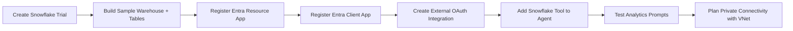

# ❄️ Lab 23: Snowflake Data Integration with Copilot Studio

*Bring governed warehouse data into Copilot Studio with OAuth, premium connectivity, and private-network design.*

## Metadata

| | |
|---|---|
| ⭐ **DIFFICULTY** | Advanced (Level 300) |
| ⏱️ **TIME** | 90 minutes |
| 🧩 **PRODUCTS** | Microsoft Copilot Studio, Snowflake, Microsoft Entra ID, Azure VNet |
| 🏷️ **TAGS** | Snowflake, Data Analytics, OAuth, VNet, Premium Connectors |
| 🏭 **INDUSTRY** | Cross-industry (Energy Analytics, Financial Risk, Retail Inventory) |
| 👤 **PERSONA** | Data Platform Architect / Maker / Security Reviewer |
| 📋 **STATUS** | Supplementary |

---

## 🗺️ Lab Flow



---

## ⚡ Why this lab matters

Warehouse data is where many organizations keep the metrics that actually drive planning, operations, and risk decisions.
Snowflake plus Copilot Studio gives you a way to bring those governed datasets into a conversational experience without copying them into yet another system.
This lab shows how to combine a premium connector, Entra-backed OAuth, and optional private networking so the pattern can scale beyond a proof of concept.

---

## 🌍 Real-world example

Picture an operations leader who wants to know which inventory items are below reorder point, which trading portfolio has the highest stress loss, or which plant spent the most on energy today.
Instead of opening three dashboards or writing SQL, they ask a Copilot that reads directly from Snowflake and returns a concise, grounded answer.
That outcome depends on careful work across trial setup, OAuth, role design, and VNet planning.

---

## 🏗️ What you'll build

| Layer | What you will build |
|---|---|
| **Snowflake sandbox** | A no-cost trial account with a sample warehouse, schema, and analytics tables |
| **Identity layer** | Entra resource and client applications plus a Snowflake external OAuth integration |
| **Connector path** | A premium Snowflake connection suitable for Copilot Studio tools |
| **Analytics experience** | An agent that answers inventory, risk, and energy consumption questions |
| **Network posture** | A VNet and private-connectivity blueprint for production hardening |

---

## 🎯 Objectives

1. Provision a Snowflake trial and create sample tables that map to real business questions.
2. Configure delegated or service-principal OAuth with Entra ID and Snowflake external OAuth integration.
3. Add Snowflake as a tool in Copilot Studio and shape clear, read-only analytics prompts.
4. Explain the role of blocked roles, claim mapping, and token version settings in successful authentication.
5. Plan a private-connectivity pattern using Power Platform VNet support and Snowflake private networking.

---

## 🧠 Core concepts overview

| Concept | What it means in this lab |
|---|---|
| **Premium connector** | The Snowflake connector is premium and requires the right Power Platform licensing. |
| **Trial credits** | The free trial currently offers 30 days and about $400 credits with no credit card required. |
| **Delegated auth** | Maps the `upn` claim and is best when the user context should flow into Snowflake. |
| **Service principal auth** | Maps the `sub` claim and is best for shared-service integrations. |
| **Resource app** | The Entra app that exposes the API scope consumed by the connector client. |
| **Client app** | The Entra app that uses the `snowflakev2` redirect URI and requests the exposed scope. |
| **External OAuth integration** | The Snowflake object that trusts Entra tokens and maps claims to Snowflake users. |
| **Blocked roles** | A Snowflake control that can quietly prevent successful connector use even with valid tokens. |
| **Token version** | Setting `requestedAccessTokenVersion=2` can matter when Snowflake is used alongside Power BI. |
| **VNet support** | A Power Platform managed-environment capability that helps route connector traffic privately where supported. |

---

## 📚 Documentation

- [Snowflake connector reference](https://learn.microsoft.com/en-us/connectors/snowflakev2/)
- [Add tools to custom agents](https://learn.microsoft.com/en-us/microsoft-copilot-studio/add-tools-custom-agent)
- [Virtual Network support overview](https://learn.microsoft.com/en-us/power-platform/admin/vnet-support-overview)
- [Azure Private Link overview](https://learn.microsoft.com/en-us/azure/private-link/private-link-overview)
- [Use agent flows in Copilot Studio](https://learn.microsoft.com/en-us/training/modules/use-agent-flows/)

---

## ✅ Prerequisites

- Access to Copilot Studio in an environment where premium connectors are allowed.
- An Entra ID tenant where you can create app registrations or get help from an identity admin.
- A Snowflake trial or enterprise account with permission to create a database, schema, and security integration.
- Basic SQL worksheet familiarity so you can create and inspect sample tables.
- A managed environment available if you want to validate VNet support planning realistically.

---

## 💳 Licensing and access planning

| Component | What you need to know |
|---|---|
| **Snowflake trial** | Free for 30 days with roughly $400 credits and no credit card requirement at signup time. |
| **Power Platform premium** | Required because the Snowflake connector is premium. |
| **Copilot Studio** | Agent licensing still applies; separate environment governance may also affect connector availability. |
| **Managed Environment** | Typically required to realize Power Platform VNet support policies cleanly. |
| **Cloud limitations** | The connector is not available in GCC, GCC High, or DoD, so validate sovereign-cloud constraints early. |

---

## 🗺️ Use cases covered

| # | Use case | Time | Required |
|---|---|---|---|
| 1 | Set Up a Snowflake Trial | 20 min | ✅ |
| 2 | Configure OAuth with Entra ID | 30 min | ✅ |
| 3 | Build a Data Analytics Agent | 20 min | ✅ |
| 4 | Secure with VNet Private Connectivity | 20 min | ✅ |

---

# 🧪 Use Case #1 — Set Up a Snowflake Trial (20 min)

> 🎯 **Objective:** Create a no-cost Snowflake trial account, load a small analytics dataset, and understand the role model before you wire up Copilot Studio.

| | |
|---|---|
| **Goal** | Provision a warehouse-backed sandbox with enough structured data to test meaningful prompts. |
| **Outcome** | You have a trial environment, a running virtual warehouse, and three sample tables for agent questions. |
| **Why it matters** | Connector demos are weak without clean data and role awareness. |

### Scenario

Your analytics team wants Copilot Studio to answer business questions over trusted Snowflake data rather than CSV uploads.
The fastest way to learn the pattern is a self-service trial that includes compute credits and admin control.
This use case gives you a safe environment to practice before you connect to a governed enterprise account.

### Step 1 — Start the free Snowflake trial

1. Open [signup.snowflake.com](https://signup.snowflake.com) and register a trial account.
2. Confirm that the trial currently offers **30 days** and roughly **$400 in credits** with no credit card required.
3. Choose the cloud and region closest to your Power Platform region where practical.
4. Sign in to Snowsight and capture the account identifier and region details.

> 💡 **Tip:** Use a workshop-specific naming convention for warehouses and databases so cleanup is easy later.

### Step 2 — Create a warehouse, database, and schema

Run the following SQL in a worksheet:

```sql
CREATE WAREHOUSE IF NOT EXISTS LAB_WH
  WITH WAREHOUSE_SIZE = 'XSMALL'
  AUTO_SUSPEND = 60
  AUTO_RESUME = TRUE;

CREATE DATABASE IF NOT EXISTS COPILOT_LAB_DB;
CREATE SCHEMA IF NOT EXISTS COPILOT_LAB_DB.OPS;
```

1. Resume the warehouse if it does not auto-start.
2. Set the worksheet context to the new database and schema.
3. Confirm you can run a simple `SELECT CURRENT_ROLE();` query.

### Step 3 — Create sample tables that map to business questions

Use this starter SQL:

```sql
CREATE OR REPLACE TABLE COPILOT_LAB_DB.OPS.INVENTORY_LEVELS (
  PRODUCT_ID STRING,
  PRODUCT_NAME STRING,
  REGION STRING,
  ON_HAND NUMBER,
  REORDER_POINT NUMBER,
  LAST_UPDATED TIMESTAMP_NTZ
);

CREATE OR REPLACE TABLE COPILOT_LAB_DB.OPS.RISK_METRICS (
  PORTFOLIO STRING,
  METRIC_DATE DATE,
  VAR_95 NUMBER(12,2),
  EXPOSURE NUMBER(12,2),
  STRESS_LOSS NUMBER(12,2)
);

CREATE OR REPLACE TABLE COPILOT_LAB_DB.OPS.ENERGY_CONSUMPTION (
  SITE_NAME STRING,
  METER_DATE DATE,
  MWH NUMBER(12,2),
  PEAK_MW NUMBER(12,2),
  COST_USD NUMBER(12,2)
);
```

### Step 4 — Insert a small but varied dataset

```sql
INSERT INTO COPILOT_LAB_DB.OPS.INVENTORY_LEVELS VALUES
('SKU-100', 'Grid Sensor', 'West', 42, 50, CURRENT_TIMESTAMP()),
('SKU-200', 'Breaker Assembly', 'Central', 18, 25, CURRENT_TIMESTAMP()),
('SKU-300', 'Smart Meter Kit', 'East', 240, 150, CURRENT_TIMESTAMP());

INSERT INTO COPILOT_LAB_DB.OPS.RISK_METRICS VALUES
('RetailPower', CURRENT_DATE(), 1250000, 5600000, 8100000),
('GasSupply', CURRENT_DATE(), 860000, 3900000, 6100000),
('TradingDesk', CURRENT_DATE(), 2420000, 9100000, 12800000);

INSERT INTO COPILOT_LAB_DB.OPS.ENERGY_CONSUMPTION VALUES
('North Plant', CURRENT_DATE(), 18.5, 4.2, 1920.40),
('South Plant', CURRENT_DATE(), 25.1, 6.1, 2684.77),
('Distribution Hub', CURRENT_DATE(), 9.8, 2.3, 991.22);
```

1. Query each table with a `SELECT *` limited to a few rows.
2. Confirm the warehouse auto-suspends after inactivity so you conserve credits.

### Step 5 — Understand roles before you integrate

1. Review the active role, warehouse, database, and schema in Snowsight.
2. Decide whether your later connector test should use a delegated user with business-role context or a service principal with a narrowly scoped role.
3. Create a note of which role can read the lab tables and which roles should remain blocked.

> ⚠️ **Warning:** Snowflake role design becomes an authentication issue later. If the role cannot reach the tables, the connector will look broken even when OAuth is fine.

### Verification checklist

- The trial account is active and you can sign in to Snowsight.
- The `LAB_WH` warehouse starts successfully and can run queries.
- All three sample tables contain test rows.
- You can identify the role that should be used during connector testing.

### Troubleshooting

- If SQL fails, check that you selected the correct worksheet role and warehouse before rerunning commands.
- If the trial seems suspended, sign back in and confirm the account has not timed out or required email validation.
- If inserts fail because of object names, verify the database and schema context.
- If you burn credits too quickly, shrink the warehouse and make sure auto-suspend is enabled.

### Challenge

- Add a fourth table that represents a KPI from your own industry, such as claims backlog, store returns, or turbine maintenance alerts.
- Create a view that summarizes low inventory risk by region so the agent can answer a higher-level question.
- Document which table should be safe for a broad audience and which table would need tighter role controls.

### Key takeaways

- A structured lab dataset makes the later agent prompts concrete and testable.
- Snowflake role awareness is part of the integration, not just a DBA concern.
- Warehouse sizing and auto-suspend matter even in a workshop because good habits scale.

### Evidence to capture

- Screenshot of the Snowsight worksheet with successful queries.
- Screenshot of the table list in `COPILOT_LAB_DB.OPS`.
- Note of the intended reader role for the connector.

### Stakeholder discussion prompts

- Which business questions are safe to answer from a chatbot versus restricted to analyst tools?
- Would your enterprise prefer a dedicated integration warehouse or shared warehouse for chat-driven workloads?
- How should data freshness expectations be communicated to end users?

### ✅ You've completed Use Case #1

You now have a warehouse-backed sandbox with enough realism to validate prompts, claims, and connectivity instead of generic hello-world SQL.

---

# 🧪 Use Case #2 — Configure OAuth with Entra ID (30 min)

> 🎯 **Objective:** Register the Snowflake OAuth resource and client applications, create the external OAuth integration in Snowflake, and validate claim mapping choices.

| | |
|---|---|
| **Goal** | Establish a modern auth pattern that the Snowflake connector can use reliably. |
| **Outcome** | You have a documented delegated or service-principal design plus a working connector-ready integration. |
| **Why it matters** | OAuth is where identity architecture, Snowflake security, and Power Platform meet. |

### Scenario

Your team wants to avoid hard-coded passwords and use Entra ID as the trust anchor.
The Snowflake connector supports both delegated and service principal patterns, but the claims and role mapping differ.
This use case walks through the minimum moving parts you must get right.

### Step 1 — Decide between delegated and service principal auth

| Pattern | Claim mapping | When to use it |
|---|---|---|
| **Delegated** | Map the `upn` claim | End-user queries where Snowflake authorization should reflect the signed-in user. |
| **Service Principal** | Map the `sub` claim | Shared integration identity or background workloads with a controlled service role. |

1. Decide whether the workshop goal is user-context analytics or shared-service analytics.
2. Document which Snowflake role the connection should land on.
3. Confirm the role is not blocked by current integration restrictions.

> 💡 **Tip:** If your eventual production design needs both patterns, implement delegated first for human-facing agent questions and service principal second for scheduled or background flows.

### Step 2 — Create the OAuth Resource app in Entra ID

1. In Entra ID, create an app registration named something like **Snowflake OAuth Resource**.
2. Open **Expose an API** and create an application ID URI and a scope that the client app can request.
3. If the same tenant also uses Power BI with Snowflake, set:

```text
requestedAccessTokenVersion = 2
```

4. Record the tenant ID, application ID URI, and scope value.

> ⚠️ **Warning:** Token version mismatches are easy to miss. If your tenant needs coexistence with other tools like Power BI, validate token version expectations up front.

### Step 3 — Create the OAuth Client app in Entra ID

1. Create a second app registration named **Snowflake OAuth Client**.
2. Add this redirect URI exactly:

```text
https://global.consent.azure-apim.net/redirect/snowflakev2
```

3. Grant the client app permission to the scope exposed by the resource app.
4. Record the client ID and secret or certificate details, depending on your standard.

### Step 4 — Create the external OAuth security integration in Snowflake

Run a starter pattern such as the following and adjust names to your tenant:

```sql
CREATE OR REPLACE SECURITY INTEGRATION EXTERNAL_OAUTH_COPILOT
  TYPE = EXTERNAL_OAUTH
  ENABLED = TRUE
  EXTERNAL_OAUTH_TYPE = AZURE
  EXTERNAL_OAUTH_ISSUER = 'https://login.microsoftonline.com/<tenant-id>/v2.0'
  EXTERNAL_OAUTH_JWS_KEYS_URL = 'https://login.microsoftonline.com/<tenant-id>/discovery/v2.0/keys'
  EXTERNAL_OAUTH_AUDIENCE_LIST = ('api://<resource-app-id>')
  EXTERNAL_OAUTH_TOKEN_USER_MAPPING_CLAIM = 'upn'
  EXTERNAL_OAUTH_SNOWFLAKE_USER_MAPPING_ATTRIBUTE = 'LOGIN_NAME';
```

1. For service principal mode, switch the mapping claim from `upn` to `sub` as required by your design.
2. Review Snowflake documentation or your platform standards for additional integration clauses such as any-role mode.
3. Save the SQL in version control or a secured runbook.

### Step 5 — Inspect blocked roles and verify the integration

Run:

```sql
DESCRIBE INTEGRATION EXTERNAL_OAUTH_COPILOT;
```

1. Review the output for blocked roles or unexpected defaults.
2. Confirm the target role that should be used by the connector is not on the blocked list.
3. Document the final mapping in plain language for future support teams.

> ⚠️ **Warning:** A blocked role can make the connector look broken even when the OAuth token is valid. Always inspect the integration output before blaming Copilot Studio.

### Step 6 — Prepare the connector test

1. Gather the account URL, warehouse, database, schema, and OAuth app details.
2. Note that the Snowflake connector is **not available in GCC, GCC High, or DoD**.
3. Create a simple test query you can execute later through a tool or flow, such as asking for low-stock products in the West region.

### Verification checklist

- The resource app exposes a scope and the client app uses the correct redirect URI.
- The Snowflake external OAuth integration exists and is enabled.
- You can explain whether the design maps `upn` or `sub` and why.
- Blocked roles have been reviewed with `DESCRIBE INTEGRATION`.

### Troubleshooting

- If consent fails, verify the redirect URI exactly matches the documented `snowflakev2` value.
- If login succeeds but Snowflake denies access, inspect claim mapping and target role membership.
- If delegated mode cannot resolve a user, verify the Snowflake login name matches the `upn` claim expectation.
- If the connector is missing from the catalog, confirm you are not in a sovereign cloud where it is unsupported.

### Challenge

- Build a comparison note that explains the operational pros and cons of delegated versus service principal access.
- Create a least-privilege Snowflake role that can read only the lab schema and nothing else.
- Add a test user whose `upn` differs from their email prefix so you can validate claim mapping explicitly.

### Key takeaways

- Snowflake OAuth success depends on exact claim, audience, and redirect values.
- Token version settings can matter when multiple Microsoft tools coexist against Snowflake.
- Role restrictions are a security feature, but they must be understood before connector testing.

### Evidence to capture

- Screenshot of both Entra app registrations.
- SQL script or screenshot showing the external OAuth integration definition.
- Output excerpt from `DESCRIBE INTEGRATION` proving role review was completed.

### Stakeholder discussion prompts

- Would your security team approve delegated access for chat-driven analytics, or require a service principal first?
- Which Snowflake roles should never be reachable from Copilot-driven workloads?
- How will certificate or secret rotation be owned over time?

### ✅ You've completed Use Case #2

You now have the identity architecture needed for a governed Snowflake integration instead of a fragile password-based experiment.

---

# 🧪 Use Case #3 — Build a Data Analytics Agent (20 min)

> 🎯 **Objective:** Add the Snowflake connector as a tool, shape agent instructions for safe analytics questions, and return readable results.

| | |
|---|---|
| **Goal** | Expose warehouse insights through a conversational front end without overwhelming the user with raw SQL. |
| **Outcome** | You have a Copilot Studio agent that can answer inventory, risk, and energy consumption questions from Snowflake data. |
| **Why it matters** | The business value appears when raw warehouse data turns into grounded decisions. |

### Scenario

Your operations director wants quick answers about inventory risk, portfolio exposure, and plant consumption trends.
Analysts can write SQL, but frontline managers often just want the answer and a short explanation.
This use case turns the Snowflake connection into a practical conversational analytics pattern.

### Step 1 — Create the analytics agent

1. Open Copilot Studio and create a new agent named something like:

```text
Snowflake Analytics Agent
```

2. Add instructions that tell the agent to answer with concise business summaries, cite the table or metric used, and ask one clarifying question when scope is missing.
3. Tell the agent not to invent numeric values and to say when the requested slice of data is unavailable.

### Step 2 — Add the Snowflake tool

1. In **Tools**, choose **Add a tool** and find the **Snowflake** connector.
2. Create or select the OAuth connection built from Use Case #2.
3. Add the actions you need for the pilot, starting with the smallest set that can answer your sample questions.
4. Review whether the connector action expects SQL text, stored procedure names, or table-oriented parameters in your tenant configuration.

> 💡 **Tip:** Keep the first scenario read-only. Production trust grows faster when stakeholders see safe queries before write-back scenarios.

### Step 3 — Define the business questions and guardrails

1. Pick three canonical questions your agent must answer:
   - Inventory: Which products are below reorder point?
   - Risk: Which portfolio has the highest current stress loss?
   - Energy: Which site has the highest daily cost?
2. Add topic descriptions or tool descriptions that map those intents cleanly.
3. Tell the agent to summarize results in plain language and optionally produce a small markdown table.

Example response format guidance:

```text
When a query returns multiple rows, summarize the top finding first, then show up to five rows in a table with clear column names. Mention the warehouse data domain used, such as inventory, risk, or energy consumption.
```

### Step 4 — Test prompts and result formatting

Use prompts such as:

```text
Which inventory items are below reorder point?
Show today's portfolio with the highest stress loss.
Which plant had the highest energy cost today?
```

1. Confirm the returned answer is readable to a non-analyst.
2. If the tool returns raw column names, improve the formatting guidance in the instructions.
3. If the result is too wide, tell the agent to show only the most relevant fields.

### Step 5 — Add one clarification path

1. Ask a deliberately vague question such as `Show me the risk numbers.`
2. Confirm the agent asks a clarifying question, for example which portfolio or date the user wants.
3. Verify the follow-up answer still uses the tool rather than guessing.

> ⚠️ **Warning:** Conversational analytics fails fast when the agent turns missing scope into invented scope. Require clarification whenever time period, region, or portfolio is ambiguous.

### Step 6 — Prepare the path to production controls

1. Decide whether the final production version should use direct connector actions, stored procedures, or Power Automate wrappers.
2. Document any SQL patterns you would disallow from conversational use.
3. Capture the dataset owners who must approve broader access later.

### Verification checklist

- The agent can answer at least one inventory question, one risk question, and one energy question.
- Answers are summarized in readable language instead of dumping raw technical output.
- The agent asks a clarifying question when scope is missing.
- The activity map shows the Snowflake tool executing for data-backed answers.

### Troubleshooting

- If the planner does not pick the tool, tighten the descriptions and include more explicit examples of when the tool should be used.
- If numbers look wrong, verify you are querying the current sample rows and not a different schema or database.
- If the output is too technical, update instructions to rename columns and summarize before tabulating.
- If the connector times out, reduce query size and confirm the warehouse is resumed.

### Challenge

- Create one prompt that compares two regions or two portfolios and decide whether you want the agent or Snowflake to do the comparison logic.
- Add a follow-up question path that lets the user drill into the top record returned by the first answer.
- Define a response template that includes a business recommendation after each query result.

### Key takeaways

- Connector success is only half the job; formatting and clarification create user trust.
- Read-only analytics is the safest way to prove value early.
- The best prompts map directly to governed business questions, not generic SQL access.

### Evidence to capture

- Transcript excerpt for each of the three sample business questions.
- Screenshot of the Snowflake tool configuration in the agent.
- Activity map screenshot showing a data-backed answer path.

### Stakeholder discussion prompts

- Which metrics are safe for a broad audience and which need role-based narrowing?
- Would executives prefer narrative summaries, tables, or both?
- Should the production version call curated stored procedures rather than free-form query actions?

### ✅ You've completed Use Case #3

You now have a conversational analytics pattern that turns Snowflake warehouse content into decisions rather than raw rows.

---

# 🧪 Use Case #4 — Secure with VNet Private Connectivity (20 min)

> 🎯 **Objective:** Plan and validate a private network path for the Snowflake connector using Power Platform VNet support and Snowflake private connectivity.

| | |
|---|---|
| **Goal** | Reduce public network exposure for sensitive analytics workloads. |
| **Outcome** | You can describe the target-state network architecture and the key dependencies for a managed-environment rollout. |
| **Why it matters** | Private connectivity is often the condition for moving a data integration from pilot to production. |

### Scenario

Your data platform team approves the pilot only if the connection path stays on private networking where possible.
Snowflake connector VNet support is generally available, but it depends on Power Platform environment policy and your Snowflake network design.
This use case helps you frame the implementation and validation checklist.

### Step 1 — Confirm your environment is eligible

1. Verify that the target Power Platform environment is a **Managed Environment** if your VNet policy model requires it.
2. Confirm that the Snowflake connector is supported in your region and remember that it is not available in GCC, GCC High, or DoD.
3. Review the Power Platform VNet support overview with your platform admin before attempting technical changes.

> 💡 **Tip:** Treat VNet enablement as an environment decision, not a per-agent toggle.

### Step 2 — Design the private path

1. Work with your Azure networking team to stand up **Azure Private Link** or the equivalent Snowflake private connectivity option for your account.
2. Confirm DNS resolution for the Snowflake private endpoint from the network path the connector will use.
3. Decide whether the pilot environment needs a dedicated subnet or can share an approved integration subnet.

Reference architecture summary:

```text
Copilot Studio agent
  -> Snowflake connector action
  -> Power Platform VNet support boundary
  -> Azure private routing
  -> Snowflake private endpoint
  -> Warehouse, database, schema
```

### Step 3 — Apply the VNet enterprise policy

1. In the Power Platform admin experience, create or review the relevant **VNet enterprise policy**.
2. Attach the policy to the target managed environment.
3. Confirm the connector is allowed by policy and any egress restrictions are documented.
4. Record the change window because network policy updates may take time to propagate.

> ⚠️ **Warning:** A connector can be perfectly configured and still fail if the environment policy blocks it. Identity and network both have to agree.

### Step 4 — Validate private routing

1. Execute a known-good query from the agent or a test flow after the network policy is in place.
2. Confirm with the network team or telemetry that the request used the intended private path.
3. Test one failure mode by temporarily removing permission or route access in a controlled nonproduction setting and observing the error signature.

### Step 5 — Capture the production readiness notes

1. Document the environment, subnet, DNS, connector, and Snowflake account dependencies.
2. Note which team owns each layer: Power Platform admin, networking, Snowflake admin, identity admin, and app owner.
3. Create a rollback plan that returns the environment to a previously working path if private routing causes unforeseen issues.

### Verification checklist

- A managed environment and VNet support path have been identified for the pilot.
- The Snowflake private endpoint design is documented.
- A VNet enterprise policy is mapped to the target environment.
- You have a concrete validation method for proving private routing.

### Troubleshooting

- If queries fail only after policy assignment, confirm connector allowance and DNS resolution inside the approved network path.
- If the environment cannot use VNet support, verify the managed-environment prerequisite and regional availability.
- If traffic still appears public, work backward through DNS, endpoint configuration, and policy attachment.
- If connectivity is intermittent, check whether the private endpoint and Snowflake network rules are aligned across regions.

### Challenge

- Create a one-slide architecture diagram for your networking and security stakeholders based on this pattern.
- List the top three operational metrics you would monitor after going live on private connectivity.
- Design a phased rollout from public pilot to private production without changing agent prompts.

### Key takeaways

- Private connectivity is an environment architecture exercise, not just a connector setting.
- Snowflake, Power Platform, and Azure networking teams all own part of the outcome.
- Validation should prove routing, not merely successful query execution.

### Evidence to capture

- Architecture notes or diagram showing the intended private path.
- Screenshot of the VNet enterprise policy assignment.
- Test transcript or flow run demonstrating successful post-policy execution.

### Stakeholder discussion prompts

- Which data domains require private routing immediately, and which could stay public in a controlled pilot?
- Who approves DNS and private endpoint changes for your Snowflake estate?
- What evidence would satisfy audit or security review that the traffic path is truly private?

### ✅ You've completed Use Case #4

You now have the security and networking blueprint needed to move Snowflake-powered agents from a safe pilot to an enterprise-ready pattern.

---

# 🙋 Summary

### What you accomplished

| Step | What you did |
|---|---|
| **Prepare** | Provisioned a Snowflake trial, warehouse, database, schema, and sample analytics tables |
| **Secure** | Configured Entra resource/client apps and a Snowflake external OAuth integration |
| **Build** | Created a Copilot Studio analytics agent backed by Snowflake data |
| **Harden** | Planned a VNet private-connectivity model for a production-grade rollout |

### Why this matters in the real world

- Conversational analytics only becomes trusted when it stays connected to the governed warehouse that business teams already rely on.
- OAuth claim mapping and Snowflake role design are part of the user experience because they decide what data can be returned.
- Private connectivity is often the last major hurdle between an exciting pilot and a security-approved production deployment.

### 🪙 Golden rules

1. Keep the first Snowflake copilot read-only and tightly scoped to a curated set of business questions.
2. Choose delegated versus service-principal auth intentionally; the claim mapping and support model differ.
3. Use `DESCRIBE INTEGRATION` early to spot blocked roles before you waste time chasing the wrong problem.
4. Treat response formatting as a product decision: clear summaries beat raw warehouse output.
5. Confirm sovereign-cloud constraints before designing around a connector that may not be available there.
6. If production requires private networking, make VNet planning part of the pilot architecture from day one.

### Recommended next steps

- Replace ad hoc queries with stored procedures or views for your highest-value analytics prompts.
- Add a Power Automate wrapper if you need extra validation, approvals, or output shaping before the agent responds.
- Create an evaluation set that checks both answer correctness and role-based access boundaries over time.

## ✅ Validation

You have successfully completed this lab when you can confirm all of the following:

- The Snowflake connection is configured and the agent can run a governed query against your Snowflake warehouse.
- The agent answers a natural-language analytics question by returning data sourced from Snowflake, formatted as a clear summary rather than raw warehouse output.
- Role-based access boundaries hold: the agent only returns data the connected identity is permitted to see, and restricted queries are denied gracefully.
- Error and empty-result cases produce helpful, user-appropriate responses instead of raw connector errors.
- You have verified any sovereign-cloud or private-networking constraints relevant to your environment before relying on the connector in production.