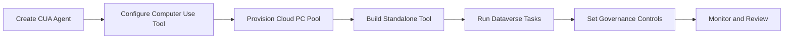

# 🖥️ Lab 28: Build a Computer-Using Agent for Desktop Automation

*Teach an energy-operations agent to see, click, type, and recover across web and desktop workflows.*

## Metadata

| | |
|---|---|
| ⭐ **DIFFICULTY** | Advanced (Level 300) |
| ⏱️ **TIME** | 2 hours |
| 🧩 **PRODUCTS** | Microsoft Copilot Studio, Computer Use, Cloud PC |
| 🏷️ **TAGS** | Computer Use, Desktop Automation, Vision AI, RPA, Process Automation |
| 🏭 **INDUSTRIES** | Energy / Utilities |

## 🎯 Objectives

By the end of this lab, you will be able to:

- Create a computer-using agent (CUA) in Copilot Studio and configure the Computer Use tool against a Cloud PC pool so the agent can drive legacy utility apps that have no APIs.
- Build a standalone computer-use tool that signs in, navigates menus, and reads or enters data across both web and desktop screens.
- Run Dataverse-driven tasks where the agent recovers from unexpected UI states and records each step for review.
- Apply governance controls, monitoring, and human-in-the-loop review so automated desktop actions stay safe, bounded, and auditable.

---

> 🔗 **Related lab:** [Lab 29: Computer Use (GA)](../29-computer-use-ga/index.md) — a focused deep-dive on the generally available computer-use feature. This lab is the end-to-end desktop-automation scenario.

## 🗺️ Lab Flow



---

## Overview

Utilities still depend on a long tail of systems that were never designed for modern API-first automation. Billing portals, outage consoles, GIS viewers, field scheduling apps, and regulatory websites often require a person to sign in, click through menus, and copy information from one screen to another.
In this lab, you will build a **Computer-Using Agent (CUA)** in **Microsoft Copilot Studio** that automates those screen-based tasks using **vision, reasoning, and a virtual mouse and keyboard**. The scenario uses Contoso Energy and Contoso-style operations work such as checking a utility billing portal, capturing account details, and escalating anomalies to operations analysts.
You will also go beyond a simple demo. You will provision execution capacity with **Cloud PC pools**, package repeatable UI automations as **standalone computer-use tools**, and put governance guardrails around the entire solution so it is secure enough for regulated enterprise operations.

---

## 🏗️ What you'll build

| Layer | What you will build |
|---|---|
| **Primary agent** | **Billing Operations Automation Agent** for utility back-office workflows |
| **Computer use tool** | A CUA that signs in to a billing portal and captures account details |
| **Execution platform** | A **Cloud PC pool** for scalable, centrally governed runs |
| **Reusable automation** | A standalone computer-use tool for account lookup and screenshot capture |
| **Governance** | Allowed websites, credentials, logging, audit, and session replay controls |
| **Monitoring** | Activity map review, transcript analysis, and failure triage playbook |

### Architecture summary

```text
User or scheduled trigger
  -> Billing Operations Automation Agent
      -> Computer use tool instructions
      -> Cloud PC pool / managed Windows session
          -> Utility billing portal
          -> Legacy desktop customer information system
      -> Dataverse activity logs + session replay
      -> Analyst review / escalation if confidence drops
```

> 💡 **Tip:** Treat computer use like an enterprise automation workforce member: give it clear instructions, limited access, and observable execution.

---

## Objectives

1. Create a basic Computer-Using Agent that can navigate a utility web application.
2. Configure a Cloud PC pool so the automation runs on managed infrastructure instead of a personal machine.
3. Package a reusable standalone computer-use tool that can be attached to agents or agent flows.
4. Set governance controls such as allow lists, credential strategy, and audit logging.
5. Review transcripts, activity maps, and session replay to troubleshoot failures.

---

## 🧠 Core concepts

| Concept | What it means in this lab |
|---|---|
| **Computer use** | An agent tool that interacts with graphical interfaces using a virtual mouse and keyboard. |
| **CUA model** | The model that interprets the screen, reasons over UI state, and performs actions. |
| **Cloud PC pool** | Windows 365 for Agents-backed capacity used to run computer use securely at scale. |
| **Standalone computer use tool** | A reusable, publishable UI automation component that can be referenced from multiple solutions. |
| **Allowed websites and apps** | An allow list that constrains where the automation can navigate. |
| **Session replay** | A screenshot-based replay of every action taken during a run. |
| **Advanced logging** | Dataverse-backed logs with screenshots, timestamps, and action details. |
| **Human supervision** | A control point for sensitive steps that require review before continuing. |

---

## 📚 Documentation

- [Automate web and desktop apps with computer use](https://learn.microsoft.com/en-us/microsoft-copilot-studio/computer-use)
- [Add standalone computer use tools to agents and agent flows](https://learn.microsoft.com/en-us/microsoft-copilot-studio/computer-use-standalone)
- [Use Cloud PC pool for computer user runs](https://learn.microsoft.com/en-us/microsoft-copilot-studio/use-cloud-pc-pool)
- [Monitor computer use](https://learn.microsoft.com/en-us/microsoft-copilot-studio/monitor-computer-use)

---

## Prerequisites

- Access to **Microsoft Copilot Studio** in an environment where generative orchestration is enabled.
- Permission to add **Tools** and, if needed, publish shared tools from the Tools page.
- A test website or internal utility portal that you are allowed to automate for training purposes.
- If using **Cloud PC pool**, the ability to create or access machine groups in the connected environment.
- Sufficient Dataverse capacity if you plan to keep screenshots and detailed advanced computer use logs.

> ⚠️ **Warning:** Use only non-production accounts and scrubbed test data while you learn. Screen automation can touch sensitive systems quickly if credentials and allow lists are too broad.

---

## 🗺️ Use cases covered

| # | Section | Time | Required |
|---|---|---|---|
| 1 | Create a basic Computer-Using Agent | 25 min | ✅ |
| 2 | Configure Cloud PC pooling | 25 min | ✅ |
| 3 | Add standalone computer-use tools | 25 min | ✅ |
| 4 | Security and governance | 20 min | ✅ |
| 5 | Test and monitor | 25 min | ✅ |

> 💡 **Tip:** If you are teaching this lab live, demonstrate one successful run first so learners can visualize the end state before they start configuring settings.

---

# 🧪 Use Case #1 — Create a basic Computer-Using Agent (25 min)

> 🎯 **Objective:** Set up a CUA that can navigate a utility billing portal and return account details.

### Scenario

An Contoso Energy billing analyst receives frequent requests to confirm whether a customer account is enrolled in paperless billing, autopay, and peak-pricing programs. The billing portal has no easy API for the analyst team, so they want an agent that can open the portal, search for the account, and report the answer.
Your goal is to build the first version of that automation directly inside an agent, using a computer use tool bound to the agent.

### Architecture snapshot

```text
Analyst prompt
  -> Billing Operations Automation Agent
      -> Local computer use tool
          -> Login page
          -> Account search screen
          -> Account summary page
      -> Agent response with captured findings
```

### Step 1 — Create the agent shell

Start with a standard Copilot Studio agent and then attach computer use as a tool. This mirrors how many production solutions evolve: conversational shell first, automation second.

1. Open [Copilot Studio](https://copilotstudio.microsoft.com/) and create a new **Agent** from scratch.
2. Name the agent **Billing Operations Automation Agent** so the purpose is obvious to future makers and operators.
3. In the instructions field, describe the operating model: the agent helps billing analysts inspect customer account status in a portal, confirms missing data with the user, and never changes account settings unless a later lab explicitly adds that behavior.
4. Turn on **generative orchestration** if it is not already enabled in your environment because computer use is only available to agents that use generative orchestration.
5. Save the agent and verify that you can access the **Tools**, **Activity**, and **Overview** pages before you continue.
6. Create a short note for yourself describing which portal pages you expect the tool to touch: sign-in page, search page, and account summary page.

> 💡 **Tip:** Keep the agent instructions focused on when to use the tool, not every click the tool will take. The click path belongs in the tool instructions.

#### Sample prompt for this step

```text
You are a billing operations assistant for Contoso Energy analysts. Help users verify account status in the utility billing portal. Ask for the account number if it is missing. Use the computer use tool only for read-only lookup tasks such as opening the billing portal, searching for an account, and reporting current billing program enrollment. Do not submit changes, update preferences, or confirm transactions unless a separate approved tool exists for that task.
```

### Step 2 — Add the computer use tool

1. Open the agent's **Tools** page and select **Add tool**.
2. Choose **New tool** and then select **Computer use**.
3. Set the **Name** to **Lookup Billing Portal Account** so the activity map is easy to read later.
4. Write a **Description** that tells the orchestrator when the tool should be used, for example when a user asks to look up a customer account, verify billing status, or capture information from the portal.
5. Select the **Computer-Using Agent (CUA)** model for the first build unless your environment requires a different approved model.
6. Do not save yet; you will refine the instructions and inputs first.

> 💡 **Tip:** Descriptions are routing hints. A vague description like 'help with portals' makes the planner choose poorly when the agent grows.

#### Quick verification

- Tool type is **Computer use**.
- The chosen model is visible on the designer page.
- The tool name clearly reflects a read-only lookup action.

### Step 3 — Write explicit UI instructions and inputs

Computer use works best when you state the app name, URL, expected checkpoints, and what to do if the screen looks different than expected.

1. Create an input called **accountNumber** so the tool can accept a different account ID on each run.
2. If the portal uses a utility test tenant, create a second input such as **businessUnit** or **serviceTerritory** to make the search context explicit.
3. In the instructions field, list the intended sequence: open the portal, sign in if already authenticated, search for the account number, open the result, read the billing status fields, and return the findings.
4. Specify the exact site name and URL so the tool does not guess between a training portal and a production portal.
5. Tell the tool what to do when a page loads slowly: wait briefly, refresh once, and stop with a clear error if the sign-in page or account summary page never appears.
6. Tell the tool what not to do: do not change billing preferences, do not click Save, do not navigate to payment submission, and do not acknowledge any confirmation dialogs.
7. Describe which fields to capture in the final response, such as paperless billing status, autopay status, and rate-plan name.
8. Save the draft after reading the instructions aloud once. If they sound ambiguous to a human reviewer, they are ambiguous to the model too.

> ⚠️ **Warning:** A tool instruction that says 'log in if needed' is risky unless you also define the credential strategy and the approved sign-in path.

#### Sample computer use instruction set for this step

```text
Open https://utilitybilling.contoso-energy.test in Microsoft Edge.
Use the existing signed-in session if one is available.
If the login page appears, stop and report that interactive sign-in is required.
Find the Account Search field.
Enter {{accountNumber}} and submit the search.
Open the first exact account match.
Read the fields for Paperless Billing, AutoPay, Rate Plan, and Service Address.
Return those values in a concise bullet list.
Do not update settings, submit forms, or click any Save, Confirm, or Payment buttons.
If the account is not found, report Account not found.
If the page structure is different than expected, capture a screenshot and stop with a clear error summary.
```

### Step 4 — Configure machine and credentials

1. In the tool configuration, review the **Machine** setting and temporarily use a nonproduction machine or the default test machine if your environment already provides one.
2. Open the **Connection** section and confirm which identity the tool will use at run time.
3. Choose **Maker-provided credentials** only for isolated training exercises where the maker's account is allowed to access the portal and the security team approves that pattern.
4. If your environment supports a better production pattern, note that you will later move to centrally stored credentials or run-only access with a controlled machine identity.
5. Add an allow list entry for the utility billing domain so navigation is constrained to the intended site.
6. If the tool needs a desktop application later, document the exact application name now so the governance review starts early.

> 💡 **Tip:** A narrow allow list is one of the easiest ways to reduce accidental navigation drift during testing.

### Step 5 — Test the first account lookup

1. Save the tool and return to the agent test chat.
2. Ask the agent to look up a known training account and confirm that it requests the account number if you did not provide one.
3. Observe the **Activity map** while the run executes and confirm that the **Lookup Billing Portal Account** tool is the resource selected by the planner.
4. When the run finishes, compare the answer to the actual test account record in the portal.
5. If the agent selected the wrong tool or refused to use computer use, tighten the tool description and the agent instructions before re-running.
6. If the tool landed on the wrong page, revise the instruction set so the page title, search field name, and stop conditions are more explicit.


#### Quick verification

- The agent asked for missing input when needed.
- The activity map shows the computer use tool call.
- The final answer returned only read-only fields.
- No settings were changed in the portal.

### Test prompts

Use these prompts in Copilot Studio test chat, the flow test pane, or the voice test panel as appropriate:

```text
Look up billing account 10004567 and tell me whether it is on autopay and paperless billing.
Check account 20001888 in the billing portal and summarize the rate plan and service address.
Use the portal to verify whether account 30001234 exists. If it does not, tell me clearly.
```

### Validation checklist

- The agent can invoke the tool without manually opening a topic.
- The tool reaches the account summary page or produces a controlled error.
- The final response uses captured portal values rather than guessed answers.
- The instructions prevent write-back or confirmation clicks.

### What you accomplished

| Outcome | Why it matters |
|---|---|
| Created a CUA-enabled agent | You established the conversational shell that decides when screen automation is appropriate. |
| Defined structured inputs | Dynamic inputs let the same automation run safely across many customer accounts. |
| Constrained the tool behavior | Explicit do-not-click guidance reduces the chance of an unintended change. |
| Ran the first end-to-end test | Early testing proves whether the tool routing, screen path, and response format are viable. |

### Key takeaways

- Computer use succeeds when the task is narrow, observable, and explicit.
- Descriptions and instructions work together: one drives selection, the other drives execution.
- Read-only scenarios are the safest place to start in a regulated utility environment.

### Troubleshooting

- If the tool opens the wrong site, add the exact URL and tighten the allowed website list.
- If the search result grid changes layout, update the instructions to mention stable labels or headings rather than pixel positions.
- If login interrupts the run, move to a better credential pattern before expanding scope.

### Evidence to capture

- Save at least one successful run, screenshot, or transcript excerpt for future demos and regression checks.
- Record the configuration choices that most influenced the result, such as descriptions, instructions, model selection, or access settings.
- Note one failure mode or edge case discovered during this use case so the team can retest it later.
- Capture which stakeholder would need to review this capability before broader rollout.

### Improvement ideas

- Add one more regression prompt that stresses this use case from a different angle.
- Decide whether any part of this pattern should become a reusable asset for other agents, flows, or teams.
- Review whether logging, governance, or support ownership need to be tightened before production use.
- Identify the next adjacent scenario you would automate or route now that this use case is working.

### Stakeholder discussion prompts

- What business outcome improves most if this use case becomes a standard operating capability?
- What would make the result more trustworthy to operations, security, or compliance reviewers?
- Which metric should be watched first after rollout to prove this use case is adding value?
- What is the simplest rollback plan if this use case behaves unexpectedly after a change?

### ✅ You've completed Use Case #1

You now have the foundation to move from **a generic agent shell** to **a working read-only portal automation**.

---

# 🧪 Use Case #2 — Configure Cloud PC pooling (25 min)

> 🎯 **Objective:** Set up Cloud PC infrastructure for secure, scalable CUA execution.

### Scenario

A maker's laptop is not the right execution surface for production-grade utility automation. The operations team needs centrally managed, Entra-joined, Intune-enrolled capacity that security can govern and operations can scale.
You will provision a Cloud PC pool and bind the computer use tool to that pool.

### Architecture snapshot

```text
Agent tool
  -> Cloud PC pool
      -> Auto-scaled managed Windows instances
      -> Entra joined / Intune enrolled
      -> Shared governance and access control
```

### Step 1 — Review Cloud PC pool prerequisites

1. Read the **Use Cloud PC pool for computer user runs** documentation and note that the feature is preview-oriented in current Microsoft Learn guidance.
2. Confirm that your environment supports machine management and that the operations or platform team can provision machine groups.
3. Verify whether your tenant already has a billing plan for **Windows 365 for Agents** or whether you are using the limited free evaluation capacity described in the documentation.
4. Document the security requirements for the pool: Entra join, Intune compliance, least-privilege access, and naming standards.
5. Identify whether your billing portal also requires access to SharePoint, Microsoft 365, or another internal resource so you can verify network path and identity requirements up front.
6. Plan a naming convention such as **cua-billing-west-dev** so analysts can recognize the intended use and environment.

> **Note:** Microsoft Learn notes that a tenant can create up to two Cloud PC pools for evaluation without a billing plan and that published autonomous runs receive limited free hours for testing.

### Step 2 — Create the Cloud PC pool

1. Return to the computer use tool and open the **Machine** dropdown.
2. Under **Cloud PC pool**, select **Add new**.
3. Enter the pool name and description, for example **CUA Billing Pool - Dev** and a description that states it is for billing portal automation in a nonproduction environment.
4. Decide whether to enable **run-only access for all users in this environment** based on your governance model; in a shared lab, this can reduce friction, but in production you should keep access scoped.
5. Select **Create** and wait for provisioning to begin.
6. Refresh the machine list periodically until the new pool appears as available.

> 💡 **Tip:** Provisioning can take up to 30 minutes, so use that wait time to finish documentation, input design, or allow-list review.

### Step 3 — Review the pool in Power Automate

1. Select **See machine details** from the computer use tool or open the Power Automate portal and navigate to **Monitor** > **Machines** > **Machine groups**.
2. Inspect the Cloud PC pool details and confirm the description, owner, and environment match your intended lab.
3. Open **Manage access** and review who can use or administer the pool.
4. If you are collaborating with other makers, add them with the minimum permissions required to test or manage the pool.
5. Document where operations staff will monitor machine health and where they will adjust access in future.
6. Record the link to the pool details page in your project notes so the team can find it quickly during support incidents.

> ⚠️ **Warning:** Do not grant broad maker access to a pool that can reach production portals unless your security team has approved that access pattern.

### Step 4 — Bind the billing automation to the pool

1. Return to the **Lookup Billing Portal Account** tool configuration.
2. In the **Machine** section, select the new Cloud PC pool instead of a personal or ad hoc machine.
3. Review the connection and credential settings again because the execution identity might behave differently on a managed machine.
4. Validate that the required browser or desktop application exists on the base image, or coordinate with the endpoint team if it must be installed.
5. If your pool must reach internal portals, verify VPN, private network routing, or conditional access requirements before testing.
6. Save the tool and capture a screenshot or note showing the selected pool for governance review.


#### Quick verification

- The correct Cloud PC pool is selected in the Machine field.
- The required browser or application is available on the image.
- Access to the necessary URL or desktop app is permitted from the pool.

### Step 5 — Plan for scale and recovery

1. Estimate the expected concurrency for your billing operations scenario, such as morning batch requests or post-storm customer billing reviews.
2. Decide whether a single pool can serve all use cases or whether you need separate pools for billing, outage, and field scheduling automations.
3. Define an escalation path for failed machines, including who checks Intune compliance, who updates credentials, and who validates application availability.
4. Document how you will pause automation safely if the portal changes unexpectedly, such as disabling the tool, narrowing access, or toggling agent availability.
5. For pilot rollouts, plan a limited user group first so you can gather performance and governance evidence before broader release.
6. Add these decisions to the project's operating model so the agent is supported like a real enterprise service.


### Test prompts

Use these prompts in Copilot Studio test chat, the flow test pane, or the voice test panel as appropriate:

```text
Run the billing account lookup using the managed Cloud PC pool and confirm the result comes back normally.
Try the same lookup after refreshing the machine list so you know the selected pool is persistent.
```

### Validation checklist

- A Cloud PC pool exists and is selectable from the computer use tool.
- The tool can run on the managed pool instead of a personal machine.
- Access and administration are scoped intentionally.
- The team has a documented monitoring and support path for the pool.

### What you accomplished

| Outcome | Why it matters |
|---|---|
| Provisioned managed execution capacity | Your automation now runs on governed infrastructure rather than an individual workstation. |
| Reviewed access controls | Machine sharing and admin boundaries matter in regulated operations. |
| Bound the tool to the pool | The agent now knows where to execute the automation. |
| Planned for scale | Operational readiness prevents the pilot from stalling when demand increases. |

### Key takeaways

- Cloud PC pools turn a single-user demo into a team-ready automation platform.
- Machine governance is part of the solution design, not a post-go-live afterthought.
- Infrastructure decisions shape both security posture and reliability.

### Troubleshooting

- If the pool does not appear, refresh the machine list and confirm provisioning completed successfully.
- If the portal is unreachable from the pool, investigate network path, conditional access, or browser installation gaps.
- If collaborators cannot test, review pool sharing permissions in Power Automate.

### Evidence to capture

- Save at least one successful run, screenshot, or transcript excerpt for future demos and regression checks.
- Record the configuration choices that most influenced the result, such as descriptions, instructions, model selection, or access settings.
- Note one failure mode or edge case discovered during this use case so the team can retest it later.
- Capture which stakeholder would need to review this capability before broader rollout.

### Improvement ideas

- Add one more regression prompt that stresses this use case from a different angle.
- Decide whether any part of this pattern should become a reusable asset for other agents, flows, or teams.
- Review whether logging, governance, or support ownership need to be tightened before production use.
- Identify the next adjacent scenario you would automate or route now that this use case is working.

### Stakeholder discussion prompts

- What business outcome improves most if this use case becomes a standard operating capability?
- What would make the result more trustworthy to operations, security, or compliance reviewers?
- Which metric should be watched first after rollout to prove this use case is adding value?
- What is the simplest rollback plan if this use case behaves unexpectedly after a change?

### ✅ You've completed Use Case #2

You now have the foundation to move from **a maker-owned execution pattern** to **a managed, scalable execution platform**.

---

# 🧪 Use Case #3 — Add standalone computer-use tools (25 min)

> 🎯 **Objective:** Create modular UI automation tools that can be reused by other agents and agent flows.

### Scenario

The billing lookup you created is valuable beyond a single agent. Operations wants the same account lookup tool available in a collections agent, a field-service exception flow, and a supervisor dashboard workflow.
You will build a standalone computer-use tool so the logic can be published once and consumed many times.

### Architecture snapshot

```text
Shared Tools library
  -> Standalone computer use tool (published)
      -> Referenced by agent flows
      -> Copied into local agent tools when needed
      -> Centralized governance and recent run visibility
```

### Step 1 — Create a standalone computer use tool from the Tools page

1. In Copilot Studio, open the global **Tools** page from the left navigation, not the local tool list inside a single agent.
2. Select **New tool** and choose **Computer use**.
3. On the **Overview** tab, set the name to **Shared Billing Account Lookup** and write a description that explains it performs read-only portal lookups for utility customer accounts.
4. Use the description to distinguish this shared tool from other future tools such as payment-plan enrollment or outage ticket review.
5. Save the tool metadata and switch back to the **Designer** tab.
6. Verify that the tool shows a publication status indicator so you know it can later be published for reuse.

> 💡 **Tip:** A shared tool description should be written for other makers, not just the orchestrator.

### Step 2 — Configure model, parameters, and outputs

1. Select the same approved model you used for the local billing lookup, unless your team wants to compare results across models.
2. Create input parameters such as **accountNumber**, **territory**, and **analystNotes** if the flow or agent needs to pass dynamic context into the run.
3. Design outputs that downstream steps can consume, such as **ratePlan**, **paperlessBillingStatus**, **autopayStatus**, and **serviceAddress**.
4. Write the instructions so the tool extracts those fields explicitly instead of returning a large freeform paragraph.
5. Add stored credentials or approved connection settings so the tool is runnable independent of any one maker's draft configuration.
6. Use the built-in test sandbox to validate that the outputs are populated consistently before you publish the tool.


#### Sample shared tool instruction set for this step

```text
Open the billing portal in Microsoft Edge.
Search for account {{accountNumber}}.
Open the first exact match.
Capture the values for:
- Rate Plan
- Paperless Billing
- AutoPay
- Service Address
Return each value through the matching output parameter.
Do not update account settings or submit forms.
```

### Step 3 — Set allow lists and human supervision

1. Open the configuration areas for **Allowed websites and desktop apps** and add only the billing portal hostnames and approved applications.
2. If the tool ever leaves the approved site set during testing, treat that as a governance failure and refine the instructions before publishing.
3. Review whether **Human supervision** is needed for sensitive steps such as opening personally identifiable billing documents or reading a high-risk exception screen.
4. If supervision is enabled, document the exact decision point and who is responsible for approving or rejecting the step.
5. Confirm that all credential references are named clearly so operations can rotate them later without guessing which automation is affected.
6. Save the draft once the tool boundary is explicit and defensible.

> ⚠️ **Warning:** Because standalone tools are reusable, weak governance settings get copied into many solutions quickly.

### Step 4 — Publish and add the tool to an agent flow

1. Select **Publish** to make the standalone tool available to agent flows.
2. Open an existing **agent flow** or create a small flow triggered by **When an agent calls the flow**.
3. Add a step and choose the published **Shared Billing Account Lookup** tool from the action picker.
4. Map the incoming flow parameter to **accountNumber** and store the outputs in later flow variables or a **Respond to agent** action.
5. Save the flow and note that agent flows always reference the latest published version of the standalone tool.
6. If you also add the tool to a normal agent as a local tool, note the lifecycle difference: the agent receives a duplicated local copy, not a live reference.


#### Quick verification

- The tool is published, not just saved as a draft.
- The flow can see the tool in the picker.
- Inputs and outputs map cleanly in the flow designer.

### Step 5 — Compare local-copy versus referenced behavior

1. Add the same standalone tool to an agent as a local tool and observe that Copilot Studio duplicates it into the agent context.
2. Update the original standalone tool description, publish again, and compare what changed in the flow versus what changed in the agent.
3. Confirm that the flow now uses the newest published behavior while the agent's local copy remains independent until you edit it separately.
4. Use this difference to decide which pattern is correct for your governance model: centralized flow reference or independent agent copy.
5. Document which business scenarios should use the flow-based reference pattern and which should use local agent copies.
6. Share that lifecycle note with your platform team because it affects release management and troubleshooting.


### Test prompts

Use these prompts in Copilot Studio test chat, the flow test pane, or the voice test panel as appropriate:

```text
Call the account lookup flow for account 10004567 and return the output fields as JSON-like values.
Use the shared tool in the collections agent for account 20001888 and verify it still honors the read-only instructions.
```

### Validation checklist

- A published standalone tool exists on the global Tools page.
- The tool exposes clear inputs and outputs.
- An agent flow can consume the published tool.
- The team understands the difference between referenced flow behavior and duplicated local agent behavior.

### What you accomplished

| Outcome | Why it matters |
|---|---|
| Published a reusable UI automation | You created a building block that can be governed once and reused many times. |
| Mapped structured inputs and outputs | Structured contracts make the tool useful inside deterministic flows. |
| Applied centralized guardrails | Allow lists and supervision travel with the shared asset. |
| Learned lifecycle differences | Understanding copy versus reference behavior prevents deployment surprises. |

### Key takeaways

- Standalone computer use tools are the bridge between one-off experiments and repeatable platform assets.
- Publishing is not just a deployment action; it is a governance event.
- Inputs and outputs are what make UI automation composable.

### Troubleshooting

- If the tool is missing in the flow picker, confirm it is published and not still in draft state.
- If outputs are blank, strengthen the instructions so the tool captures named fields explicitly.
- If a local agent copy behaves differently than the flow version, remember that local tools are duplicated, not linked.

### Evidence to capture

- Save at least one successful run, screenshot, or transcript excerpt for future demos and regression checks.
- Record the configuration choices that most influenced the result, such as descriptions, instructions, model selection, or access settings.
- Note one failure mode or edge case discovered during this use case so the team can retest it later.
- Capture which stakeholder would need to review this capability before broader rollout.

### Improvement ideas

- Add one more regression prompt that stresses this use case from a different angle.
- Decide whether any part of this pattern should become a reusable asset for other agents, flows, or teams.
- Review whether logging, governance, or support ownership need to be tightened before production use.
- Identify the next adjacent scenario you would automate or route now that this use case is working.

### Stakeholder discussion prompts

- What business outcome improves most if this use case becomes a standard operating capability?
- What would make the result more trustworthy to operations, security, or compliance reviewers?
- Which metric should be watched first after rollout to prove this use case is adding value?
- What is the simplest rollback plan if this use case behaves unexpectedly after a change?

### ✅ You've completed Use Case #3

You now have the foundation to move from **a single-agent automation** to **a reusable automation asset**.

---

# 🧪 Use Case #4 — Security and governance (20 min)

> 🎯 **Objective:** Configure audit logging, session replay, and governance policies for CUA.

### Scenario

Before security signs off on the pilot, they want to know what the automation can open, what logs are retained, how screenshots are stored, and how auditors can review runs after the fact.
You will harden the solution with logging, retention, and access decisions that fit an energy-industry governance model.

### Step 1 — Turn on advanced logging in the environment

1. Open the [Power Platform admin center](https://admin.powerplatform.microsoft.com/) and navigate to your environment settings.
2. Go to **Products** > **Features** and confirm that **Allow conversation transcripts and their associated metadata to be saved in Dataverse** is enabled if your environment policy allows it.
3. Scroll to the **Computer Use** section and confirm **Store logs in Dataverse** is turned on.
4. Review the logging verbosity options: **All data**, **Data without screenshots**, and **Minimal**.
5. Choose the lowest verbosity that still satisfies your support and audit requirements for this lab.
6. Set an appropriate **Log retention time** so you do not keep screenshots longer than policy allows.

> ⚠️ **Warning:** Screenshots can contain sensitive customer or employee information. Retention decisions should involve compliance and privacy stakeholders.

### Step 2 — Decide on screenshot, Purview, and audit posture

1. If your organization uses Microsoft Purview, evaluate whether **Send audit logs to Microsoft Purview** should be enabled for this environment.
2. Document that Purview records appear under the activity term **CUAOperation** when the setting is turned on.
3. Define which teams may review session replay: platform operations, security analysts, privacy reviewers, or business owners.
4. For highly sensitive flows, prefer **Data without screenshots** unless screenshots are truly required for troubleshooting.
5. Record the retention rationale for the lab, such as keeping screenshots for seven days during pilot troubleshooting and then shortening or removing them later.
6. Capture the decision in a governance table or change record so the setting is auditable itself.


### Step 3 — Constrain access and credentials

1. Review every stored credential used by the tool and make sure it follows a named service-account or approved delegated-account pattern.
2. Remove any lingering personal test credentials from draft tools or maker-only experiments.
3. Review pool sharing, run-only access, and agent access so only authorized users can trigger the automation.
4. Check the allowed websites and allowed applications lists again to confirm they reflect only approved destinations.
5. Document the break-glass plan: how to disable the tool, revoke credentials, or disconnect the machine if suspicious behavior is observed.
6. Add a simple change-management step stating that any instruction update must be tested and reviewed before production publication.


### Step 4 — Prepare an audit-ready runbook

1. Create a runbook section that explains what evidence exists for each computer use run: transcript, activity map, screenshots, timestamps, machine name, and credentials used.
2. List who owns first-line triage, second-line platform support, and compliance review.
3. Add a severity model for failures such as page drift, credential failure, blocked navigation, or unexpected write behavior.
4. Define a quarterly review to confirm the portal still matches the instructions and the allow lists still reflect approved sites.
5. Link the runbook to the exact Microsoft Learn monitoring articles so new operators can self-serve basic troubleshooting.
6. Store the runbook where your utility operations team already keeps automation and support procedures.


#### Quick verification

- Logging level selected intentionally.
- Retention period documented.
- Credential and access review completed.
- Break-glass disable path recorded.

### Test prompts

Use these prompts in Copilot Studio test chat, the flow test pane, or the voice test panel as appropriate:

```text
Run a billing lookup and then open the activity details to confirm that replay, screenshots, and timestamps are visible according to the selected logging level.
```

### Validation checklist

- Advanced computer use logging is configured intentionally.
- Retention and screenshot posture align with policy.
- Credentials, pool access, and allow lists were reviewed.
- A support and audit runbook exists for the automation.

### What you accomplished

| Outcome | Why it matters |
|---|---|
| Enabled observability controls | You can now review what the automation did instead of trusting a black box. |
| Defined data-retention posture | Regulated enterprises need explicit reasoning for screenshot and log storage. |
| Reduced attack surface | Tighter credentials and allow lists reduce risk materially. |
| Prepared an audit story | A repeatable runbook makes pilot approval easier. |

### Key takeaways

- Governance decisions are part of the product, not paperwork around the product.
- The safest automation is the one with narrow access and rich observability.
- Privacy, security, and operations all need a seat at the table for computer use.

### Troubleshooting

- If session details are missing, confirm advanced logging is enabled at the environment level.
- If storage concerns arise, lower verbosity or shorten retention before expanding usage.
- If auditors cannot access evidence, revisit both the logging settings and the support runbook.

### Evidence to capture

- Save at least one successful run, screenshot, or transcript excerpt for future demos and regression checks.
- Record the configuration choices that most influenced the result, such as descriptions, instructions, model selection, or access settings.
- Note one failure mode or edge case discovered during this use case so the team can retest it later.
- Capture which stakeholder would need to review this capability before broader rollout.

### Improvement ideas

- Add one more regression prompt that stresses this use case from a different angle.
- Decide whether any part of this pattern should become a reusable asset for other agents, flows, or teams.
- Review whether logging, governance, or support ownership need to be tightened before production use.
- Identify the next adjacent scenario you would automate or route now that this use case is working.

### Stakeholder discussion prompts

- What business outcome improves most if this use case becomes a standard operating capability?
- What would make the result more trustworthy to operations, security, or compliance reviewers?
- Which metric should be watched first after rollout to prove this use case is adding value?
- What is the simplest rollback plan if this use case behaves unexpectedly after a change?

### ✅ You've completed Use Case #4

You now have the foundation to move from **a functional automation** to **a governed automation service**.

---

# 🧪 Use Case #5 — Test and monitor (25 min)

> 🎯 **Objective:** Review activity maps, transcript details, and failure patterns so you can run CUA reliably.

### Scenario

Your pilot is live for a small billing operations team. The next question is not whether the automation can work once, but whether you can operate it day after day as screens, data, and network conditions change.
You will use Copilot Studio and Dataverse-backed activity details to monitor success and troubleshoot failures.

### Step 1 — Run a controlled success case

1. Use a known-good training account and run the lookup from the agent test chat.
2. Open the **Activity** page and select the run.
3. Compare the **Activity map** and **Transcript** views so you understand both the orchestration path and the step-by-step computer use behavior.
4. Select the computer use action in the activity map to open the side panel.
5. Review the **Summary** section for duration, action count, screenshot count, machine name, and credential reference.
6. Open **Websites & applications** to confirm the run stayed inside the approved boundary.


### Step 2 — Inspect session replay and timing

1. Use the **Session replay** controls to step through the screenshots one action at a time.
2. Look for slow pages, ambiguous click targets, or repeated recovery attempts that indicate instruction weakness.
3. Record which step consumed the most time so you can optimize the flow later.
4. Note whether the automation hesitated on search results, pagination, or modal dialogs because those are common UI drift points.
5. If the average time per action seems high, consider simplifying the navigation path or reducing unnecessary page hops.
6. Share the replay with another maker or operator to confirm your interpretation is not biased.

> 💡 **Tip:** Session replay is especially useful for business stakeholders because it shows the automation visually instead of as abstract logs.

### Step 3 — Simulate a failure and capture evidence

1. Test with an invalid or missing account number to trigger a controlled not-found path.
2. If allowed in your lab tenant, temporarily point the search to a screen variant or a known edge case to observe how the tool behaves when the UI changes.
3. Review the transcript for reasoning messages that explain why the tool stopped or retried.
4. Export session logs if your review process requires offline evidence for a support ticket or audit trail.
5. Capture the exact failing step, screenshot, and error summary in a triage document.
6. Decide whether the failure calls for instruction tuning, governance changes, or application-owner escalation.

> ⚠️ **Warning:** Do not create destructive failures in production-like systems just to see what happens. Use harmless negative paths such as invalid IDs or unavailable pages.

### Step 4 — Create a monitoring scorecard

1. Define three to five simple operational metrics for the pilot: success rate, average duration, retry count, human escalation count, and most common failure step.
2. Review recent runs from the last several days and capture those metrics in a spreadsheet or dashboard.
3. Tag failures by category such as login issue, page drift, data not found, or machine/network issue.
4. Meet with the business owner and decide what thresholds are acceptable before scaling usage to more analysts.
5. Use the scorecard to choose the next improvement backlog items, for example stronger instructions, a faster page path, or a credential update.
6. Revisit the scorecard after every meaningful tool change so you can detect regressions quickly.


### Step 5 — Build the support handoff pattern

1. Document a standard incident template that includes run ID, machine name, tool version, input values used, and last successful screenshot.
2. Define who should receive first contact when a failure occurs during working hours versus after hours.
3. Specify when a run should be retried automatically and when it should be stopped pending human review.
4. Add a short knowledge-base article for common fixes such as relinking credentials, refreshing allow lists, or updating instructions after UI drift.
5. Train one backup operator who did not build the tool to perform the support steps so the automation is not dependent on a single maker.
6. Run one tabletop exercise where a colleague pretends to be the support analyst and follows your handoff process end to end.


### Test prompts

Use these prompts in Copilot Studio test chat, the flow test pane, or the voice test panel as appropriate:

```text
Look up account 10004567 and then review the run details for timing and screenshots.
Look up account INVALID-TEST and verify the agent reports a clean not-found path without guessing.
```

### Validation checklist

- You can interpret both Activity map and Transcript views.
- You know how to find session replay, websites accessed, and credential references.
- You captured at least one controlled failure and categorized it.
- You created a basic monitoring scorecard and support handoff process.

### What you accomplished

| Outcome | Why it matters |
|---|---|
| Reviewed operational telemetry | You can now see how the automation behaves instead of judging only the final answer. |
| Observed session replay | Replay is the fastest way to explain failures to business and technical teams alike. |
| Built a scorecard | Lightweight metrics help you decide whether the pilot is ready to scale. |
| Defined support ownership | Operational clarity is what turns a demo into a service. |

### Key takeaways

- Every successful pilot needs both build-time and run-time discipline.
- Activity evidence should drive changes, not anecdotes.
- Supportability is a feature of the lab deliverable.

### Troubleshooting

- If activity details are too sparse, revisit logging verbosity before the next test run.
- If failures cluster around a single page, simplify the instruction path or work with the app owner on UI stability.
- If business reviewers distrust the automation, use session replay to make the behavior transparent.

### Evidence to capture

- Save at least one successful run, screenshot, or transcript excerpt for future demos and regression checks.
- Record the configuration choices that most influenced the result, such as descriptions, instructions, model selection, or access settings.
- Note one failure mode or edge case discovered during this use case so the team can retest it later.
- Capture which stakeholder would need to review this capability before broader rollout.

### Improvement ideas

- Add one more regression prompt that stresses this use case from a different angle.
- Decide whether any part of this pattern should become a reusable asset for other agents, flows, or teams.
- Review whether logging, governance, or support ownership need to be tightened before production use.
- Identify the next adjacent scenario you would automate or route now that this use case is working.

### Stakeholder discussion prompts

- What business outcome improves most if this use case becomes a standard operating capability?
- What would make the result more trustworthy to operations, security, or compliance reviewers?
- Which metric should be watched first after rollout to prove this use case is adding value?
- What is the simplest rollback plan if this use case behaves unexpectedly after a change?

### ✅ You've completed Use Case #5

You now have the foundation to move from **a built and governed automation** to **an operable automation with monitoring discipline**.

---

# 🙋 Summary

### What you accomplished

| Step | What you did |
|---|---|
| **Agent build** | Created a billing-focused Computer-Using Agent for read-only portal automation |
| **Infrastructure** | Provisioned and selected a Cloud PC pool for managed execution |
| **Reuse** | Published a standalone computer-use tool and attached it to an agent flow |
| **Governance** | Configured logging, retention, allow lists, and credential controls |
| **Operations** | Used session replay and activity maps to create a monitoring and support model |

### Why this matters for energy and utilities

- Utilities rely on many systems that are still screen-first rather than API-first.
- Computer use extends automation into billing, outage, compliance, and field workflows that previously required swivel-chair work.
- Governed UI automation can shorten cycle times without sacrificing auditability.

### Recommended next steps

- Add a second tool that captures outage ticket information from a legacy desktop app.
- Introduce human supervision for any step that reads or writes regulated customer data.
- Evaluate whether a future API integration should replace the most fragile parts of the screen automation.

> 🔋 **Final thought:** The most successful computer-use solutions are not the ones that click the fastest; they are the ones that business, operations, and security teams all trust.

---

## 📎 Appendix A — Suggested facilitation prompts

Use these prompts to guide discussion during a live workshop, customer briefing, or internal enablement session.

- Where in our current Contoso Energy or Contoso workflow are analysts retyping or rechecking information in a browser or desktop app?
- Which of those steps are safe for read-only automation today, and which require human supervision?
- If the portal owner gave us one API next quarter, which screen-automation step would we replace first?
- What evidence would our audit team need to be comfortable with session replay and screenshot retention?
- How would we pause this automation quickly during a billing release weekend?

## 📎 Appendix B — Environment readiness checklist

- Named nonproduction accounts are available for testing.
- The billing portal or desktop app is reachable from the selected machine or Cloud PC pool.
- Allow lists contain only approved domains and applications.
- Credential ownership and rotation process are documented.
- Dataverse capacity is sufficient for the selected logging level.
- Support contacts know how to retrieve the activity map and session replay.
- A rollback or disable plan exists before broader rollout.

## 📎 Appendix C — Extension ideas

- Build a second standalone tool that downloads a PDF bill and extracts key fields into structured outputs.
- Add a flow that triggers the shared billing lookup asynchronously and posts the result to Teams.
- Compare run quality across CUA and an approved Anthropic-based computer use model if your environment allows external models.
- Create a compliance-focused scorecard that tracks screenshot retention and human-escalation counts by week.

## 📎 Appendix D — Demo prompt bank

Use these copy-paste prompts when you want a quick demonstration set for the lab.

- Look up billing account 10004567 and tell me whether it is on autopay and paperless billing.
- Check account 20001888 in the billing portal and summarize the rate plan and service address.
- Use the portal to verify whether account 30001234 exists. If it does not, tell me clearly.
- Run the billing account lookup using the managed Cloud PC pool and confirm the result comes back normally.
- Try the same lookup after refreshing the machine list so you know the selected pool is persistent.
- Call the account lookup flow for account 10004567 and return the output fields as JSON-like values.
- Use the shared tool in the collections agent for account 20001888 and verify it still honors the read-only instructions.
- Run a billing lookup and then open the activity details to confirm that replay, screenshots, and timestamps are visible according to the selected logging level.
- Look up account 10004567 and then review the run details for timing and screenshots.
- Look up account INVALID-TEST and verify the agent reports a clean not-found path without guessing.

## 📎 Appendix E — Change control checklist

- Record the feature, tool, or topic version before making edits.
- Retest at least one known-good prompt after every significant change.
- Capture screenshots or transcripts for any issue you escalate.
- Review security and access implications whenever you add a new data source or tool.
- Document the owner of every integration, flow, or connected agent used in the lab.
- Use a limited pilot audience before broad rollout.
- Define rollback steps before enabling a new capability in production-like environments.
- Revisit retention and logging settings whenever you expand scope.
- Store prompt or instruction changes in version control or change records where possible.
- Schedule a follow-up review after the pilot to decide what should be hardened, simplified, or retired.

## 📎 Appendix F — Vocabulary quick reference

- Computer use: An agent tool that interacts with graphical interfaces using a virtual mouse and keyboard.
- CUA model: The model that interprets the screen, reasons over UI state, and performs actions.
- Cloud PC pool: Windows 365 for Agents-backed capacity used to run computer use securely at scale.
- Standalone computer use tool: A reusable, publishable UI automation component that can be referenced from multiple solutions.
- Allowed websites and apps: An allow list that constrains where the automation can navigate.
- Session replay: A screenshot-based replay of every action taken during a run.

## 📎 Appendix G — Use-case review worksheet

### Use Case #1 — Create a basic Computer-Using Agent

- Objective review: Set up a CUA that can navigate a utility billing portal and return account details.
- Success evidence to collect: The agent can invoke the tool without manually opening a topic.
- Most important takeaway: Computer use succeeds when the task is narrow, observable, and explicit.
- Most likely support issue: If the tool opens the wrong site, add the exact URL and tighten the allowed website list.
- Suggested next enhancement: Read-only scenarios are the safest place to start in a regulated utility environment.

### Use Case #2 — Configure Cloud PC pooling

- Objective review: Set up Cloud PC infrastructure for secure, scalable CUA execution.
- Success evidence to collect: A Cloud PC pool exists and is selectable from the computer use tool.
- Most important takeaway: Cloud PC pools turn a single-user demo into a team-ready automation platform.
- Most likely support issue: If the pool does not appear, refresh the machine list and confirm provisioning completed successfully.
- Suggested next enhancement: Infrastructure decisions shape both security posture and reliability.

### Use Case #3 — Add standalone computer-use tools

- Objective review: Create modular UI automation tools that can be reused by other agents and agent flows.
- Success evidence to collect: A published standalone tool exists on the global Tools page.
- Most important takeaway: Standalone computer use tools are the bridge between one-off experiments and repeatable platform assets.
- Most likely support issue: If the tool is missing in the flow picker, confirm it is published and not still in draft state.
- Suggested next enhancement: Inputs and outputs are what make UI automation composable.

### Use Case #4 — Security and governance

- Objective review: Configure audit logging, session replay, and governance policies for CUA.
- Success evidence to collect: Advanced computer use logging is configured intentionally.
- Most important takeaway: Governance decisions are part of the product, not paperwork around the product.
- Most likely support issue: If session details are missing, confirm advanced logging is enabled at the environment level.
- Suggested next enhancement: Privacy, security, and operations all need a seat at the table for computer use.

### Use Case #5 — Test and monitor

- Objective review: Review activity maps, transcript details, and failure patterns so you can run CUA reliably.
- Success evidence to collect: You can interpret both Activity map and Transcript views.
- Most important takeaway: Every successful pilot needs both build-time and run-time discipline.
- Most likely support issue: If activity details are too sparse, revisit logging verbosity before the next test run.
- Suggested next enhancement: Supportability is a feature of the lab deliverable.

## 📎 Appendix H — Facilitator retrospective questions

- Which part of the lab delivered the clearest business value signal?
- Where did learners need the most clarification or setup help?
- Which configuration step should be templatized for future workshops?
- What governance question came up repeatedly during testing?
- Which scenario felt most production-ready by the end of the lab?
- Which scenario should stay in pilot or preview status longer?
- What data, screenshot, or transcript artifact should be saved as a future teaching example?
- What would you simplify if you had to teach this lab in half the time?

## 📎 Appendix I — Role-based adaptation ideas

- For utility executives: shorten outputs into briefing bullets and decision-oriented summaries.
- For operations managers: emphasize current blockers, exceptions, and next actions.
- For field supervisors: simplify the language and foreground immediate procedural steps.
- For analysts: retain more detail, numeric evidence, and traceability to underlying sources.
- For compliance reviewers: elevate logging, retention, consent, and approval checkpoints.
- For helpdesk or contact-center leads: prioritize repeatability, escalation clarity, and support runbooks.

## 📎 Appendix J — Final quality gate

- At least one successful end-to-end scenario has been recorded.
- At least one edge case or failure path has been tested deliberately.
- Descriptions, instructions, and prompts are understandable to a reviewer who did not build the solution.
- Ownership is documented for every connected service, flow, tool, or knowledge source.
- A rollback or disable path exists before broader rollout.
- The pilot audience and feedback loop are defined.

## 📎 Appendix K — Quick demo script

- Start with the business problem in one sentence.
- Show the core happy-path scenario end to end.
- Show one failure or edge case and how the solution handles it.
- Explain the governance or support controls that make the scenario enterprise-ready.
- Close with the next step you would pilot in the real organization.
