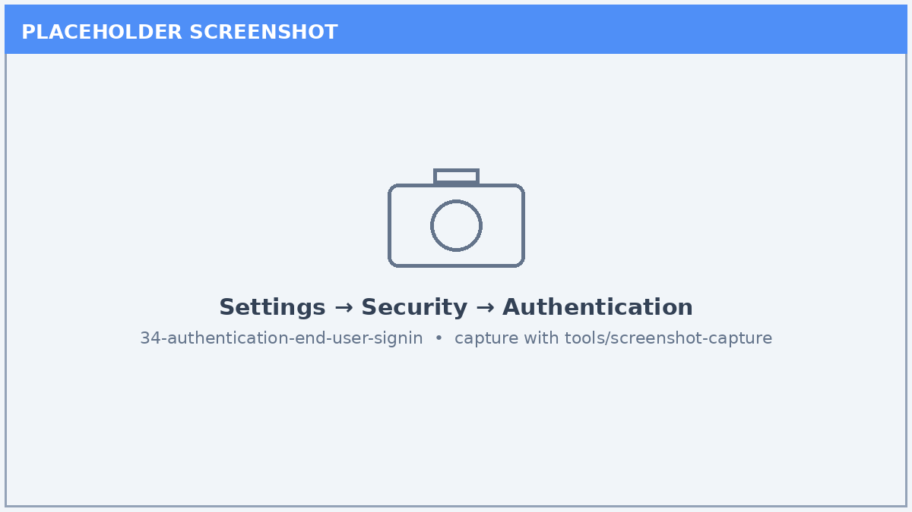
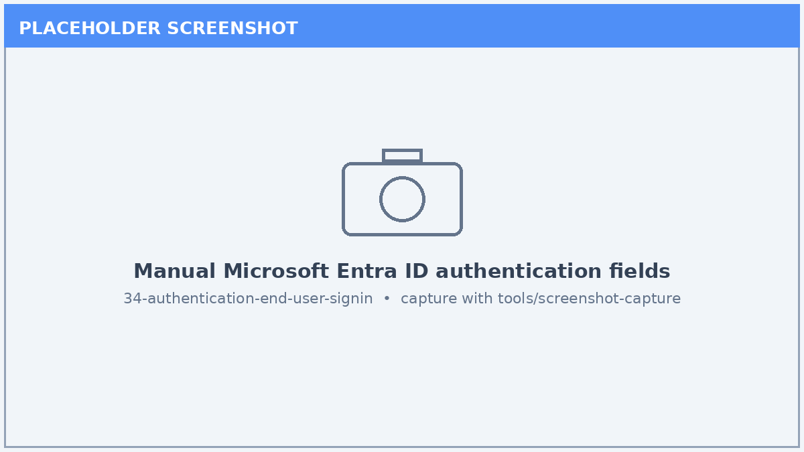
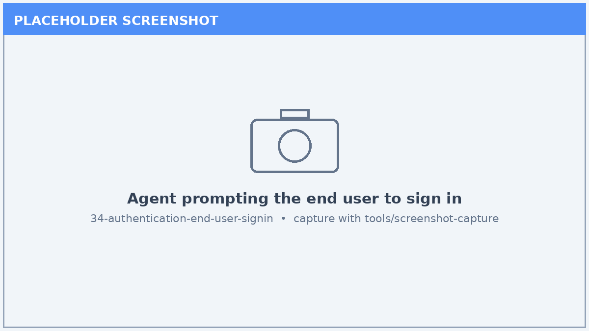

# Lab 34: Authentication & End-User Sign-In Configuration

*Configure how end users authenticate to your agent so it can act on their behalf and respect their permissions.*

| | |
|---|---|
| ⭐ **DIFFICULTY** | Advanced (300) |
| ⏱️ **TIME** | 60 minutes |
| 🧩 **PRODUCTS** | Microsoft Copilot Studio, Microsoft Entra ID |
| 🏷️ **TAGS** | Authentication, Entra ID, SSO, Single Sign-On, Security |
| 🏭 **INDUSTRIES** | Cross-industry |

---

## Overview

Production agents almost always need to know **who** the user is — to honor data permissions, personalize responses, and call downstream services on the user's behalf. This lab walks through Copilot Studio's **end-user authentication** options, configuring **Microsoft Entra ID** sign-in, and validating the sign-in experience across channels.

## 🎯 Learning Objectives

1. Compare authentication options: **no authentication**, **Microsoft authentication**, and **manual (custom Entra ID)**.
2. Register or reuse an **Entra ID app registration** for the agent.
3. Configure **manual Entra ID** authentication with the correct scopes and redirect URLs.
4. Validate the **sign-in prompt** in the test canvas and a published channel.
5. Understand how authenticated identity flows into **connectors and tools** (SSO).

## Prerequisites

- A Copilot Studio agent and permission to edit its security settings.
- Access to the **Microsoft Entra admin center** (or an existing app registration).
- Tenant permission to grant API permissions / consent (or an admin who can).

## Step-by-Step

### Step 1 — Review authentication options

1. Open your agent and go to **Settings → Security → Authentication**.
2. Review the three options and their implications for SSO and connectors.
3. Decide whether the scenario needs user identity (most production agents do).

### Step 2 — Prepare an Entra ID app registration

1. In the **Entra admin center**, create (or reuse) an **app registration** for the agent.
2. Add the Copilot Studio **redirect URI**.
3. Configure the required **API permissions** and a client secret if needed.

### Step 3 — Configure manual Entra ID authentication

1. Back in Copilot Studio, select **Authenticate manually**.
2. Enter the **client ID**, **client secret**, **token URLs**, and **scopes**.
3. Save the configuration.

### Step 4 — Test the sign-in experience

1. Open the **Test** pane and start a conversation.
2. Confirm the agent prompts the user to **sign in** and completes the flow.
3. Verify the agent can read the authenticated user's identity (for example, greet by name).

### Step 5 — Validate SSO into tools

1. Add or open a connector/tool that supports **single sign-on**.
2. Confirm the authenticated token flows to the tool without a second prompt where supported.
3. Document which channels require additional channel-specific auth setup.

## ✅ Validation / Success Criteria

- The agent uses an intentional authentication mode (not left at default by accident).
- End users are prompted to sign in and the flow completes successfully.
- The agent can reference the authenticated user's identity.
- You documented channel-specific authentication considerations.

## ✅ Lab Complete

Your agent now authenticates end users with **Microsoft Entra ID**, enabling permission-aware responses and SSO into downstream tools — a foundation for secure, production-grade deployments.

**Suggested next labs:**

- [Lab 35: Data Loss Prevention (DLP) & Governance Policies](../35-dlp-governance-policies/index.md) — govern what connectors authenticated agents may use.
- [Lab 40: Entra Agent Identities (Preview)](../40-entra-agent-identities-preview/index.md) — give the agent itself a managed identity.

> 🔗 **Related lab:** [Lab 21: Custom Connectors & OAuth for Copilot Studio](../21-custom-connectors-oauth/index.md) — apply OAuth to custom connectors.

---

*Screenshots in this lab are placeholders. Capture live images with the [screenshot tool](../../tools/screenshot-capture/) (`shots.json` is wired for this lab).*
