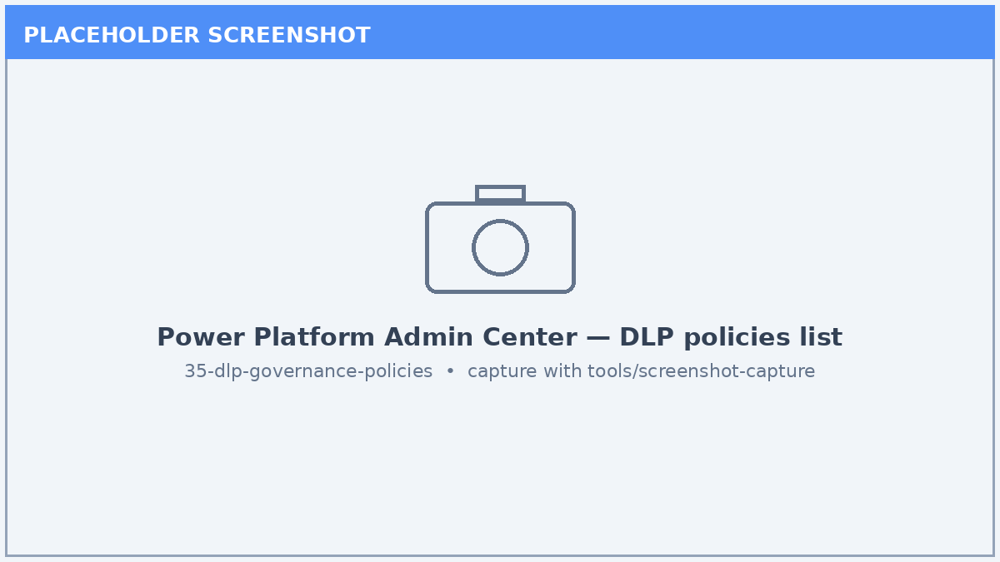
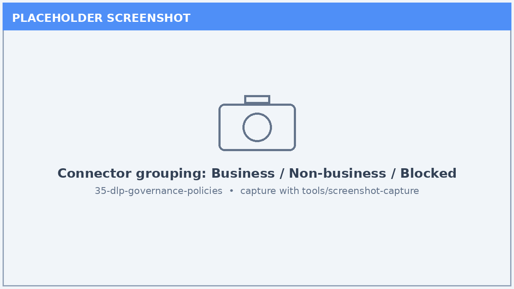
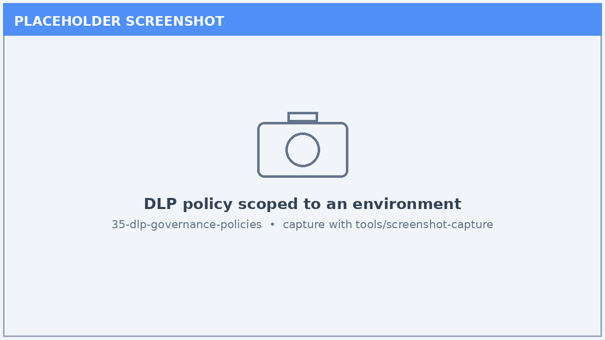

# Lab 35: Data Loss Prevention (DLP) & Governance Policies

*Apply tenant-level governance so agents and makers can only use approved connectors and data flows.*

| | |
|---|---|
| ⭐ **DIFFICULTY** | Advanced (300) |
| ⏱️ **TIME** | 60 minutes |
| 🧩 **PRODUCTS** | Microsoft Copilot Studio, Power Platform Admin Center |
| 🏷️ **TAGS** | Governance, DLP, Data Loss Prevention, Connectors, Compliance |
| 🏭 **INDUSTRIES** | Cross-industry |

---

## Overview

As agent building scales across an organization, **governance** keeps it safe. **Data Loss Prevention (DLP)** policies in the Power Platform Admin Center control which connectors makers and agents may combine, preventing sensitive data from flowing to unapproved destinations. In this lab you create a DLP policy, classify connectors, scope the policy to an environment, and verify its effect on agents.

## 🎯 Learning Objectives

1. Navigate **DLP policies** in the Power Platform Admin Center (PPAC).
2. Classify connectors into **Business**, **Non-business**, and **Blocked** groups.
3. Scope a policy to specific **environments**.
4. Understand how DLP affects **agent tools and flows** at design and run time.
5. Document a governance baseline and exception process.

## Prerequisites

- **Power Platform administrator** (or equivalent) access to PPAC.
- A non-production environment to test policy effects safely.
- A list of approved vs. restricted connectors for your organization.

## Step-by-Step

### Step 1 — Open DLP policies in PPAC

1. Go to the **Power Platform Admin Center → Policies → Data policies**.
2. Review any existing policies and their scopes.
3. Select **+ New Policy**.

### Step 2 — Classify connectors

1. Place sensitive/business connectors in the **Business** group.
2. Place general connectors in **Non-business**.
3. Move connectors that must never be used into the **Blocked** group.
4. Remember: connectors in different groups cannot be combined in the same agent/flow.

### Step 3 — Scope the policy

1. Choose whether the policy applies to **all environments**, **specific environments**, or **all except**.
2. Scope this test policy to your **non-production** environment.
3. Save and publish the policy.

### Step 4 — Observe the effect on agents

1. In the scoped environment, open an agent and attempt to add a **Blocked** connector tool.
2. Confirm the action is prevented or flagged by the policy.
3. Confirm an approved (Business) connector still works.

### Step 5 — Document governance baseline

1. Record the connector classification rationale.
2. Define an **exception request** process for new connectors.
3. Set a review cadence for the policy.

## ✅ Validation / Success Criteria

- A DLP policy exists with connectors classified into the three groups.
- The policy is scoped to the intended environment(s).
- A blocked connector is demonstrably prevented in an agent.
- You documented a governance baseline and exception process.

## ✅ Lab Complete

You established **tenant-level governance** with DLP policies, ensuring agents across your organization use only approved connectors and data flows — a cornerstone of safe, scalable agent adoption.

**Suggested next labs:**

- [Lab 38: Agent Inventory Schema](../38-agent-inventory-schema/index.md) — track ownership and risk across all agents.
- [Lab 39: Agent Readiness / Issue Status](../39-agent-readiness-issue-status/index.md) — gate releases on readiness criteria.

> 🔗 **Related lab:** [Lab 34: Authentication & End-User Sign-In Configuration](../34-authentication-end-user-signin/index.md) — pair connector governance with user authentication.

---

*Screenshots in this lab are placeholders. Capture live images with the [screenshot tool](../../tools/screenshot-capture/) (`shots.json` is wired for this lab).*
